A Base de Conhecimento é um sistema como qualquer outro e por esse motivo é necessário ter um fluxo de atualizações constantes para se manter funcionando com o mínimo de erros e sem instabilidades.

Essa documentação tem todas as instruções para que o desenvolvedor consiga fazer alterações no código, corrigir bugs, implementar novas funcionalidades e melhorias. Os pré-requisitos principais para que o desenvolvedor possa trabalhar no processo de desenvolvimento da BC é ter um conhecimento de [Git](https://git-scm.com/), [Gitflow](https://danielkummer.github.io/git-flow-cheatsheet/index.pt_BR.html), [GitLab](https://about.gitlab.com/), [PHP](http://www.php.net/), [Twig Template Engine](https://twig.symfony.com/), [Yaml](http://www.yaml.org/spec/1.2/spec.html) e [Grav](https://learn.getgrav.org/). Caso não saiba o que é qualquer uma dessas tecnologias, favor estudá-las antes de fazer os processos aqui descritos.

O ambiente em que será feito o processo de desenvolvimento deverá estar com o [Git](https://git-scm.com/book/pt-br/v1/Primeiros-passos-Instalando-Git), [GitFlow](https://danielkummer.github.io/git-flow-cheatsheet/index.pt_BR.html) e [Composer](https://getcomposer.org/doc/00-intro.md) instalados e funcionando.

## Clonando o Projeto

Antes de iniciar o processo de desenvolvimento da BC, a primeira coisa a se fazer é clonar o projeto em um servidor web php. A BC está versionada no [GitLab da Eagle Tecnologia](http://186.195.139.10:2851/users/sign_in) e você poderá usar o seguinte comando para clonar o projeto em seu ambiente de desenvolvimento:

```bash
git clone http://192.168.1.5/leo/knowledgebaseapp.git
```
Insira suas credenciais do _GitLab_ para autorizar o clone do projeto.

Após o clone estar concluido, entre na pasta do projeto e inicie um workflow com o GitFlow rodando o seguinte comando:

```bash
git flow init
```
Caso dê o seguinte erro: `Working tree contains unstaged changes. Aborting.`. Rode novamente o comando e então aperte enter para todas questões que aparecer. Resultado será semelhante a imagem abaixo.

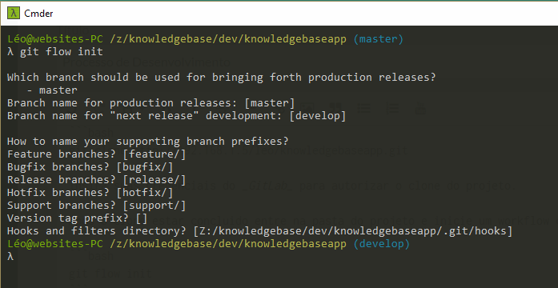

Para evitar problemas de exceder o tamanho de dados a ser enviado para o servidor remoto, é necessário aumentar o buffer do versionamento. Para isso, use o seguinte comando para aumentar o buffer:

```bash
git config http.postBuffer 524288000
```

## Instalando Dependências

Com o projeto clonado em nosso ambiente, precisamos agora instalar as dependências da plataforma _Grav_ para que a BC funcione corretamente. Para esse procedimento rode o comando:

```bash
composer install
```
Após todas as dependências serem instaladas, rode o projeto no navegador para ver os erros detectados. Provavelmente irá aparecer uma página como a imagem a seguir:

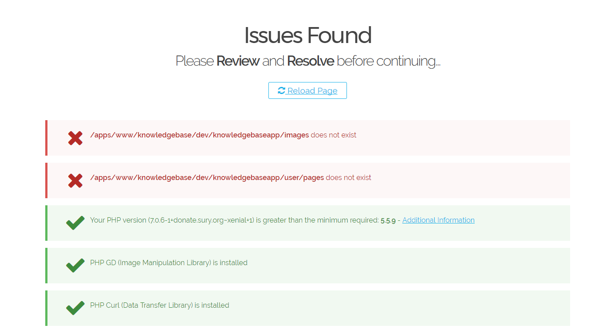

Se aparecer os erros demonstrados na imagem acima resolva-os criando a pasta `images` na raiz do projeto.

```bash
mkdir images
```

E depois renomeie a pasta `pages.dist` que está localizada dentro da pasta `user` para `pages`.

```bash
cd user
mv pages.dist pages
```
E por fim entre na pasta `user/config` e renomeie o arquivo `system.dist` para `system.yaml`.

```bash
cd user/config
mv system.dist system.yaml
```
Ao carregar a página novamente já verá o layout da BC.


Com isso, finalizamos o processo de instalação da plataforma para desenvolvimento e evolução do projeto. Todo esse procedimento acima, será feito somente uma única vez. A partir de agora nosso projeto está pronto para receber correção de bugs, novas funcionalidades e melhorias.

O procedimento acima será realizado novamente somente quando precisar de iniciar o processo de desenvolvimento em outro ambiente ou se entrar mais um colaborador para a equipe do projeto.

## Coleta e registro de demandas

Antes de sair fazendo alterações e implementar novas funcionalidades, deve-se seguir um processo de coleta dessas demandas, recebendo-as por e-mail, analizando e gerando um registro de issues no GitLab.

#### 1) Solicitação de Demandas

Qualquer colaborador, cliente ou revenda pode solicitar uma demanda para a BC, basta preencher o [formulário de demanda](https://ajuda.eagletecnologia.com/formularios-de-solicitacao/base-de-conhecimento) que está disponível.

#### 2) Etiquetar E-mail

Quando uma demanda é solicitada utilizando o formulário, os dados serão enviados para o e-mail `websites@eagletecnologia.com` por `notifications` com o assunto `Demanda - Base de Conhecimento`.

Para manter uma organziação desse registro na caixa de e-mail, o desenvolvedor deverá etiquetar com a tag `Demanda BC`.

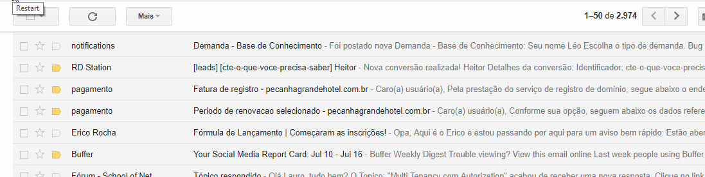

#### 3) Análise da Demanda

Logo que receber uma nova demanda, a primeira coisa a se fazer é analisá-la seguindo os seguintes critérios:

* É possível de ser feita levando em consideração a tecnologia da plataforma;
* É uma demanda que trará benefícios para todos os tipos de usuários (clientes, colaboradores e revendas) e não prejudicará um ou outro usuário beneficiando somente um usuário específico;
* É uma demanda que não muda radicalmente a interface;
* É uma demanda que não gera manutenção excessiva;
* É uma demanda que não gerará muitos erros no futuro;
* A demanda condiz com o propósito da Base de Conhecimento;

Se a resposta de todas as questões acima for `sim`, então ela poderá ser implementada na BC. Ainda na análise deverá ser identificado em qual tipo de demanda se encaixa.

**Tipos de Demanda**

* {c:blue}New{/c}: Significa nova funcionalidade;
* {c:orange}Improved{/c}: Significa melhoria de alguma funcionalidade existente;
* {c:red}Bugfix{/c}: Significa um mal funcionamento de alguma funcionalidade.

#### 4) Registro no GitLab

A BC segue um padrão de versionamento de 3 dígitos `1.0.0`:

* Primeiro dígito: Significa a versão mais alta e descreve alterações muito grandes no projeto, como mudança na estrutura do layout, implementação de comportamentos grandes e complexos e alteração de funcionalidades estáveis;
* Segundo dígito: Significa pequenas implementações e melhorias. Esse dígito deverá incrementar toda vez que tiver uma nova funcionalidade ou alguma melhoria no projeto;
* Terceiro Dígito: Significa resolução de bugs. Quando um bug for detectado, o desenvolvedor deverá analisa-lo e concluir se é um bug grave que pode comprometer o funcionamento e estabilidade da BC, se sim, ele deverá ser resolvido o mais rápido possível para evitar problemas maiores e o dígito deverá ser incrementado.

Com essas informações em mente, faça a autenticação no [GitLab](http://186.195.139.10:2851/users/sign_in) e abra o projeto `knowledgebaseapp`.

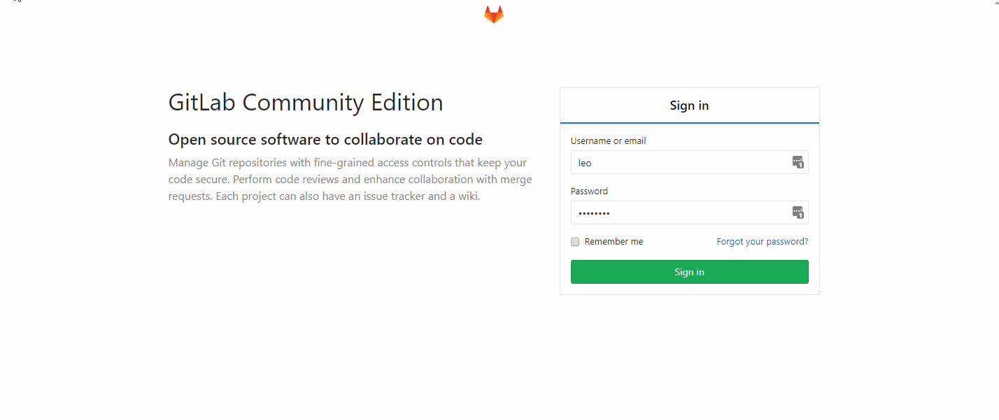

Para registrar uma demanda no GitLab, antes temos que ter a `milestone`[^1] registrada.

! Uma milestone deverá ser registrada somente se existir pelo menos uma demanda solicitada que foi analizada no mês. A milestone somente é registrada para primeiro e segundo dígitos, ou seja, para grandes e pequenas mudanças. Não se cria milestones para resolver bug.

Assim que a primeira demanda for solicitada no mês, já fassa o registro da _milestone_ seguindo a ordem de incrementação que está no GitLab.

Para criar uma milestone siga os passos marcados em vermelho nas imagens:

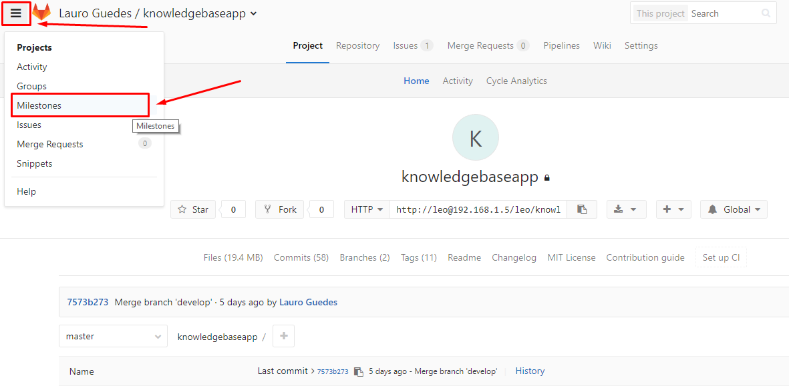

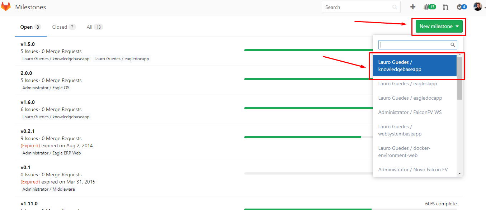

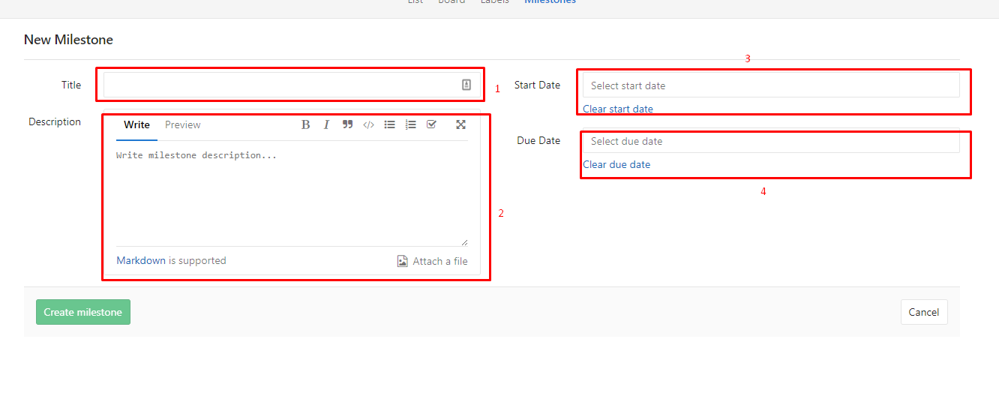

1. Insira a tag de versionamento. Deverá ser colocado o caractere `v` de versão e os dígitos incrementados da última milestone registrada no GitLab. Ex: `v1.2.0`;
2. Explique de forma bem resumida quais as demandas terão nesta versão;
3. Coloque a data no qual irá começãr a implementação;
4. Coloque a data prevista para término da versão. Uma milestone é considerada fechada se todas as issues correspondentes estiverem fechadas.

Feita a criação da milestone, agora deve-se criar a issue. Para isso basta clicar no menu `Issues` e depois em `New issue`.

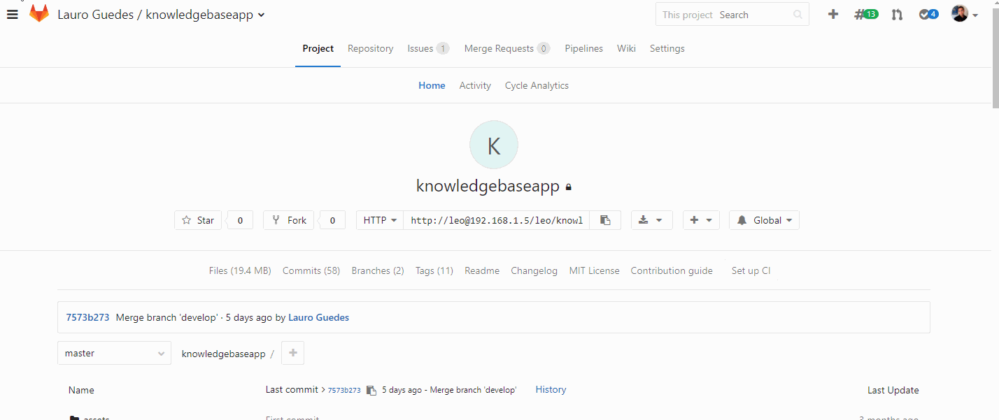

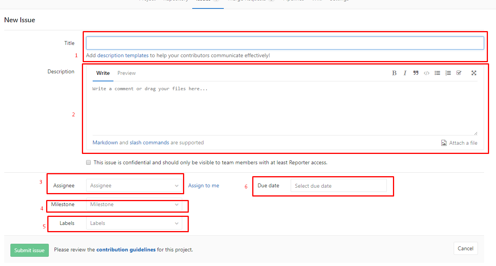

1. Insira o assunto da demanda;
2. Descreva de forma detalhada e clara o que é a demanda. É permitido o uso da [sintaxe markdown](https://ajuda.eagletecnologia.com/manuais/base-de-conhecimento/sintaxe-markdown);
3. Assine o usuário responsável pela implementação da demanda;
4. Selecione a milestone indicada para a demanda;
5. Escolha o tipo de demanda;
6. Coloque uma data prevista para o término da implementação da demanda.

Feito o preenchimento do formulário, salve-o para que a demanda fique registrada no GitLab.

## Lançar uma nova Versão

Com todas as demandas cadastradas, chegou a hora de fazer as implementações, atualizações e correções.

Antes de começar a realizar as implementações, entre na pasta do projeto e verifique se o ramo `develop` está limpo. Use o comando a seguir para realizar essa verificação.

```bash
git status
```
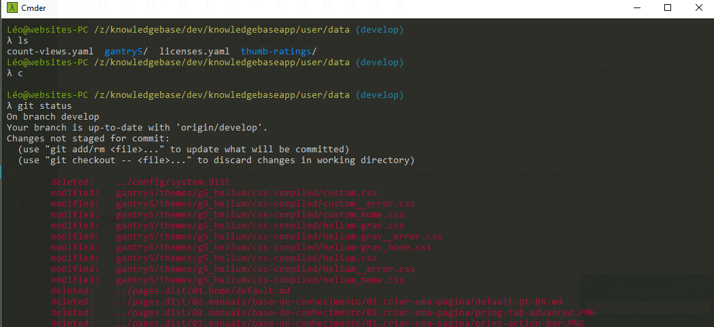

Caso dê um resultado parecido com a imagem acima no qual existem arquivos alterados para serem versionados, deverá ser feito um `commit` das alterações antes de criar o ramo da versão. Faça o seguinte:

```bash
git add .
git commit -m "Limpesa do ramo develop para nova versão"
```
Após rodados os camandos acima, rode o comando `git status` novamente no qual terá o seguinte resultado.

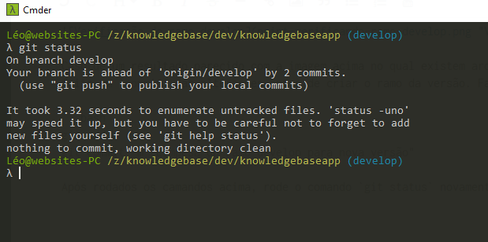

!! Após feita a limpeza do ramo, não recarregue o projeto no navegador, pois isso irá sujar novamente o ramo develop e o procedimento acima terá que ser feito novamente.

Neste momento o repositório já está preparado para receber um ramo de release do GitFlow. Para criar o ramo de release rode o comando:

```bash
git flow release start <milestone>
```
O nome da release deverá ser o mesmo nome da milestone sem o `v`. Ex: `1.2.0`.

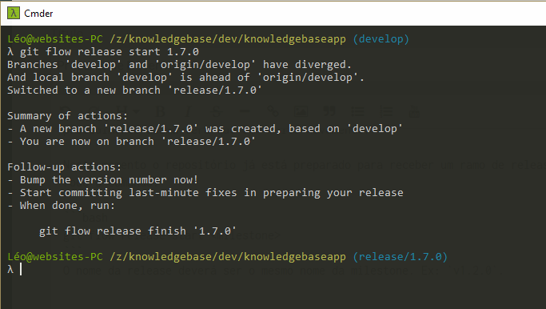

Neste momento as demandas já podem começar a serem implementadas no projeto. Altere antes de qualquer modificação no projeto o arquivo `copyright.yaml` localizado em:

```bash
user/data/gantry5/themes/g5_helium/config/default/particles/copyright.yaml
```
Altere o valor da milestone atual pela que será implementada.

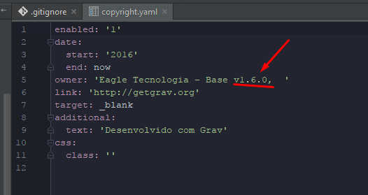

! Ao término de cada funcionalidade, melhoria ou bug implementada, deverá ser feito a sequência de comandos para commit: `git add .` e depois `git commit -m "<assunto da issue implementada>"`. Caso uma demanda demore muito para ser finalizada é recomendado que seja feito _commits_ durante a implementação para garantir que a versão fique com poucas alterações entre um _commit_ e outro.

!! O _commit_ só poderá ser feito se a demanda estiver **100% funcionando** sem qualquer erro.

A cada _commit_ finalizado de uma demanda registrada no GitLab, deverá ser feito o fechamento dessa issue na interface.

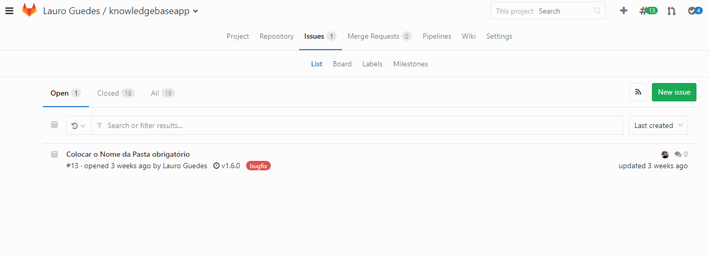

Ao finalizar a implementação de todas as demandas da milestone e garantir que está tudo funcionando sem qualquer erro aparente, poderá finalizar a release e enviar as alterações para o GitLab e o servidor de produção. Faça a sequência de comandos a seguir para fazer esse procedimento de fechamento da versão.

#### Sequência de comandos para fechamento de versão

1) O comando a seguir dá um merge nos ramos `develop` e `master` tagueando-o e deleta o ramo da release.
```bash
git flow release finish <milestone>
```
No processo de execução acima irá surgir uma tela com um editor de texto para que seja descrito a versão. Descreva uma frase que resuma a milestone e salve. Lembrando que o editor de texto que é aberto é o `vim`.

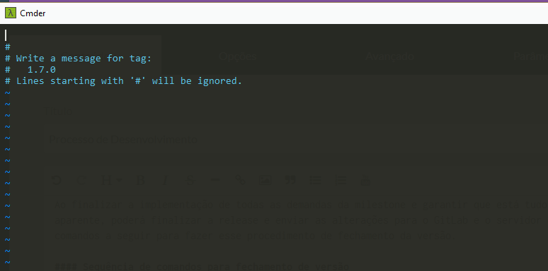

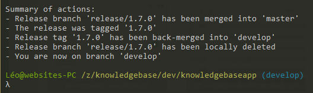

2) Os seguintes comandos envia as alterações do ramo master e developer para o servidor do GitLab e publica a tag da versão.
```bash
git push origin develop
# irá pedir as credenciais

git push origin master
# irá pedir as credenciais

git push --tag
# irá pedir as credenciais
```
3) Esse último comando envia as alterações para o servidor de produção, no qual está localizado na _Amazon WebServices_.

! Se é a primeira vez que estará enviando uma nova versão para produção, deverá adicionar o repositório remoto da AWS em seu ambiente. Rode o comando `git remote add prod ubuntu@ec2-54-94-215-29.sa-east-1.compute.amazonaws.com:~/repository/knowledgebaseapp.git`.

```bash
git push prod master
```
Se não ocorrer nenhum erro, a BC já estará com sua nova versão publicada online.

#### Caso não ocorra nenhuma demanda para ser implementada

! Caso não ocorra nenhuma demanda durante o mês, o procedimento a ser feito será somente o de verificar as atualizações de plataforma e plugins.

Quando não há nenhuma demanda a ser implementada, ainda sim é necessário fazer alterações no projeto por causa das atualizações de plataforma e plguins. Neste caso não é necessário criar uma versão, o procedimento será feito em cima do ramo develop.

Faça as atualizações de plataforma e plugins diretamente na interface administrativa da BC, depois siga os passos:

1) Comitar atualizações:
```bash
git add .
git commit -m "Atualizações de plataforma e plugins"
```
2) Checkout no ramo master:
```bash
git checkout master
```
3) Junte as alterações do develop com o master:
```bash
git merge develop
```
4) Mande alterações para o GitLab
```bash
git push origin develop
git push origin master
```
5) Mande alterações para o servidor de produção
```bash
git push prod master
```
## Lançar hotfix

A criação de um ramo hotfix será realizada quando houver alguma falha do projeto em produção e essa falha tenha que ser resolvida de imediato.

Antes de criar o ramo de hotfix, verifique se o ramo `develop` está limpo. Caso contrário faça a limpesa antes comitando as modificações.

Para lançar um ramo de hotfix não necessariamente ele deva iniciar do develop, as vezes acontece de ter fechado uma release que está em produção e estamos implementando uma outra nova em desenvolvimento e acontece alguma falha na release de produção. Para evitar mexer na release atual em desenvolvimento abrimos um hotfix a partir de uma release já fechada que no caso estaria em produção.

#### Procedimento de abertura de Hotfix

1) Entre no ramo defeituoso:
```bash
git checkout <nome_ramo_defeituozo>
```
2) Crie o ramo hotfix:
```bash
# lembrando que hotfix são ramos de bug, então a numeração incrementada é o 3º dígito da release defeituosa.
git checkout -b <nome_hot_fix>
```
3) Faça a correção no projeto, realizando os _commits_ necessários.

4) Ao finalizar todas as correções, certifique-se e teste para que ainda não haja nenhum erro aparente.

5) Vá para o ramo mais atual:
```bash
git checkout <ramo_mais_atual>
```
6) Junte as correções com o ramo mais atual, que no caso poderia ser a release nova:
```bash
git merge <nome_hot_fix>
```
7) Entre novamente no ramo de hotfix:
```bash
git checkout <nome_hot_fix>
```
8) Finalize o ramo hotfix:
```bash
git flow hotfix finish <nome_hot_fix>
```
9) Publique as correções no GitLab:
```bash
git push origin developer
git push origin master
git push --tag
```
10) Publique as correções no servidor de produção:
```bash
git push prod master
```

*[BC]: Base de Conhecimento

[^1]: Tag que indica em qual versão será implementada as novas funcionalidades, melhorias e bugs. Ex: v1.2.0
[^2]: Termo em inglês que significa `demanda`