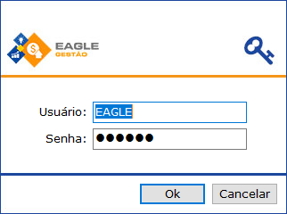

Para abrir o Sistema clique duas vezes sobre o ícone Eagle Gestão na área de trabalho ou no menu `Iniciar / Programas / Eagle Gestão / Eagle Gestão`.

Informe o nome de usuário e senha e clique em Ok.

**Observações:**
* Para cada funcionário é aconselhável associar um nome de usuário e uma senha (qualquer dúvida, consultar a assistência técnica).
* Cada usuário poderá ter um privilégio específico, ou seja, o acesso de um usuário poderá ser diferente dos outros. A configuração dos Perfis de Usuário é realizada durante o processo de implantação do sistema e deve ser feita por um técnico da empresa, que é o profissional qualificado para tal.