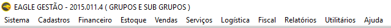

Todos os recursos do sistema Eagle ERP encontram-se nos comandos localizados na barra de menus, na parte superior. Eles estão separados em módulos (sistema, cadastros, financeiro, estoque, vendas, mala direta, integração, utilitários e ajuda).

As funcionalidades utilizadas com mais frequência podem ser ativadas com as teclas de atalho, como por exemplo, o cadastro de produtos, que pode ser acionado com a tecla F4; o cadastro de clientes, com a tecla F2 e assim por diante.
Ao longo deste documento, todas as funcionalidades serão apresentadas seguindo-se a mesma estrutura de menus do sistema (figura 2).

