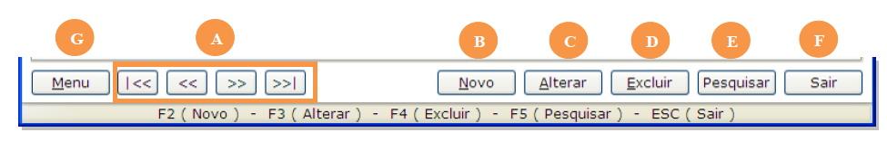

A barra de navegação é sempre exibida da parte inferior de todas as telas de cadastro do sistema. Com ela é possível executar ações de pesquisa, inclusão, alteração, exclusão e comandos adicionais.

* A - botões de navegação de registro – são utilizados para navegar entre os registros já cadastrados no sistema (primeiro registro, registro anterior, próximo registro, último registro)
* B - botão **Novo** – utilizado para a criação de um novo registro (abre uma nova tela de cadastro) – comando de atalho - tecla F2
* C - botão **Alterar** – utilizado para modificar um registro já cadastrado (desbloqueia os campos para alteração das informações) – comando de atalho - tecla F3 (ver seção 2.3.3)
* D - botão **Excluir** – utilizado para retirar da base de dados, um determinado registro – comando de atalho – tecla F4
* E - botão **Pesquisar** – utilizado para procurar determinado registro. Ver seção Pesquisar Registros – tecla F5
* F - botão **Sair** – ao clicar neste botão, a tela atual será fechada – comando de atalho - tecla Esc
* G - botão **Menu** (ou botão direito do mouse) – exibe comandos adicionais. Varia de acordo com a tela utilizada