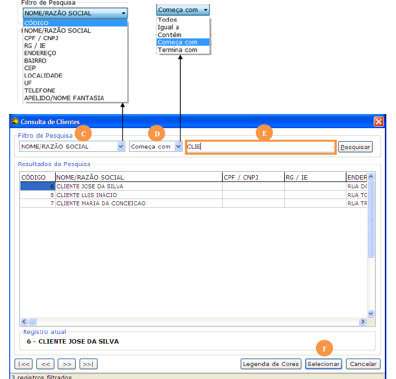

O processo de localização é de extrema importância e é utilizado com frequência no sistema. Para alterar, excluir ou simplesmente verificar informações, faz-se necessário a localização de um registro. Logo abaixo, serão mostrados os passos para execução desse processo.

Para localizar o registro, utilize os botões de navegação **(A)** da barra de navegação _(ver seção 2.3.1)_ ou clique sobre o botão Pesquisar **(B)**.

Caso clique em Pesquisar, será aberta uma tela contendo a relação de todos os registros, como no exemplo da `figura 4 – Tela de Registros`.

Escolha o tipo de pesquisa **(C)** e **(D)** – esses campos permitem alterar o tipo de pesquisa como, por exemplo, pesquisar por código ou por descrição; pesquisa exata ou aproximada, etc.

No campo **(E)** digite o parâmetro de pesquisa (varia de acordo com o tipo de pesquisa – código ou descrição). À medida que o usuário digita, o sistema faz a filtragem dos dados.

Para selecionar, clique uma vez sobre o registro e clique no botão selecionar **(F)** ou apenas clique duas vezes sobre o registro escolhido.