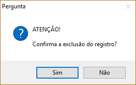

A exclusão de um registro do sistema exige muita atenção do usuário para que não seja feito por engano ou descuido. Baseado nisso, o sistema pede a confirmação da exclusão (figura 5).

Para executar o processo, o usuário deverá localizar o registro (ver seção 2.3.2) e clicar sobre o botão Excluir na barra de navegação na parte inferior da tela.

