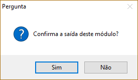

Após o término de alguma operação ou durante o cancelamento da mesma, é necessário finalizar o processo fechando a tela. Pode-se fechá-la clicando no botão (X) ou pressionando a tecla Esc, localizado no canto superior esquerdo do teclado. É necessário confirmar ou não a saída do módulo (figura 6).

