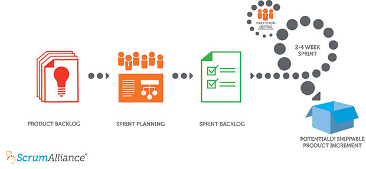

O processo de desenvolvimento de qualquer projeto que envolve a interação entre humanos sempre trás grandes questões de gestão e controle. Ao longo do tempo inúmeras metodologias e processos foram criados para ajudar os gestores nesta empreitada.

Este documento descreve a metodologia proposta pelo _Framework Scrum_ para a gestão do desenvolvimento de projetos de software ágeis adotado pela Eagle Tecnologia.

A seguir serão descritos os pilares da metodologia:

## Sprint

O _Sprint_ é o núcleo do _Scrum_, trata-se de um intervalo de tempo pré-definido para a entrega recorrente de demandas utilizáveis.

Os _Sprints_ são ciclos de desenvolvimento compostos pelas etapas de planejamento, desenvolvimento, acompanhamento, revisão e melhorias.

A duração dos _Sprints_ podem ser diferentes para cada projeto a depender de suas características e necessidades. Gerlamente aconselha-se que o _Sprint_ tenha no máximo 30 dias de duração.

## Reunião de planejamento do Sprint

Reunião realizada sempre no início de cada _Sprint_ que tem por finalidade definir quais demandas serão trabalhadas, bem como as metas de cada _Sprint_.

Durante a reunião as demandas previamente selecionadas pelo _Product Owner_ são analisadas detalhadamente a fim de que cada membro do Time tenha condição de definir um peso para as demandas. Após a análise, é realizado o [Planning Poker](https://ajuda.eagletecnologia.com/materiais/interno/desenvolvimento/processo-de-estimativa-de-software) para que seja definido o peso consensual de cada demanda.

O _Product Owner_, juntamente com o _Time Scrum_, após ter mensurado todas as demandas, definirá a menta geral do _Sprint_ e as metas especificas.

Atualmente a definição do volume de demandas entregáveis é definido pelo chute coletivo, uma vez que não há histórico de pontuação para que seja definido o volume de trabalho entregável pelo time.

## Reunião Diária

Reunião realizada diariamente pelo _Time Scrum_ com o intuído de disseminar o conhecimento a cerca da evolução do _Sprint_ e dos impedimentos que podem impossibilitar a equipe de alcançar as metas estipuladas.

A reunião diária se apoia em três perguntas as quais os membros do _Time_ deverão responder:

- O que você fez ontem?
- O que você fará hoje?
- Há algum impedimento no seu caminho?

As reuniões diárias devem ser realizadas com todos os membros do _Time_ de pé e não deve ter a duração superior à **15 minutos**.

As reuniões são realizadas todos os dias as **8 horas e 15 minutos**, logo após a realização da ginástica laboral. Não há reuniões específicas para cada projeto, sendo realizado apenas uma, onde é tratado todos os projetos em andamento.

## Reunião de Revisão do Sprint

Realizada ao fim de cada _Sprint_ pelo _Product Owner_ e o _Time Scrum_, esta reunião tem por finalidade, revisar o trabalho realizado pelo _Time_ durante o _Sprint_.

Durante a reunião são discutidas as demandas trabalhadas bem como as metas que foram alcanças ou não. Também são discutidos os impedimentos que ocorreram ao longo do _Sprint_ e que tiveram influência direta na realização da meta.

Cada membro do _Time_ é chamado a se pronunciar sobre os impedimentos e dificuldades na implementação das demandas.

Esta reunião não possui data fixa sendo sempre realizada antes da reunião de planejamento.

## Reunião de Retrospectiva

Reunião que deve ocorrer sempre ao término do _Sprint_ para que seja analisado o processo implantado no desenvolvimento.

O propósito da Retrospectiva da _Sprint_ é:

- Inspecionar como a última _Sprint_ foi em relação às pessoas, aos relacionamentos, aos processos e às ferramentas;
- Identificar e ordenar os principais itens que foram bem e as potenciais melhorias;
- Criar um plano para implementar melhorias no modo que o _Time Scrum_ faça seu trabalho;

! Esta reunião não é realizada pela equipe na empresa.

## Papéis e objetos do Scrum

- **Product Backlog**: é uma lista contendo todas as funcionalidades desejadas para um produto. O conteúdo desta lista é definido pelo _Product Owner_. O _Product Backlog_ não precisa estar completo no início de um projeto. Pode-se começar com tudo aquilo que é mais óbvio em um primeiro momento. Com o tempo, o _Product Backlog_ cresce e muda à medida que se aprende mais sobre o produto e seus usuários.

- **Sprint Backlog**: é uma lista de tarefas que o _Time Scrum_ se compromete a fazer em um _Sprint_. Os itens do _Sprint Backlog_ são extraídos do _Product Backlog_, pela equipe, com base nas prioridades definidas pelo _Product Owner_ e a percepção da equipe sobre o tempo que será necessário para completar as várias funcionalidades.

- **Product Owner**: é a pessoa que define os itens que compõem o _Product Backlog_ e os prioriza nas reuniões de planejamento do _Sprint_.

- **Scrum Master**: procura assegurar que a equipe respeite e siga os valores e as práticas do _Scrum_. Ele também protege a equipe assegurando que ela não se comprometa excessivamente com relação àquilo que é capaz de realizar durante um _Sprint_.

- **Scrum Team:** é toda a equipe de desenvolvimento. No _Scrum Time_ todos da equipe assumirão mais de uma função. Logo têm o papel de programador, designer, analista de testes, arquiteto de software e outros. Todos no projeto trabalham juntos para completar a _Sprint Backlog_ com o qual se comprometeram para um _Sprint_.

**Saiba mais sobre o Framework Scrum:**

[https://www.scrumguides.org/docs/scrumguide/v1/Scrum-Guide-Portuguese-BR.pdf](https://www.scrumguides.org/docs/scrumguide/v1/Scrum-Guide-Portuguese-BR.pdf)
[https://www.desenvolvimentoagil.com.br/](https://www.desenvolvimentoagil.com.br/)