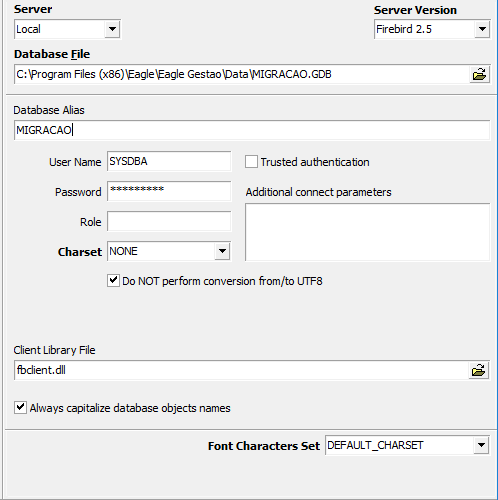
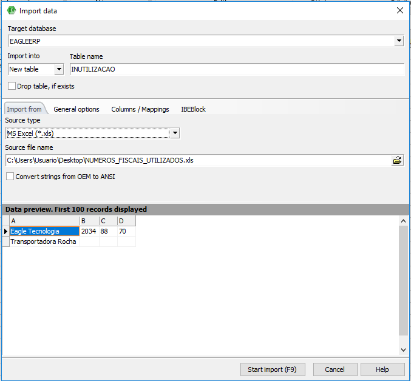
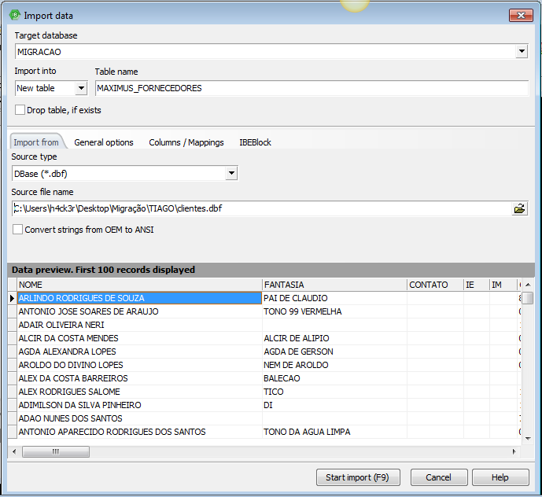

===

## Objetivos
Orientar colaboradores do setor de Suporte na realização dos procedimentos mais comuns durante a conversão de bases de dados de outros sistemas para a base Eagle Gestão. Por padrão, são migrados dados de pessoas e produtos.

## ACR UM – Recebimento e análise dos dados
1. A revenda deverá enviar um e-mail para o setor de Suporte contendo o banco a ser migrado, sua a origem (SMALL, DIGISAT, FACIL por exemplo) e o nome da empresa.
2. Na tabela que guarda os dados da empresa, confira se a razão social é a mesma da enviada pelo e-mail ou se o banco de dados já foi recebido anteriormente. A tabela EMPRESA costuma se chamar EMITENTE em outros bancos.
3. Estando tudo certo, deverá ser aberta uma tarefa com detalhes da migração, e caso tenha alguma solicitação fora dos padrões de migração atuais, deverá ser registrada na tarefa para análise da possibilidade de migração. Exemplo: Migração de contas a receber.

## ACR DOIS – Configurações dos bancos de origem
1. Exemplo de configuração de bancos Firebird (FDB) e Interbase (GDB):
* O banco recebido deverá ser aberto no IBexpert com as seguintes configurações:

2. Exemplo de importação de planilhas e arquivos DBF para migração:
* Abra o IBExpert e vá em Tools -> Import Data realize as configurações necessárias e clique em Start Import.
* Importe a planilha ou o arquivo .dbf em um banco limpo EAGLEERP dentro de uma nova tabela, como mostrado nas configurações abaixo:

É necessário converter a planilha para .xls – caso esteja no formato .xlsx – e tirar o cabeçalho antes de importar, caso tenha. 
Na importação, os nomes das colunas podem ser mudados em Columns/Mappings.
Após importar os arquivos, os scripts de migração existentes podem ser utilizados como base e adaptados de acordo com o nome e quantidade das colunas e tabelas do banco de origem. 

## ACR TRÊS - Execução do script de Migração
1. Tenha um banco limpo com o nome de EAGLEERP e configure no IBExpert como mostrado em [Como configurar Ibexpert](https://ajuda.eagletecnologia.com/faq/como-configura-o-ibexpert-para-acesso-ao-banco-de-dados-do-eagle-gestao-e-eagle-pdv);
2. O banco a ser migrado deve ter o nome de MIGRACAO;
3. Conecte os dois bancos;
4. Crie aliases com o nome de EAGLEERP e MIGRACAO para ambos;
5. Abra o script de migração mais estável e mais compatível com o banco a ser migrado e execute no banco EAGLEERP. Pode ser necessário fazer alterações no script, dependendo das regras de implementação do banco de dados EAGLEERP em relação ao banco MIGRAÇÃO, para que o script execute sem erros e os dados sejam migrados de forma íntegra.

## ACR QUATRO – Conferências a serem feitas
Caso não ocorra nenhum erro ao executar o script, é preciso conferir a integridade dos dados. Confira:
1. Se a quantidade de pessoas e produtos no banco novo é a mesma do banco de origem, inclusive nos relatórios cadastrais. 
2. A tributação, através dos relatórios de tributação de produtos por Estado (NCM e CST de ICMS inconsistentes) para enviar as devidas observações para a revenda. 
3. Confira dados de endereço e telefone de pessoas.

Antes de abrir o sistema, confira se as triggers estão ativas no banco de dados e execute a procedure UTIL_ACERTA_GENERATORS se o script não o tiver feito.
Caso o script de migração não esteja na versão mais recente homologada, após a migração atualize o banco.
! É importante ter os scripts sempre atualizados.

## ACR CINCO – Envio para a revenda

O banco enviado para a revenda deverá conter as observações pontuadas durante a conferência e a informação sobre a sua versão.

