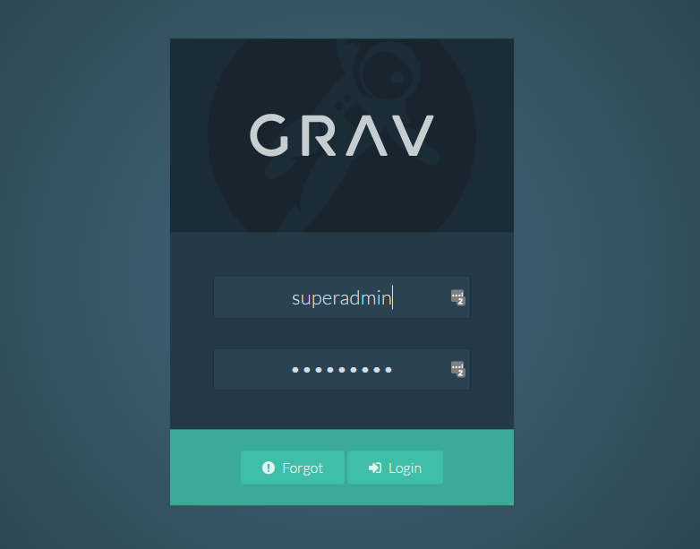
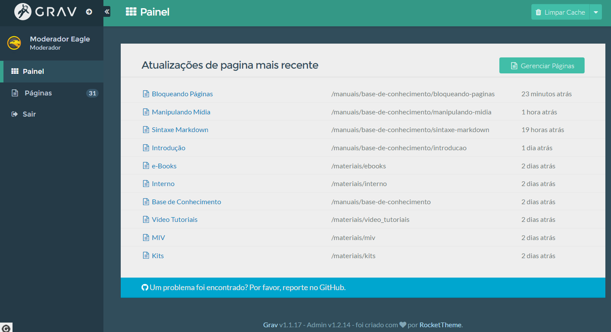
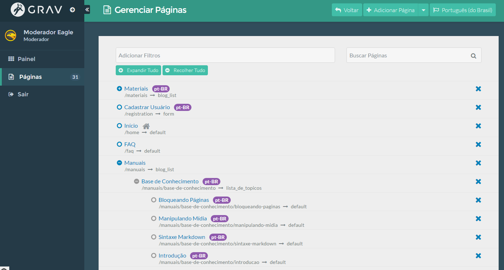
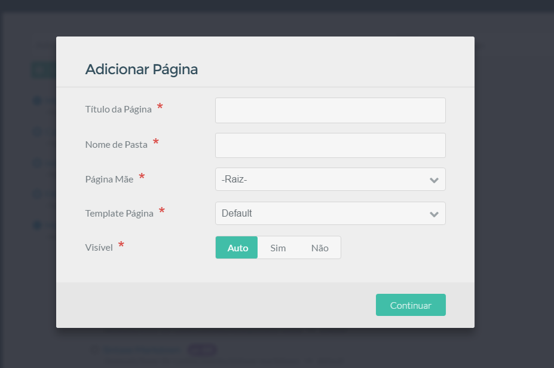
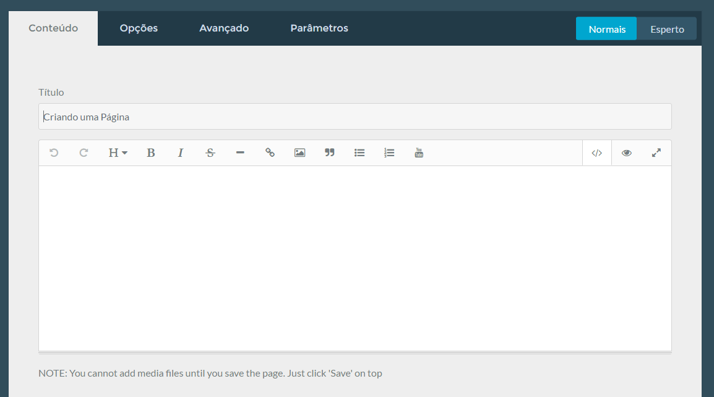
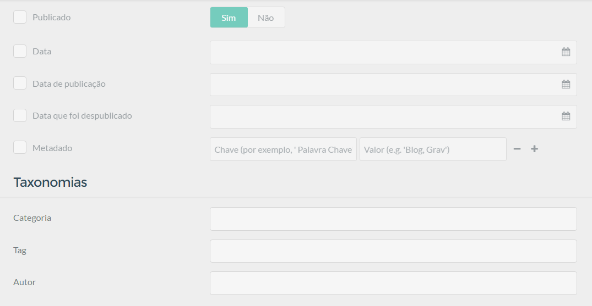
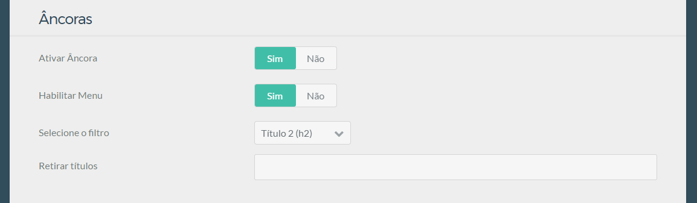
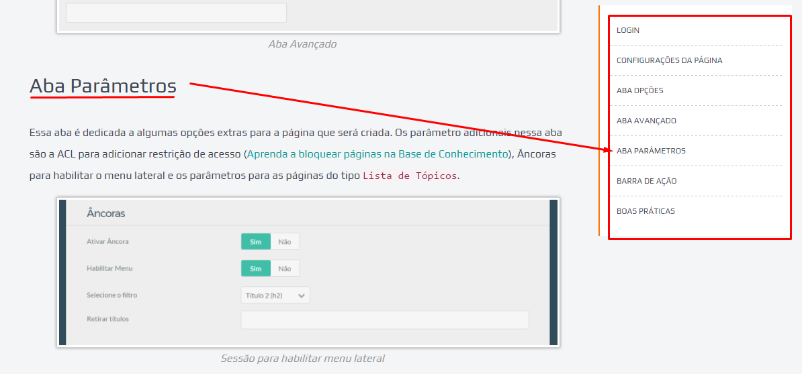
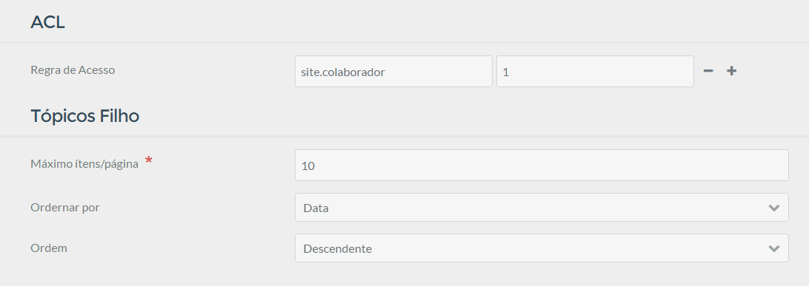
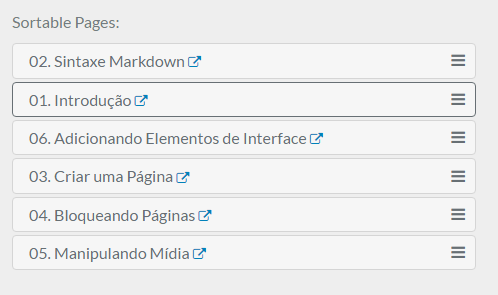

A criação de uma página na Base de Conhecimento é muito simples e rápido. A maioria das configurações que vem como padrão na criação não será necessário alterar.

## Login

Antes de criar a página, primeiro precisamos fazer o login como `moderador` ([Entenda como funciona os níveis de acesso](../bloqueando-paginas)).

Feito o login você verá uma página como mostrado abaixo:

Nessa página para criar uma página, clique no menu `Páginas` para acessar o grenciamento de páginas da Base de Conhecimento.

## Configurações da Página

Agora clique em adicionar uma página para inserir as primeiras configurações.

Confira na tabela baixo a explicação de cada item da tela:

|Campo|Explicação|
|-----|----------|
|Título da Página|Aqui será o título que identificará a página e aparecerá nos tópicos recentes e menus|
|Nome da pasta|Para toda página criada é criada também uma pasta que guardará o arquivo da página, neste caso não é necessário colocar nada, pois ao digitar o título esse campo é preenchido automaticamente|
|Página Mãe|Selecione nesse campo quem será a página acima da qual você está criando. Isso é importante para a organização da Base de Conhecimento.|
|Template Pàgina|Esse campo define como a página será renderizada na plataforma. Muito cuidado ao selecionar essa opção, pois ela define o layout da página. Por padrão a plataforma aceita vários tipos de templates, mas somente três foram configurados para atender as necessidade da Base de Conhecimento. São eles: **Blog List**: Esse é o layout pai de todos, ele só será usado para criar mais categorias além das padrões, FAQs e Materiais; **Lista de Tópicos:** Esse template será usado somente para toda e qualquer página que tiver páginas filhas. **Default:** Esse template é usado para todas páginas específicas que não possui filhas.|
|Visível|Esse campo não precisa alterar ele sempre pegará as configurações automaticamente de acordo com os campos preenchidos acima.|

Inserido as primeiras configurações, você acessará o formulário para escrever o texto da página ([Aprenda a formatar os textos na Base de Conhecimento](../sintaxe-markdown)).

## Aba Opções

Na aba opções serão inseridos os parâmetros da página referentes a data de publicação, metadados, categoria, tags e autor. Essas informações são importantes para tornar a página melhor ranqueada tanto nos Buscadores como na própria busca interna da Plataforma.

|Sessão|Descrição|
|------|---------|
|Publicando|Nessa sessão você irá inserir respectivamente a opção de publicar ou despublicar a página, a Data fixa que a página foi criada, a data de publicação e a data de despublicação caso você deseje que a página fique por um período determinado. Por fim temos o campo Metadado, onde serão colocados parâmetros como palavra-chave e resumo da página para melhorar o ranqueamento nos buscadores.|
|Taxonomias|Essa sessão é responsável por enquadrar a página em níveis de organização. Os campos respectivos são Categoria, tag e autor. As tags é interessante ter no máximo 3.|

! Uma observação sobre o campo de `Data` da aba **Publicando** é que se você deixa-lo em branco, sempre que você fizer alguma alteração na página, ele irá pegar a data atual daquela alteração, caso contrário, a data ficará fixa e não alterará de acordo com a modificação. Essa questão influencia na ordenação das páginas que foram configuradas nas páginas pais(Lista de Tópicos). **Ex:** se uma página foi deixado o campo em branco e a outra teve a data fixada, num cenário onde a página pai está configurada para mostrar a ordenação por data descendente, mesmo que você modifique a página onde a data está fixada imediatamente depois de uma modificação da página que não tem a data fixada, ela ainda aparecerá depois da página sem a data fixada.

## Aba Avançado

Essa aba você poderá editar as configurações que foram inseridos na primeira etapa da criação da página, além de outras opções mais avançadas que não serão necessárias alterar ou inserir na Base de Conhecimento atual.

## Aba Parâmetros

Essa aba é dedicada a algumas opções extras para a página que será criada. Os parâmetro adicionais nessa aba são a ACL para adicionar restrição de acesso ([Aprenda a bloquear páginas na Base de Conhecimento](../bloqueando-paginas)), Âncoras para habilitar o menu lateral e os parâmetros para as páginas do tipo `Lista de Tópicos`.

Esta sessão é referente ao menu lateral das páginas do tipo `default`. Com essas opções é possível tornar os títulos âncoras para ele mesmo, e também, fazer com que esse título se torne um ítem de menu lateral. Veja na imagem abaixo. Um título da página vira uma âncora para ele no menu ao lado:

**Opções**

- **Ativar âncora**: aqui você habilita se deseja ou não habilitar a âncora para os títulos;
- **Habilitar menu**: aqui você habilita se deseja que o menu lateral apareça na página;
- **Selecione o filtro**: aqui você escolhe qual o nível de título deseja que seja criado os menus laterais. [Veja nesse link os níveis de títulos disponíves](../sintaxe-markdown#formatando-ttulos)
- **Retirar títulos**: caso você escolha um filtro para os títulos que irão aparecer no menu lateral, pode acontecer de querer retirar alguns do menu. Para isso, basta colocar o conteúdo desses títulos no campo separando-os por vírgula.

Para as páginas do tipo `Lista de Tópicos` existe alguns parâmetros referentes ao máximo de ítens para mostrar, ordenação padrão, e ordem da ordenação respectivamente. Por padrão os itens serão ordenados pela data de alteração de forma descendente. Se você quiser montar uma ordenação crescente fixa sem ser baseada em datas, basta mudar o parâmetro para `Padrão` ou `Pasta` e a direação para `Ascendente`. 

! Neste caso as páginas filhas deverão ter o campo `Prefixo numérico de pasta` na aba `Avançado` habilitado, dessa forma a plataforma irá atribuir um número na frente da pasta da página para proporcionar a ordeção crescente fixa. Feito isso, as páginas que estão no mesmo nível aparecerão logo abaixo desse campo e terá opção de ordená-las da forma que quiser. Verifique o exemplo na imagem abaixo:

 
## Barra de Ação

Após criado o texto da página, você poderá fazer algumas ações como salvar, copiar etc.

|Opção|Descrição|
|-----|---------|
|Visualizar|Abra uma nova aba no link da página, essa opção é habilitada somente se você já estiver salvado a primeira vez.|
|Voltar|Volte para gestor de páginas.|
|Copiar|Essa opção te dá a habilidade de poder clonar a página criada, muito útil se precisar criar uma página com os parâmetros e configurações comuns.|
|Mover|Com essa opção você consegue mudar a ordem de visualização da página diante as outras do mesmo pai.|
|Apagar|Apaga a página permanentemente, muito cuidado ao selecionar essa opção.|
|Gravar|Salva a página.|

