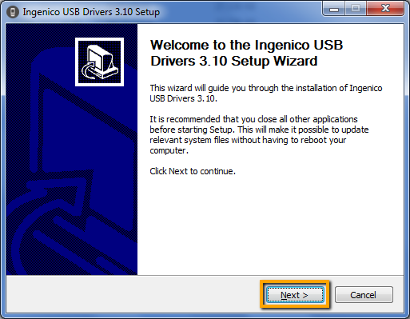
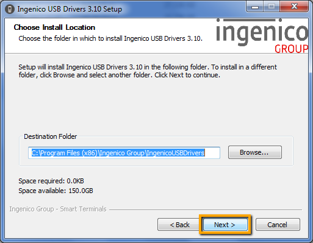
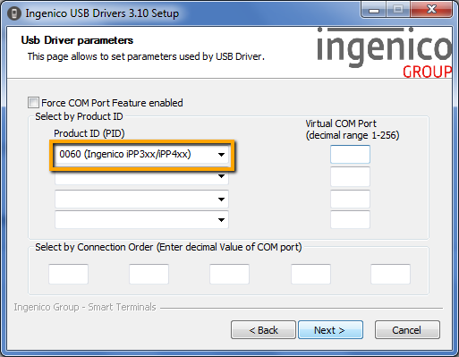
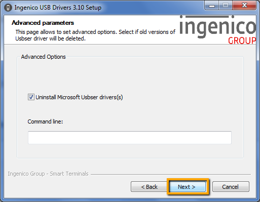
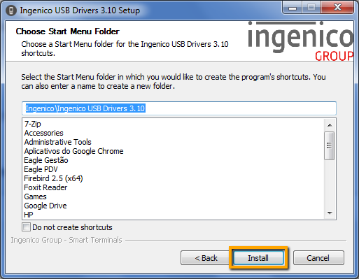
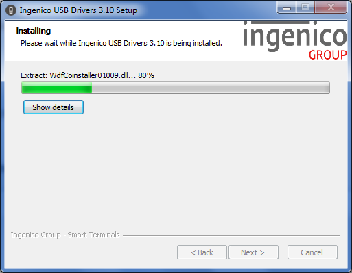
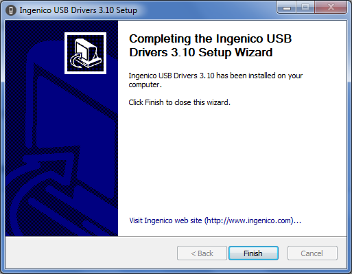
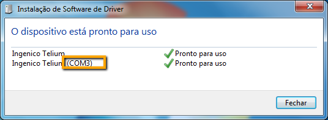
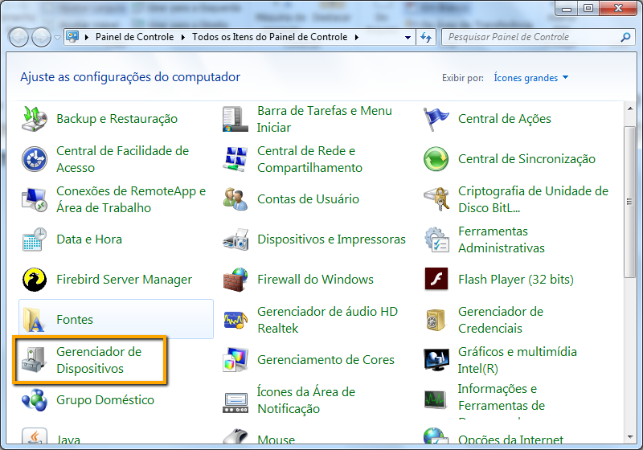
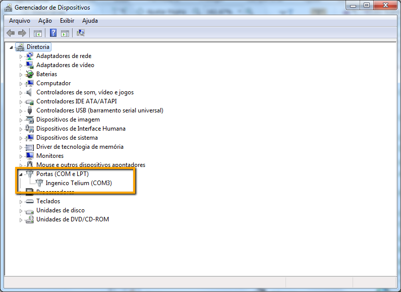

## Introdução

Esta guia vai mostrar os passos para instalar e configurar os modelos de Pinpads testados com o nosso PDV. Esta tecnologia tem por objetivo otimizar o check-out com uma solução de POS segura e rápida.

## Instalando Pinpad Ingênico iPP320

Para iniciar o processo de instalação baixe o [iPP 300 Series Driver](https://www.ingenico.com.br/binaries/content/assets/latin-america/drivers/ipp3xx0-usb-driver-v3.10.zip),  execute o instalador e clique em **Next**.

!! Aconselhamos não plugar o terminal iPP320 antes de efetuar a instalação do driver.

Clique em **Next**

!! Recomendamos não alterar o diretório padrão de instalação.

Selecione 0060 (Ingenico iPP3xx/iPP4xx) conforme demonstra imagem abaixo e clique em **Next**.

!! Os campos acima somente devem ser preenchidos se houver outros dispositivos, além do iPP320, conectados ao computador e quando for necessário especificar a porta COM para o iPP320.

Mantenha a opção **Unistall Microsoft Usbser Drivers** selecionada e clique em **Next**.

Clique em **Install**

Aguarde até que a instalação seja concluída.

Após aguardar a instalação por completo clique em **Finish**

Conecte o iPP320 à porta USB, aguarde mensagem de sucesso na instalação.

Observe que o Pinpad foi reconhecido na porta COM3.

Para conferir em qual porta de comunicação o dispositivo foi instalado entre **Gerenciador de Dispositivos** no **Painel de Controle do Windows**.

Dentro do **Gerenciador de Dispositivos** clique em **Portas (COM e LPT)** e verifique se consta o dispositivo **Ingenico Telium** e entre parênteses a especificação da porta de comunicação.

!!!! O Pinpad já está pronto para ser utilizado com o Eagle PDV.