===

## Abrindo o Sistema

Para abrir o Sistema clique duas vezes sobre o ícone correspondente na área de trabalho ou através do **Menu Iniciar / Programas / Eagle Gestão / Eagle Gestão.**

Informe o nome de usuário e senha e clique em Ok.

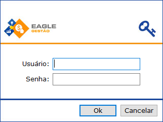

! Para cada funcionário é aconselhável associar um nome de usuário e uma senha (qualquer dúvida, consultar a assistência técnica).

! Cada usuário poderá ter um perfil específico, ou seja, o acesso de um usuário poderá ser diferente dos outros dependendo do tipo de acesso. A configuração dos Perfis de Usuário é realizada durante o processo de implantação do sistema. 

  
## Barra de Menus

Todos os recursos do sistema Eagle Gestão encontram-se nos comandos localizados na barra de menus superior. Eles estão separados em módulos (Sistema, Cadastros, Financeiro, Estoque, Vendas, Fiscal, Relatórios, Utilitários e Ajuda).

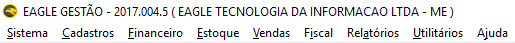

As funcionalidades utilizadas com mais frequência podem ser acionadas através da barra de menus lateral. Os principais comandos são acessados, também, utilizando-se as teclas de atalho correspondentes.

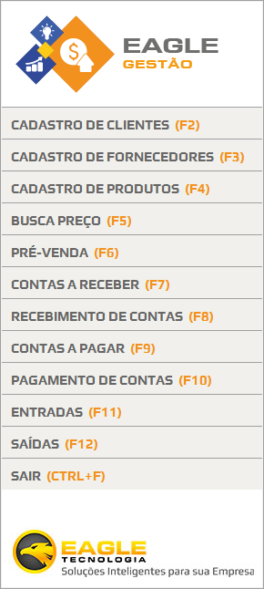

  
## Barra de Comandos

A barra de comandos é sempre exibida da parte inferior de todas as telas de cadastro do sistema. Com ela é possível executar ações de **navegação** entre registros, **inclusão**, **alteração**, **exclusão**, **pesquisa** e comandos complementares.

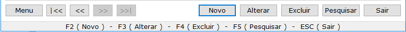

|Comando|Ação|
|------|----|
|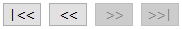|Navega entre os registros já cadastrados no sistema (primeiro registro, registro anterior, próximo registro, último registro)|
|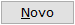|Abre uma nova tela de cadastro para criação de um novo registro na base de dados - Tecla F2|
|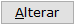|Modifica um registro já cadastrado (desbloqueia os campos para alteração das informações) - Tecla F3|
||Retira registros armazenados no banco de dados do sistema - Tecla F4|
|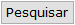|Procura determinado registro que possa ou não estar armazenado no banco de dados do sistema para que seja realizada alguma operação - Tecla F5|
||O usuário poderá sair da tela de cadastro - Tecla Esc|
|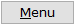|Exibe todas as funcionalidades adicionais|

  
## Localizando um Registro

O processo de pesquisa é utilizado quando o usuário necessita de um registro já armazenado no sistema, e pode ser utilizado para a realização de consulta simples, atualização de dados, ou exclusão de registros.

### Solicitar pesquisa de registro

O processo de pesquisa se inicia quando o usuário utiliza o botão lupa ou o botão pesquisar.

### Verificar disponibilidade de registros

Antes de exibir a tela de pesquisa, o sistema verifica a disponibilidade de informações e, caso não haja dados cadastrados, uma mensagem é disparada.
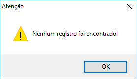

Caso contrário, o sistema mostrará todos os registros disponíveis no banco de dados.
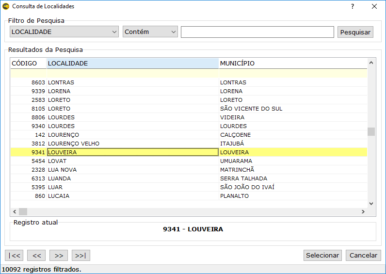

A Tela de Pesquisa é composta pelas seguintes seções:

** Filtro de Pesquisa**

Os filtros de pesquisa são mecanismos que possibilitam ao usuário fazer combinações de parâmetros que facilitem a localização da informação desejada.
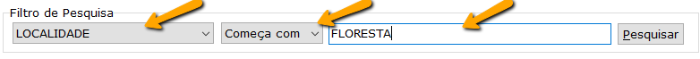
O usuário poderá utilizar os filtros para definir os parâmetros de pesquisa:
- Pesquisa por campos - a busca é realizada num atributo específico de uma entidade. Por exemplo: pesquisar um produto pelo seu código.
- Pesquisa por casamento padrão - a busca é feita utilizando-se uma combinação específica que deve coincidir com a descrição do atributo pesquisado. Exemplo: pesquisar um produto que termina com o termo "ADA".

** Resultados de Pesquisa**

Exibe todos os registros recuperados do banco ou apenas aqueles que foram filtrados, de acordo com os parâmetros informados.
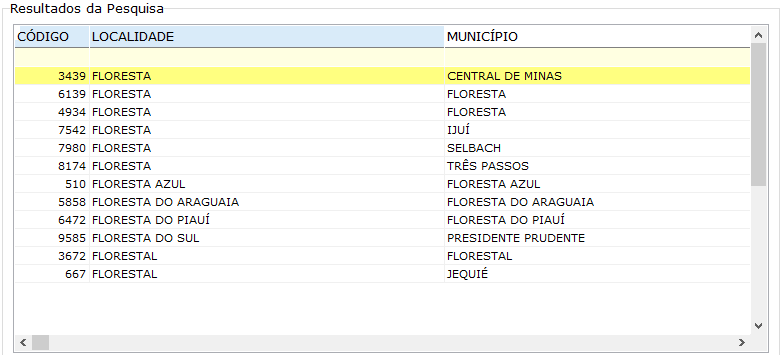

** Registro Atual **

Exibe a descrição principal do registro selecionado no momento.
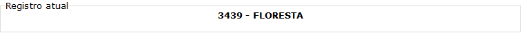

** Barra de Navegação **

Botões de navegação: Primeiro registro, registro anterior, próximo registro, último registro.
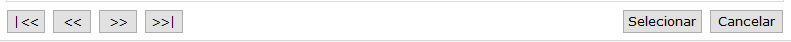

** Total de Registros **

Exibe o total de registros filtrados.
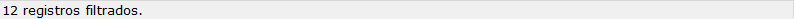

 
! Depois de realizada a pesquisa, o usuário poderá navegar até o registro desejado e selecioná-lo através do comando **Selecionar** ou pressionando a tecla **Enter** ou **Barra de Espaço**.

  
## Alteração

Para modificar alguma informação que já esteja cadastrada, é necessário acionar o
recurso de Alteração. O processo é o mesmo para todos os registros que se encontram na
base de dados do sistema. A seguir, serão mostrados os passos para se executar alguma
alteração.
1. Abra a tela de cadastro referente à informação que se deseja alterar (produto, cliente, fornecedor, orçamento, etc.)
1. Localize o registro em que se deseje fazer a modificação (utilize o botão _Pesquisar_ ou a _Lupa_)
1. Clique sobre o botão Alterar para que os campos do registro sejam desbloqueados
1. Altere os dados desatualizados ou incorretos do registro
1. Clique em Salvar para gravar as alterações

! Caso o sistema não localize nenhuma informação no 2º passo, uma mensagem de registro não encontrado é mostrada ao usuário.
  
## Exclusão

Os passos iniciais para realizar a Exclusão, são semelhantes ao processo de Alteração, descritos anteriormente.
1. Abra a tela de cadastro referente à informação que se deseja excluir (produto, cliente, fornecedor, orçamento, etc.)
2. Localize o registro em que se deseje fazer a exclusão (utilize o botão _Pesquisar_ ou a _Lupa_)
3. Clique sobre o botão Excluir
4. Confirme a exclusão do registro
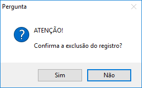
5. Informe o Usuário e Senha do Sistema

 
! O usuário poderá ou não excluir um determinado registro, dependendo do seu Perfil no Sistema.

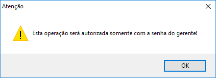

  
## Fechando uma tela

Para fechar qualquer janela do sistema, basta pressionar o botão x, localizado no canto superior direito da tela. O usuário também poderá utilizar o atalho Alt + F4 ou a tecla Esc para fechar a tela. O sistema sempre irá exibir uma mensagem de confirmação antes de finalizar o módulo.

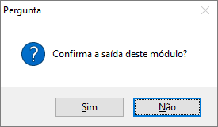

  
## Finalizando o Sistema

Para fechar o sistema, o usuário poderá utilizar a opção Sistema / Sair, pressionar as teclas Ctrl + F ou simplesmente pressionar o botão x, no canto direito da janela.
Antes de finalizar, o programa irá exibir uma mensagem de confirmação e, caso a resposta seja positiva, outra janela será exibida, dando ao usuário a possibilidade de criar um backup (cópia de segurança).

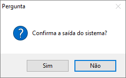
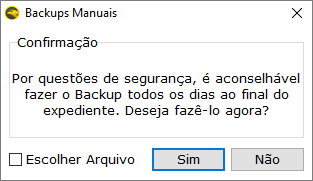

! Para mais informações sobre Backup, acesse o Tópico [_**Backup e Segurança**_](https://ajuda.eagletecnologia.com/manuais/eagle-gestao/backup-e-seguranca)