===

## Introdução

Este módulo permite ao usuário do sistema realizar orçamentos para os clientes da empresa e confirmar a venda através do faturamento dos mesmos. Somente após o faturamento haverá alteração financeira - comissões, movimentação de caixa, contas a receber por exemplo - e de estoque. A pré-venda pode ser feita através da tela de orçamentos e venda rápida.

## Orçamentos 
Segue o padrão visual das demais telas do sistema e pode ser acessada pelo Menu lateral na tela inicial, pelo menu superior em **Vendas → Orçamentos** ou pela **tecla F6**.

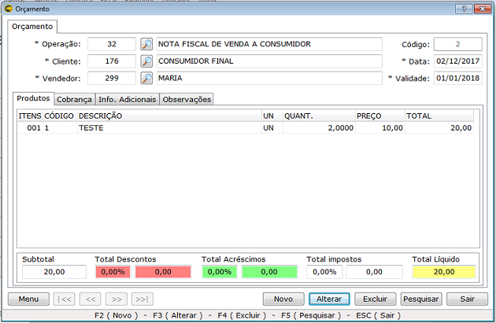

|Opção|Função|
|-----|------|
|Operação|Clicando na lupa você pode selecionar a operação de saída. Esse recurso é muito útil para quem trabalha com tipos diferentes de saídas, principalmente quando há a emissão de cupons fiscais ou notas fiscais eletrônicas. Também de acordo com a necessidade uma operação pode ser escolhida como padrão, não sendo necessário selecionar a operação desejada. Contate o suporte para realizar esse tipo de configuração.|
|Código|Número da pré-venda/orçamento. É automático, e incrementa um a cada nova venda iniciada ao clicar em **NOVO**.|
|Cliente|De acordo com a necessidade do usuário o cliente pode ser padrão, sendo automaticamente o **consumidor final**. Ao clicar na lupa são listados todos os clientes cadastrados para selecionar o cliente ao qual se refere a venda lançada. Também é possível selecionar o cliente digitando o seu código.|

!!! Ao clicar sobre a palavra CLIENTE o sistema exibe a ficha financeira do cliente - **Relatório Analítico de Cliente** - com dados consolidados sobre suas compras, sendo útil para avaliar no instante se é viável realizar uma venda a prazo para esse cliente.

|Opção|Função|
|-----|------|
|Data|Data em que a venda é lançada no sistema. O campo é editável, o que torna possível o lançamento de vendas retroativas. Recomenda-se que as vendas sejam lançadas na hora para evitar perda de registros, uma vez que orçamentos - vendas não faturadas - têm prazo de validade.|
|Vendedor|Clique na lupa e selecione o responsável pela venda ou digite o código de vendedor. Apenas aparecerão os nomes cadastrados em FUNCIONÁRIOS e marcados como VENDEDORES. Mas se necessário pode ser feito uma configuração para selecionar o vendedor automaticamente de acordo com o usuário logado ao sistema. Nesse caso, contate o suporte.|
|Produtos|Serão discriminados os itens da venda. Altere os campos de quantidade e preço de acordo com a necessidade.| 

Existem algumas maneiras para selecionar os produtos:
1. O produto pode ser selecionado clicando com o mouse duas vezes.
1. Pressionando a tecla Back Space.
1. Usando o código de barras. Para isso o código de barras tem que estar cadastrado como referência do produto. Sendo assim clique no campo **código** e passe o leitor no produto.

! Para excluir o produto do orçamento utilize a função Ctrl+Del.

Na parte inferior da tela de orçamentos há opções de descontos e acréscimos sobre a venda.  
Para conceder desconto por produto, clique no produto e depois aperte F12 no teclado.

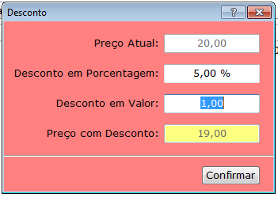 

Para conceder acréscimo por produto, clique no produto e depois aperte F11 no teclado.

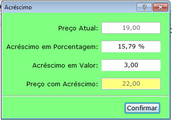 

Os descontos e acréscimos podem ser concedidos tanto digitando a porcentagem como o valor.  
O campo acréscimo pode ser utilizado como frete ao gerar documentos fiscais. Essa configuração deve ser realizada pelo suporte no cadastro da empresa.

! Os campos de descontos e acréscimos devem ser preenchidos antes de passar para a aba COBRANÇA.

Para inserir uma observação na venda basta pressionar F10.

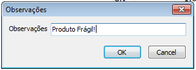 

A aba **Cobrança** é utilizada para editar as opções financeiras da venda, tais como meio de pagamento, número de parcelas, data de vencimento das parcelas e valores de cada parcela.  

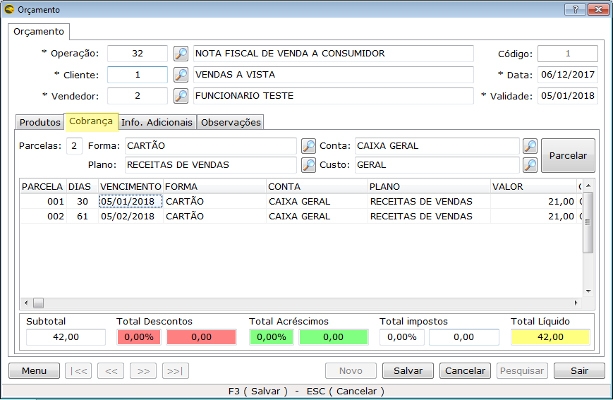 

|Opção|Função|
|-----|------|
|Parcelas|Insira a quantidade de parcelas.|
|Forma|Insira um meio de pagamento (cartão, cheque, boleto). Alguns meios de pagamento já vêm cadastrados no sistema.|
|Conta|Selecione a conta para a qual o recebimento da venda será direcionado, podendo ser caixa, cofre, banco, entre outros.| 
|Plano|Selecione o plano de contas contábil do qual a receita fará parte. Entre em contato com a contabilidade para obter mais informações.|
|Custo|Selecione o centro de custos para o qual essa receita será destinada. Pode ser por exemplo um setor ou projeto da sua empresa.|
|Parcelar|Após ter preenchido todas as informações anteriores, clique em parcelar. Serão geradas as parcelas da venda de acordo com a quantidade informada.|

É possível alterar vencimento, forma de pagamento, conta, plano de contas, valor e centro de custo de cada parcela. Ao alterar o dia de vencimento da primeira parcela, o dia de vencimento de todas as posteriores também serão alterados. Por isso é preciso ter atenção ao realizar esse procedimento, apesar de ser possível alterar cada uma. Da mesma forma ao alterar o valor de alguma parcela, as parcelas posteriores serão reajustadas.  

! Contate o suporte para o cadastro ou alterações em cadastros de meios de pagamento, contas correntes ou centro de custos.

Através da aba **Informações Adicionais** é possível informar o local da operação, sendo:
* Não se aplica (NF-e complementar ou de ajuste)
* Operação presencial
* Operação não presencial, pela Internet
* Operação não presencial, teleatendimento
* NFC-e em operação com entrega a domicílio
* Operação não presencial, outros  

Também é possível informar o tipo de consumidor, sendo **Normal** ou **Final**. O local informado pelo sistema por padrão a cada nova venda é Operação Presencial e o tipo de consumidor é o mesmo informado no cadastro de cliente, podendo ambos serem alterados de acordo com a necessidade.  

Por meio da aba **Observações** é possível inserir outras informações sobre o produto. Essas observações serão impressas no orçamento.

Somente após o faturamento os produtos saem do estoque e o financeiro do cliente é lançado. O faturamento é através da tecla F6 ou do menu lateral na opção **FATURAR ORÇAMENTO**.

### Menu orçamentos

No menu lateral da tela de Orçamentos há opções, que também podem ser acessadas por meio de teclas de atalho, que influenciam na realização da venda conforme a imagem:

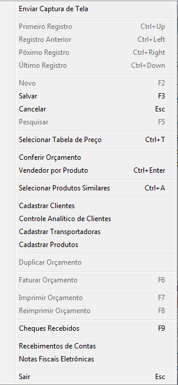   

Também é possível acessar o Menu clicando com o botão direito do mouse da parte inferior da tela de orçamento. Algumas opções estarão desabilitadas caso a tela esteja ou não em modo de edição. Dentre as várias opções, algumas devem ser ressaltadas:

|Opção|Função|
|-----|------|
|Selecionar tabela de preço Crtl + T|Caso tenha mais de uma tabela de preço cadastrada, além da tabela padrão, é possível escolher a tabela de preço a ser usada, fazendo com que todos os produtos da venda usem o preço da tabela selecionada. Para obter informações sobre cadastro de tabelas de preço acesse o [Manual de Cadastros](https://ajuda.eagletecnologia.com/manuais/eagle-gestao/modulo-cadastros#cadastro-de-tabelas-de-preo). {c:red}Após inserir os produtos não é possível trocar de tabela{/c}. 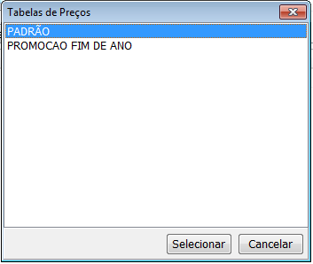 |
|Vendedor por produto Ctrl + Enter|Usando essa opção, após ter clicado no produto específico, o sistema mostrará uma tela para selecionar vendedor. Dessa forma a comissão daquele determinado produto irá para o vendedor selecionado, e o produto ficará {c:blue}azul{/c}. Caso contrário o comissionado na venda será o vendedor da venda.|
|Selecionar Produtos Similares Ctrl + A|Para que você obtenha resultados com essa função, devem existir produtos similares vinculados. Selecione o produto e acesse essa opção. Isso fará com que apareçam todos os produtos similares a este. Ao selecionar um produto similar, o mesmo substituirá o produto que estava na venda.|
|Cadastrar clientes|Essa opção permite que o usuário acesse a tela de cadastro de clientes sem precisar sair da tela de vendas.|
|Cadastro analítico de cliente|Esse é outro meio de acessar o relatório de controle analítico do cliente selecionado na venda.|
|Cadastrar transportadoras|Essa opção permite que o usuário altere ou cadastre uma nova transportadora sem precisar sair da tela de vendas.|
|Cadastrar produtos|Essa opção permite que o usuário altere ou cadastre um novo produto sem precisar sair da tela de vendas.|
|Duplicar orçamento|Essa opção permite que o usuário duplique os orçamentos salvos, inclusive os que já foram faturados.|
|Faturar orçamento F6|Essa opção é usada para faturar os orçamentos salvos. Só após o seu faturamento será gerada a conta a receber se a venda for a prazo. Se for em dinheiro o recebimento irá constar no caixa. Outro detalhe importante é que só após o faturamento o produto sairá do estoque. No cadastro da Empresa, essa opção pode ser configurada para faturar automático ou perguntar se deseja faturar orçamento ao salvá-lo. Contate o suporte para alterar essas configurações.|
|Imprimir orçamento F7|Essa opção é usada para imprimir os orçamentos de forma manual. No cadastro da Empresa essa opção pode ser configurada para imprimir o orçamento ao salvar ou mostrar orçamento ao salvar. Contate o suporte para alterar essas configurações.|
|Reimprimir orçamento F8|Reimprimir orçamentos salvos.|
|Cheques recebidos F9|Através dessa opção você pode cadastrar o cheque no momento da venda. Para habilitar essa opção a forma de pagamento deve ser cheque. Se for mais de um cheque você pode salvá-lo e replicar, dessa forma será necessário alterar as informações do mesmo. Assim o cheque será vinculado à conta a receber do cliente e aparecerá nos relatórios de cheques Emitidos/Recebidos. 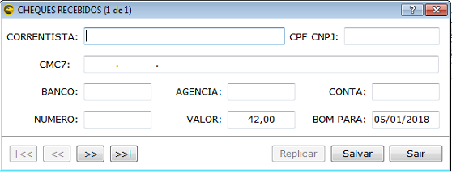 |
|Recebimentos de contas|Ao clicar nessa opção irá abrir a tela de recebimentos de contas, não sendo necessário sair da tela de vendas.|
|Notas fiscais eletrônicas|Ao faturar o orçamento com operação de nota fiscal, você pode selecionar essa opção para ir automaticamente para a tela de Gerenciador de Notas Fiscais. Dessa forma, você poderá transmitir a nota fiscal pendente.|

## Venda Rápida 
Acessada pelo comando **CTRL+F6**, ou pelo menu superior em **Vendas → Venda Rápida**, ou através do **aplicativo** (atalho), a tela de venda rápida é destinada a quem é menos dependente do mouse e deseja mais agilidade na venda. 

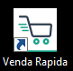

Através da tela de Venda Rápida é possível executar vendas utilizando apenas os comandos do teclado, de forma intuitiva como mostrado na imagem abaixo.

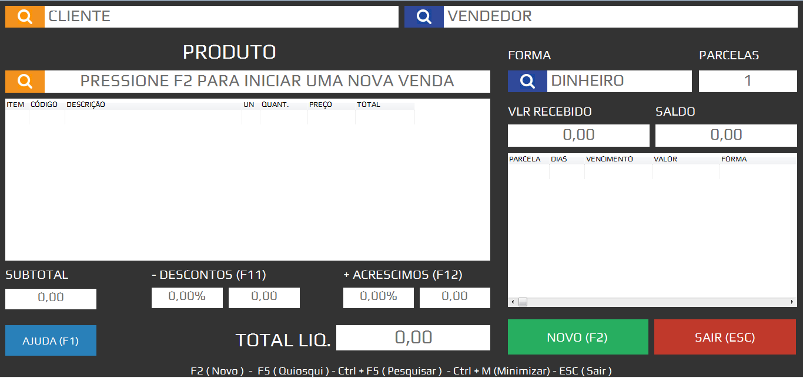

|Opção|Função|
|-----|------|
|F1 Ajuda|Menu, que contém opções semelhantes ao menu de orçamentos, como acesso ao controle analítico de clientes, produtos similares e reimpressão de orçamento e outras opções exclusivas dessa tela como abrir gaveta, liberar desconto máximo e entrada obrigatória no momento da venda, que serão explicadas mais adiante.|
|F2|Realizar nova venda ou finalizar venda iniciada. Ao clicar em F2 pela primeira vez em uma venda que já esteja iniciada, o ponteiro será direcionado para a forma de pagamento, para que possa ser escolhida. Pela segunda vez, o sistema finalizará e salvará a venda caso não esteja faltando nenhuma informação.|
|F3|Alterar venda já salva e selecionada na tela de orçamento. É possível pesquisar uma venda realizada através do Menu ou pressionando Ctrl+F5.|
|F4|Excluir venda.|
|F5 Quiosque|Busca preço de produtos. 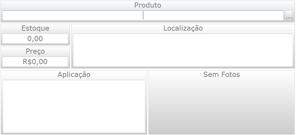|
|F6| Faturar venda: Para que a venda realmente se concretize, ou seja, dar baixa no estoque ou realizar movimentação no caixa, deve-se faturar a venda.|
|F7|Imprimir venda.|
|F8|Reimpressão de vendas já faturadas.|
|F9|Cheques recebidos: Cadastro de cheques recebidos no ato da venda.|
|F10|Inserir observações na venda. Para inserir uma observação sobre o orçamento, basta pressionar F10 sem ter clicado sobre a descrição do produto. Essa observação sairá no Documento Auxiliar de Venda e na nota fiscal.|
|F11|Conceder descontos na venda.|
|F12|Inserir acréscimos na venda.| 
|Ctrl + F5|Pesquisar vendas realizadas que ainda não foram faturadas.|
|Ctrl+F11|Inserir acréscimo no item.|
|Ctrl+ F12|Conceder desconto no item.|
|Ctrl + A|Selecionar produtos similares: Essa função pode ser usada, por exemplo, caso o produto que deseja vender não tenha mais estoque, ou o cliente queira um outro produto que seja similar ao produto referido. Selecione o produto em questão, pressione Crtl+A e selecione o produto similar desejado. O produto similar substituirá o produto original na venda. É preciso que o produto original tenha cadastrado produto similar.| 
|ESC|Cancelar venda.|

! Use as setas para movimentar dentro dos campos e as teclas ENTER e TAB para movimentar entre os campos principais.
! As funções acima também podem ser encontradas acessando o Menu.

### Venda a prazo na tela de Venda Rápida

Para realizar uma venda a prazo na tela de Venda Rápida siga os passos a seguir:
1. Tecle F2 para solicitar uma nova venda.
1. Para selecionar o cliente aperte a barra de espaço com cursor no campo de seleção de cliente ou clique na lupa de pesquisa, que abrirá a pesquisa de clientes. Pesquise o cliente usando as setas para navegar na lista e a tecla ENTER para selecionar.
1. O cursor irá para o campo de vendedor, tecle barra de espaço e selecione o vendedor. Pressione ENTER para o cursor ir para a pesquisa de produtos.
1. O cursor irá para o campo de produto, insira o código do produto caso saiba ou tecle barra de espaço, e vá para pesquisa de produtos, selecione o produto com a tecla ENTER. Pode ser usado o leitor de código de barras para selecionar o produto caso o produto tenha o código cadastrado.
1. Após escolher o produto, pode-se movimentar utilizando as setas entre os campos de quantidade, valor e altera-los caso necessite.
Pode-se também no ato de colocar o produto, inserir a quantidade antes. Exemplo: para inserir 5 unidades de um produto digite **5 x 'código do produto'** ou **5 x' e passe o leitor no código de barras**. 
1. Após inserir os produtos, dê desconto (F11) ou acréscimos (F12) necessários.
1. Para finalizar (indo para meio de pagamento) aperte F2.
1. Para alterar a forma de pagamento, aperte a tecla barra de espaço e selecione o meio de pagamento desejado.
1. No campo Parcelas insira o número de parcelas caso o meio de pagamento selecionado permita.
1. Sendo a venda a ser realizada a prazo, o campo saldo ficará com o valor da venda.
1. Para movimentar entre as parcelas geradas utilize as setas do teclado, podendo alterar data de vencimento, e meio de pagamento de cada parcela, apertando a tecla barra de espaço.
1. Após inserir a cobrança corretamente, aperte F2 para salvar.
1. Para imprimir a venda tecle F7.
1. Para Faturar a venda tecle F6.

### Venda a vista na tela de Venda Rápida.

1. Após fazer todo o processo de inserção de cliente, vendedor e produtos (como mostrado anteriormente) vá para meio de pagamento F2.
1. Altere a forma de pagamento, apertando a tecla barra de espaço e selecione o meio de pagamento desejado, no caso dinheiro. Meio de pagamento dinheiro possui apenas uma parcela. 
1. Sendo a venda em dinheiro, o campo valor recebido ficará com o valor da venda. Tem-se a opção de inserir no campo valor recebido, o valor em dinheiro que o cliente entregou, para que o sistema lhe apresente o troco. Por exemplo, uma venda no valor de R$10,00 e o cliente lhe passa uma nota R$20,00, digite 20,00 no campo valor recebido que o sistema lhe apresenta a seguinte tela. 

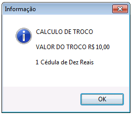

Após inserir os valores da venda, salve a venda com atalho F2, imprima usando F7 e depois fature a venda pelo atalho F6.

## Faturamento

Este módulo mostra todos os orçamentos que ainda não foram faturados, podendo ser acessado pelo Menu superior do sistema em **Vendas → Faturamento**. Os orçamentos podem ser selecionados das seguintes formas.

1. Mostrar todos
1. Mostrar por cliente
1. Mostrar por vendedor
1. Mostrar por rota
1. Mostrar por período

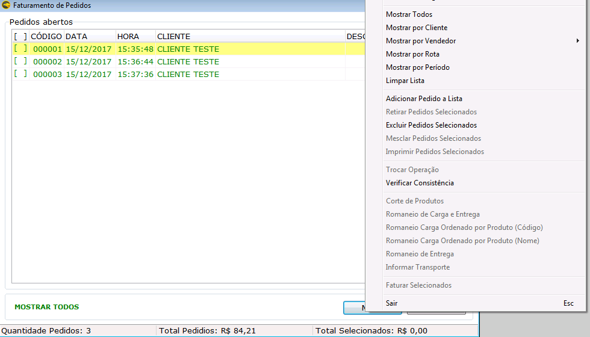

|Opção|Função|
|-----|------|
|Adicionar pedido à lista|Essa opção é utilizada para incluir um orçamento que não está na lista. Aparecerá a tela de pesquisa de orçamentos. Selecione o orçamento que deseja incluir.|
|Retirar pedidos selecionados|Selecione o orçamento e utilize essa opção para retirá-lo da lista.|
|Excluir pedidos selecionados|Essa opção é utilizada para excluir orçamentos selecionados.|
|Mesclar pedidos selecionados|Essa opção é irreversível, e é utilizada para unificar os orçamentos selecionados e transformá-los em um só. **Essa função serve para os orçamentos do mesmo cliente**.|
|Imprimir pedidos selecionados|Imprimir orçamentos selecionados.|
|Trocar operação|Essa opção é irreversível, e é utilizada para trocar a operação salva no orçamento anteriormente. Se forem vários orçamentos, basta selecioná-los e ao clicar na opção aparecerá uma janela mostrando todas as operações de saída ativas. Troque para a operação necessária.|
|Verificar Consistência|Essa opção serve para validar os orçamentos selecionados, verificando se o valor líquido é igual ao valor processado.| 
|Romaneio de carga e entrega|Ao clicar nessa função ela abre a tela que acessa os relatórios de Romaneio de Carga, Romaneio de Entrega e Etiqueta de Romaneio e Entrega. |
|Romaneio de carga ordenado por produto (código)|Essa função já abre diretamente o relatório de romaneio de carga ordenando pelo código do produto.|
|Romaneio de carga ordenado por produto (nome)|Essa função já abre diretamente o relatório de romaneio de carga ordenando pelo nome do produto.|
|Informar transporte|Essa função permite que o usuário coloque as informações de transporte do orçamento, podendo ser selecionado um orçamento para informar o transporte e ir navegando entre os orçamentos pendentes através das setas. 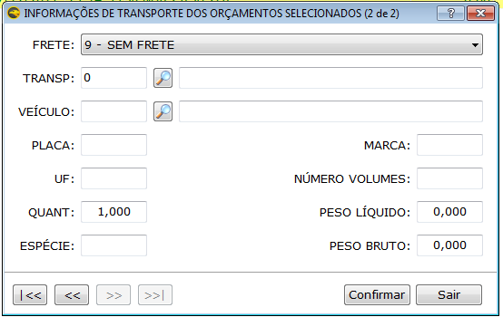|

!!! O romaneio de carga é o documento que discrimina todas as mercadorias embarcadas ou todos os componentes de uma carga. O romaneio tem o objetivo de facilitar a identificação e localização de qualquer produto dentro de um lote e facilitar a conferência da mercadoria por parte da fiscalização, tanto no embarque como no desembarque.[^1]
[^1]: Fonte: Receita Federal

! Para mais detalhes sobre os relatórios acesse o módulo de relatórios.

## Devoluções

O Módulo de devolução de vendas auxilia de forma prática a movimentação de entrada e saída de produtos devolvidos ou trocados. Este Módulo gerencia apenas o estoque dos produtos, assim os valores financeiros devem ser alterados manualmente de acordo com a transação. 
Para realizar uma devolução ou troca de produtos, as operações de devoluções e trocas devem ser previamente criadas e configuradas, para isso, o suporte técnico do sistema deve ser contatado.

### Devolução de Venda

A devolução de uma venda pode ser realizada no sistema através de dois passos. Acesse: **Vendas → Devoluções** para exibir a tela de devoluções e clique em **Novo**.
Nesta aba devem ser informados os dados da devolução que será realizada. 

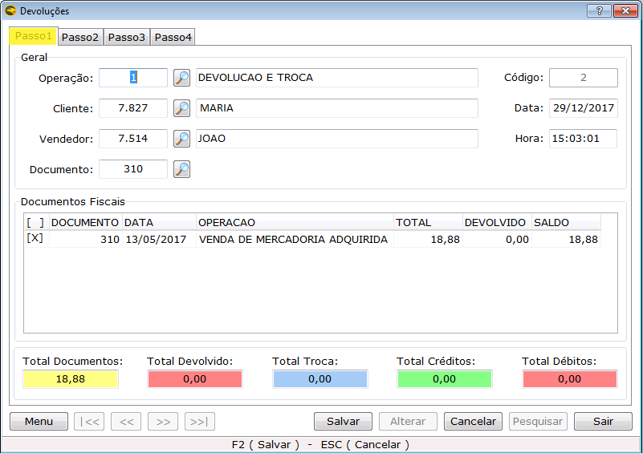

|Opção|Função|
|-----|------|
|Operação|Selecione a operação de devolução que será utilizada. É necessário ter uma operação de devolução configurada. Caso não tenha, contate o suporte.|
|Cliente|Selecione o cliente para qual será realizada a devolução ou troca. Ao inserir cliente, aparecerão os documentos fiscais de todas as vendas realizadas para o mesmo.|
|Vendedor|Selecione o vendedor que está realizando a troca.|
|Data e Hora|Aparecerá a data e hora em que a devolução está sendo inserida no sistema, podendo ser alterada.|
|Documento|Por meio dessa opção é possível selecionar o documento específico que corresponde à venda que está sendo devolvida. Clique na lupa e, ao selecionar o documento serão listados automaticamente o cliente, vendedor e documento fiscal.| 
|Documentos Fiscais|Lista todos os documentos de vendas realizadas para o cliente selecionado com data e valor da venda realizada. Selecione os documentos que estiverem relacionados com a devolução.|
|Total Documentos|Aparecerá a soma dos valores de todos os documentos selecionados.|

Na aba Passo 02 será realizada a devolução dos produtos. Aparecerão todos os itens da venda selecionada, com os respectivos preços e quantidades vendidas. Caso queira efetuar troca ou devolução de todos os produtos, clique com o botão direito sobre um dos itens e selecione uma das opções do menu suspenso.

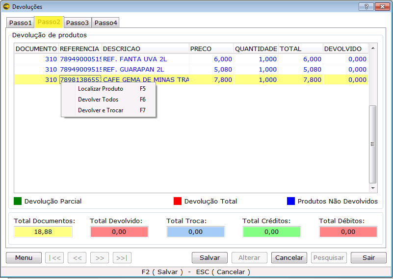

Ou selecione o produto que vai ser devolvido e no campo **DEVOLVIDO** insira a quantidade a ser devolvida conforma imagem abaixo. 

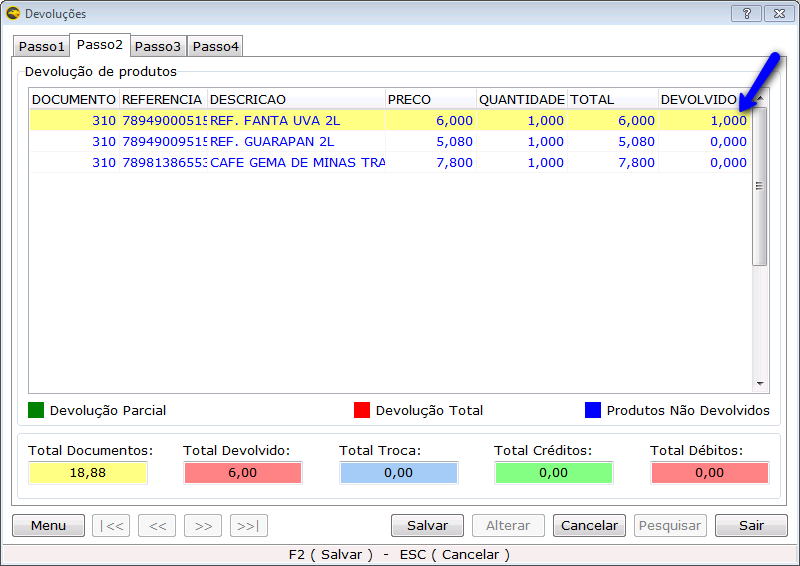

+ Se a devolução for total, ou seja, a quantidade vendida do produto for a igual à quantidade devolvida, o produto ficará com a cor em {c:red}VERMELHA{/c} após salvar.
+ Se a devolução for parcial, ou seja, a quantidade vendida for diferente da devolvida o produto ficará com a cor {c:green}VERDE{/c}. 
+ Caso fique {c:blue}AZUL{/c} após salvar, é que nenhuma quantidade daqueles produtos foram devolvidas ou trocadas.

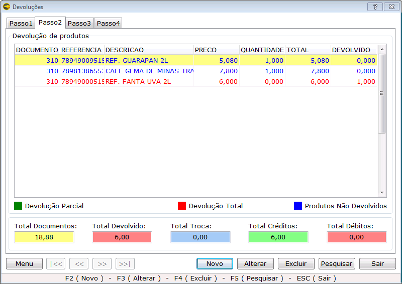

Clique em salvar. Para que a devolução altere o estoque dos produtos, acesse **Menu** e clique em **Faturar Devolução** ou pressione a tecla **F6**.

### Gerenciamento Financeiro de uma devolução  

O processo de devolução não altera os valores da venda que foi realizada anteriormente. Portanto esta alteração deve ser feita manualmente, de acordo com a política da empresa, onde se deve escolher a forma de como tratar o crédito gerado para o cliente.  

Abaixo estão listadas algumas das opções que poderiam ser utilizadas pela empresa:  

1. Caso a venda tenha sido realizada com uma forma de pagamento a prazo, e o cliente ainda não tenha realizado o pagamento, poderá ser realizada a alteração do valor da conta a receber. Para alterar o financeiro da conta a receber na tela de devolução acesse Menu  → Lançamento de contas a receber, pesquise a conta a ser alterada e faça as devidas alterações. Ou então acesse Financeiro → Contas a Receber → Lançamentos de contas a receber.
1. Caso o cliente já tenha pagado a venda e a empresa trabalhe com devolução de dinheiro, para controlar a saída do dinheiro do caixa da empresa o processo a ser seguido pode ser de lançar uma conta a pagar da empresa para o cliente e fazer a retirada em dinheiro do valor no caixa. Para isso acesse Financeiro → Contas a Pagar → Lançamento de Contas a Pagar.
1. Caso o cliente já tenha quitado a dívida e a empresa não trabalhe com devolução de dinheiro o processo a se fazer é o lançamento de vale crédito para o cliente. Desta forma o cliente ficará tendo o saldo para ser descontado em compras futuras. Para saber como lançar um vale crédito consulte a seção [VALE CRÉDITO](https://ajuda.eagletecnologia.com/manuais/eagle-gestao/modulo-vendas-e-faturamento#vale-crdito).  

## Troca de produtos  
O processo de troca é composto pela devolução do produto e a troca por outra mercadoria. Desta forma é necessário seguir todos os passos explicados na [seção de devolução de venda](#devolues), para posteriormente realizar a troca da mercadoria.
O processo de troca pode ocorrer por um produto de maior ou menor valor que a mercadoria adquirida na primeira venda. Abaixo serão mostrados os processos que devem ser realizados para cada uma destas situações.

### Troca por produtos com valor maior que os produtos devolvidos

Para realizar o processo de troca Acesse: Vendas → Devoluções e a tela de devoluções será exibida. Clique em Novo. O passo 1 e passo 2 correspondem ao processo de devolução, faça os passos conforme o que foi explicado em **[DEVOLUÇÃO DE VENDA](#devolues)**, mas ainda não fature. 
No Passo 3 insira o novo produto, pesquise por código ou descrição o produto desejado, insira a quantidade e coloque o preço caso tenha necessidade.

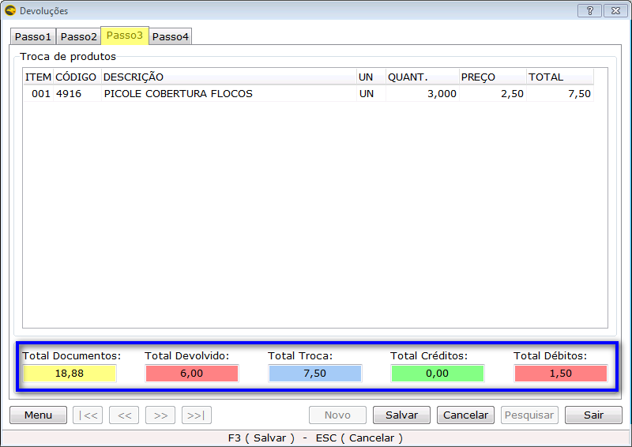

É interessante analisar os valores gerados nos campos **totais** conforme a tabela abaixo:

|Opção|Função|
|-----|------|
|Total Documentos| Valor total do documento de compra que contém a mercadoria a ser devolvida.|
|Total Devolvido|Valor total de todos os produtos devolvidos. Sempre será menor ou igual a **Total Documentos** dependendo da quantidade de produtos a ser devolvido.|
|Total Troca|Valor dos novos produtos.|
|Total Créditos|Valor devido pela empresa quando o total de troca for menor que o Total Devolvido.|
|Total Débitos|Valor devido pelo cliente quanto o total da troca for maior que o Total Devolvido.|

Como nesse exemplo o novo produto (R$7,50) tem valor maior que o produto devolvido (R$6,00), então será gerado um valor de débito para o cliente (Total Débitos = R$1,50). Clique em Salvar.

Para alterar o estoque do produto devolvido, acesse: Menu → Faturar Devolução (F6), caso a operação não esteja marcada para faturar automaticamente.
Após o faturamento será criado um orçamento com os dados da troca. Saia do módulo de devoluções e acesse: Vendas → Orçamentos. Aparecerá o orçamento gerado com o novo produto. Para que o valor da troca fique correto, sendo o valor do débito gerado na troca, conceda um desconto no valor do produto devolvido. 

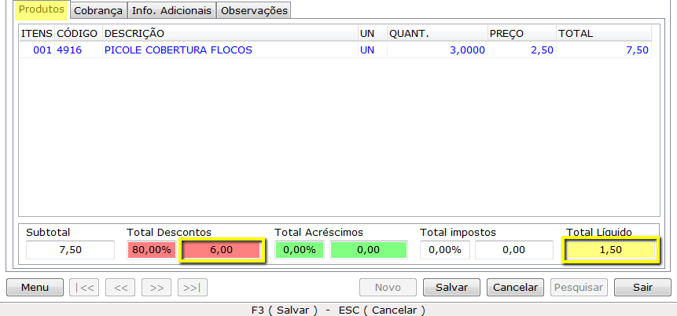

Na aba Cobrança insira a forma de pagamento, plano de contas, conta corrente, centro de custos e clique em parcelar. Após isso fature (F6) para que o estoque do novo produto e o financeiro seja alterado.

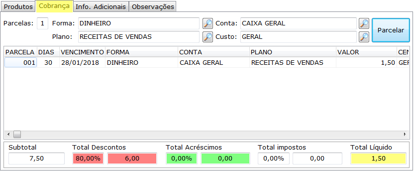

### Troca por produtos com valor menor que os produtos devolvidos

Nessa situação, a troca de produtos é feita de maneira semelhante à mostrada na seção anterior. Insira o novo produto pesquisando por código ou descrição, depois altere a quantidade e coloque o preço caso tenha necessidade.
Dessa vez será gerado um total de créditos (já que o produto selecionado na troca tem valor menor que o produto devolvido no passo 2), conforme a figura abaixo:

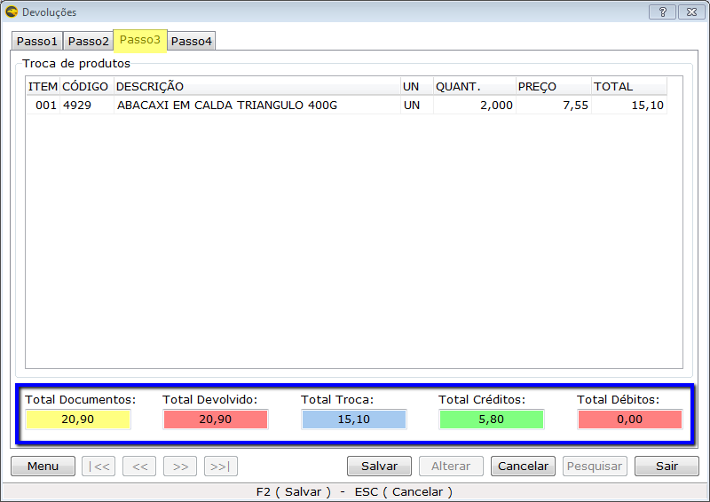

Salve e fature a devolução (F6), depois acesse: Vendas → Orçamentos.
No orçamento criado conserve uma operação de troca que não possui financeiro. Como o valor devolvido é maior que valor do produto trocado, o desconto deverá ser de 100% (cem por cento).

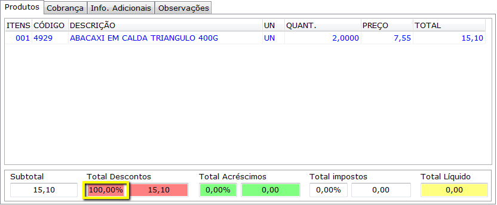

Salve o orçamento e fature.
O valor financeiro do crédito gerado no processo de troca pode ser trabalhado conforme indicado na seção de [Gerenciamento do Financeiro de uma Devolução](#gerenciamento-financeiro-de-uma-devoluo). Na próxima seção será mostrado [como fazer vale crédito](#como-fazer-um-vale-crdito), uma função muito útil para quando é gerado crédito na devolução ou troca. 

!!! Em ambos os processos de troca apresentados, caso seja necessário emissão de nota fiscal, na tela de Orçamentos acesse: Menu → Notas Fiscais Eletrônicas, selecione a nota e a transmita.

## VALE CRÉDITO

O Vale Crédito é uma forma de fornecimento de crédito pela empresa ao seu cliente. Constitui-se de um determinado valor que a empresa teoricamente deve ao cliente. Este valor pode ser utilizado pelo cliente para compra de novos produtos na empresa.

### Como fazer um vale crédito

1. Inicialmente é necessário cadastrar o meio de pagamento Vale Crédito e o plano de contas despesas Vale Crédito. Para realizar estes cadastros entre em contato com o suporte do sistema.
1. Posteriormente Acesse: Cadastros → Clientes → Cadastro de Clientes, pesquise pelo cliente e o marque também como fornecedor.

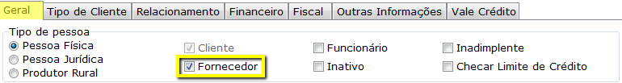

3. Acesse: Financeiro→ Contas a pagar → Lançamento de Contas a Pagar.
4. Lance uma conta a pagar no valor do crédito disponível, em nome do cliente. No meio de pagamento coloque vale crédito e o plano de contas vale crédito. Esta conta será quitada automaticamente, conforme a configuração feita no meio de pagamento. 

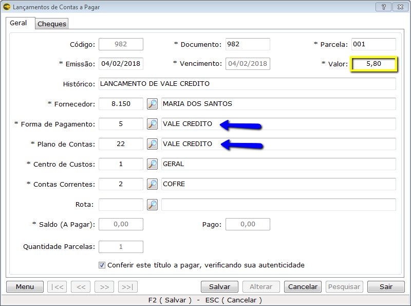

!!! No caso de uma devolução ou troca por produto de menor valor em que se queira fazer um vale crédito, o valor do crédito gerado na troca deverá ser o valor inserido na conta a pagar.

5. Para certificar-se de que o lançamento do vale crédito foi efetuado acesse o cadastro do cliente e verifique na aba Vale Crédito se o valor está disponível.

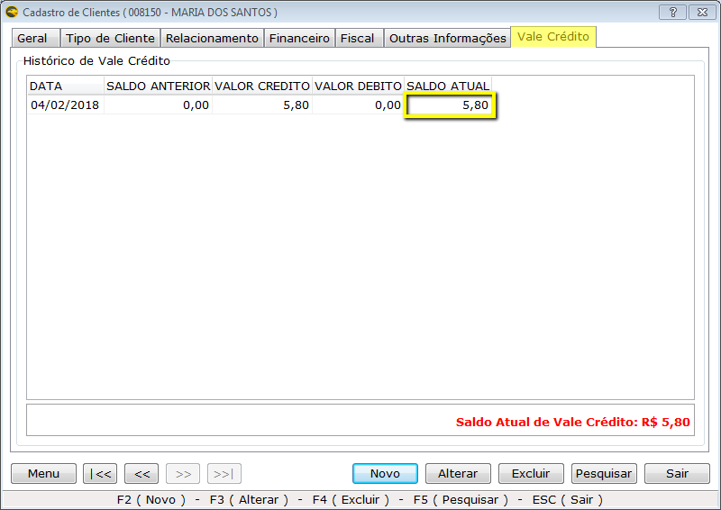

### Realizando Vendas com Meio de Pagamento Vale Crédito

O processo de venda para clientes que possuem vale crédito é o mesmo que uma venda comum, a única coisa que é diferenciada é a forma de pagamento que deve ser Vale Crédito. Desta forma, ao realizar uma venda para o cliente que possui vale crédito na empresa, selecione o meio de recebimento vale crédito e coloque o valor correspondente ao valor disponível do vale. 
Se a venda for maior que o saldo do vale crédito, crie duas ou mais parcelas na cobrança. A primeira parcela deve ser com meio de pagamento vale crédito e com o valor a ser quitado do vale crédito do cliente. As outras parcelas devem estar com o meio de pagamento e valor acordado com o cliente.

Na figura abaixo a compra tem valor superior ao do vale crédito.

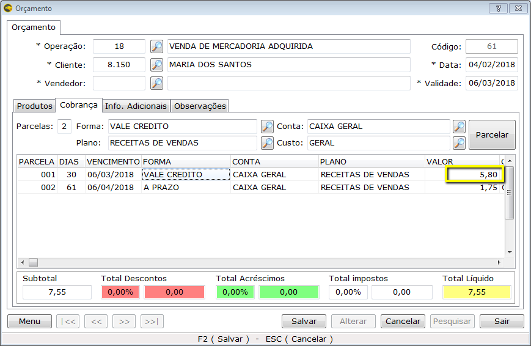

Quando a compra realizada possui um valor menor que o vale crédito disponível, o cliente ainda possuirá saldo na empresa, podendo ser verificado no seu cadastro na aba **Vale Crédito**.

### Recebendo contas com Meio de Pagamento Vale Crédito

Caso o cliente deseje utilizar o vale crédito que possui na empresa para pagar uma conta pendente, se a empresa permitir esse tipo de transação, em recebimento de contas selecione o meio de pagamento vale crédito.

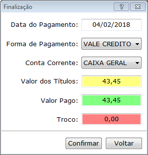

