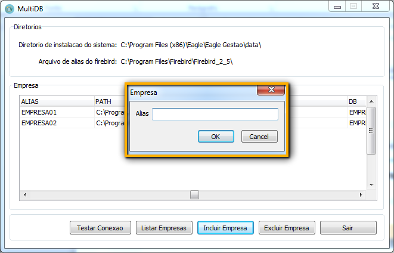

## **INSTALAÇÃO**

1.	Execute o validador.
2.	Na opção do tipo de instalação escolhe Emissor NF-e/CT-e e prossiga a instalação normal.

3.	Após a instalação, abra o Localconf e faça a configuração do Localconf para usar Multibancos para clientes que irão usar mais de um banco (ex.: Contabilidades). Para clientes que usarão apenas um banco deve ser marcada a opção **Normal.**

4.	Faça a configuração de backup. Escolha uma pasta padrão onde o sistema fará o backup de cada um dos bancos. O sistema criará nesta pasta uma subpasta com o nome de cada aliases.!

5.	Para criação dos bancos de dados, execute o aplicativo MultiBD.exe. 

6.	Para a criação dos banco de dados a partir do MultiDB deve ter sempre um banco de dados limpo na pasta do sistema, ou seja, certifique que o banco padrão (EAGLEERP.FDB) não foi usado.

					* 	Para criar os bancos use a opção Incluir Empresas.
					* 	Na tela que aparecer coloque o CNPJ da empresa, sem os caracteres especiais, que quer 							cadastrar. A informação é importante pois será usada no registro e para abrir o sistema.
					* 	Após cadastrar a empresa sai do aplicativo e abra o sistema.

7.	Na tela de login coloque o usuário e senha. No treinamento será passado o usuário padrão da sua empresa. Também é necessário colocar o CNPJ da empresa cadastrada, sem os caracteres especiais, da mesma forma que foi colocada anteriormente.

! OBS.: Após a configuração de um banco como Multibanco a tela de login será sempre a mostrada na Figura 7. Caso o banco de dados seja normal a instalação terá que ser refeita. Para banco configurado como Normal a tela de login será como a mostrada na Figura 8

8.	Para multi bancos após o login vai surgir a tela de registro. Para banco normal a tela de registro aparecerá quando o sistema for aberto.

9.	Para realizar o registro é importante que a empresa já esteja cadastrada no [Falconfv](http://falconfv.com/) . O Falcon é o sistema de gerenciamento financeiro e registro do sistema. Em caso de dúvida consulte o Suporte Técnico.
* **CNPJ:**: CNPJ da empresa cadastrada no Aliases e no Falcon.
* **TERMINAL**: Chave na máquina que o sistema está. A chave é gerada automaticamente. 
* **CHAVE:**: Chave de registro gerado pelo Falcon ao criar o terminal.
* **DESCRIÇÃO:** Nome do banco de dados em caso de multi banco o sistema vai gerar o nome. 
* **LOGIN:**	Login do usuário do Falcon.
* **SENHA:** Senha do usuário do Falcon.
10.	 Após concluir o registro será apresentada a mensagem de registro realizado com sucesso e você pode abrir o sistema. O processo de registro deve ser feito para cada banco de dados.

