## Introdução

Programa Aplicativo Fiscal – Emissor de Cupom Fiscal (PAF-ECF) é o programa desenvolvido para possibilitar o envio de comandos ao software básico do ECF, sem capacidade de alterá-lo ou ignorá-lo. Embora a definição de PAF-ECF se restrinja ao aplicativo que envia comandos de funcionamento ao ECF, os requisitos técnicos estabelecidos na legislação aplicam-se também, no que couber, ao Sistema de Gestão ou de Retaguarda, ao Sistema de Emissão de Documento Fiscal por Processamento Eletrônico de Dados (PED) e ao Sistema de Emissão de Nota Fiscal Eletrônica(NF-e), utilizados por estabelecimento comercial varejista ou prestador de serviço de transporte intermunicipal ou interestadual de passageiros.

## Abrindo o Sistema
Para abrir o sistema dê um clique duplo no ícone Eagle PDV e aguarde o carregamento do sistema.

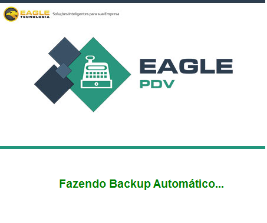

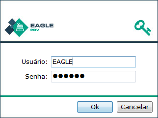

## Teclas de Função

O PDV possui algumas teclas de atalho, que são exibidas na parte inferior do sistema com as seguintes funções:

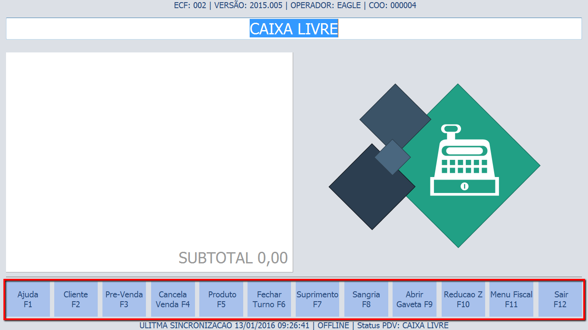

|Função|Ação|
|-----|------|
|F1 – Ajuda|Acesso a todas as funcionalidades do PDV.|
|F2 – Cliente|Acesso a tela de identificação de clientes.|
|F3 – Pre-Venda|Acesso a lista de Pre-Vendas em aberto.|
|F4 – Cancela Venda|Cancela a ultima venda ou uma venda em andamento.|
|F5 – Produto|Acesso a consulta de produtos.|
|F6 – Controle de Turno|Acesso a tela Abertura e Fechamento de Turno.|
|F7 – Suprimento|Acesso a tela de Suprimento.|
|F8 – Sangria|Acesso a tela de Sangria.|
|F9 – Abre Gaveta|Quando disponível, comanda a abertura da gaveta de dinheiro.|
|F10 – Redução Z|Comanda emissão da Redução Z.|
|F11 – Menu Fiscal|Acesso ao Menu Fiscal de acordo com a legislação vigente.|
|F12 – Sair|Solicita ao usuário confirmação para sair do PDV.|

## Abertura de turno
Ao acessar o PDV, caso o turno esteja fechado, o sistema entra em modo de abertura de turno para que o operador de caixa informe os dados necessários para iniciar sua jornada de trabalho. Esta funcionalidade pode ser acessada através da tecla de função F6.

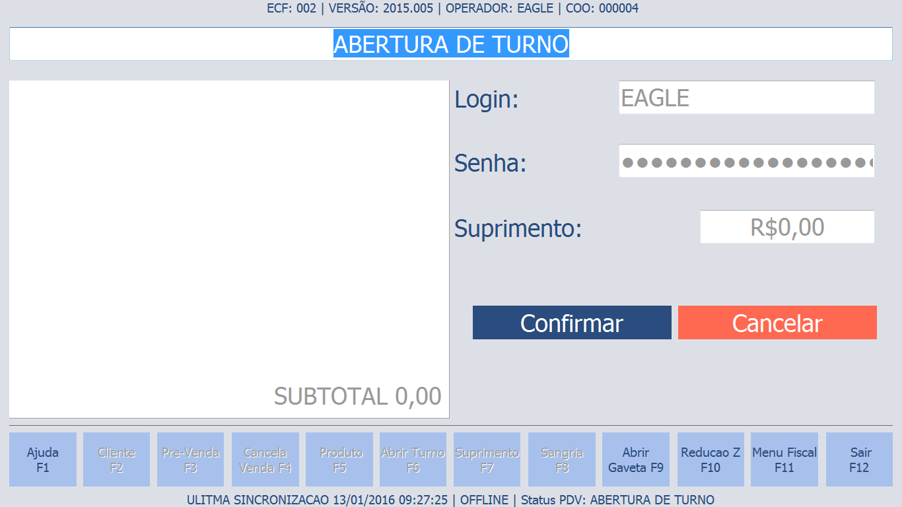

|Campo|Ação|
|-----|----|
|Login|Informe o login de operador que aparecerá como vendedor no cupom fiscal. Para identificar um vendedor diferente do que abriu o turno é necessário fechar o turno do operador atual e abrir novamente com a senha do outro operador.|
|Senha|Informe a senha do usuário.|
|Suprimento|Informe o valor do suprimento de caixa caso o turno se inicie com um fundo de troco.|

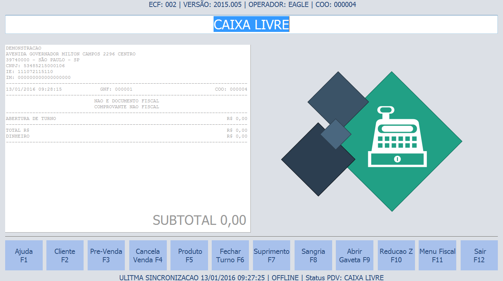

! Assim que o sistema iniciar o turno aparecerá a tela de caixa livre. A Imagem promocional em modo slide show poderá ser configurada com a logomarca da empresa ou parceiro.

! Para trocar de operador selecione a opção Fechar **Turno (F6)** para que a opção **Abrir Turno** ésteja disponível novamente. Informe o login e senha do usuário que assumirá o novo turno e clique em confirmar.

## Consulta de Preço
Para consultar o preço de um produto basta acionar a função **Produto (F5)** para que o sistema exiba a tela de pesquisa de produtos onde o usuário poderá selecionar um filtro de pesquisa e informar o parâmetro necessário para encontrar o produto.

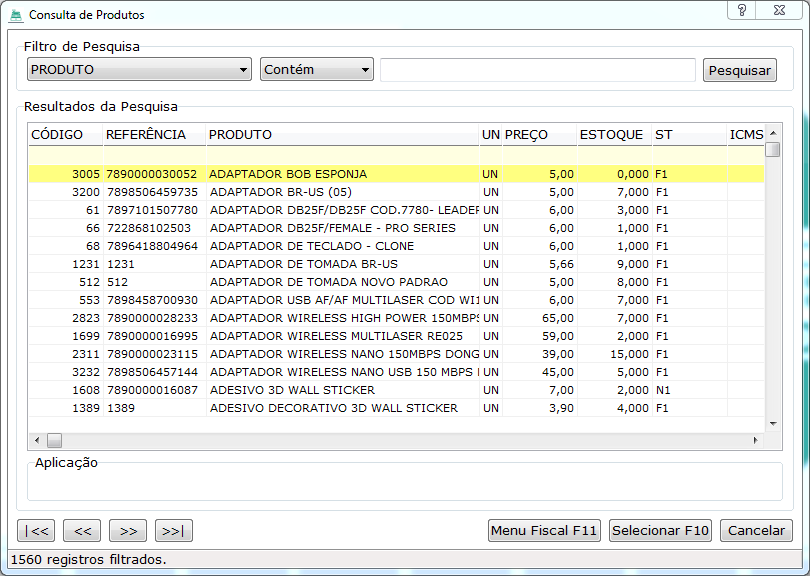

! Após pesquisar o produto desejado você pode selecionar ou cancelar. Ao clicar em cancelar o sistema volta para tela anterior. Se o PDV estiver no modo de caixa livre ou com uma venda em andamento, ao selecionar um registro o mesmo será impresso na impressora fiscal.

! Para selecionar produto presione ENTER, BARRA DE ESPAÇO ou clique acione a função Selecionar (F10).

! Caso o PDV esteja configurado para solicitar quantidade ao vender, após selecionar será solicitado ao usuário a quantidade a ser vendida do produto.

## Identificação de Cliente

A finalidade básica do PDV é efetuar vendas para consumidor final, mas existem situações que as vendas terão que ser feitas identificando clientes. Para identificar um cliente durante uma venda basta acessar a função **Cliente (F2)**.

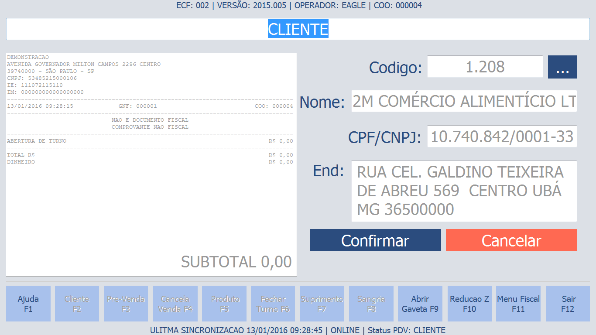

|Campo|Ação|
|-----|----|
|Código|Informe o Código do Cliente e pressione ENTER para buscar o cliente pelo código.|
|Nome|Informe o nome do consumidor manualmente caso queira identificar consumidor não cadastrado.|
|CPF/CNPJ|Informe o CPF ou CNPJ do Consumidor manualmente caso queira identificar consumidor não cadastrado.|
|Endereço|Informe o endereço do consumidor manualmente caso queira identificar consumidor não cadastrado.|
|Confirmar|Clique em confirmar ou pressione ENTER para confirmar a identificação do cliente.|
|Cancelar|Clique em Cancelar ou pressione ESC para voltar à tela anterior.|

! Para identificar um **cliente não cadastrado** cadastre um cliente específico para esta finalidade e após selecionar o mesmo modifique os dados para que conste no cupom fiscal.

## Efetuando Venda a Vista

Para iniciar uma venda basta o operador pesquisar um produto **(F5 ou SPACE)** ou passar um item no **leitor de código de barras** quando o caixa estiver livre.

Após pesquisar o produto **(F5)** e confirmar o PDV iniciou a venda na impressora fiscal e registou o primeiro produto.

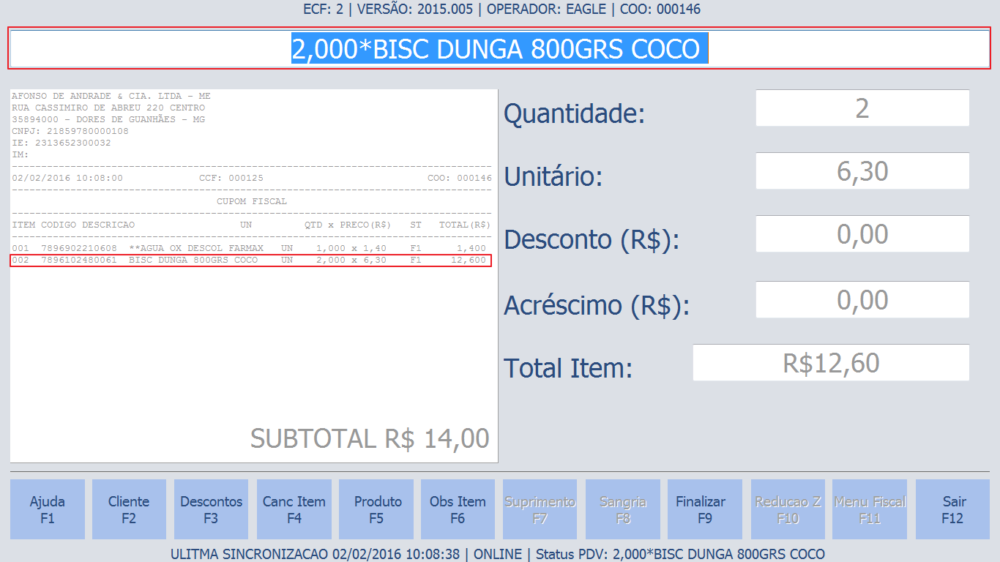

Após informar **Quantidade** * **SPACE** o PDV exibiu a tela de pesquisa de produto para que o produto seja encontrado e selecionado e registrado na impressora fiscal.

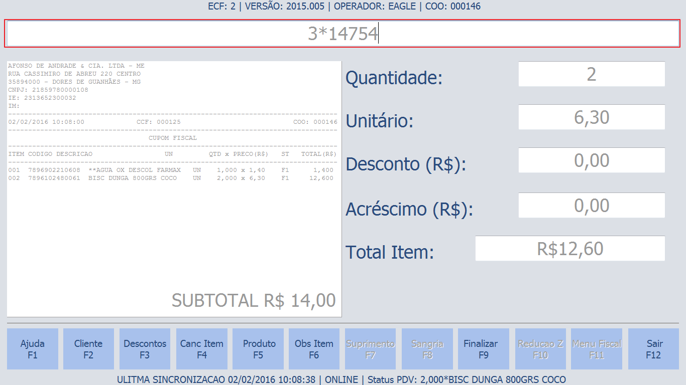

Após informar **Quantidade** * **Código** do Produto e pressionar **ENTER** o sistema registra as respectivas quantidades informadas do produto encontrado pelo código.

! Cada vez que um produto é registrado o PDV atualiza o valor do subtotal para que o operador e o cliente que esteja acompanhando a venda veja o total da compra.

! Para facilitar a agilidade da venda utilize um **leitor de código de barras** para registrar os produtos que foram cadastrados com código do tipo EAN.

! Caso deseje **cancelar um item vendido** acesse a função **Cancela Item (F4)** e informe o número do item e confirme a operação.

! Para produtos com códigos gerados por balanças basta utilizar o leitor de código de barras para registrar os produtos.

! Caso seja necessário registrar **informações adicionais** referente a venda de produtos as mesmas podem ser inseridas acessando a função **Obs. Item (F6)**.

Após registrar os produtos resta finalizar a venda para liberar a impressora fiscal e o PDV para uma nova venda. Para finalizar uma venda em andamenteo acesse a função **Finalizar Venda (F9)**.

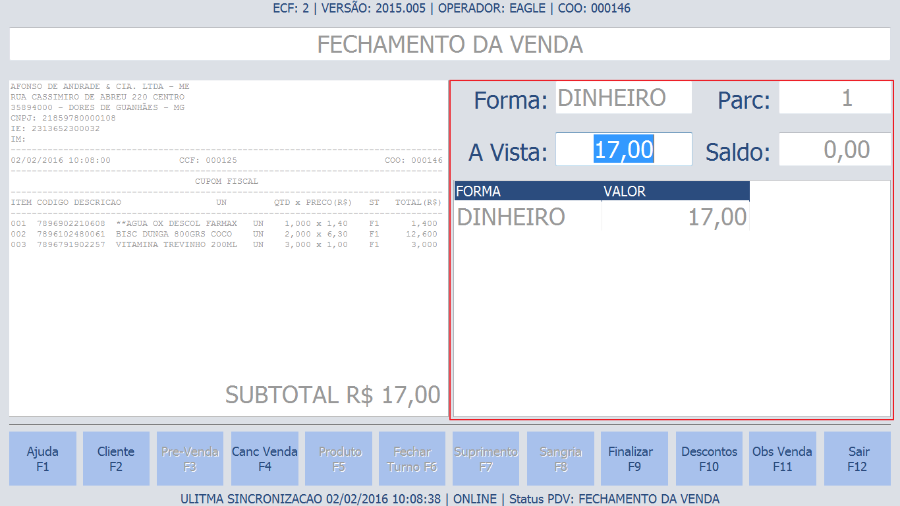

! Note que ao solicitar o fechamento da venda o PDV já sugere que o pagamento será **DINHEIRO**. Para solicitar o fechamento da venda pressione **ENTER**.

! Caso seja necessário informar **observações adicionais** na venda acesse a função **Obs. Venda (F9)** para que após o fechamento estas informações apareçam no rodapé do cupom fiscal.

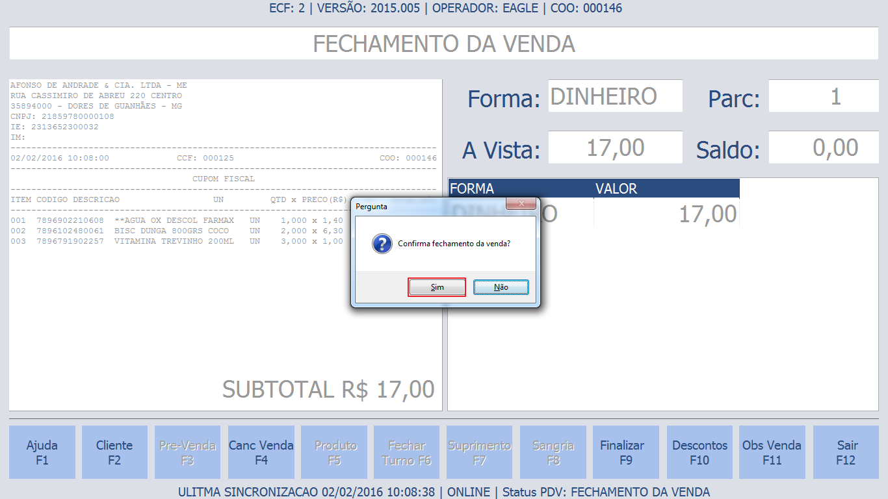

Para confirmar o fechamento desta venda basta clicar em Sim para que o PDV registre a forma de pagamento na impressora fiscal e finalize o cupom fiscal.

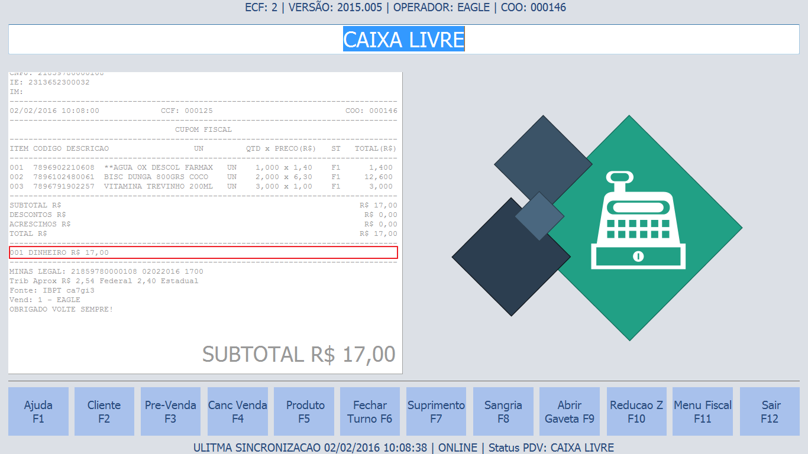

Após o fechamento da venda o PDV exibe na tela o registro do cupom fiscal até que seja iniciada uma nova venda.

! Caso seja informado um valor maior que o valor da venda no campo A Vista o sistema calcula o troco e exibe na tela quais valores de cédulas e moedas terão que ser entregues ao cliente.

## Efetuando Venda Parcelada

Para efetuar uma venda parcelada registre os produtos. Um produto pode ser registrado acessando a **Pesquisa de Produto (F5)**, pressionando **SPACE** ou informando o código do produto e pressionando **ENTER**. Você poderá informar a **Quantidade** * **Produto** para vender mais de uma unidade de determinado produto.

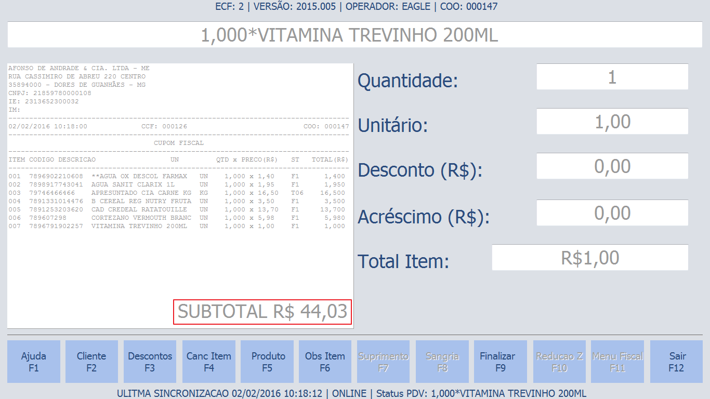

Identifique o cliente pressionando **(F2)** para gerar as contas a receber no retaguarda.

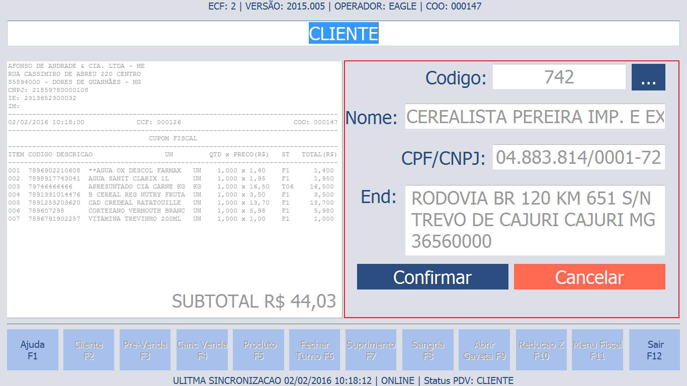

Após **confirmar** a identificação do cliente do cliente acesse a função **Finalizar Venda (F9)** para que o parcelamento seja realizado.

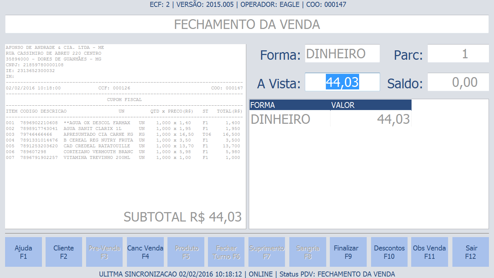

Para trocar a forma de pagamento desta venda pressione **ENTER** e clique e **NÃO** para que o PDV mostre a tela de pesquisa de forma de pagamento.

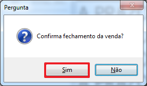

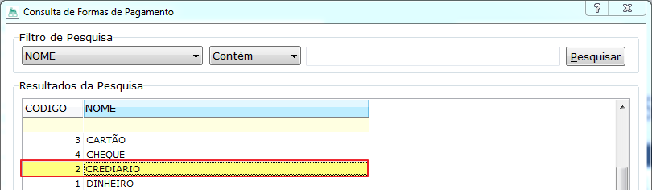

Após selecionar a forma de pagamento desejada informe a quantidade de parcelas e pressione **ENTER**.

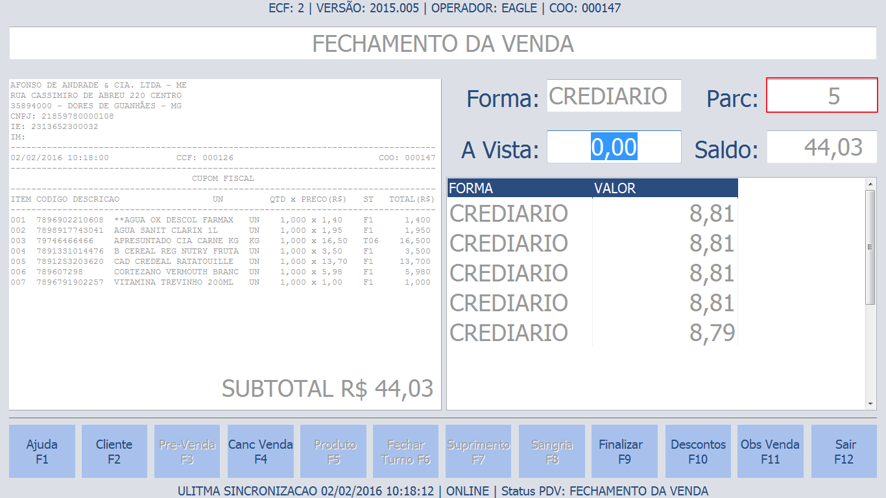

Após visualizar o parcelamento pressione **ENTER** para que o PDV solicite confirmação para o fechamento da venda. Clique em simpara confirmar.

Após confirmar o fechamento da venda aguarde até que o PDV finalize todo o processo e imprima a **confissão de dívida** que é impressa para vendas parceladas em formas de pagamento a prazo.

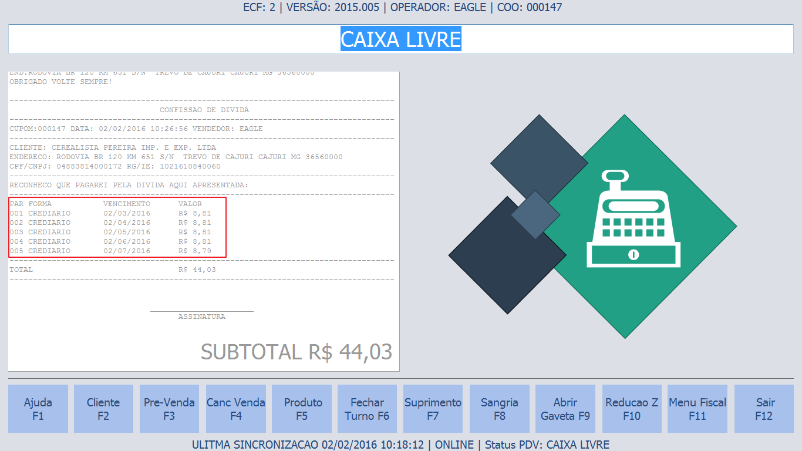

! Caso o cliente deseje dar uma entrada em DINHEIRO é possível infomar o valor a vista.

! Caso seja informado valor a vista maior que o valor da venda o sistema gera uma parcela em **DINHEIRO** e calcula o **TROCO**.

## Cancelando uma venda

Uma venda poderá ser cancelada assim que ela for finalizada uma vez que nenhum outro documento tenha sido emitido pelo ECF ou quando a venda está em andamento. Para cancelar uma venda com a mesma em andamento pressione **ESC** até que apareça a mensagem mostrada na imagem a seguir. Confirme ou cancele a operação.

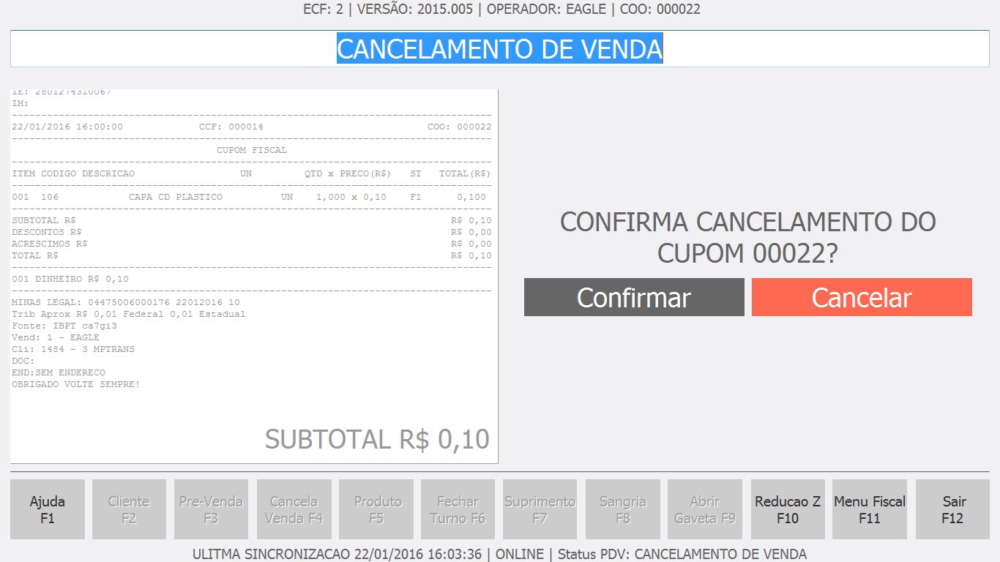

Para cancelar uma venda que já foi finalizada acesse a função **Cancela Venda (F4)**. Se a venda puder ser cancelada o sistema realizará o procedimento.

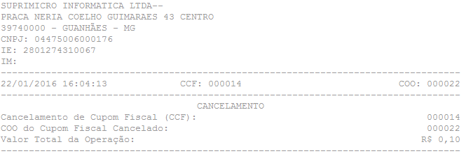

## Faturando pre-venda
Para visualizar uma Pre-Venda que foi efetuada no retaguarda acesse a **função Pre-Venda (F3)**.

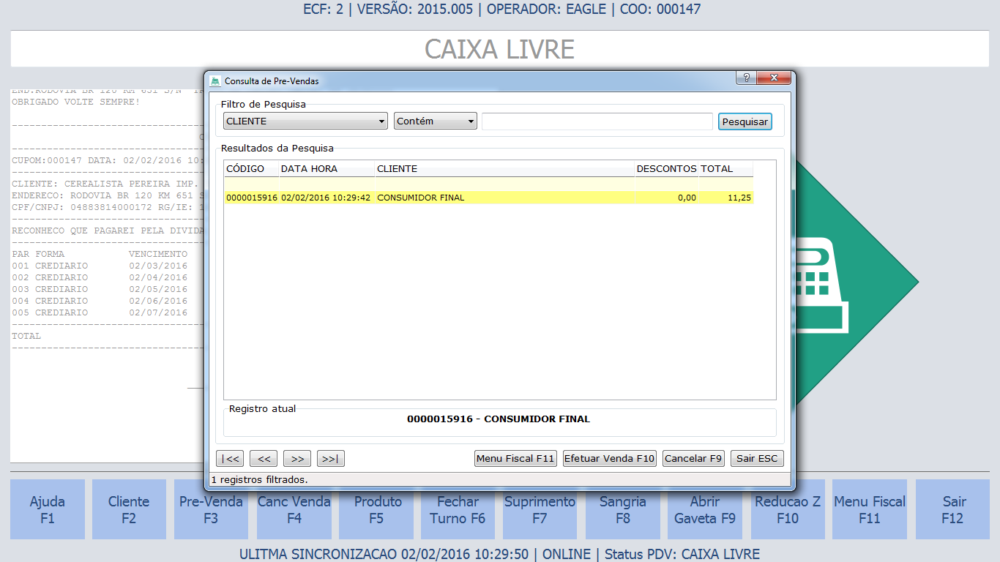

|Função|Ação|
|------|----|
|Menu Fiscal|Caso o PDV esteja em modo de caixa livre o acesso ao menu fiscal estará disponível desta tela.|
|Efetuar Venda|Clique nesta opção para realizar a venda.|
|Cancelar|Clique nesta opção para cancelar a venda.|
|Sair|Clique nesta opção para sair.|

! O Registro de Pré-Venda (RPV) diferencia-se do Documento Auxiliar de Venda (DAV) pelo fato de ser apenas um registro eletrônico enquanto que o DAV além de ser um registro eletrônico é também um documento impresso.

## Suprimento
Suprimento de caixa é uma operação onde o operador credita um valor que pode ser utilizado como fundo de troco. Para efetuar um suprimento acione a função **Suprimento (F7)**.

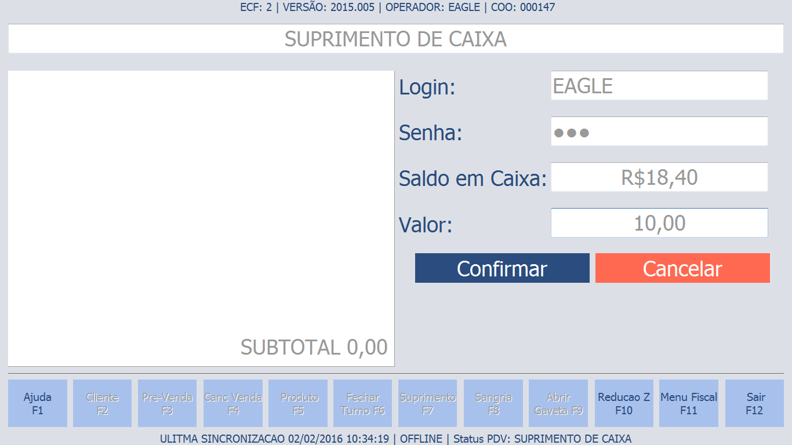

|Campo|Ação|
|-----|----|
|Login|Informe o login.|
|Senha|Informe a senha.|
|Saldo em Caixa|O sistema recupera o saldo do caixa para o usuário saber o limite do suprimento.|
|Valor|Informe o valor do suprimento.|
|Confirmar|Clique em confirmar para que o comando seja executado.|
|Cancelar|Clique em cancelar para voltar à tela de caixa livre.|

## Sangria

Sangria de caixa é uma operação onde o operador debita um valor que pode ser utilizado para pagar uma conta ou transferia para outro caixa. Para efetuar um suprimento acione a função **Sangria (F8)**.

|Campo|Ação|
|-----|----|
|Login|Informe o login.|
|Senha|Informe a senha.|
|Saldo em Caixa|O sistema recupera o saldo do caixa para o usuário saber o limite da sangria.|
|Valor|Informe o valor da sangria.|
|Confirmar|Clique em confirmar para que o comando seja executado.|
|Cancelar|Clique em cancelar para voltar à tela de caixa livre.|

## Fechamento de Turno
Quando o operador de caixa for encerrar suas atividades basta acionar a função **Fechar Turno (F6)** que seja possível a **troca de operador** ou **fechamento do dia** com a emissão da **Redução Z**. Esta funcionalidade pode ser acessada através da tecla de função **F6**.

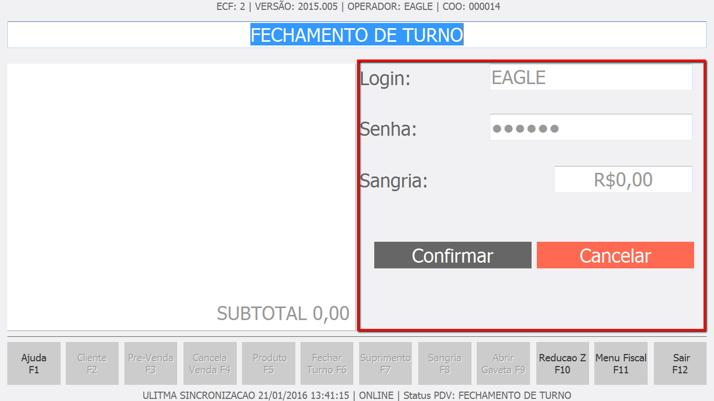

|Campo|Ação|
|-----|----|
|Login|Informe o login do operador de caixa que está encerrando o movimento.|
|Senha|Informe a senha.|
|Sangria|Informe o valor da retirada de caixa caso seja necessário.|
|Confirmar|Clique em confirmar para que o comando seja executado.|
|Cancelar|Clique em cancelar para voltar à tela de caixa livre.|

! Após o fechamento de turno o sistema solicita abertura de turno novamente. Caso esteja encerrando o movimento do dia acione a função **Redução Z (F10)** e certifique-se de não precisará mais realizar vendas no PDV, pois após este comando o ECF ficará bloqueado até a virada do dia.

## Redução Z
A emissão da Redução Z é obrigatória e deve ser comandada após o expediente ou no outro dia antes da abertura do dia.  Para comandar a impressão da Redução Z certifique-se de que o turno estará fechado para que o PDV permita o acesso ao comando de **Redução Z (F10)**

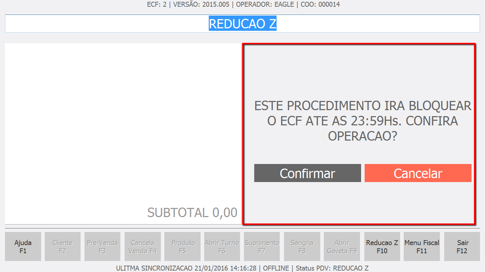

## Menu Fiscal

O **Menu Fiscal** está disponível para acesso em todo o sistema, através do comando **Menu Fiscal (F11)**.

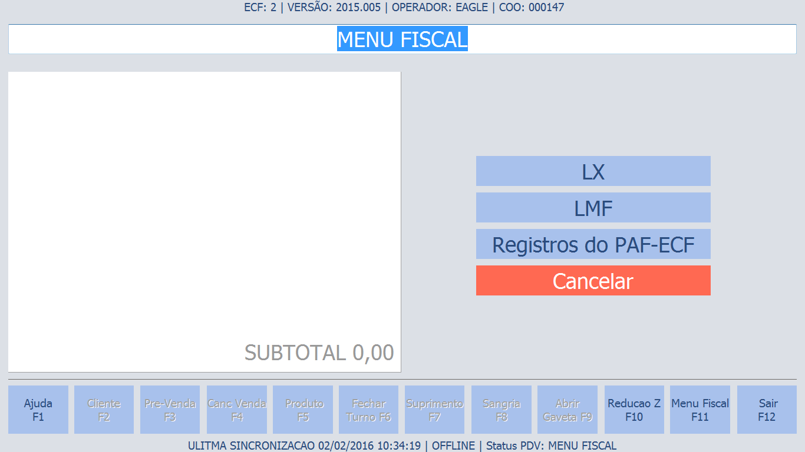

|Função|Ação|
|------|----|
|LX|Comanda a impressão da Leitura X.|
|LMF|Função para comandar a impressão da Leitura da Memória Fiscal pelo ECF, possibilitando a seleção do tipo de leitura (completa ou simplificada) e da abrangência das informações por período de data e por intervalo de CRZ.|
|Registros do PAF-ECF|Para gerar arquivo eletrônico, conforme leiaute estabelecido no Anexo II (Registro U1), contendo as informações relativas aos registros efetuados até o momento da execução deste comando, devendo na conclusão da geração ser exibida mensagem informando o local onde o arquivo foi gravado. O arquivo eletrônico gerado deve ser assinado digitalmente por meio da inserção do Registro tipo EAD.|

## Arquivos Fiscais
O PDV possui um menu de acesso que contem rotinas que geram arquivos fiscais de acordo com a legislação vigente. Gerar este arquivo acesse a função **Ajuda (F1)** e selecione o arquivo fiscal que deseja gerar.

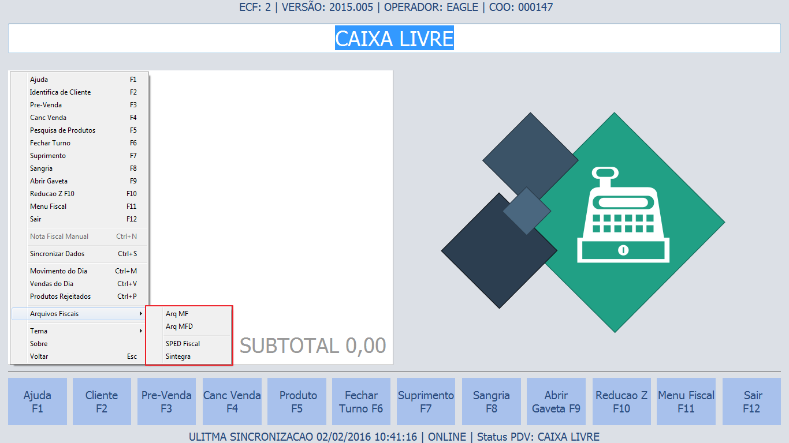

|Função|Ação|
|------|----|
|Arq MF e Arq MFD|Gera um arquivo com dados extraídos da memória fiscal do ECF que deve ser gravado em CD mensalmente.|
|SPED Fiscal|Este arquivo pode ser gerado no retaguarda e contem informações referentes as vendas de cupons e notas fiscais eletrônicas emitidas.|
|Sintegra|Este arquivo pode ser gerado no retaguarda e contem informações referentes as vendas de cupons e notas fiscais eletrônicas emitidas.|

## Relatórios
Todos os movimentos realizados no PDV serão sincronizados para o retaguarda onde o gestor ou gerente da empresa poderá analisar relatórios de vendas, estoque, fluxo de caixa e contas a receber decorrente das vendas.

Para acessar os relatórios do PDV que tem por objetivo fornecer dados para **controle diário** do operador de caixa acesse a função de **Ajuda (F1)**.

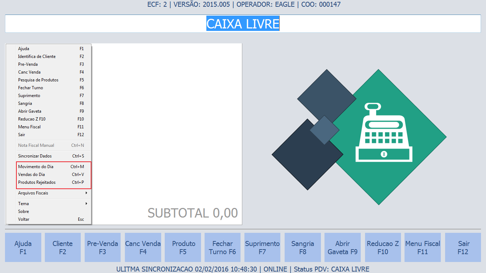

**Movimento do Dia**: Mostra para o operador de caixa os documentos emitidos e operações realizadas no PDV.

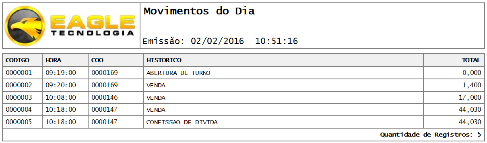

**Vendas do dia**: Mostra para o operador de caixa um resumo das vendas por meios de pagamentos.

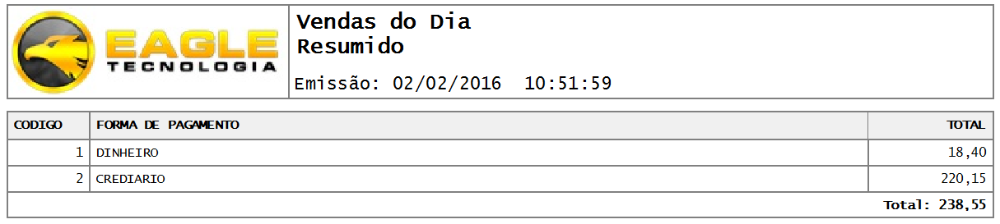

**Produtos rejeitados**: Mostra para o operador produtos que não podem ser vendidos no PDV que por ventura estão cadastrados incorretamente ou possuem alíquotas que não estão cadastradas no ECF.

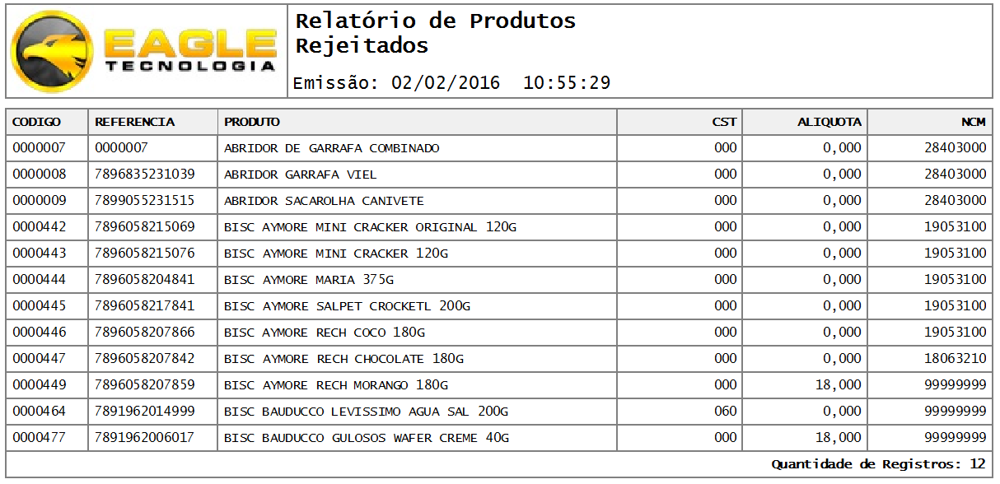
