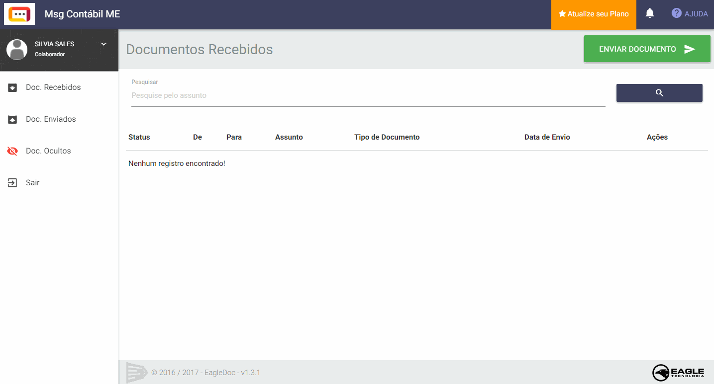
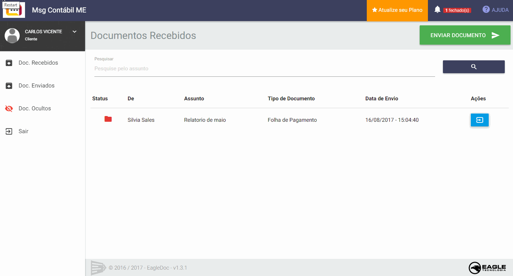
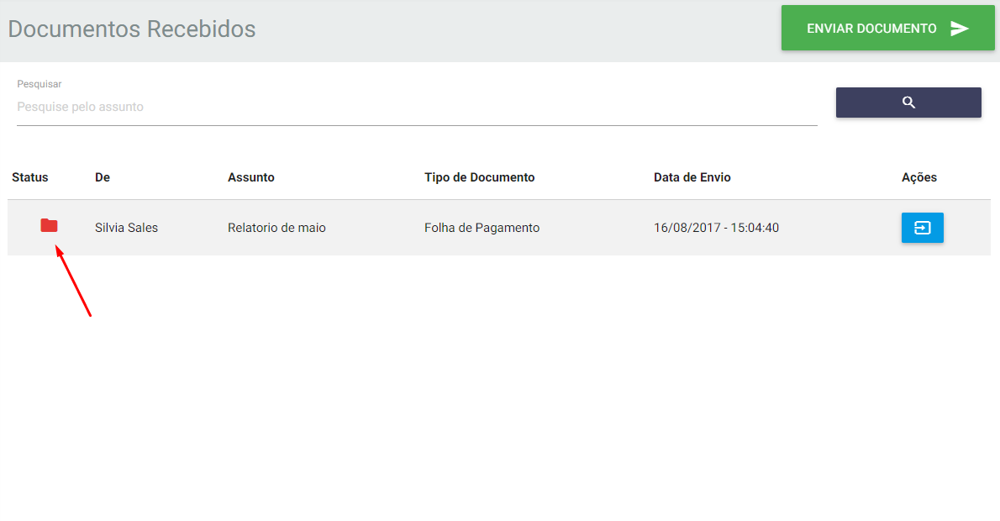
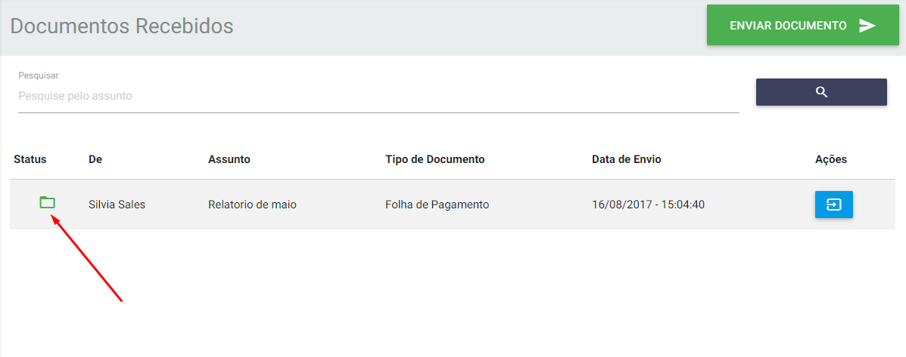
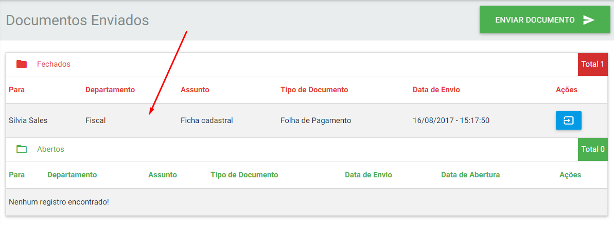
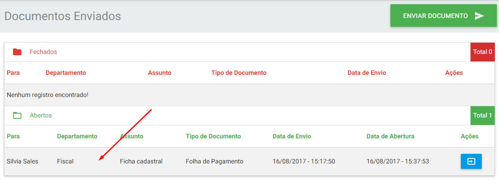
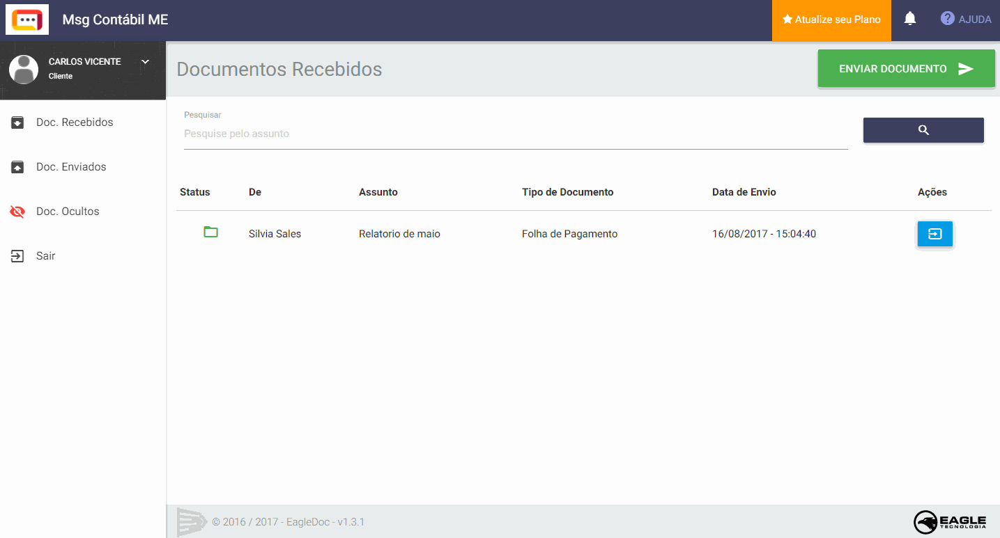
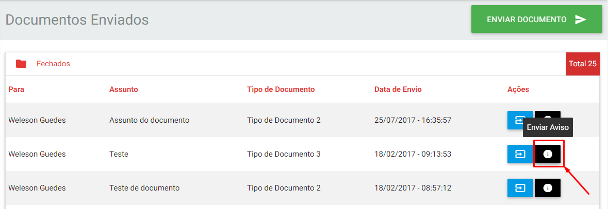

O envio de documentos no _EagleDoc_ é muito semelhante ao envio de um e-mail simples em qualquer ferramenta de e-mail. A diferença é que o documento sempre estará amarrado a uma empresa, usuário e tipo de documento se for um colaborador que estiver enviando ou a um departamento, usuário, tipo de documento se for um cliente que estiver enviando.

Isso facilita a organização dos documentos enviados e recebidos no sistema, ficando fácil pesquisá-los e acessá-los.

!!! Todo documento enviado emitirá uma notificação tanto no sistema como no e-mail do usuário que irá receber o documento para lembrá-lo de que há um documento a ser aberto.

## Sou colaborador como envio documentos?

Basta clicar no botão `Enviar Documento`, preencher o formulário e anexar os arquivos. **OBS**: O campo `Descrição` não é obrigatório. Veja o processo na imagem abaixo:

## Sou cliente como envio documentos?

Basta clicar no botão `Enviar Documento`, preencher o formulário e anexar os arquivos. **OBS**: O campo `Descrição` não é obrigatório. Veja o processo na imagem abaixo:

!!! Depois da escolha de um departamento é possível destinar o documento para `todos` que fazem parte daquele departamento. Caso seja feita a escolha por um usuário específico, o documento será enviado para todos do departamento e também será enviado um lembrede de documento recebido para o e-mail do usuário escolhido.

## Status dos Documentos

Quando um documento é enviado ele sempre irá com o status `fechado`. Enquanto permacer nessa situação significa que o usuário ou o departamento que recebeu esse documento ainda não o abriu.

No momento da abertura do documento o status é alterado para `aberto`. Essa mudança de status é identificada na cor {c:red}vermelha{/c} se estiver fechado e na cor {c:green}verde{/c} se estiver aberto.

Veja nas imagens abaixo o status em ambas as páginas de documentos enviados e recebidos:

!!! Ao posicionar o mouse em cima do status aberto, aparecerá uma informação sobre quem abriu o documento e em que data e hora.

!!! Na página de documentos enviados após o documento ser aberto ele automaticamente desce para a sessão de documentos abertos.

!!!! Após um período de 20 a 30 dias de um documento aberto, ele é automaticamente enviado para a sessão de `Documentos Ocultos` para limpar a área tanto da página de `Documentos Recebidos` como a da `Documentos Enviados`.

## Acessando Documento

Para acessar um documento recebido ou enviado, basta clicar no botão azul `abrir documento`, ou clicar no botão em destaque na notificação enviada no e-mail.

Ao acessar o documento todos os detalhes e informações estarão disponíveis, inclusive os arquivos para download.

## Emitir aviso de documento fechado

Com o _EagleDoc_ é possível enviar um aviso por e-mail para um usuário que recebeu um documento no qual está fechado a mais de 10 dias. Quando o período de documento fechado excede, aparece um botão do lado do de `abrir documento` que serve justamente para emitir esse aviso.

Ao clicar no botão o aviso é enviado imediatamente para o usuário que recebeu aquele documento pedindo para que abra-o.

