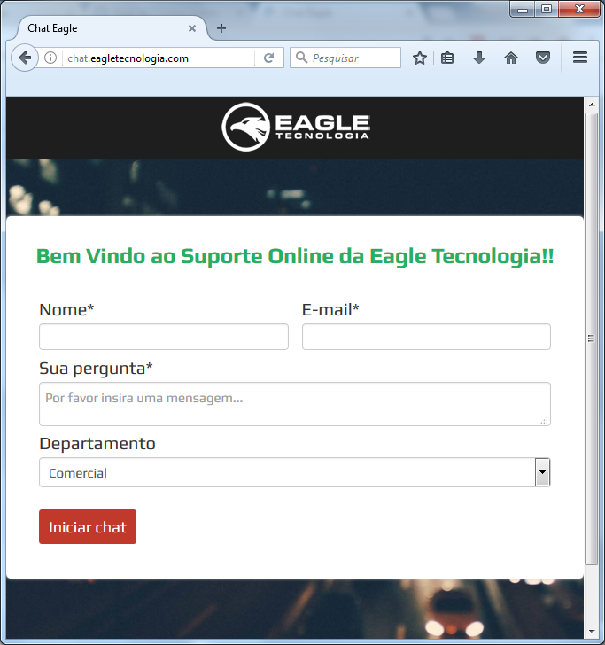
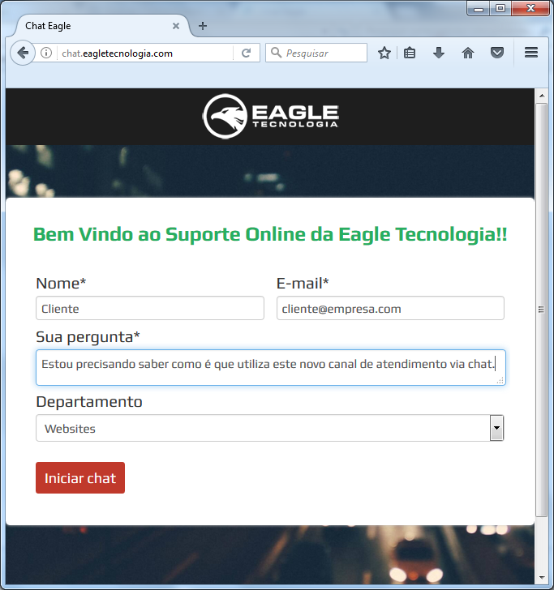
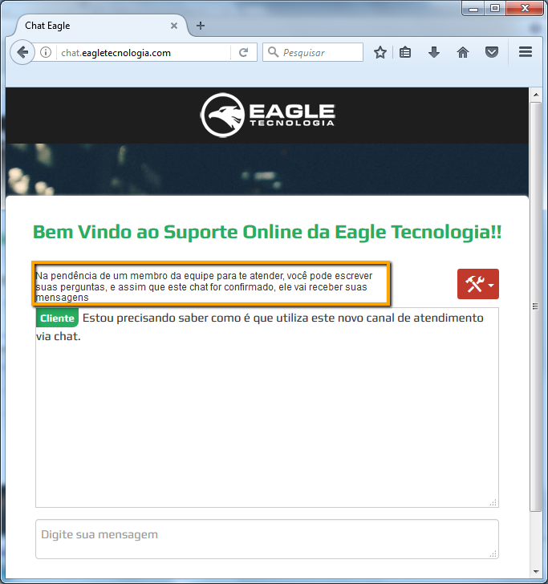
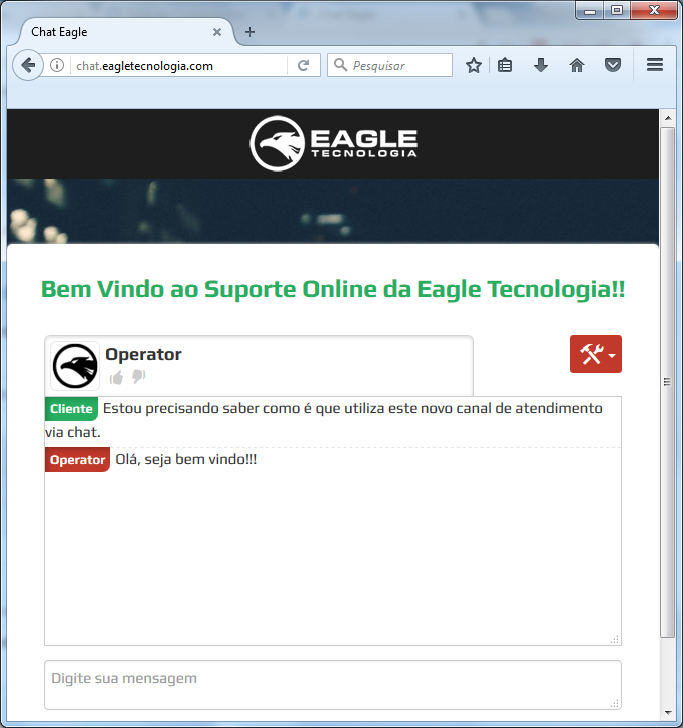
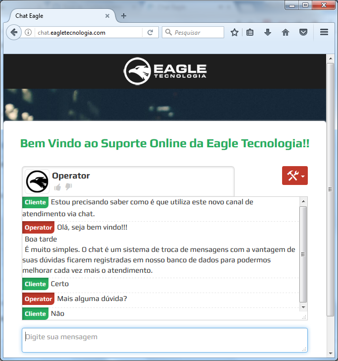
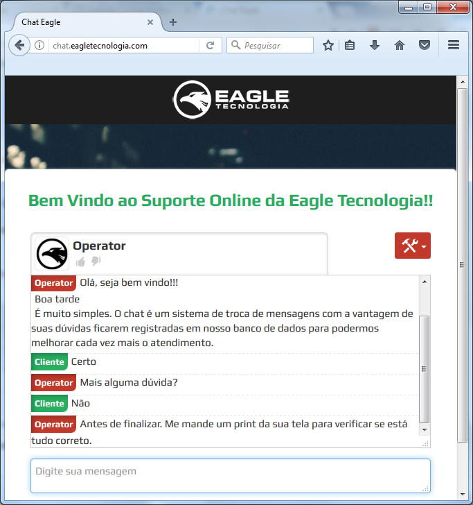
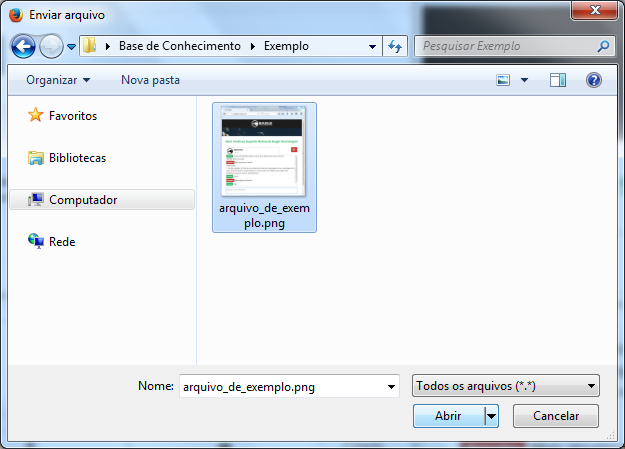
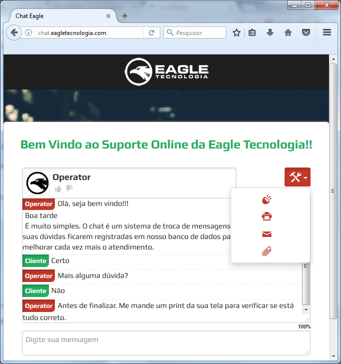
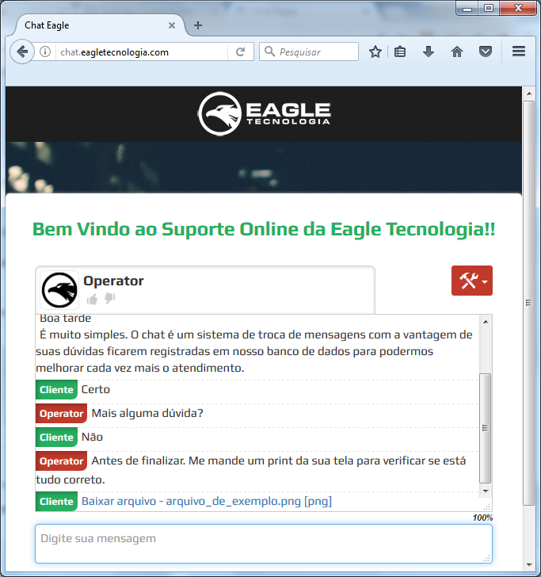
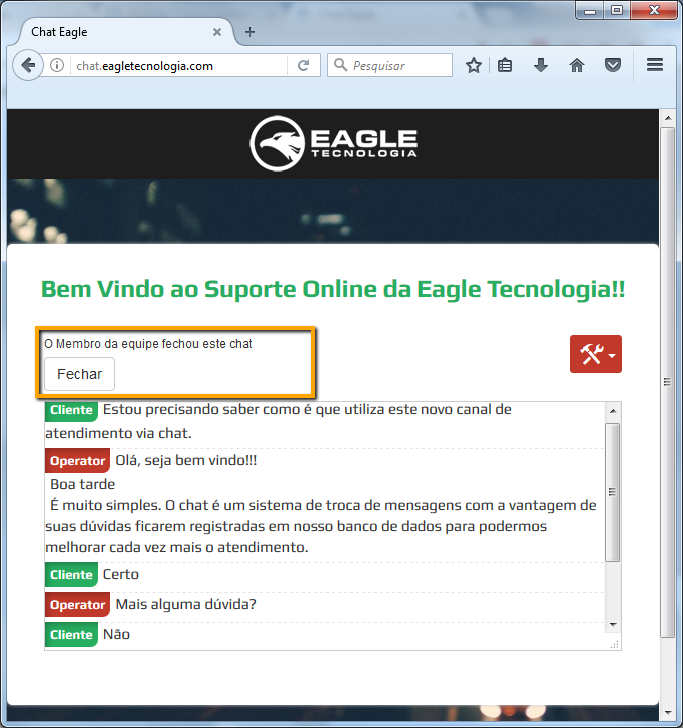

## Introdução

Nossa empresa está dispondo de um novo canal de atendimento a cliente e parceiros que é o **atendimento via chat**. Este recurso permite o relacionamento com os setores Comercial ,Financeiro, Suporte e Websites. A principal vantagem de se utilizar este canal é o histórico de atendimento que fica armazenado servindo como base para que nossa equipe de suporte direcione ao setor de desenvolvimento as demandas mais recorrentes que podem ser melhor desenvolvidas para prover uma melhor experiência com o usuário.

! A partir de 01/09/2017 não realizaremos atendimentos via skype pelo fato de não se possível centralizar o histórico de atendimentos, tão importante para análises estratégicas da organização.

## Solicitando atendimento via chat

Para solicitar suporte via chat entre no navegador de sua preferência no site: [chat.eagletecnologia.com](chat.eagletecnologia.com) 

Esta é a página inicial do chat onde você poderá inserir os seguintes campos:
1. Nome: Nome do usuário que está solicitando suporte.
1. E-mail: E-mail do usuário que está solicitando suporte.
1. Sua pergunta: Informe neste campo a sua dúvida para que os nossos atendentes tenham a primeira informação para iniciar o atendimento.
1. Departamento: Selecione um departamento entre Comercial, Financeiro, Suporte e Websites.

A imagem a seguir ilustra os campos preenchidos antes da solicitação do atendimento. Clique em Iniciar Chat para que os nossos atendentes vejam seu pedido de suporte. 

Ao clicar em iniciar chat aguarde até que um de nossos atendentes aceite seu pedido de suporte.

! O tempo de espera até que se inicie uma conversa dependerá do número de pedidos de suporte na fila de atendimento. Caso não consiga falar com nossos atendentes deixe uma mensagem para que seja dado um retorno o quanto antes.

Assim que o pedido de suporte for aceito pela nossa equipe comecará a interação entre usuário e atendente para solução das dúvidas.

Durante o atendimento o usuário poderá fazer suas perguntas ao atendente e receber as respostas que necessita para concluir a execução de suas rotinas. Caso seja necessário um acesso remoto as informações necessárias poderão ser passadas via chat.

## Enviando arquivos

Durante um atendimento pode haver necessidade de envio de arquivos, seja print de tela, seja um script, um backup etc. O nosso chat online suporta o envio de arquivos com tamanho máximo de 10mb das seguintes extensões:

|Extensão|Finalidade|
|--------|----------|
|gif, jpeg, jpg, png| Em um atendimento poderão ser enviados logomarcas, prints de telas para visualização de uma situação dentre outras imagens|
|zip, rar|Poderão ser enviados backups de sistemas compactados nestas extensões para testes internos e simulação de falhas|
|xls, xlsx|Poderão ser enviadas planilhas de contagem de estoque, cadastros dentre outros tipos de planilhas|
|doc, docx|Poderão ser enviados formulários, declarações e demais documentos redigidos no word|
|sql|Poderão ser enviados scripts de bancos de dados para correções|
|pdf|Poderão ser enviados arquivos convertidos em PDFs|

Para enviar um arquivo selecione o menu indicado para que seja apresentada a janela para seleção.

! Antes de enviar um arquivo certifique-se de onde o mesmo foi salvo

Selecione o arquivo e clique em abrir.

Aguarde até que o arquivo seja 100% enviado.

Assim que o arquivo for enviado o destinatário poderá acessar o mesmo.

! Caso a janela do browser seja fechada durante este processo, o atendimento é interrompido sendo necessário entrar novamente na tela inicial do chat e solicitar o suporte novamente.

## Fechando um atendimento

Não havendo nenhum assunto a ser tratado o atendente fechará o atendimento e o usuário poderá clicar em Fechar .

Assim que o usuário fechar o chat será mostrada a tela inicial do chat que estará pronta para um novo atendimento.

