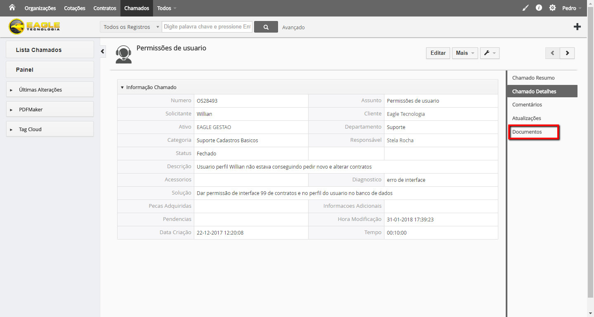
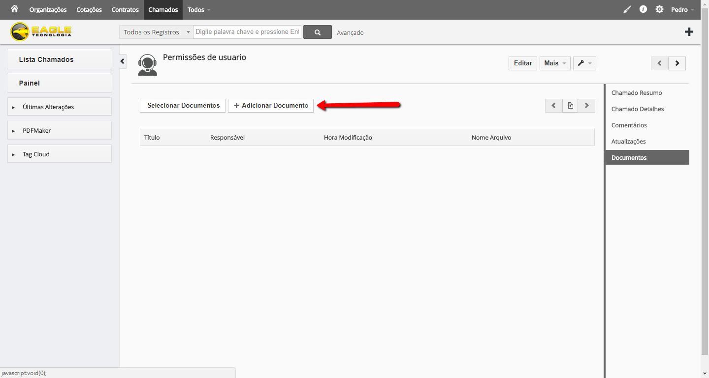
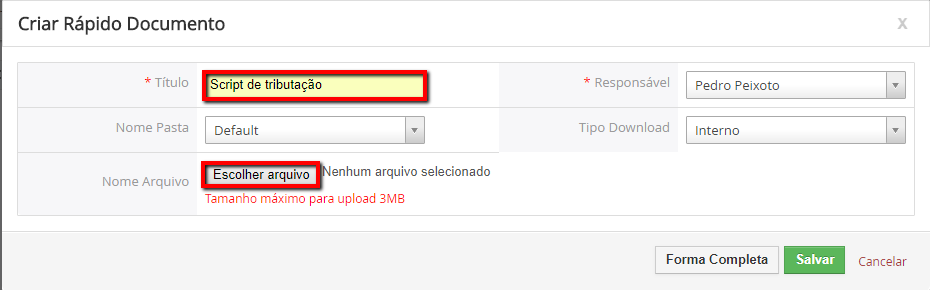
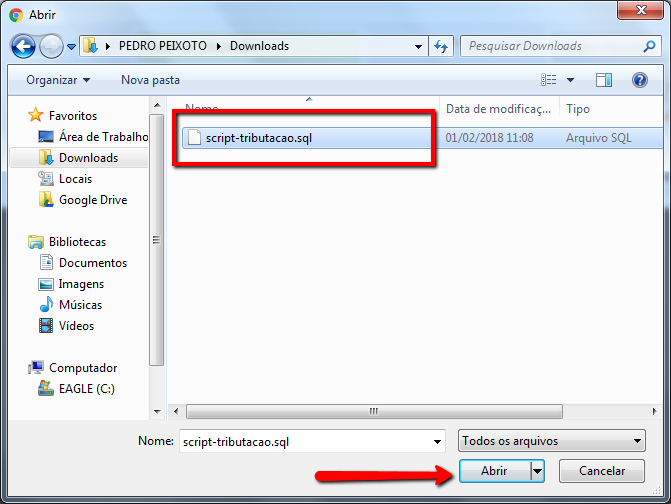
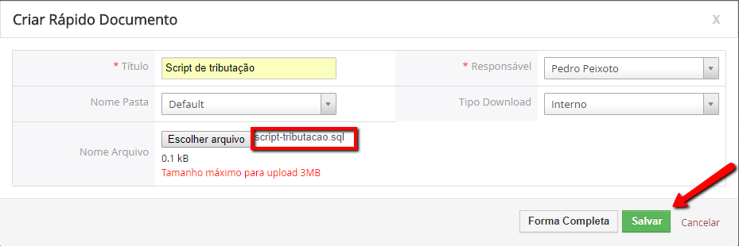
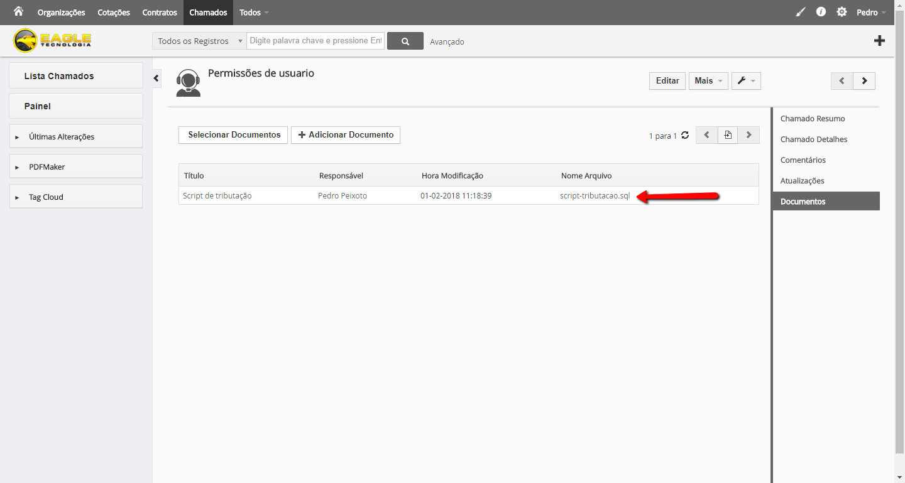

## OBJETIVOS

Orientar profissionais do setor de Suporte e Desenvolvimento a anexar aquivos que auxiliaram no atendimento ao cliente tais como planilhas, scripts, prints, relatórios etc. 

## PASSOS
1. Clique no chamado para visualiar os Detalhes
1. Clique em Documentos

1. Clique em Adicionar Documento
 
1. Informe um título sugestivo para o anexo e clique em Selecionar Arquivo

1. Clique no arquivo a ser anexado

! Ao anexar arquivo verifique se o tamanho do mesmo não exceda 3mb.
1.Clique em Salvar

1. O arquivo já estará anexado e para baixar basta clicar no mesmo

!!!! Em vez de anexar vários arquivos zipados é aconselhado que se anexe um arquivo por vez.