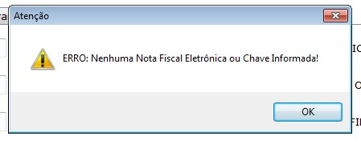
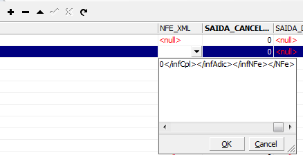

Algumas vezes ao tentar consultar uma NF-e no Sistema aparece a seguinte mensagem:

Isso acontece pois, por algum motivo, o XML e a chave de acesso da nota fiscal não gravaram no banco de dados.
Para resolver siga as seguintes instruções:
1 – No Eagle Gestão, exporte o XML da nota referida.
2 – Abra esse XML com o bloco de notas, selecione todo o conteúdo e copie.
2 – Na tabela SAIDAS do bando de dados cole o conteúdo selecionado na coluna NFE_XML na linha referente à nota fiscal consultada, usando o IBExpert.

3 – Clique em Commit Transaction.
4 – Caso a tela de saídas no sistema esteja aberta nessa nota, altere e salve a nota a ser consultada.
5 – Realize a consulta novamente.
