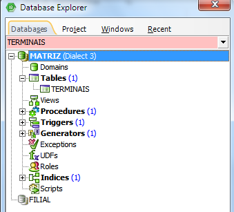
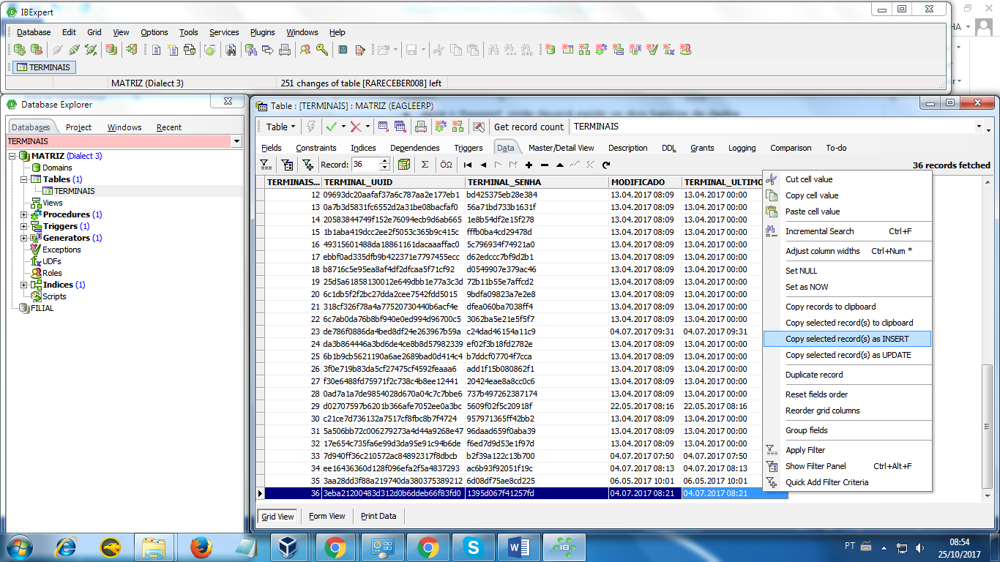
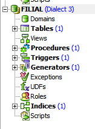
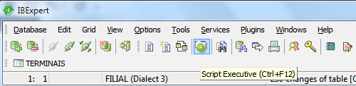
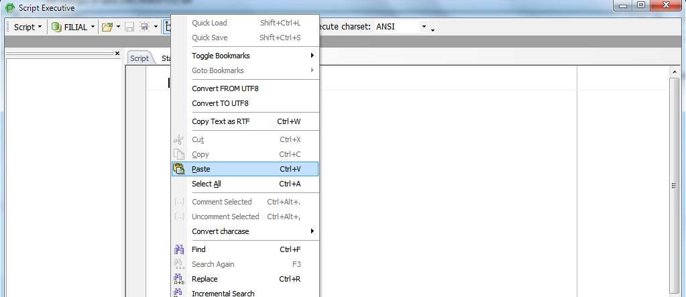
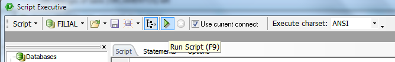
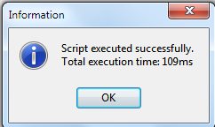
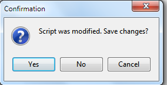
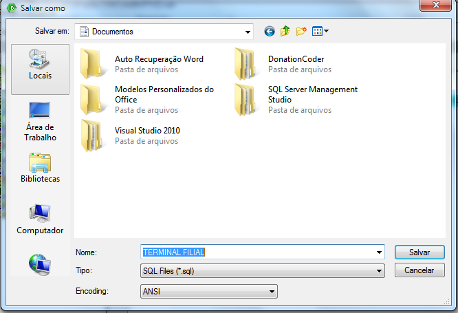

Quando acontece a necessidade configurar atalho de outro banco de dados em um computador que já possui o registro de terminal e se pede registro novamente, deve –se fazer a inserção do registro do terminal do banco de dados existente no novo banco a ser configurado. 
* Abra o Ibexpert, onde deverá existir os dois bancos de dados configurados.  
* Acesse o banco de dados que possui registro nesse computador , no nosso exemplo , o banco Matriz  e pesquise a tabela terminais .  

* Abra a tabela Terminais , acesse a aba Data e vá ao último registro de terminal no banco , clique com botão direito do mouse e selecione Copy selected record(s) as INSERT

* Abra o banco de dados que receberá o registro do terminal . 

* Clique em Script Executive ou de Ctrl +F12

* Abrirá tela para executar script , clique com botão direito do mouse  e selecione Paste ou Ctrl+V , ou seja, estará colando o registro do terminal que foi copiado do banco Matriz . 

* Após realizar a colagem execute  o procedimento em :

* Confirme a execução clicando em YES 

* Depois Clique em OK 

* Finalizado, feche a tela e aparecerá uma mensagem perguntando se deseja salvar o script executado, clique em Yes. 

* Salve o Script (o registro do terminal ) onde desejar e com nome que desejar .  

Finalizado, feche o Ibexpert e abra o atalho que estava pedindo registro . 

