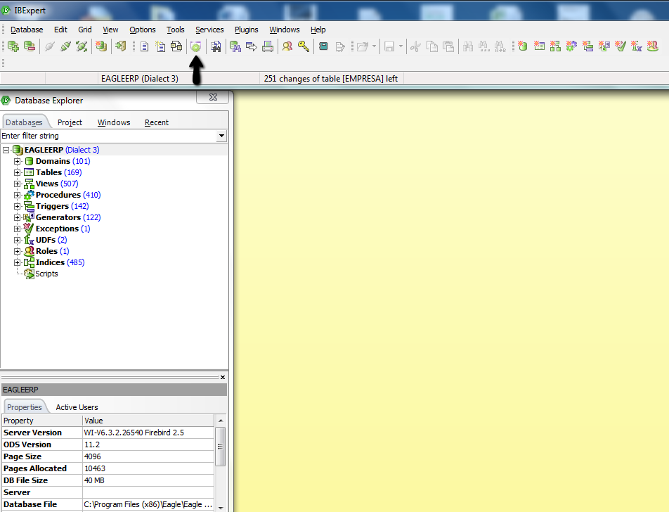
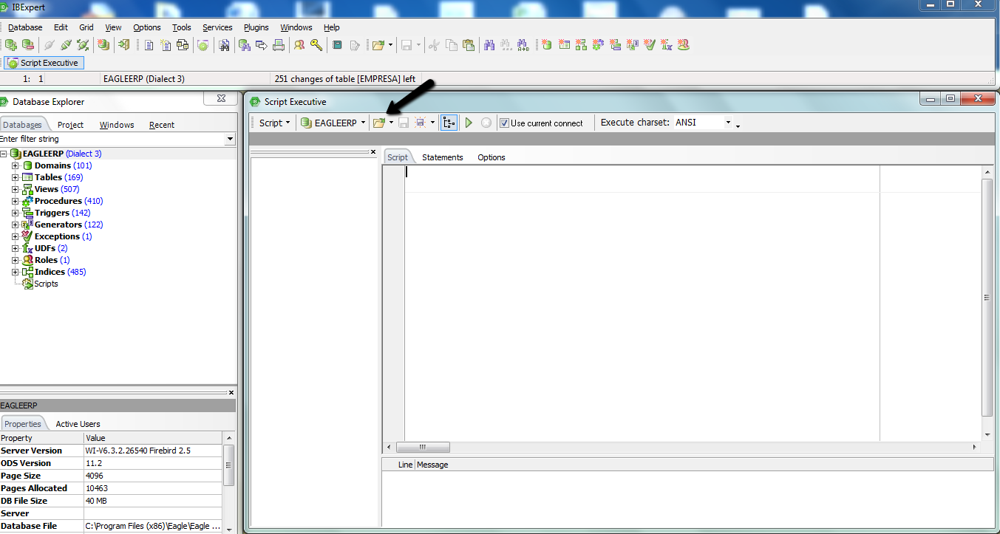
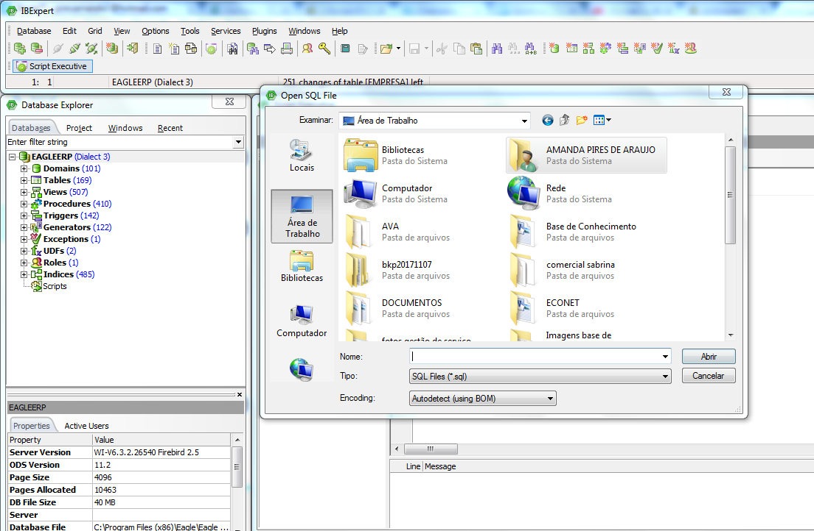
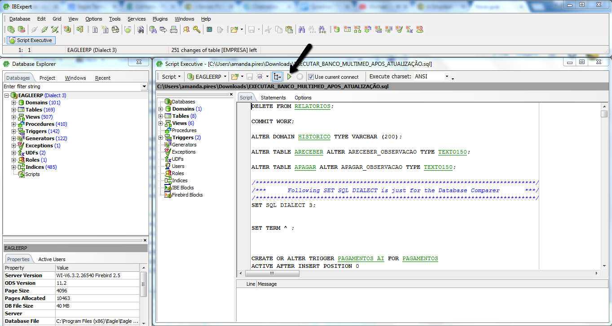

1. Conecte o banco de dados no Ibexpert [FAQ](https://ajuda.eagletecnologia.com/faq/como-configura-o-ibexpert-para-acesso-ao-banco-de-dados-do-eagle-gestao-e-eagle-pdv)
2. Conecte ao banco e clique em execute script conforme a imagem;

3. Pesquise o arquivo salvo no computador;

4. Selecione o arquivo;

5. E por último execute o arquivo.

! Ao executar um script a opção ' Use current connect.