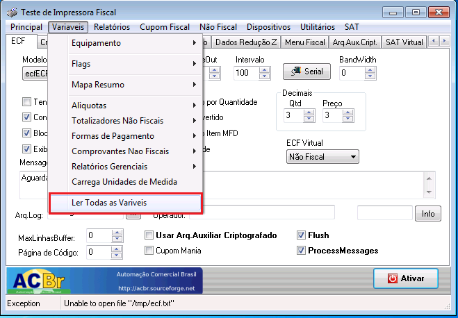
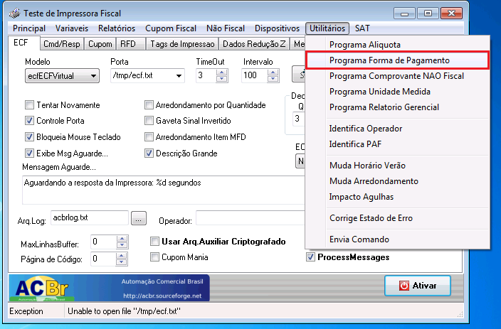
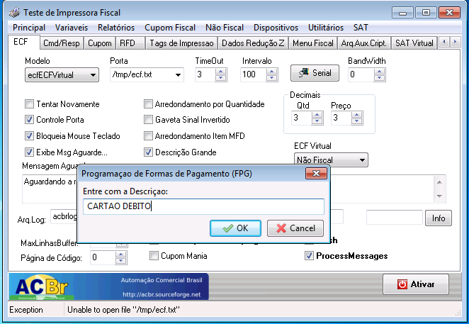
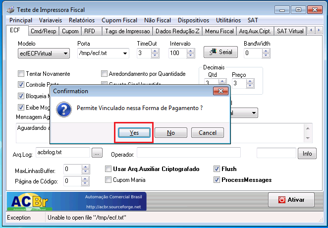
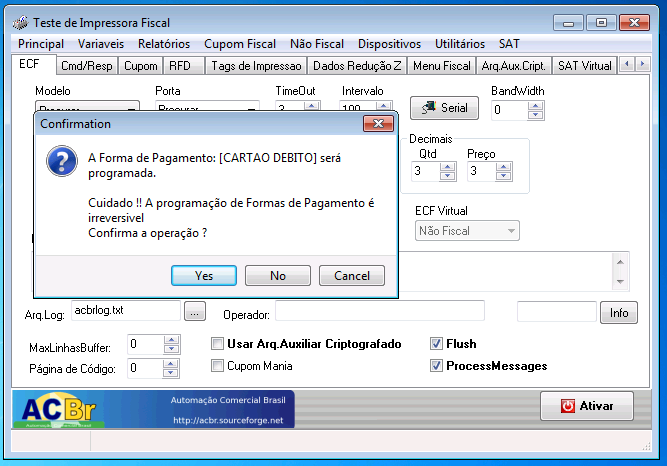

Dependendo a necessidade do seu cliente, e também da impressora que ele está utilizando pode ser necessário realizar alguns cadastros de forma manual na impressora, como meios de pagamento visto que, nem todos os meios de pagamento vem cadastrado.

!! É importante informar que esses cadastros são irreversíveis, ou seja, ficaram registrados na impressora, portanto sempre confira antes a real necessidade de cadastrar essas informações, seja com o cliente ou com o contador.

## Como conectar ao ECFTeste

! O aplicativo que é utilizado para realizar esse tipo de procedimento por padrão da Eagle é o ECFTeste. Ele estará  instalado na pasta do Eagle PDV.
1.	Após abrir o aplicativo do ECFTeste, primeiro você deve conectar a impressora e configurar a conexão, informando o modelo, porta e clicando em ativar.

2.	Depois de ativar, caso tenha alguma duvida sobre os dados que já se encontram gravados na impressora é possível verifica-los através do menu Variáveis -> Ler Todas as Variáveis.

## Cadastrando meio de pagamento

1.	Após confirmar os dados que serão gravados, para cadastra-los deve-se acessar o menu Utilitários e selecionar a opção que deseja cadastrar. 

2.	Insira o nome da forma de pagamento que será cadastrada (ex: Cartao Debito), e clique em Ok.

3.	Importante que para poder vincular o meio de pagamento cadastrado com o meio de pagamento que se encontra no Eagle Gestão, sempre selecione a opção Yes quando perguntar se deseja permitir vincular o meio de pagamento, caso contrario você não poderá realizar essa vinculação, o que pode acarretar em transtornos futuros.

4.	Por fim se o cadastro estiver correto clique em Yes novamente.

! No LocalConf do Eagle PDV é necessário vincular os meios de pagamento cadastrados na impressora aos meios de pagamento do Eagle Gestão.

