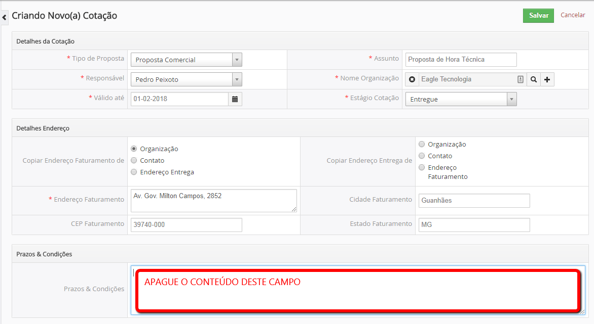
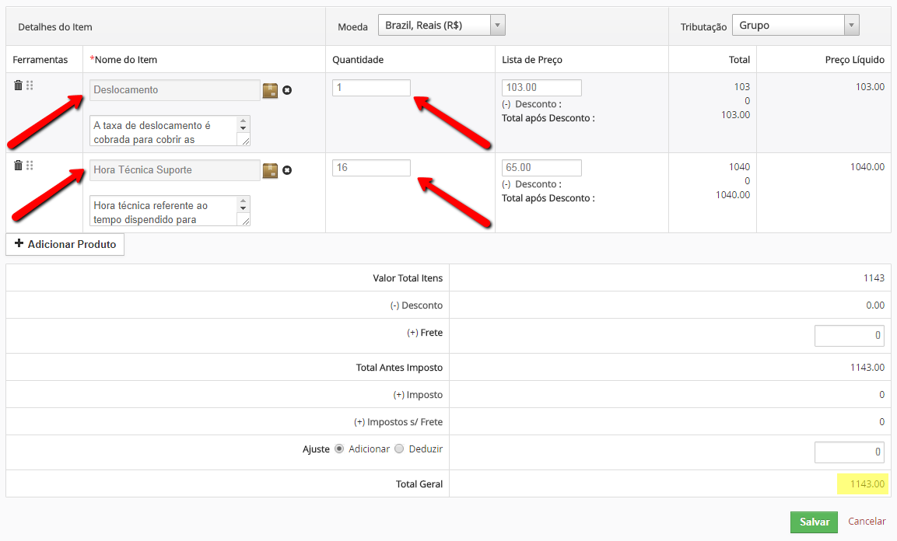

===

## OBJETIVOS
Orientar profissionais do setor de Suporte, Comercial, Website e Administrativo quanto a cobrança de despesas referentes a novos treinamentos.

## ACR UM – CONDIÇÃO DE NOVO TREINAMENTO
1. Novo treinamento é considerado em caso onde já ocorreu o treinamento padrão dentro do processo de implantação e o cliente o solicita em função de:
- Saída do funcionário treinado;
- Férias do funcionário treinado;
- Contratação de novos funcionários;
- Contratação de novos módulos;
1. O cliente deverá ser comunicado com antecedência da referida cobrança e deve-se comunicar também uma média de valor em função da demanda apresentada;
1. O setor administrativo deverá ser comunicado para gerar um orçamento base com a estimativa de horas e demais custos.

## ACR DOIS – VALORES E FORMA DE PAGAMENTO
1. Em caso de novo treinamento será cobrada a hora técnica que é um cálculo do valor da mão de obra em um atendimento em função do tempo (em horas) que se gastará em determinado serviço:
- R$65,00 por hora técnica
1. Em caso de treinamento fora de Guanhães deve ser acrescido:
- R$ 73,00 referente a diária do veículo;
- R$ 0,50 por km;
- R$ 30,00 referente diária de alimentação por técnico;
- Hospedagem por conta do cliente, caso seja necessário;
1. A forma de pagamento será através de boleto bancário com o prazo de 30 dias;
1. O boleto e nota fiscal deverão ser enviados por e-mail.

! O valor da hora técnica será gerado em função do número de horas demandadas para o **novo treinamento**;

## ACR TRES – FORMALIZAÇÃO DA PROPOSTA NO CRM
1. Para formalizar a proposta solicite uma nova cotação no CRM conforme instruções a seguir;
1. Informe o Tipo de Proposta como Proposta Comercial;
1. Informe o Assunto como Proposta de Deslocamento ou Hora Técnica;
1. Informe a Empresa

1. Informe o Deslocamento somado com o valor por km;
1. Informe a Hora Técnica quando houver necessidade e a quantidade;

1. Envie esta proposta para o cliente por e-mail ou entregue impressa.

! O valor da hora técnica deverá ser cobrado somente em casos de novos treinamentos.