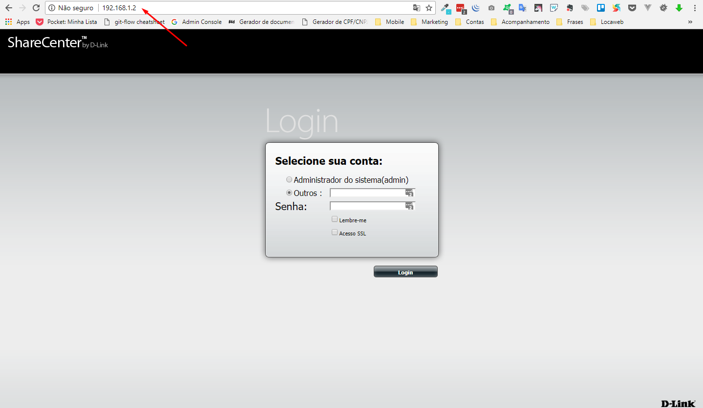
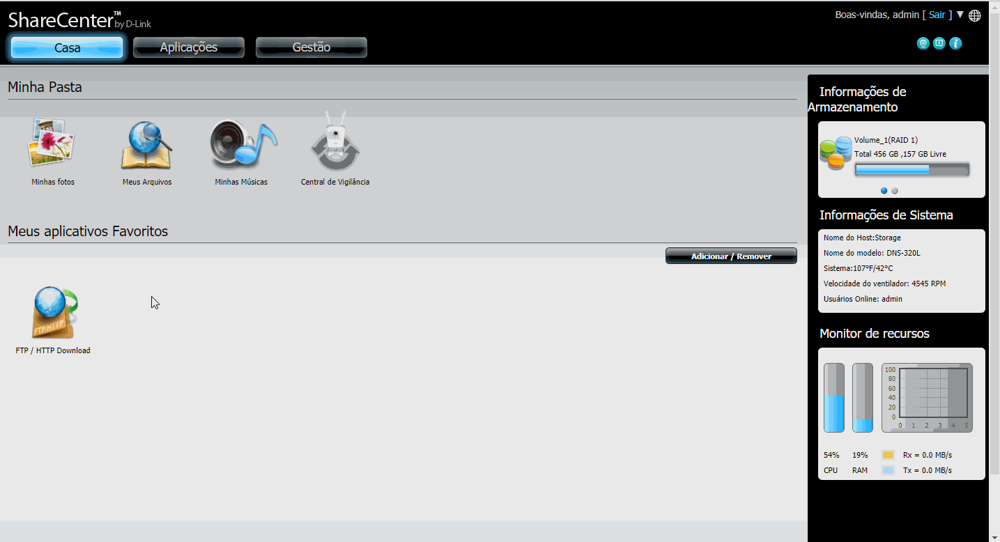
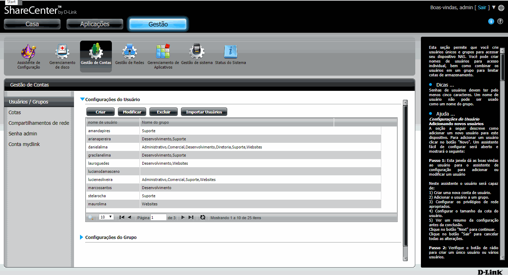
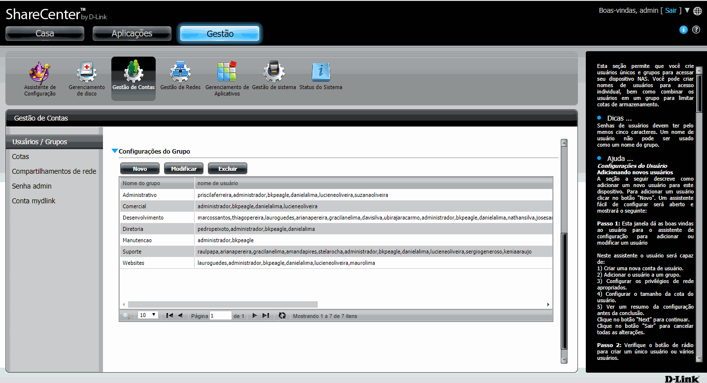

O Storage é um dispositivo onde está todos os arquivos dos setores da Empresa. [Saiba mais sobre as especificações do dispositivo](https://ajuda.eagletecnologia.com/materiais/interno/infraestrutura/politica-de-backup#especificaes-dos-storages).

O Storage ShareCenter by D-link pode ser acessado (solicite a gerência) pelo ip `192.168.1.2`. Essa documentação irá mostrar como criar novos usuários e novos grupos.

## Novos Usuários

Após realizado o acesso clique em `Gestão / Gestão de Contas / Criar`.

Siga para próximo, deixe selecionado a opção padrão, coloque o nome `(obs: tudo minúsculo e tudo junto)` e a senha, marque os gurpos que o usuário irá participar, marque as permissões para cada pasta, deixe o limite da cota em `0`, clique em terminar. 

## Novos Grupos

Da mesma forma dos usuários também pode-se criar os grupos. Espanda a aba `Configurações do Grupo` logo abaixo da listagem de usuário, clique em novo e em próximo, coloque o nome do grupo, assinale os usuários que estarão nesse grupo, marque as permissões para cada pasta, deixe o limite da cota em `0`, clique em terminar.

! Após realizado os cadastros, teste o novo usuário acessando a pasta no qual foi concedido permissão.
