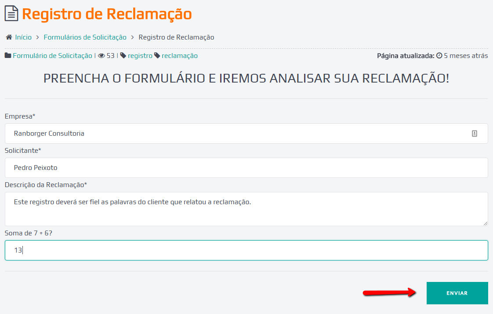
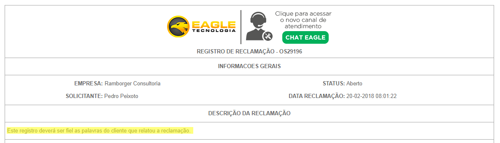
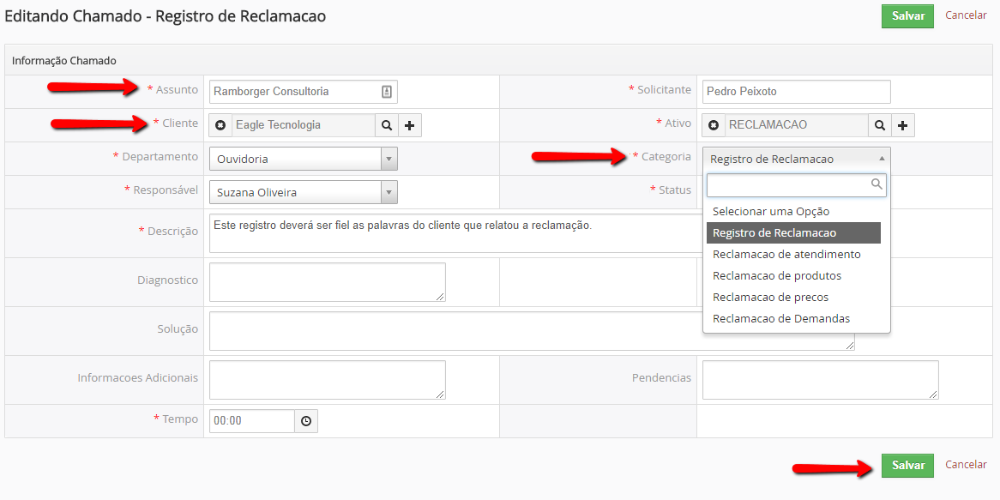
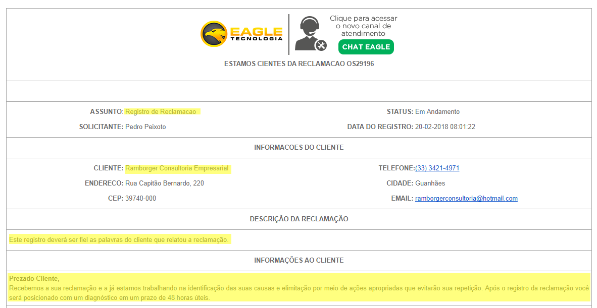
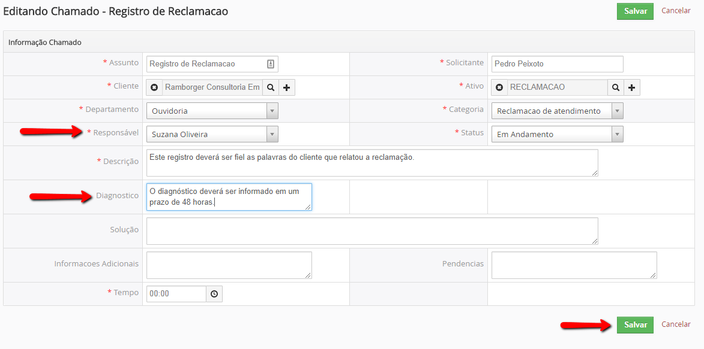
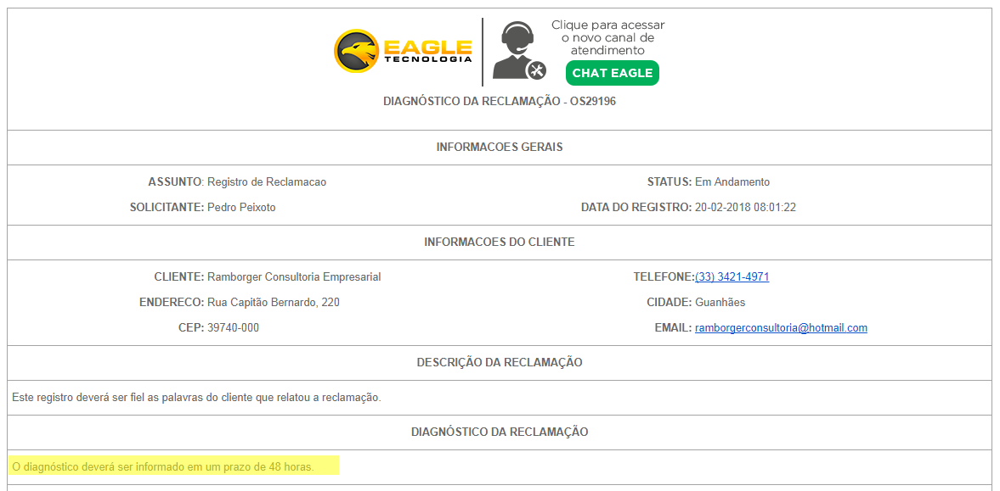
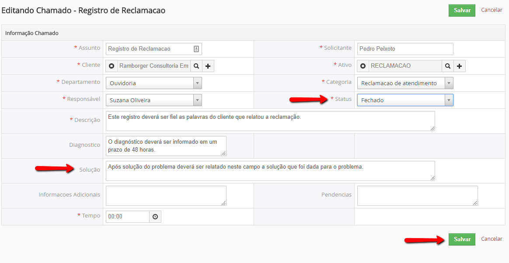

===

## OBJETIVOS
Orientar profissionais de TODOS os setores a estarem sempre atentos as reclamações dos clientes para a melhoria do atendimento e serviços prestados. Quando ocorre uma reclamação é necessário que a empresa registre-a e a trate adequadamente, de forma a garantir a satisfação e a continuidade da utilização dos produtos e serviços pelos clientes.

## ACR UM - DO REGISTRO DA RECLAMAÇÃO
1. Uma reclamação pode ser identificada nas seguintes situações:
- Cliente expressa insatisfação durante um atendimento;
- Cliente expressa insatisfação durante um pós-venda;
- Cliente expressa insatisfação durante uma pesquisa de satisfação;
- Cliente liga e expressa sua insatisfação;
- Cliente expressa insatisfação via e-mail, whatsapp, skype, e outros canais;
1. Os seguintes motivos serão considerados passíveis de registro de reclamação:
- Má qualidade do atendimento;
- Descontentamento com nossos produtos;
- Preços altos em relação ao mercado;
- Demandas não atendidas;
1. Após identificado o motivo reclamação o registro deverá ser feito por quem identificou a reclamação ou pelo próprio cliente no [Formulário de Registro de Reclamação](https://ajuda.eagletecnologia.com/formularios-de-solicitacao/registro-de-reclamacao) na base de conhecimento; 
1. O registro deverá ser fiel as palavras do cliente que relatou a reclamação;
1. O setor administrativo será responsável por conduzir a solução do problema e poderá delegar tarefas aos setores relacionados com a reclamação.

!!!! Qualquer funcionário da empresa terá autoridade para identificar uma reclamação e efetuar o registro

## ACR DOIS - DO TRATAMENTO DA RECLAMAÇÃO
1. O tratamento das reclamações consiste na pronta solução do problema junto ao cliente e, posteriormente, na identificação das suas causas e eliminação por meio de ações apropriadas, evitando a repetição;
1. O Cliente ou Colaborador registra uma reclamação;

!!!! **Passos** 1) Identificar a empresa 2) Identificar o Solicitante 3) Relatar a Reclamação 4) Informar a Soma 5) Enviar
1. Os Diretores e Administrativo são notificados do registro da reclamação;

1. O Administrativo classificam a reclamação;

!!!! Passos:  1) Pesquisar o cliente de acordo com o assunto da reclamação 2) Categorizar a reclamação 3) Salvar
1. O Cliente e Diretoria são notificados da ciência da reclamação;

! O Administrativo tem um prazo de 48 horas para apurar a reclamação;
1. O Administrativo apura a reclamação e informa o seu diagnóstico;

!!!! **Passos** 1) Informar o Responsável pela Solução do Problema 2) Informar o Diagnóstico 3) Salvar
1. O Cliente, Diretoria e o Responsável são notificados do diagnóstico da reclamação;

! O Administrativo deverá ligar para o cliente informando uma data prevista para solução;
1. O Administrativo informa a solução para a reclamação na data prevista;

!!!! **Passos** 1) Modificar o Statua para Fechado 2) Relatar a Solução do Problema 3) Salvar
1. O Cliente, Diretoria e Responsável são notificados da solução para a reclamação;

! O Administrativo deverá ligar para o Cliente informando da solução da reclamação;
1. O Administrativo marca na agenda para ligar para o cliente novamente sete dias após a solução da reclamação;
! O Administrativo deverá ligar para o cliente para apurar se existe mais alguma pendência;

!!!! As reclamações corretamente tratadas podem contribuir para a fidelização dos clientes.
