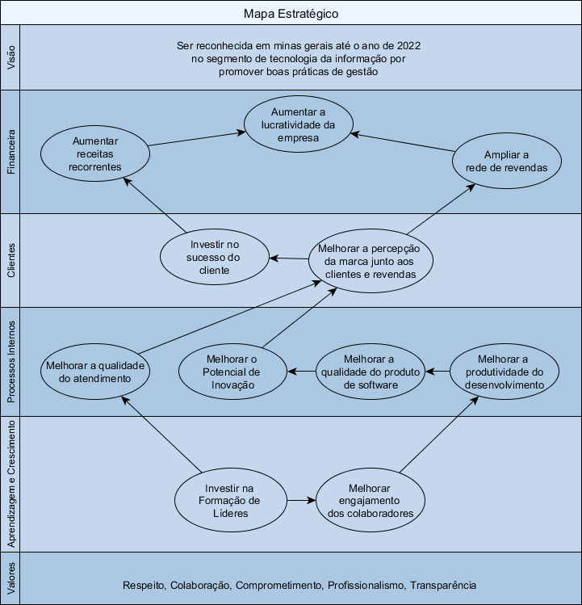

===

## INTRODUÇÃO

A estratégia é caminho escolhido para alcançar os objetivos da organização e realizar a visão de futuro. A definição das estratégias é fundamental para o sucesso porque que ao definir as estratégias são levados em consideração o ambiente interno e externo identificando forças que podem impulsionar ou restringir o crescimento da organização. Neste contexto a Visão Estratégica da organização são traduzidas em Objetivos Estratégicos que são monitorados por Indicadores que são associados as Metas que são alavancadas por Iniciativas Estratégicas que são desdobradas em Planos de Ação.

## CRONOGRAMA

|O que|Como|Quando|
|-----|----|------|
|Análise dos ambientes externo e interno|Matriz Swot|22/01|
|Definição da visão, missão e valores da empresa|Reunião|23/01|
|Estabelecer estratégias para alcançar a visão|BSC|24/01|
|Criar indicadores e metas|Reunião|25/01|
|Desenvolver planos de ação|5w2h|26/01|
|Apresentação das estratégias, metas e planos|Reunião|03/02|
|Monitoramento das ações|Relatórios|Mensal|
|Revisar a estratégias e planos|PDCA|Trimestral|

## Ambientes externo e interno	
Para identificar esses fatores, é importante conhecer três tipos de ambientes: o macroambiente, que inclui os cenários político, legal, econômico, social e tecnológico em que a empresa está inserida; o ambiente operacional ou setor de atuação, que envolve os comportamentos dos clientes, fornecedores, concorrentes e mercado-alvo; e, por fim, o ambiente interno, que determina as forças e fraquezas da organização.

|Ambiente Interno|Forças|Fraquezas|
|----------------|------|---------|
| |Atendimento Pouca dependência de fornecedores externos Rede de Revendas|Adequação da legislação próximo do prazo Índice de satisfação médio Pouco conhecimento a respeito da expectativa do cliente|
|**Ambiente Externo**|**Oportunidades**|**Ameaças**|
| |Exigência legais Necessidade de controle das empresas Retomada do crescimento da economia|Sistemas online Inadimplência Pouco uso dos recursos do sistema|

## Missão, Visão e Valores
A Missão da empresa formaliza a razão de sua existência, define por que ela existe. A Visão permite estabelecer os objetivos estratégicos a serem atingidos no futuro.

**Missão:** Oferecer sistemas de gestão empresarial como diferencial para os pequenos negócios.

**Visão:** Ser reconhecida em minas gerais até o ano de 2022 no segmento de tecnologia da informação por promover boas práticas de gestão.

**Valores:** Respeito, Colaboração, Comprometimento, Profissionalismo, Transparência.

## Estratégias para alcançar a visão	
Para definir as estratégias é preciso considerar informações sobre clientes, mercados, fornecedores, colaboradores, bem como a capacidade de produtiva e de entrega de valor ao cliente. Isso ajuda a posicionar a organização de forma competitiva e a garantir a sua continuidade. A organização deve focar em aproveitar oportunidades, enaltecer as forças, diminuir as fraquezas e prevenir as ameaças. 

")

Para transformar nossas estratégias em objetivos operacionais que, por sua vez constituirão um roteiro para a obtenção de resultados utilizaremos do Balanced Scorecard (BSC). A seguir serão apresentados os objetivos divididos nas perspectivas Financeira, Clientes, Processos Internos, Aprendizagem e Crescimento.

## Indicadores e metas
A criação de indicadores permite avaliar e mensurar, por meio de resultados quantitativos, se a empresa tem alcançado suas estratégias. O estabelecimento de metas de curto e longo prazos ajuda a definir níveis de resultados esperados, possibilitando a análise de desempenho do negócio. Tanto os indicadores quanto as metas precisam ser disseminados para todos os colaboradores.

### Indicadores Administrativos
|Objetivo|Meta|Indicador|Como Obter|
|--------|----|---------|----------|
|Melhorar engajamento dos colaboradores|% Rotatividade inferior a 25%|% Rotatividade|3Ponto|
|Melhorar engajamento dos colaboradores|Feedback com os colaboradores a cada 6 meses|Feedback|Reunião de feedback|
|Investir em formação de líderes|100% dos gerentes capacitados|Capacitações|Certificados|
|Aumentar a Lucratividade da empresa|Aumentar a Lucratividade em 10%|Lucratividade|DRE|
|Aumentar a Lucratividade da empresa|Reduzir a Inadimplência para 4%|Inadimplência|A Receber x Recebimentos|
|Aumentar a Lucratividade da empresa|Reduzir em 5% o orçamento base zero|Orçamento|A Pagar x Pagamentos|

### Indicadores Comerciais
|Objetivo|Meta|Indicador|Como Obter|
|--------|----|---------|----------|
|Melhorar a percepção da marca junto aos clientes e revendas|Aumentar visitas mensais em 30% |Visitas mensais|RD|
|Melhorar a percepção da marca junto aos clientes e revendas|Aumentar a taxa de abertura de e-mails para 20%|Taxa de abertura de e-mails|RD|
|Aumentar Receitas Recorrentes|Alcançar 100 Leads|Leads|RD, CRM|
|Aumentar Receitas Recorrentes|Gerar 30 oportunidades|Oportunidades|RD, CRM|
|Aumentar Receitas Recorrentes|Melhorar a Taxa de Conversão entre Oportunidades e Vendas para 20%|Contratos|RD, CRM|
|Aumentar Receitas Recorrentes|Aumento do faturamento em 20%|Faturamento|Faturamento|

### Indicadores Desenvolvimento
|Objetivo|Meta|Indicador|Como Obter|
|--------|----|---------|----------|
|Melhorar a produtividade do desenvolvimento|Alcançar acerto da estimativa em 80%|Estimativa|Gitlab|
|Melhorar a produtividade do desenvolvimento|Alcançar 90% de cumprimento de prazos|Cumprimento de prazos|Gitlab|
|Melhorar a produtividade do desenvolvimento|Registrar 60% das horas trabalhadas|Horas trabalhadas|Gitlab|
|Melhorar a qualidade dos produtos de software|Alcançar de cobertura de testes superior a 25%|Cobertura de Testes|Gitlab|
|Melhorar a qualidade dos produtos de software|Diminuir % de defeitos de versão para 5%|% de defeitos de versão|Gitlab|
|Melhorar a qualidade dos produtos de software|Diminuir Quantidade de Suporte Nível 3 para 5%|Quantidade de Suporte Nível 3|Gitlab|
|Melhorar o Potencial de Inovação|Implementar 30% de demandas estratégicas por versão|% demandas estratégicas|Gitlab|
|Melhorar o Potencial de Inovação|Lançar 3 Produtos por Ano|Lançamento de Produtos|Gitlab|

### Indicadores Suporte
|Objetivo|Meta|Indicador|Como Obter|
|--------|----|---------|----------|
|Investir no sucesso do cliente|Alcançar o índice de satisfação superior a 90%|NPS e Chat|Índice de Satisfação|
|Investir no sucesso do cliente|Reduzir o Churn para menos de 7%|Churn|Servidor de Licenças|
|Melhorar a qualidade do atendimento|Alcançar Índice de Reclamação inferior a 2%|Índice de Reclamação|CRM|
|Melhorar a qualidade do atendimento|Registrar 100% dos atendimentos|Registro de atendimento|CRM|
|Melhorar a qualidade do atendimento|Mensalmente registrar na base de conhecimento no mínimo 2 faqs por colaborador|Número de faqs|Base de Conhecimento|

### Indicadores Diretoria
|Objetivo|Meta|Indicador|Como Obter|
|--------|----|---------|----------|
|Ampliar a rede de revendas|Alcançar 50 Leads|Leads|CRM|
|Ampliar a rede de revendas|Gerar 15 oportunidades|Oportunidades|CRM|
|Ampliar a rede de revendas|Melhorar a taxa de conversão entre oportunidades em contratos para 20%|Contratos|CRM|

## Planos de ação	
De modo geral, os planos de ação são estabelecidos para realizar aquilo que a empresa precisa fazer para que sua estratégia seja bem-sucedida. Devem incluir a definição de responsáveis, de prazos e dos recursos necessários para a execução das ações. Para priorizar as ações foram levadas em consideração os seguintes critérios: Aumentar Receitas, Diminuir Despesas, Valorizar a Marca, Organização.

### Plano de ação Administrativo
|O que|Quem|Quando|
|-----|----|------|
|Revisar o processo de crédito e cobrança.|Priscila, Suzana|09/fev|
|Revisar a fórmula do índice de inadimplência.|Priscila, Suzana|09/fev|
|Criar cronograma para realização do NPS duas vezes por ano|Daniela, Suzana|16/fev|
|Criar mecanismo de Pós-Vendas|Priscila, Daniela|23/fev|
|Definir um plano de capacitação para cada cargo|Amanda, Lauro, Suzana, Daniela|16/mar|
|Criar cronograma para realização do feedback com os colaboradores duas vezes por ano|Daniela, Pedro, Suzana|23/mar|
|Revisar o processo de seleção e contratação|Daniela, Pedro, Suzana|30/mar|
|Revisar requisitos e responsabilidades para cada função|Amanda, Lauro, Suzana, Daniela, Pedro|20/abr|
|Revisar documento de cargos|Daniela, Pedro, Suzana|27/abr|
|Documentar os processos principais do administrativo.|Priscila, Suzana|04/jun|
|Documentar rotina do time administrativo.|Priscila, Suzana|04/jun|

### Plano de ação Comercial
|O que|Quem|Quando|
|-----|----|------|
|Documentar os processos principais do comercial.|Daniela, Luciene|16/fev|
|Implantar metodologia de funil vendas.|Daniela, Luciene|16/fev|
|Trabalhar mix de produtos|Daniela, Luciene|16/fev|
|Documentar rotina do time de comercial.|Daniela, Luciene|23/fev|
|Planejar ação comercial para o Eagle Backup|Daniela, Luciene|16/mar|
|Planejar ação comercial para o Eagle DOC|Daniela, Luciene|23/mar|
|Definir critérios de segmentação da carteira de clientes|Daniela, Luciene|30/mar|
|Definir estratégias de comunicação baseadas na segmentação dos clientes.|Daniela, Luciene, Mauro|30/mar|

### Plano de ação Desenvolvimento
|O que|Quem|Quando|
|-----|----|------|
|Documentar o processo de gestão de demandas|Lauro, Ariana|23/fev|
|Implantar canal de atendimento via chat|Pedro, Mauro|02/mar|
|Criar documento com orientações sobre estimativa de software|Lauro, Marcos|02/mar|
|Realizar plano de trabalho com a metodologia SCRUM|Lauro, Marcos|09/mar|
|Reestruturar o site voltado para o produto com espaço para revenda.|Lauro, Mauro, Daniela|27/abr|
|Desenvolver plano de trabalho para automatização de testes|Ariana, Marcos|18/mai|
|Criar fórmula para calcular o custo da hora do desenvolvimento|Lauro, Marcos|01/jun|
|Documentar os processos principais do desenvolvimento|Lauro, Marcos|15/jun|
|Documentar rotina do time de desenvolvimento|Lauro|15/jun|
|Lançar o Eagle SL|Lauro, Marcos, Daniela|06/jul|
|Lançar do Emissor de NFC-e|Lauro, Ariana, Daniela, Pedro|13/jul|
|Criar funcionalidade que mensura acessos aos sistemas da Eagle|Ariana, Marcos|21/set|

### Plano de ação Suporte
|O que|Quem|Quando|
|-----|----|------|
|Melhorar o processo de implantação|Amanda, Pedro, Raul|16/mar|
|Documentar os processos principais do suporte|Amanda, Stela|13/abr|
|Documentar rotina do time de suporte|Amanda, Stela|13/abr|
|Documentar os manuais para a base do conhecimento|Willian|11/mai|

### Plano de ação Diretoria
|O que|Quem|Quando|
|-----|----|------|
|Criar mecanismo para tratar reclamações.|Pedro|09/fev|
|Candidatar a empresa em prémios de reconhecimento de gestão.|Daniela, Pedro|23/fev|
|Criar uma política de suporte para revenda.|Daniela, Pedro|02/mar|
|Planejar encontro de revendas.|Daniela, Pedro|09/mar|
|Estruturar a metodologia de sucesso do cliente|Daniela, Pedro|27/abr|
|Contratar empresa para prospecção de novas revendas.|Daniela, Pedro|06/jul|
|Lançar do produto de suporte avançado e consultoria|Daniela, Pedro|20/jul|
|Criar política salarial|Daniela, Pedro|10/ago|

## Gestão a Vista	
A informação pode ser transmitida em quadros de aviso, folders, intranet, boletins informativos, memorandos internos, apresentações da direção da empresa, eventos de conscientização e, até, canais informais.

## Monitoramento	
Ao dar início à prática das ações planejadas, é preciso acompanhar, por meio de reuniões periódicas, todas as etapas para garantir que seja seguido o planejamento previsto, a fim de atingir o sucesso almejado. Os sistemas de informação devem apoiar o monitoramento da implementação dos planos de ação.

<table>
    <tr>
        <td style="border: 1px solid #000; text-align: left; vertical-align: top">
            <b>Jan</b> 
        </td>
        <td style="border: 1px solid #000; text-align: left; vertical-align: top">
            <b>Fev</b> 
            23/02 - Entrega 5W2H 
            28/02 - Indicadores
        </td>
        <td style="border: 1px solid #000; text-align: left; vertical-align: top">
            <b>Mar</b> 
            30/03 - Entrega 5W2H 
            30/03 - Indicadores            
        </td>
        <td style="border: 1px solid #000; text-align: left; vertical-align: top"> 
            <b>Abr</b> 
            27/04 - Entrega 5W2H 
            30/04 - Indicadores
        </td>
    </tr>
    <tr>
        <td style="border: 1px solid #000; text-align: left; vertical-align: top">
            <b>Mai</b> 
            25/05 - Entrega 5W2H 
            31/05 - Indicadores
        </td>
        <td style="border: 1px solid #000; text-align: left; vertical-align: top">
            <b>Jun</b> 
            29/06 - Entrega 5W2H 
            29/06 - Indicadores            
        </td>
        <td style="border: 1px solid #000; text-align: left; vertical-align: top">
            <b>Jul</b> 
            27/07 - Entrega 5W2H 
            31/07 - Indicadores            
        </td>
        <td style="border: 1px solid #000; text-align: left; vertical-align: top"> 
            <b>Ago</b> 
            31/08 - Entrega 5W2H 
            31/08 - Indicadores            
        </td>
    </tr>
    <tr>
        <td style="border: 1px solid #000; text-align: left; vertical-align: top">
            <b>Set</b> 
            28/09 - Entrega 5W2H 
            28/09 - Indicadores            
        </td>
        <td style="border: 1px solid #000; text-align: left; vertical-align: top">
            <b>Out</b> 
            26/10 - Entrega 5W2H 
            26/10 - Indicadores            
        </td>
        <td style="border: 1px solid #000; text-align: left; vertical-align: top">
            <b>Nov</b> 
            30/11 - Entrega 5W2H 
            30/11 - Indicadores            
        </td>
        <td style="border: 1px solid #000; text-align: left; vertical-align: top"> 
            <b>Dez</b> 
            28/12 - Entrega 5W2H 
            28/12 - Indicadores            
        </td>
    </tr>	
</table>

## Melhoria Contínua	
A promoção de revisões periódicas das estratégias ajuda a organização a se antecipar a possíveis riscos do planejamento, que pode se inviabilizar por conta de alterações inesperadas ou imprevistas no ambiente ao redor da organização.

## GLOSSÁRIO

**Balanced Scorecard**: É um framework que auxilia as organizações a definir sua estratégia a partir da Missão, Visão e Valores. Estas estratégias serão traduzidas em objetivos estratégicos que serão monitorados por indicadores que serão associados as metas que serão alavancadas por iniciativas estratégicas que serão desdobradas em planos de ação.

**Estratégias**: Caminho escolhido para alcançar os objetivos da organização e realizar a visão de futuro. A definição das estratégias é fundamental para o sucesso da empresa. Para definir as estratégias é importante analisar o ambiente, identificar forças internas ou externas que podem impulsionar ou restringir a atuação e o crescimento da organização. É importante analisar o ambiente externo considerando informações que estão fora do controle da empresa: situação político econômica, legislações, atuação de concorrentes, novas tecnologias. Os fatores internos da organização também tem que ser analisados: competência dos colaboradores, recursos financeiros disponíveis, infraestrutura e capacidade produtiva. A partir da análise formal do ambiente a organização deve definir as estratégias a serem adotadas para tratar as forças identificadas. A validação das estratégias pela equipe aumenta o seu comprometimento com os desafios propostos.

**Indicadores** : Indicadores são informações quantidativas que expressam o desempenho de um produto ou processo em termos de eficiência, eficácia ou nível de satisfação. Além disso os indicadores permitem acompanhar a evolução ao longo do tempo. Índice de satisfação de clientes, Índices de inadimplência, Índice de participação no mercado são exemplos de indicadores. A definição dos indicadores para avaliação da implementação das estratégias permite o gerenciamento do progresso com base em fatos facilitando a tomada de decisão.

**Metas**: A meta representa um nível de desempenho pretendido para um indicador em um deteminado período de tempo. A determinação de metas transmite os objetivos da empresa com foco em resultados, o que gera mobilização de pessoas e dados para tomada de decisão. A comunicação dos indicadores e metas para os colaboradores contribui com o comprometimento para o alcance dos objetivos e auxilia a integração da estratégia no cotidiano das pessoas.