## Introdução

O presente documento tem como objetivo orientar as revendas quanto à utilização Falcon para registro de cliente e controle da quantidade de terminais usada para cada cliente.

O Falcon é o gerenciador de clientes sejam para representantes, parceiros, revendas e para a Eagle como controle da quantidade de clientes que utilizam o sistema.  Então a cobrança é realizada em cima da quantidade de terminais liberados para os clientes e da quantidade de empresas ativas.

## Acessando o Falcon
Para acessar o Falcon basta inserir o endereço [http://www.falconfv.com.br](http://www.falconfv.com.br) no navegador de sua preferência, sendo recomendável o Google Chrome.

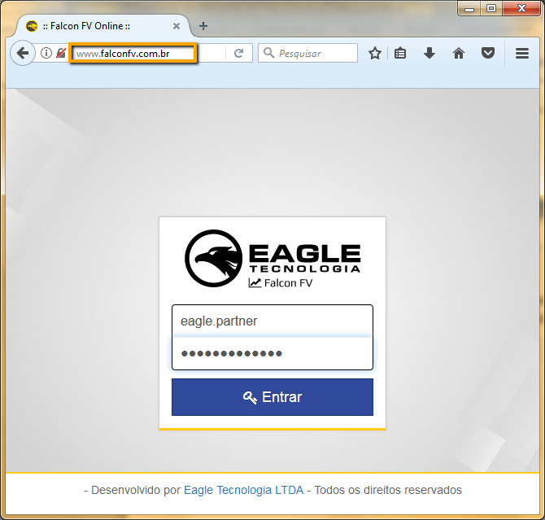

!!! O acesso a área restrita do Falcon é autorizado após o fechamento do contrato de parceria entre a Eagle e a Revenda.

## Tela inicial

A tela inicial do servidor de licenças mostra algumas informações importantes para acompanhamento da atividade da revenda.

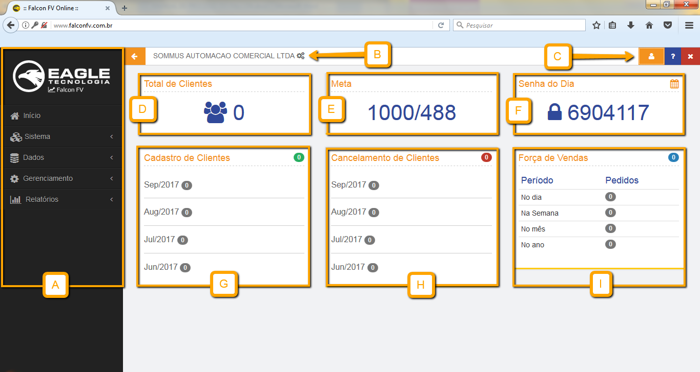

|Opção|Função|
|-----|------|
|A|Navegue pelas páginas do Falcon usando o menu lateral.|
|B|Clique neste menu para gerenciar outra empresa cadastrada.|
|C|Menu superior direito que contem gerenciamento de perfil, breve tutorial de navegação e opção de sair do servidor de licenças.|
|D|Mostra o total de clientes cadastrados pela empresa.|
|E|Meta geral a ser cumprida / valor que ainda falta para cumprir a meta.|
|F|Senha de manutenção do Eagle ERP e Eagle PDV usada para instalação e acesso a todas as funções dos sistemas.|
|G|Totais de clientes cadastrados nos quatro últimos meses pela a empresa gerenciada.|
|H|Totais de clientes cancelados nos quatro últimos meses pela empresa gerenciada.|
|I|Dados de pedidos realizados pelo aplicativo Falcon FV.|

## Alterar Senha

Para alterar a senha, após fazer o primeiro acesso, vá ao **menu superior direito / Meu Perfil**.

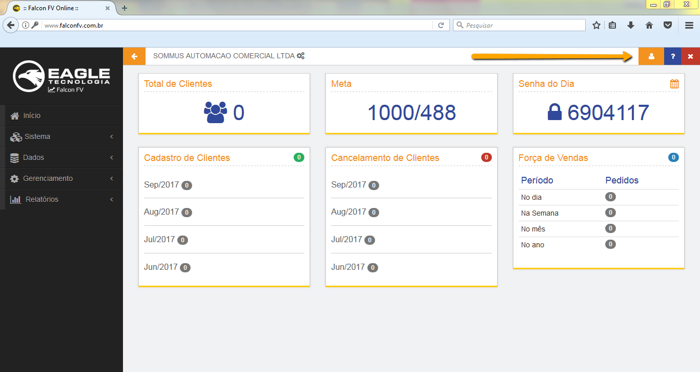

Será exibida a tela para a alteração da senha. **Clique em Alterar Senha** 

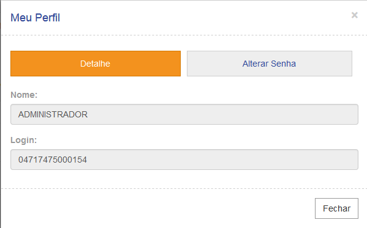

Após exibida a Aba de Alteração de Senha clique em Alterar e logo após em Salvar.

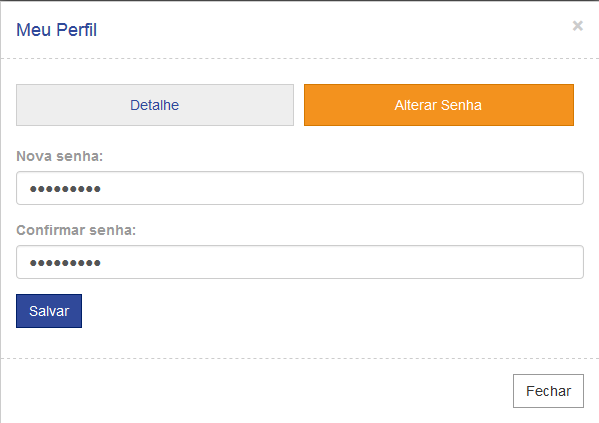

! Sua senha é uma maneira de garantir a segurança das suas informações, portanto é imprescindível que ela seja alterada para uma senha segura e confidencial.

## Gerenciar empresas

Todas as empresas que utilizem o sistema, seja para demonstração, teste ou utilização efetiva, precisam estar cadastradas no servidor de licenças. Para acessar dados de uma empresa cadastrada vá até a sessão 
**Sistema / Empresas**.

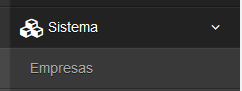

Será exibida a lista de empresas cadastradas:  

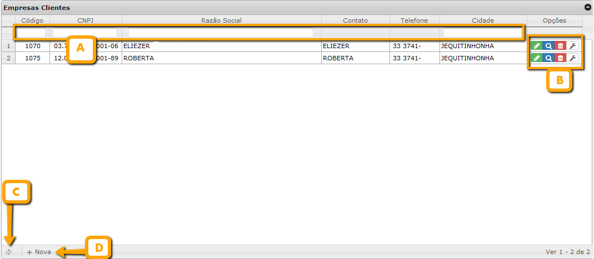

|Opção|Função|
|-----|------|
|A|Filtros de pesquisa por código, CNPJ/CPF, Razão Social ou cidade respectivamente. Digite os caracteres iniciais e pressione Enter.|
|B|Menu de opões|
|C|Recarregar a lista de empresas cadastradas.|
|D|Cadastrar uma nova empresa.|

No menu de opções as funções mais importantes são as de editar, visualizar e excluir.

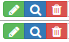

|Opção|Função|
|-----|------|
|Editar|Editar dados da empresa cliente.|
|Visualizar|Visualizar mais detalhes sobre a empresa cliente.|
|Excluir|Excluir empresa cliente.|

! É preciso ter cuidado ao optar por excluir uma empresa, pois os terminais cadastrados para essa empresa também serão excluidos no servidor de licenças. Assim, não será mais possível acessar o sistema por esses terminais.

## Cadastro de empresa

Para cadastrar uma nova empresa clique no botão **NOVA** no canto inferior esquerdo da tela. Será mostrada a tela de cadastro da empresa onde **todos os dados devem ser preenchidos**. 
Na aba **Identificação** o Código é gerado automaticamente e o Tipo de Pessoa define pessoa física ou jurídica, validando o CNPJ ou CPF digitado.

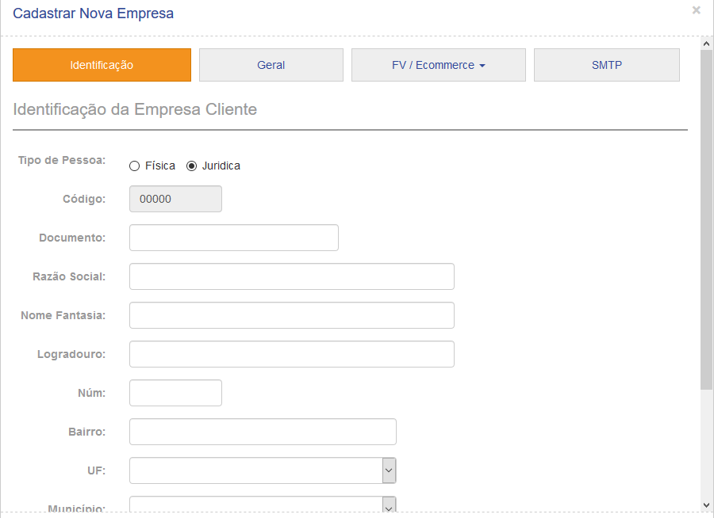

Na aba **geral**, defina qual será o modo de operação da empresa cadastrada, ou seja quais serão os produtos utilizados pela empresa, sendo:  

1.Apenas sistemas ERP.  
2.ERP e Força de Vendas.  
3.ERP e Ecommerce.  
4.ERP, Força de Vendas e Ecommerce.  

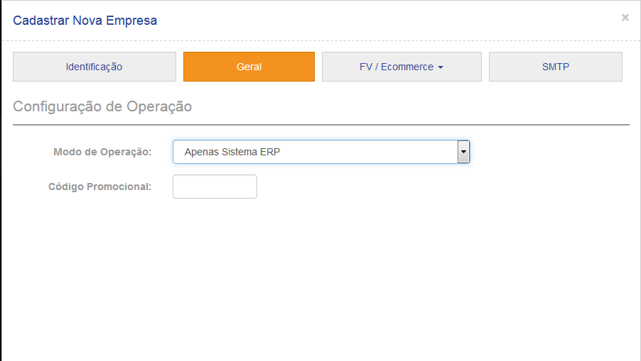

É importante escolher corretamente o modo de operação, pois caso a empresa trabalhe com o Força de Vendas ou Ecommerce e estiver marcado "Apenas sistemas ERP", não será possível realizar configurações necessárias desses módulos.

## Gerenciamento de terminais

Após estar cadastrada, para criar terminais é necessário gerenciar (trocar) a empresa. Acesse o **menu superior / Gerenciar dados** e selecione a empresa a qual deseja cadastrar terminais.

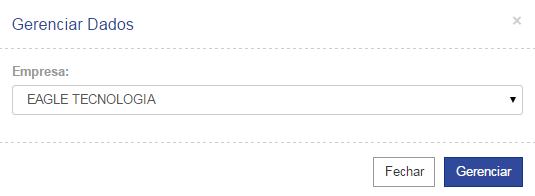

Computadores que utilizam o sistema Eagle ERP devem estar registrados, caso necessário inativo ou bloqueado. Para gerenciar terminais acesse **Terminais na sessão de Gerenciamento**.

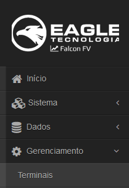

Serão listados os terminais cadastrados para a empresa.

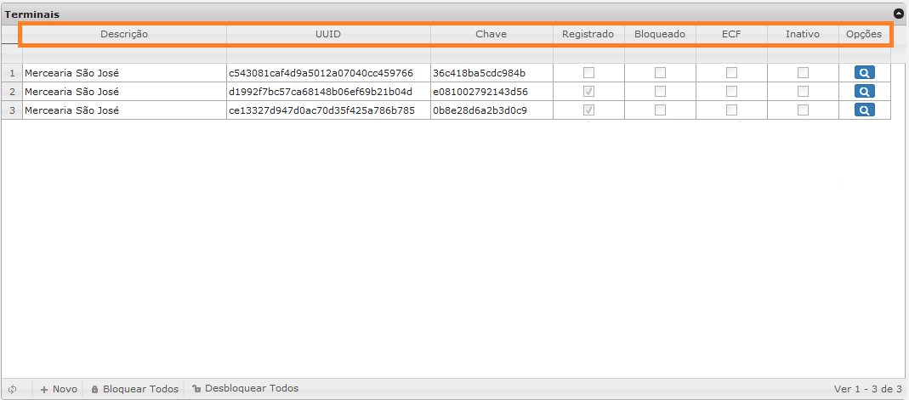

A tabela abaixo contém a explicação sobre cada coluna:

|Campo|Função|
|-----|------|
|Descrição|Nome usado para identificar o terminal.|
|UUID|Identificador Universal Único do terminal, gerado automaticamente após o seu registro.|
|Chave|Chave de registro do terminal que deve ser inserida após a instalação do Eagle Gestão no momento do registro.|
|Registrado|Indica se o terminal cadastrado está registrado.|
|Bloqueado|Indica se o terminal cadastrado está bloqueado. Para bloquear um terminal basta marcar essa opção.|
|Inativo|Indica se o terminal cadastrado está inativo. Marque essa opção para inativar clientes em caso de necessidade.|
|Opções|Ao clicar na lupa, será mostrado o histórico de acesso ao sistema por aquele terminal.|

!!! Caso o sistema precise ser reinstalado em um mesmo terminal, desmarque-o como registrado e efetue o registro do sistema após a instalação.

## Registrando um terminal

Para registrar um terminal, na página de gerenciamento de terminais clique em **NOVO**.  

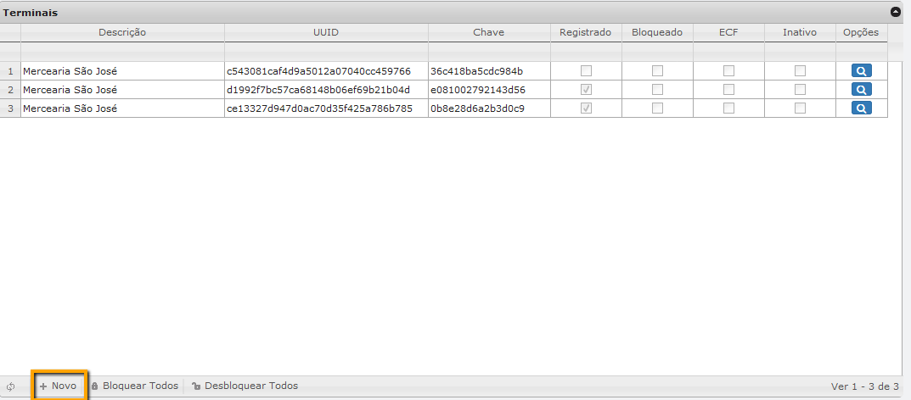

Será aberta uma caixa de diálogo. Pressione **OK** para continuar.

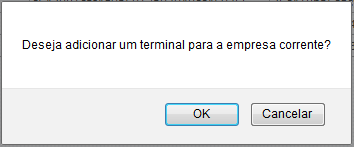

Será criada uma nova chave.

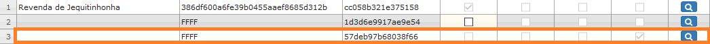

Após instalar o sistema, na tela de registro, preencha todos os campos.

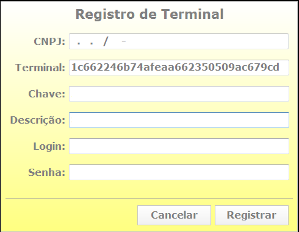

|Campo|Função|
|-----|------|
|CNPJ|CNPJ da empresa a ser registrado o terminal.|
|Terminal|Identificador Universal Único do terminal, gerado automaticamente e, após registrado, será o UUID do terminal no servidor de licenças.|
|Chave|Insira a chave que foi gerada no servidor de licenças após criar o terminal no servidor de licenças.|
|Descrição|Nome que será usado no servidor de licenças. É importante colocar um nome coerente, como o nome da máquina do cliente, SERVIDOR, BALCAO 1, BALCAO 2, CAIXA 1, ESCRITORIO.|
|Login|Seu login de acesso ao servidor de licenças.|
|Senha|Sua senha de acesso ao servidor de licenças.|

Clique em registrar para ativar a licença e o terminal fará parte da lista de terminais no servidor de licenças.
