## Introdução
Programa Aplicativo Fiscal – Emissor de Cupom Fiscal (PAF-ECF) é o programa desenvolvido para possibilitar o envio de comandos ao software básico do ECF, sem capacidade de alterá-lo ou ignorá-lo. Embora a definição de PAF-ECF se restrinja ao aplicativo que envia comandos de funcionamento ao ECF, os requisitos técnicos estabelecidos na legislação aplicam-se também, no que couber, ao Sistema de Gestão, ao Sistema de Emissão de Documento Fiscal por Processamento Eletrônico de Dados (PED) e ao Sistema de Emissão de Nota Fiscal Eletrônica(NF-e), utilizados por estabelecimento comercial varejista ou prestador de serviço de transporte intermunicipal ou interestadual de passageiros.

## Instalando o Sistema
Para garantir a integridade da versão que será instalada no cliente sempre confira a última versão do Eagle PDV disponibilizada em nossa base de conhecimento para download. Clique no instalador do EaglePDV para iniciar a instalação e clique em **Avançar**.

Aceite o contrato e clique em **Avançar**.

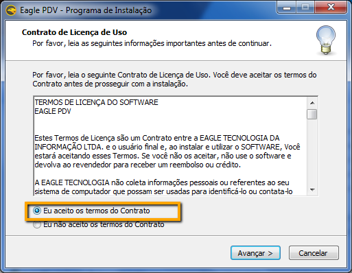

Informe a senha do dia e clique em **Avançar**.

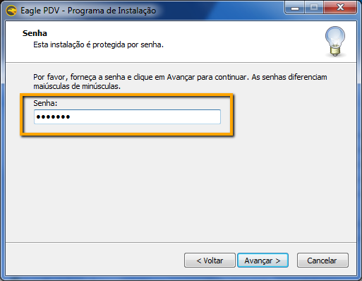

Clique em **Instalação Completa** do Sistema e clique em **Avançar**.

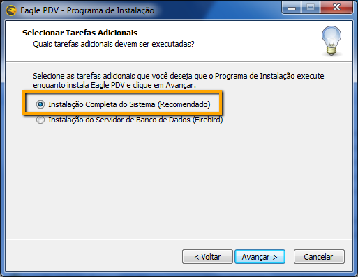

!!! A opção **Instalação do Servidor de Banco de Dados (Firebird)** deverá ser marcada somente se o servidor for conter somente o banco de dados em vez de o sistema instalado.

Clique em **Avançar**.

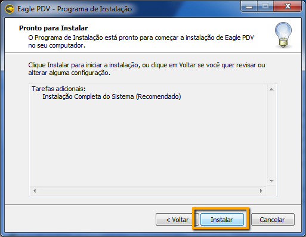

Aguarde o processo de instalação.

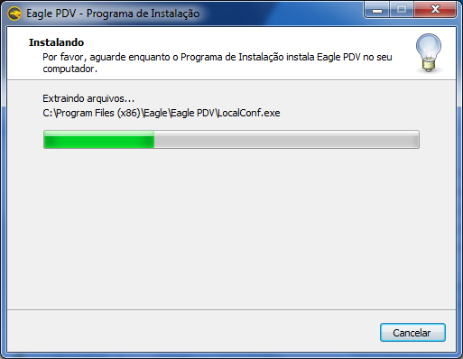

Caso o Firebird já esteja instalado no computador clique em Cancelar. Clique [aqui](https://ajuda.eagletecnologia.com/manuais/drivers-e-utilitarios/instalar-e-configurar-servidor-de-banco-de-dados) para seguir as orientações de instalação do o Firebird caso seja necessário.

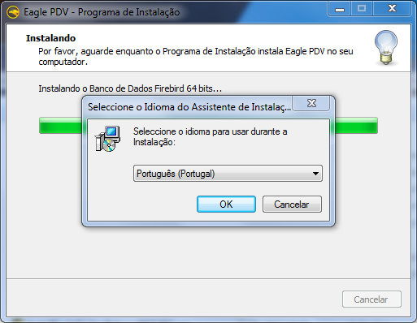

## Configurando o Sistema
Após a instalação o sistema solicitará a senha do dia para liberar o acesso a tela de configuração. Esta opção deve estar disponível somente para os técnicos de suporte.

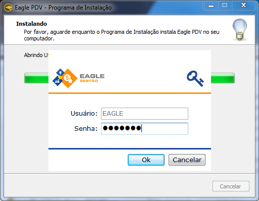

Após informar a senha do dia, o assistente de configuração exibirá uma mensagem de instrução. Após ler a instrução clique em **Avançar**.

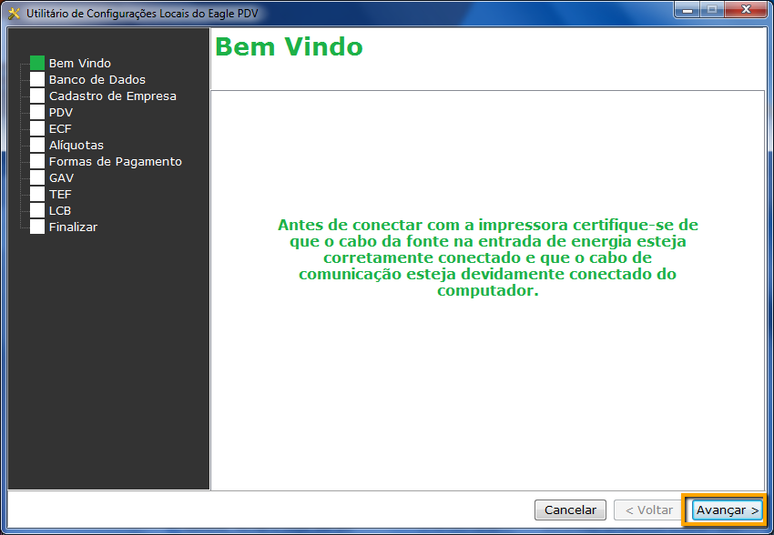

## Banco de dados
Configure as opções de banco de dados conforme as instruções descritas logo abaixo.

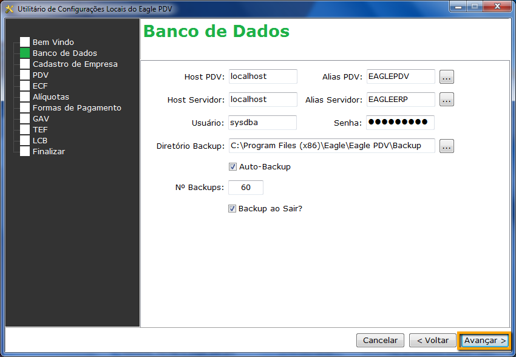

|Campo|Função|
|-----|----|
|Host e Alias PDV|Crie um Alias chamado EAGLEPDV localmente para configurar o banco de dados do PDV|
|Host e Alias Servidor|Caso não tenha sido criado crie um Alias chamado EAGLEERP para o banco de dados do Eagle Gestão informe o host e alias.|
|Usuário|Informe o usuário do banco de dados que geralmente é sysdba.|
|Senha|Informe a senha do banco de dados que geralmente é masterkey.|
|Diretório de Backup|Selecione o diretório onde serão armazenados os backups do PDV.|
|Auto Backup|Marque esta opção para que o PDV faça backup automaticamente no mínimo uma vez por dia.|
|Número de Backups|Informe o número de backups a serem mantidos pelo PDV.|
|Backup ao Sair|Marque esta opção para que o PDV solicite backup ao usuário toda vez que o mesmo sair do PDV.|

Após informar as configurações de banco de dados clique em **Avançar** e caso o PDV não identifique o cadastro da empresa será solicitada confirmação para sincronização total de dados.

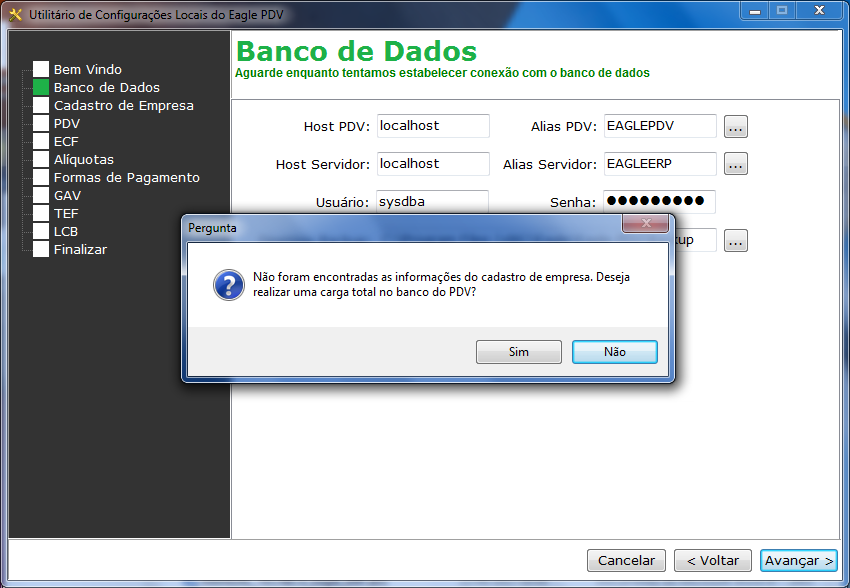

!! Em hipótese alguma o banco de dados do PDV poderá ficar configurado em uma máquina remota pois cada PDV deverá ter o seu banco de dados.

!!!! Caso seja possível configurar o banco de dados do PDV em um endereço remoto comunique imediatamente ao suporte técnico para que seja feita a correção nas regras de configuração de banco de dados.

! Prefira trabalhar somente com Alias para identificar os bancos de dados pois é mais amigável para dar suporte no cliente.

## Cadastro de empresa

Após a sincronização será exibida os dados da empresa. Após confirmar os dados da empresa clique em **Avançar**.

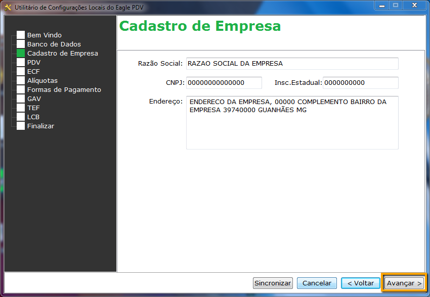

## Configurações do PDV
As configurações do PDV definem o comportamento do processo de venda. Caso tenha necessidade de utilizar alguma destas configurações siga as instruções abaixo:

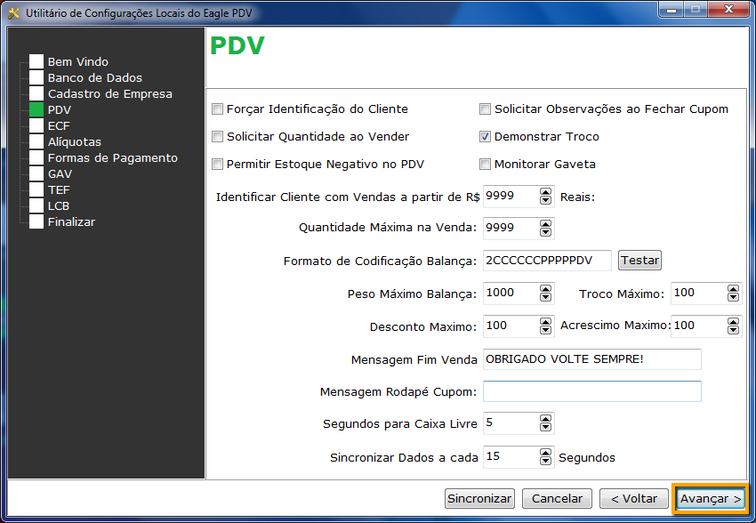

|Campo|Função|
|-----|----|
|Forçar Identificação do Cliente|Marque esta opção para que o PDV exija que o cliente seja identificado antes do fechamento da venda.|
|Solicitar Observações ao Fechar Cupom|Marque esta opção para que o PDV exija informações complementares antes do fechamento da venda|
|Solicitar Quantidade ao Vender|Solicita que seja informada a quantidade do produto antes que o mesmo seja impresso no ECF. Esta opção é ativada automaticamente quando o usuário pesquisa um produto pesado.|
|Demonstrar Troco|Marque esta opção para que o sistema exiba na tela o troco para que o operador possa voltar o troco correto para o cliente.|
|Permitir Estoque Negativo no PDV|Marque esta opção para que o PDV não verifique disponibilidade em estoque do produto ao registrar|
|Monitorar Gaveta|Marque esta opção para que o sistema acione a gaveta após o fechamento da venda.|
|Identificar Cliente com Vendas a partir de|Informe o valor mínimo para que o sistema solicite identificação de cliente ao fechar uma venda |
|Quantidade Máxima na Venda|Informe a quantidade máxima permitida de venda de um item no PDV.|
|Formato de Codificação de Balança|Informe a codificação de balança para que o sistema possa identificar códigos gerados por balanças.|
|Peso Máximo Balança|Informe o valor máximo de peso suportado pela balança para evitar erros de registro de produtos|
|Troco Máximo|Defina o valor máximo de troco que pode ser voltado para o cliente no caixa.|
|Desconto Máximo|Informe o máximo de desconto em percentual que pode ser concedido em uma venda|
|Acréscimo Máximo|Informe o máximo de acrescimo em percentual que pode ser informado em uma venda|
|Mensagem Fim Venda|Defina uma mensagem para constar no fim de cada venda.
|Mensagem Rodapé Cupom|Defina uma mensagem para constar no rodapé do cupom fiscal.|
|Segundos para Caixa Livre|Defina quantos segundos o PDV ficará esperando para retornar a tela de caixa livre após o fechamento de uma venda.|
|Tempo Sincronizar Dados|Defina o intervalo de tempo que o PDV sincronizará os dados. O PDV sincroniza os dados somente em modo de CAIXA LIVRE.|

## Cadastro de ECF
O cadastro de ECF deve ser feito primeiramente no Sistema de Gestão porque as vendas de todos os ECFs serão centralizadas em sua base de dados.

! Cada PDV obrigatoriamente deverá ser associado a um ECF previamente cadastrado no Sistema de Gestão

Para cadastrar um ECF no Eagle Gestão acesse:
1. Menu Principal / Fiscal / ECF.
1. Clique em **Novo**, informe os dados do ECF e clique em **Salvar**. 

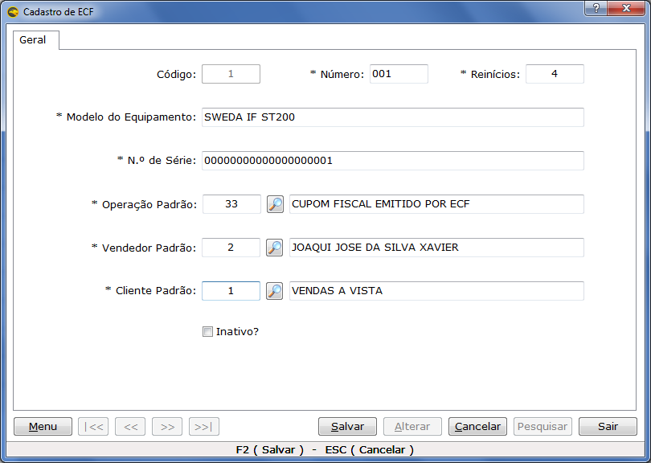

|Campo|Função|
|-----|------|
|Número|Informe o número do ECF que pode ser obtido no rodapé de uma Leitura X|
|Reinícios|Informe o Contador de Início de Operação que pode ser obtido na seção **Contadores** de uma Leitura X|
|Modelo do Equipamento|Informe o Modelo do Equipamento pode ser obtido no rodapé de uma Leitura X|
|Número de Série|Informe o Número de Série do Equipamento pode ser obtido no rodapé de uma Leitura X|
|Operação Padrão|Informe a operação que será gerada os documentos fiscais importados do PDV. Caso a empresa tenha mais de um PDV cada ECF deverá ser associado a uma operação diferente. Ex: VENDAS CAIXA 001, VENDAS CAIXA 002 etc.|
|Vendedor Padrão|Informe o vendedor padrão caso alguma venda seja importada sem vendedor.|
|Cliente Padrão|Informe o cendedor padrão caso alguma venda seja importada sem cliente.|
|Inativo|Caso o ECF seja inutilizado inative este cadastro clicando nesta opção.|

! Após salvar volte as configurações do PDV e clique em **Sincronizar** para que o ECF cadastrado possa ser associado do PDV.

Clique na lupa para pesquisar o ECF que será associado do PDV.

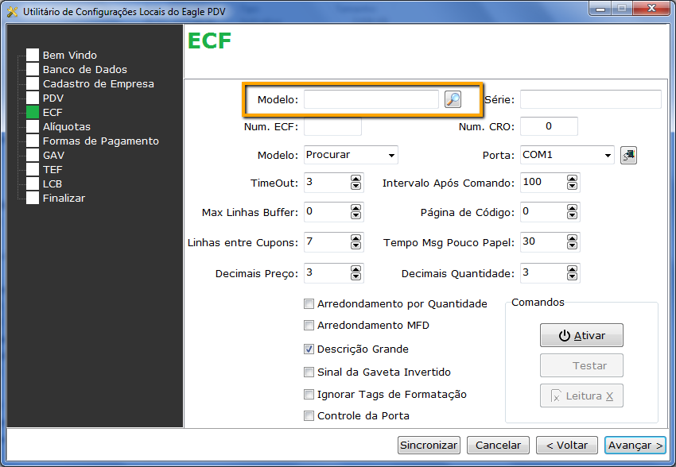

Após selecionar o ECF informe o **Modelo** e **Porta** do equipamento e clique em **Ativar**.

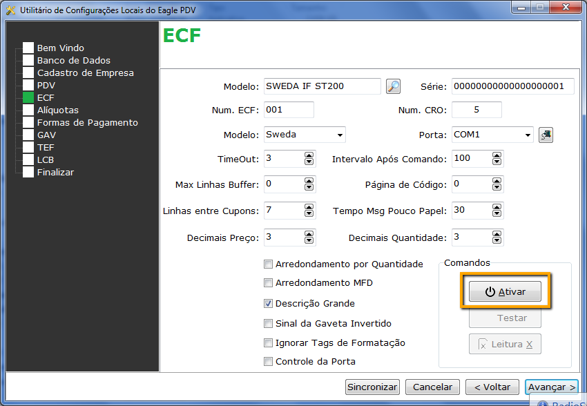

! As demais configurações somente devem ser alteradas com orientações do suporte técnico.

Após clicar em **Ativar** aguarde até que seja carregada todas as informações do ECF para prosseguir com a configuração. Clique em **Avançar**.

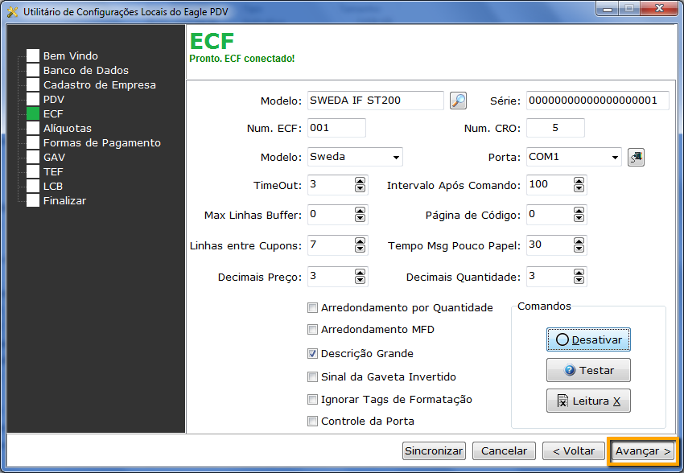

!!!! Para verificar que o ECF esteja funcionando corretamente uma leitura X pode ser comandada.

! Caso a empresa trabalhe com mais de um PDV preste atenção para não vincular um mesmo ECF para instalações de PDV diferentes. Cada PDV deverá ser associado a um ECF.

## Alíquotas
As alíquotas cadastradas no ECF serão exibidas e cadastradas no banco de dados do PDV para que seja associadas aos produtos sincronizados.

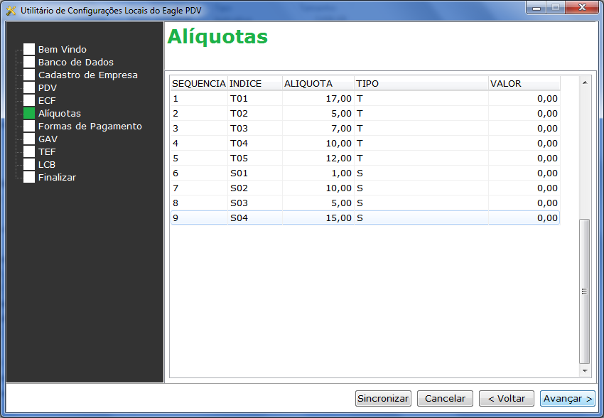

!!!! Caso existam produtos cadastrados no Sistema de Gestão com alíquotas diferentes das apresentadas nesta tela de configuração o PDV disponibilizará um **Relatório de Produtos Rejeitados** que basicamente são produtos que não são compatíveis com a tributação da impressora ou cadastrados de maneira errada.

!!! Consulte a contabilidade do cliente antes de criar uma alíquota no ECF ou modificar o cadatro de produtos no Sistema de Gestão.

## Formas de Pagamento
As formas de pagamento que foram carregadas do ECF terão que ser vinculadas as formas de pagamento cadastradas no Sistema de Gestão. Para vincular as formas de pagamento siga as instruções a seguir:

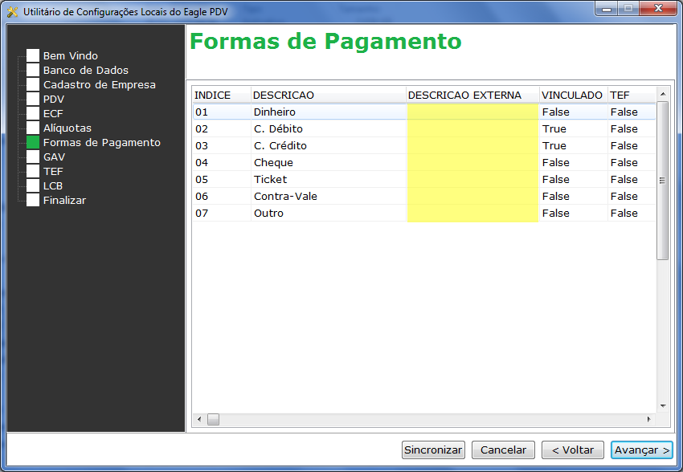

Clique duas vezes sobre a forma de pagamento ou pressione barra de espaço até que seja exibida a tela de consulta de formas de pagamento. Selecione a forma de pagamento correspondente e clique em selecionar.

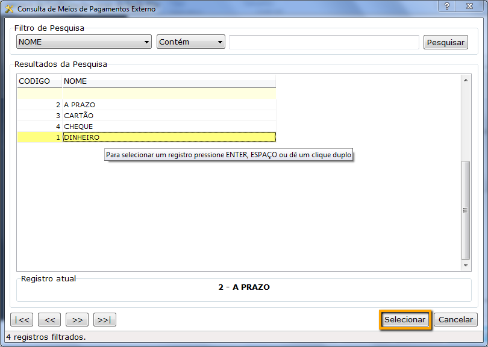

Clique em Selecionar para vincular a forma de pagamento do Sistema de Gestão com a forma de pagamento do ECF. Repita este passo para as demais formas de pagamento que serão utilizadas no PDV.

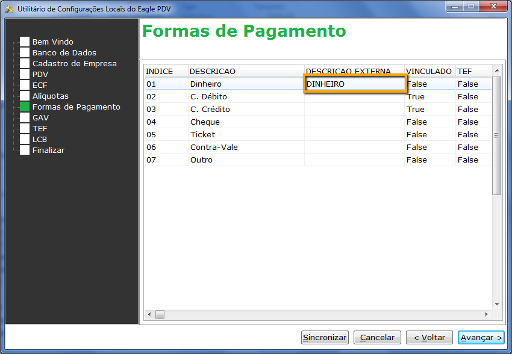

!!!! Caso exista alguma forma de pagamento no Sistema de Gestão que não poder ser utilizada no PDV basta deixar a mesma desvinculada a uma forma de pagamento do ECF.

! Uma mesma forma de pagamento do Sistema de Gestão poderá ser associada a mais de uma forma de pagamento do ECF, mas não fará diferença nenhuma quando as vendas forem sincronizadas para o Sistema de Gestão.

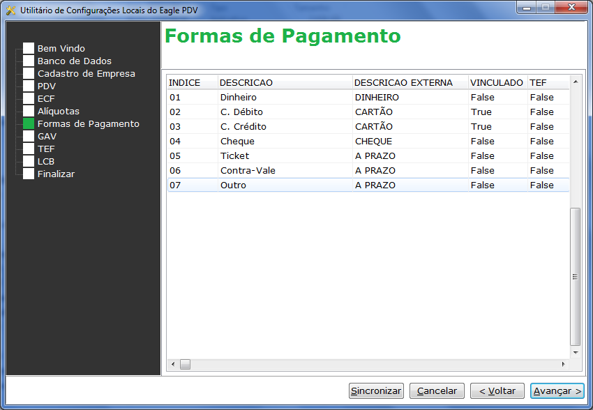

Após vincular as formas de pagamento do Sistema de Gestão com as correspondentes do ECF clique em **Avançar**.

## Gaveta

Para configurar a gaveta no PDV para que a mesma possa ser aberta com comando siga as instruções a seguir:

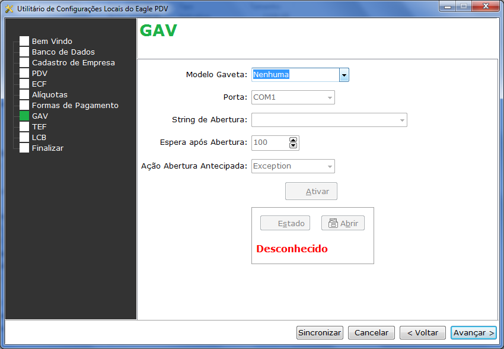

|Campo|Função|
|-----|----|
|Modelo de Gaveta|Selecione o modelo de gaveta a ser utilizada.|
|Porta|Caso a gaveta esteja ligada a uma porta de comunicação selecione a porta.|
|String de abertura|Selecione a string de abertura de acordo com a marca da gaveta.|
|Espera após Abertura|Informe o intervalo de espera após abertura da gaveta.|
|Ação Abertura Antedipada|Selecione a ação para abertura antecipada da gaveta.|
|Ativar|Após configurar clique em ativar para testar a gaveta.|
|Estado|Clique para verificar se a gaveta está aberta ou fechada.|
|Abrir|Clique para abrir a gaveta.|

! Caso a gaveta esteja aberta e o Estado da mesma estiver Fechado marque a opção **Sinal da Gaveta Invertido** nas configurações do ECF para corrigir o problema.

## TEF

A configuração do TEF (Transferência Eletrônica de Fundos) permite que as vendas no cartão sejam autorizadas diretamente com a operadores de cartão concomitante com o processo de finalização de venda onde a forma de pagamento foi configurada como TEF.

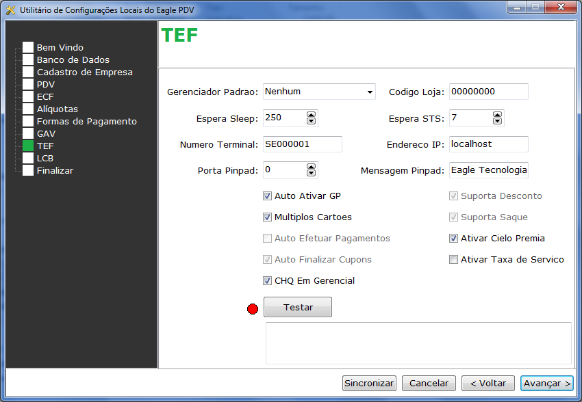

Informe as configurações do TEF conforme informações destacadas a seguir e clique em **Testar**.

|Campo|Função|
|-----|------|
|Gerenciador Padrão|Selecione o gerenciador CliSiTef|
|Código Loja|Informe o código da Loja configurado no Configurador Geral Sitef|
|Número Terminal|Informe o número do terminal que deve ser diferente em cada caixa|
|Endereço IP|Informe o endereço do servidor Sitef que pode ser local ou remoto|
|Porta Pinpad|Informe a porta COM onde o Pinpad foi reconhecido|
|Testar|Clique para testar a conexão com o Sitef|

Logo após será apresentada o menu administrativo do TEF onde o **Teste de Comunicação** será executado. Com a primeira opção selecionada clique em **OK**.

! Caso o PinPad não esteja instalado singa as instruções para instalação e configuração [aqui](https://ajuda.eagletecnologia.com/manuais/drivers-e-utilitarios/instalar-e-configurar-pinpad)

## LCB
Caso a empresa utilize leitores fixos de código de barras nesta tela será possível configurar o leitor que funcionará junto com o PDV.

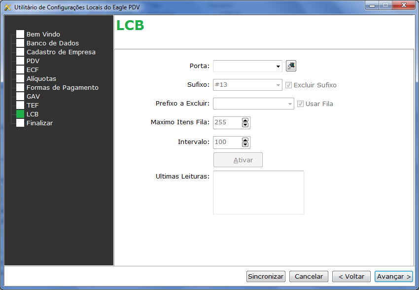

|Campo|Função|
|-----|------|
|Porta|Selecione a porta que o leitor está conectado.|
|Sufixo|Caso seja necessário informe um sufixo para o dispositivo.|
|Excluir Sufixo|Marque aqui para excluir o sufixo.|
|Máximo Itens Fila|Informe a quantidade de itens na fila de leitura.|
|Intervalo|Informe o intevalo|
|Ativar|Clique aqui para ativar e testar o leitor.|
|Útimas Leituras|Visualize as últimas leituras realizadas e confira e ajuste as configurações.|

## Salvando as Configurações

Após realizar as configurações clique em **Finalizar** para começar a utilizar o PDV.

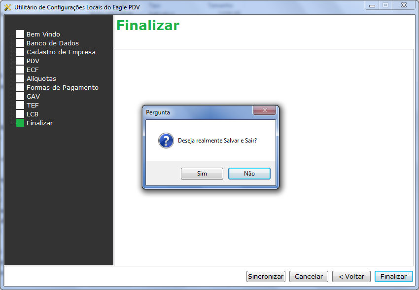

Aguarde até que os dados sejam sincronizados.

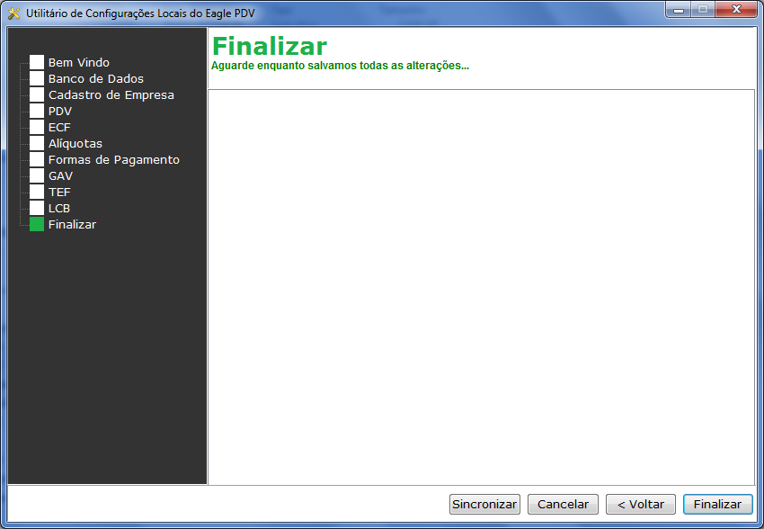

! Cada PDV poderá ter configurações diferenciadas dependendo dos modelos de dispositivos conectados aos caixas.

## Abrindo o PDV

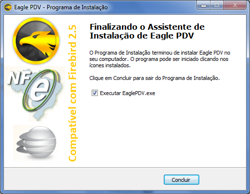

Após finalizar as configurações clique em concluir para abrir o PDV.

Aguarde até que as configurações sejam carregadas.

! Antes de começar a treinar o usuário emita o relatório de produtos rejeitados para que seja mostrado ao usuário produtos que não poderão ser vendidos até que seu cadastro seja corrigido.

## Produtos Rejeitados

Este relatório mostrará ao usuário a relação de produtos que terão que ser corrigidos para que possam constar na pesquisa de produtos para venda.

!!! Para mais informações sobre o PDV consulte o manual de usuário.