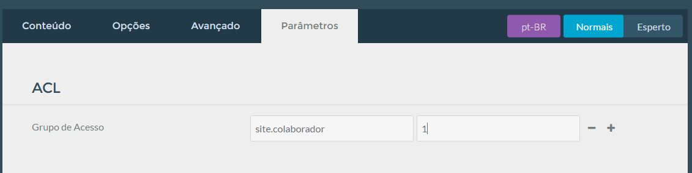

A Base de Conhecimento tem um mecanismo que permite restringir páginas para acesso não autorizado. Esse bloqueio pode ser feito na página pai, nesse caso todas as páginas filhas também serão bloqueadas. E pode ser feito também o bloqueio numa página específica.

A Plataforma foi projetada para 5 tipos de usuários:

* Cliente
* Revenda
* Colaborador
* Moderador
* Administrador

Cada usuário tem o seu nível de acesso que segue uma hierarquia. Para realizar o bloqueo é colocado uma regra na página que queira bloquear para determinado tipo de usuário. Veja a tabela a seguir para entender o funcionamento:

|Usuário|Permissão|Regra
|-------|---------|-----|
|Cliente|Acessa somente as páginas restringidas para o cliente|site.cliente|
|Revenda|Acessa as páginas restringidas para a revenda e para o cliente|site.revenda|
|Colaborador|Acessa as páginas restringidas para o colaborador, para o cliente e para a revenda|site.colaborador|
|Moderador|Acessa todas as restrições acima e ainda tem acesso ao painel administrativo para criar páginas para a Base de conhecimento|sem regra|
|Adminstrador|Acesso total a todas as páginas restringidas e a administração do sistema|admin.super|

Cada usuário tem sua senha padrão para acesso às páginas bloqueadas.

Para setar uma regra para a página, basta ir na aba `Parâmetros` e na sessão **ACL** no campo **Grupo de Acesso**, coloque uma das regras citadas na tabela e coloque o valor **1**. Assim a página estará bloqueada para a regra setada. Ex: Caso uma página que deva ser vista somente para os colaboradores, coloque a regra `site.colaborador`, quando essa página for acessada irá aparecer um formulário de login e quem terá acesso, de acordo com a tabela acima, será somente os usuários **Colabroador**, **Moderador** e **Administrador**.

