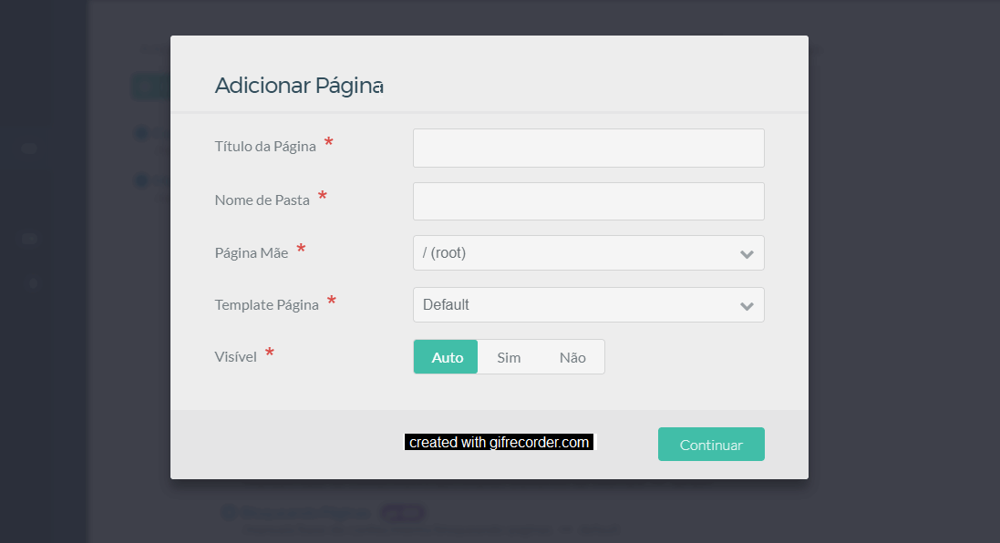

Uma página de Changelog é a página que conterá toda uma lista de versões de um sistema. Cada ítem desta lista de versões conterá as novas funcionalidades, melhorias e bugs corrigidos.

A página deverá seguir um padrão de escrita e o título da página deverá obrigatoriamente ser `Changelog` para que a estilização da página seja mantido de forma isolada de outras páginas.

A localização dessa página deverá ser dentro de `Manuais` e ela deverá ficar na raiz da página pai do manual de um sistema. O tipo da página será `Default`. Lembre-se também de ativar a âncora, habilitar o menu e setar o filtro para **Título 2** na aba `Parâmetros`. Segue exemplo da criação de uma página de Changelog:



## Padrão de Escrita

Uma página de changelog terá no início a identificação da versão e data de lançamento e logo em seguido os marcadores: `new`, `improved` e `bugfix` que conterão em cada um os itens relacionados. Veja padrão de escrita:

```markdown

## v1.3.0-rc.5
### 07/05/2017

1. [](#new)
	* Nova funcionalidade 1
	* Nova funcionalidade 2
	* Nova funcionalidade 3
1. [](#improved)
	* Melhoria 1
	* Melhoria 2
1. [](#bugfix)
	* Bug resolvido 1
	* Bug resolvido 2
	* Bug resolvido 3
	* Bug resolvido 4

```
O padrão de escrita acima obterá o seguinte resultado:

## v1.3.0-rc.5
### 07/05/2017

1. [](#new)
	* Nova funcionalidade 1
	* Nova funcionalidade 2
	* Nova funcionalidade 3
1. [](#improved)
	* Melhoria 1
	* Melhoria 2
1. [](#bugfix)
	* Bug resolvido 1
	* Bug resolvido 2
	* Bug resolvido 3
	* Bug resolvido 4

Então para cada nova versão lançada a página de `Changelog` do sistema deverá ser atualizada com esse padrão. Coloque sempre a escrita da última versão no topo da página para manter uma ordem descrescente.

Sempre que criar uma nova página de `Changelog` copie e cole o trecho de código abaixo no topo para gerar a legenda:

```markdown

#### Legenda

1. [](#new)
	* Novo recurso implementado
1. [](#improved)
	* Melhoria de recurso existente
1. [](#bugfix)
	* Erro que foi encontrado e corrigido

```
