## Introdução

Uma impressora não fiscal não possui memória fiscal da impressora e nem o lacre, pois seu uso não precisa ser fiscalizado. O tipo de conexão para ambas pode ser USB ou serial e o tipo de impressão que mais é utilizado é a impressão térmica.

## Instalando Drivers

Para iniciar a configuração de uma impressora não fiscal entre no **Painel de Controle** e clique em **Dispositivos e Impressoras**.

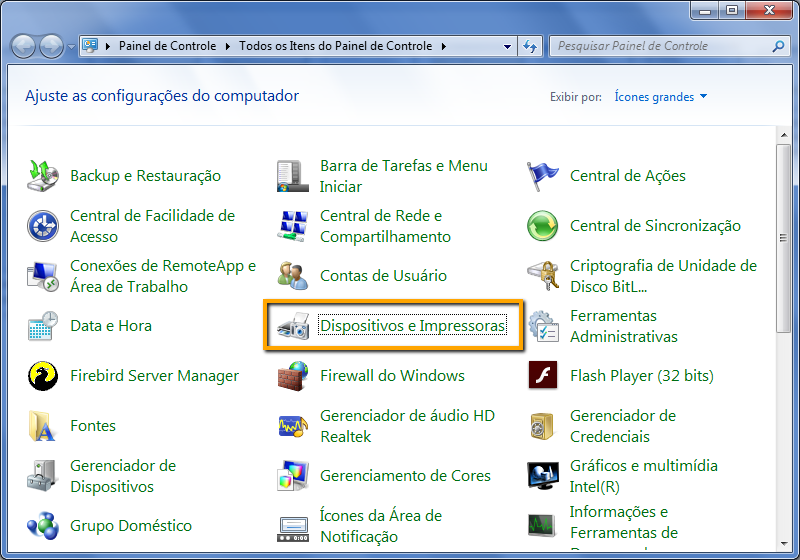

Na tela de **Dispositivos e Impressoras** clique em **Adicionar uma Impressora**.

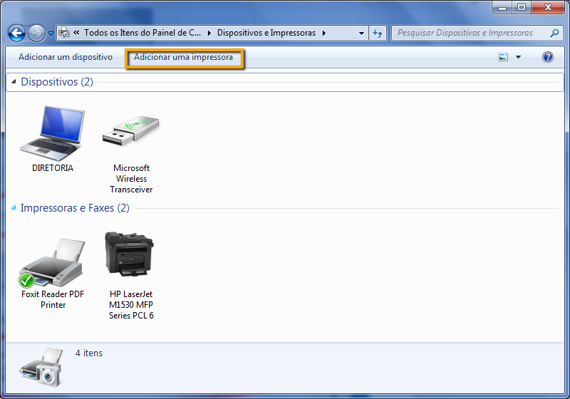

Selecione a opção **Adicionar um Impressora Local**.

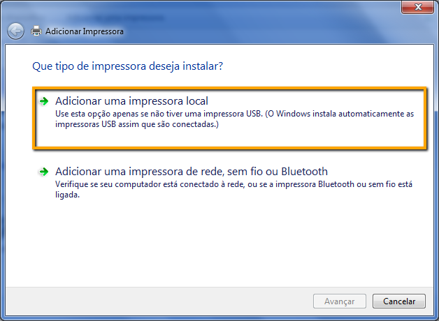

Selecione a opção **Usar porta Existente** e a porta onde a impressora não fiscal foi reconhecida pelo sistema operacional. Neste exemplo estamos instalando a impressora na porta COM1.

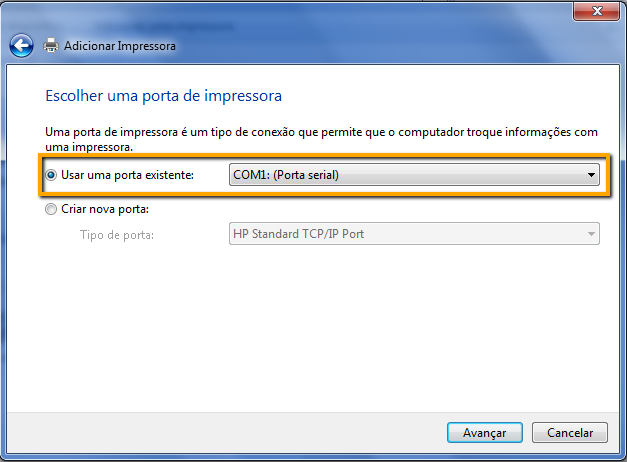

Selecione o Fabricante **Generic** e a Impressora **Generic Text Only**. Clique em **Avançar**.

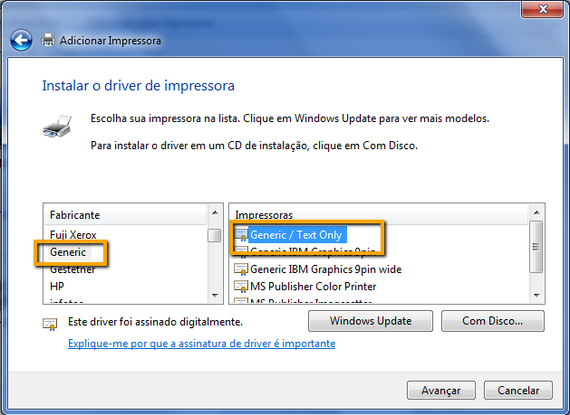

Por padrão recomendamos que o nome da impressora instalada seja **Cupom**. Clique em **Avançar**.

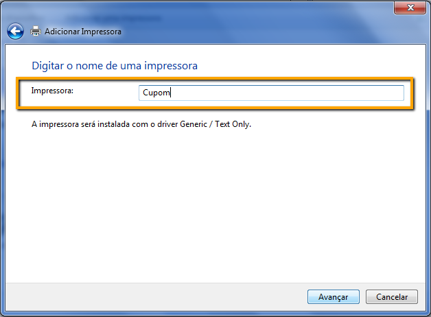

Para que outros usuários possam localizar e utilizar a impressora selecione a opção **Compartilhar** e mantenha o nome de compartilhamento sugerido. Clique em **Avançar**.

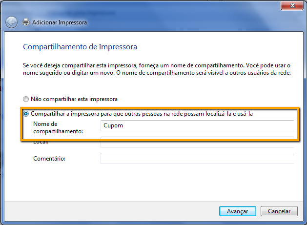

Clique em **Concluir** e se desejar imprima uma página de testes.

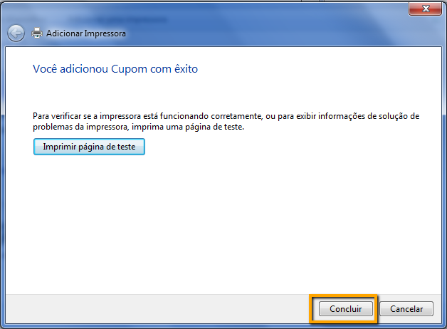

Após adicionada a impressora acesse **Preferências de Impressão**.

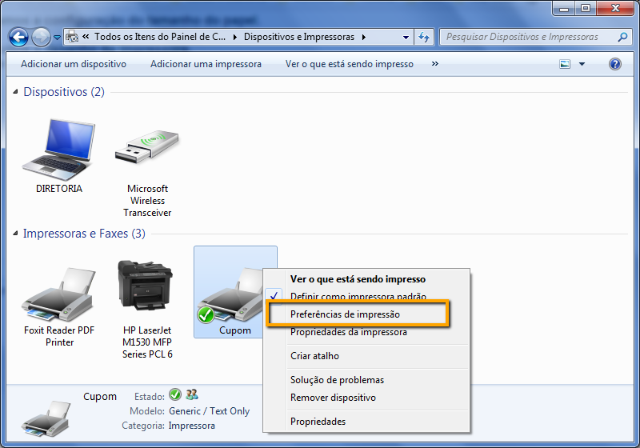

Clique em **Avançado**.

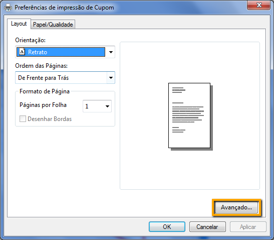

Selecione a opção **Ledger** referente ao **Tamanho do Papel** e clique em **OK**.

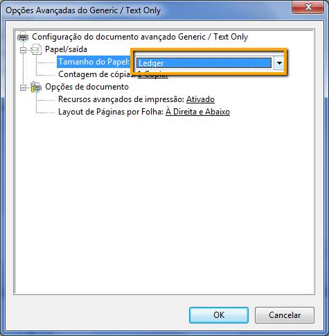

Acesse as **Propriedades da Imrpessora** para que seja realizada mais uma configuração.

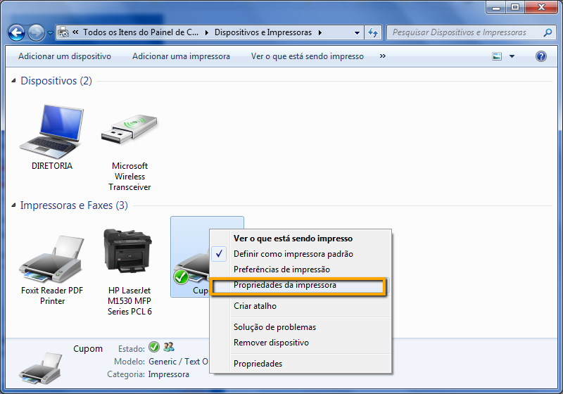

Na Aba **Comandos da Impressora** adicione o comando **<1B>C<01>** no campo **Iniciar trabalho de impressão**.

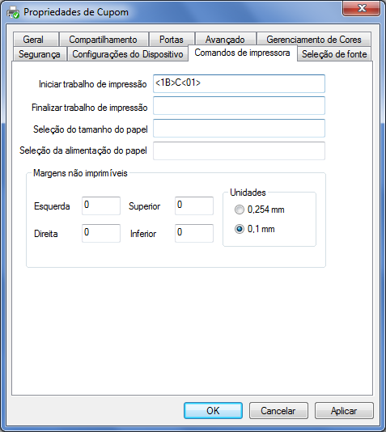

!!!! Impressora instalada com sucesso.