## Introdução

Firebird é um sistema gerenciador de banco de dados (SGDB) com suporte a sistemas com centenas de usuários simultâneos e bases de dados com centenas de gigabytes. Há suporte gratuito na Internet através de vários sites. O Firebird tem a maior base de usuários no Brasil, Rússia e Europa.

## Instalando o Firebird

Para iniciar a instalação do Firebird 2.5.2.26540 execute o instalador, selecione o idioma Português(Portugal) e clique em OK.

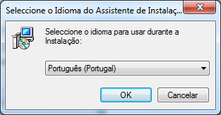

! Recomendamos utilizar a versão 2.5 ou superior.

!  A instalação deve ser feita na máquina servidor do banco de dados.

A tela do assistente de instalação do Firebird será exibida. Clique em **Seguinte** para prosseguir com a instalação.

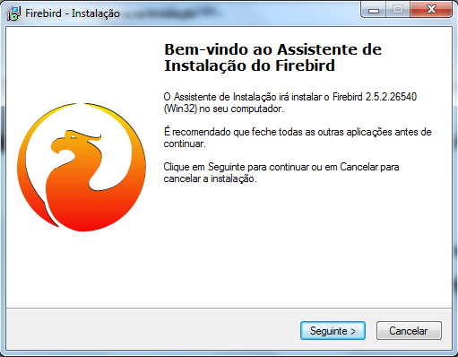

Na tela seguinte, selecione a opção, **Aceito o contrato** e em seguida clique em **Seguinte**.

Clique em **Seguinte**.

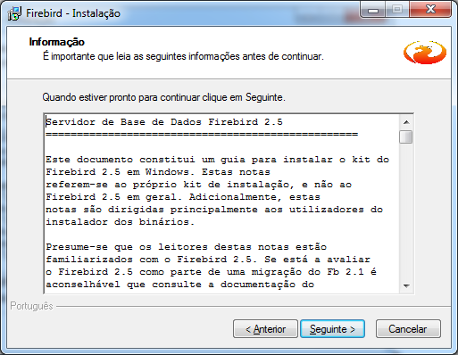

Clique em **Seguinte** sem alterar o diretório padrão de instalação.

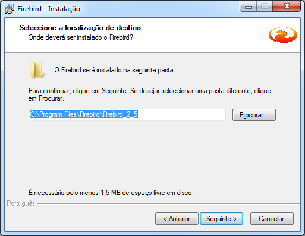

!! Recomendamos não alterar o diretório de instalação

Clique em **Seguinte** mantendo as opções sugeridas pelo instalador.

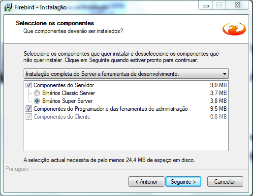

Clique em **Seguinte**.

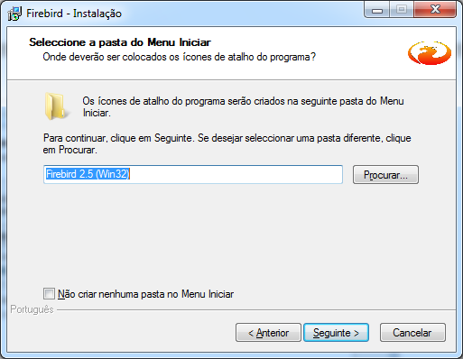

Após confirmar se TODAS as opções estão marcadas conforme na tela a seguir clique em **Seguinte** e **Instalar**.

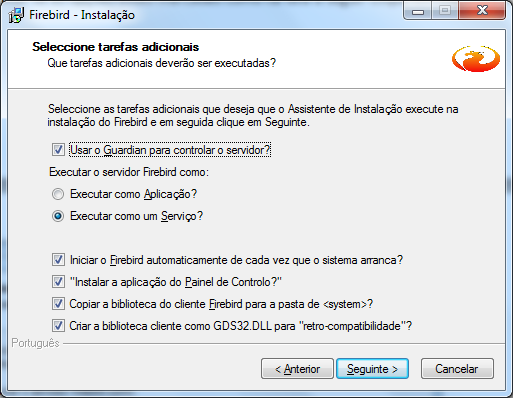

Aguarde a instalação.

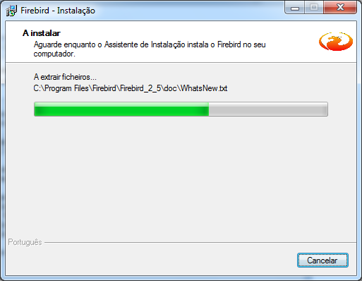

Clique em **Concluir**.

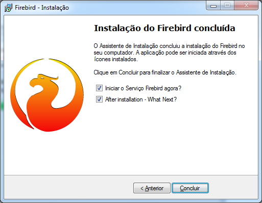

!!!! Se tudo ocorreu bem, o Firebird estará instalado e rodando no seu computador. 

## Criando Alias
Um passo muito importante após a instalação do servidor de banco de dados Firebird é a criação de um alias para os bancos de dados de nossas soluções. O Alias é uma maneira de facilitar a configuração do sistema com o banco de dados eliminando assim a necessidade de conhecer todo o caminho físico até o arquivo de banco de dados. 

O caminho físico do banco de dados não fica mais visível na aplicação cliente, e ainda permite maior flexibilidade para alteração física do banco de dados da aplicação quando necessário, sendo que utilizando alias só precisamos especificar o novo caminho do banco de dados na definição do alias sem a necessidade de alterarmos todas as configurações dos terminais.

Para configurar alias para bancos de dados no Firebird abra o arquivo aliases.conf no servidor com um editor de arquivo texto de sua preferência na pasta de instalação do Firebird.

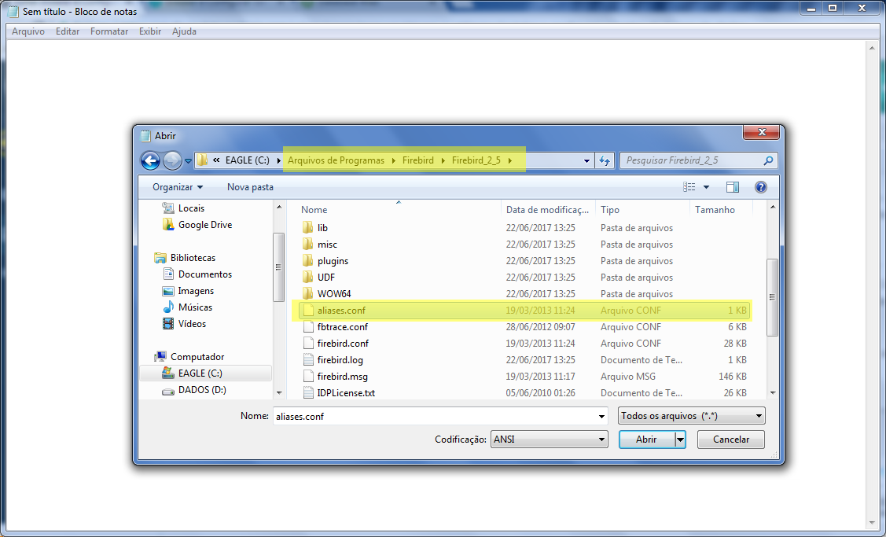

Se é a primeira vez que o Firebird está sendo instalado a seguinte estrutura será apresentada:

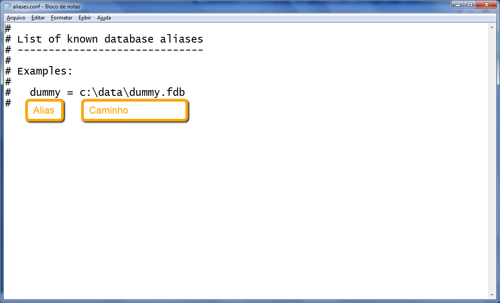

|Campo|Função|
|-----|------|
|Alias|Representa o apelido para o banco de dados a ser configurado|
|Caminho|Representa o caminho completo do arquivo de banco de dados|

! As informações contidas nas primeiras 8 (oito) linhas do arquivo são comentários porque cada linha começa com o caractere # (cerquilha).

Para configurar um novo alias acrescente uma linha em branco no arquivo e informe o Alias = Caminho como no exemplo a seguir:

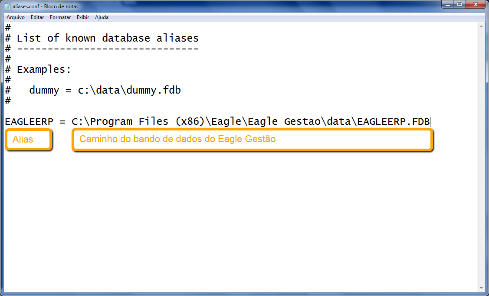

|Campo|Função|
|-----|------|
|EAGLEERP|Alias para o banco de dados do Eagle Gestão|
|C:\Program Files (x86)\Eagle\Eagle Gestao\data\EAGLEERP.FDB|Caminho do banco de dados do Eagle Gestão no servidor|

Quando houver mais de um banco de dados no mesmo servidor, cada um deve ser informado individualmente no arquivo de configuração conforme demonstra a figura abaixo:

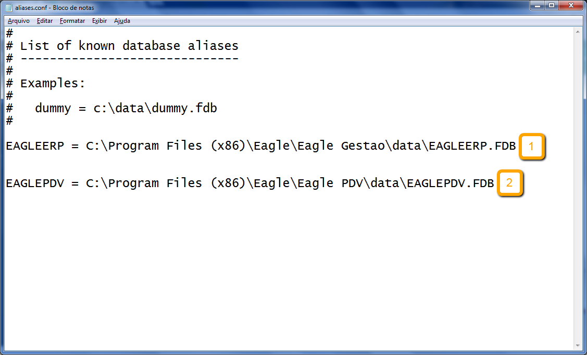

|Alias|Mapeamento|
|-----|------|
|1|Alias para o arquivo de banco de dados do Eagle Gestão|
|2|Alias para o arquivo de banco de dados do Eagle PDV|

!!!! Utilizando alias em nosso banco de dados nós fazemos com que nossa aplicação cliente faça referência ao alias para conectar ao banco de dados, não sendo mais necessário armazenar o caminho completo do arquivo de banco de dados.

## Liberando Porta no Firewall

Para que seja possível o acesso ao Firebird instalado no servidor de outros computadores sem que o Firewall do Windows esteja desativado, a porta de comunicação TCP do Firebird deve ser configurada para acesso remoto.

Para iniciar a configuração acesse o **Firewall do Windows** no Painel de Controle.

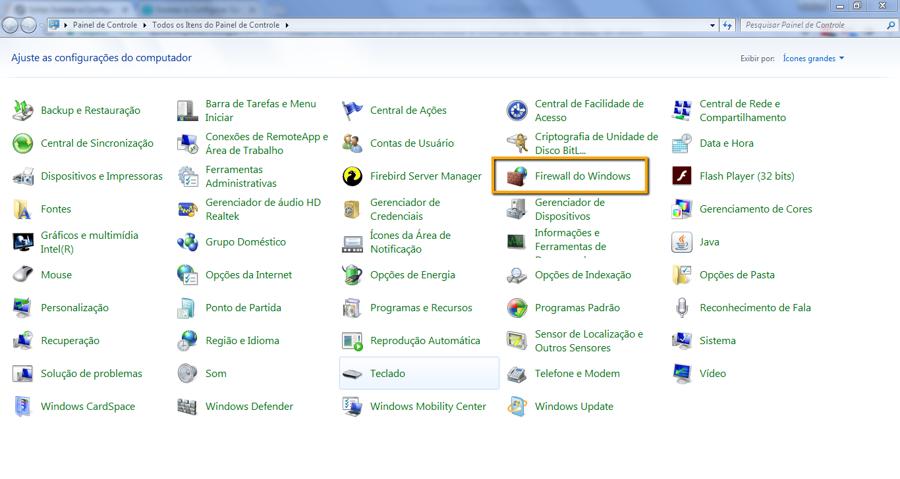

Dentro do Painel de Controle clique em **Configurações Avançadas**.

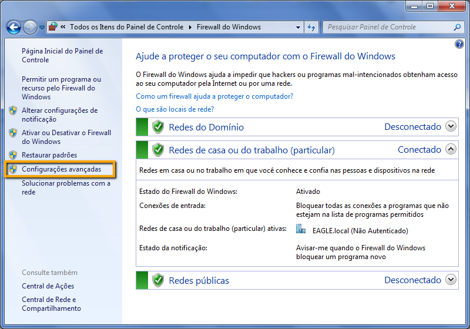

Após ser exibida a tela de Segurança Avançada selecione a opção **Regras de Segurança e Conexão** e clique em **Nova Regra**.

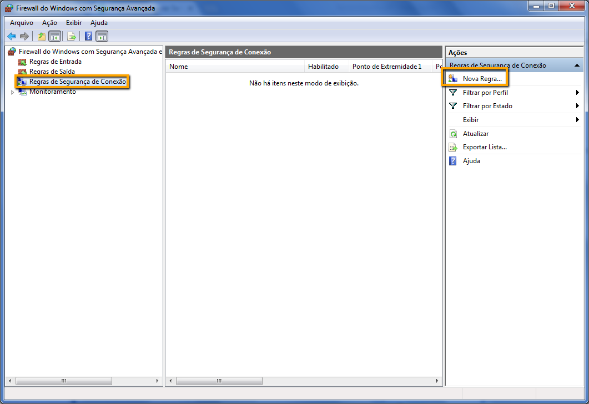

No assistente de Nova Regra de Segurança de Conexão selecione o tipo de regra **Personalizado** e logo em seguida **Protocolos e Portas**.

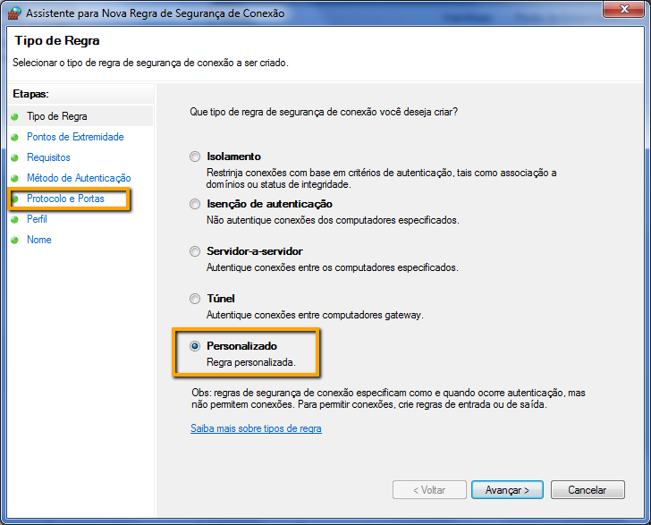

Na tela protocolos e portas deverão ser inseridas as informações conforme ilustra a imagem. Clique em **Avançar**.

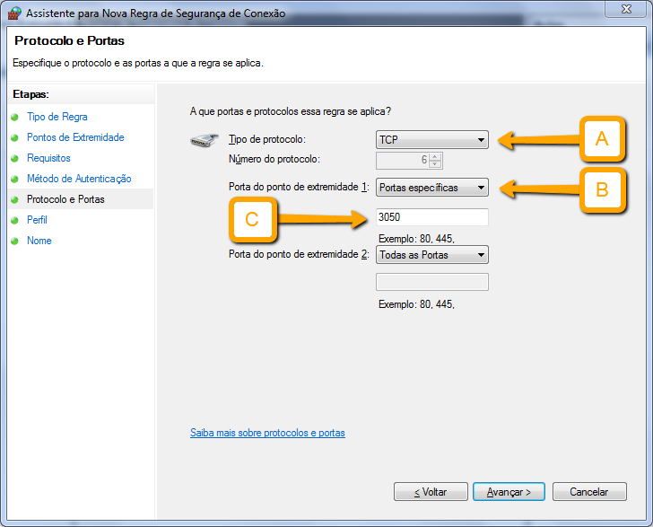

Verifique se todas as opções estão marcadas e clique em **Avançar**.

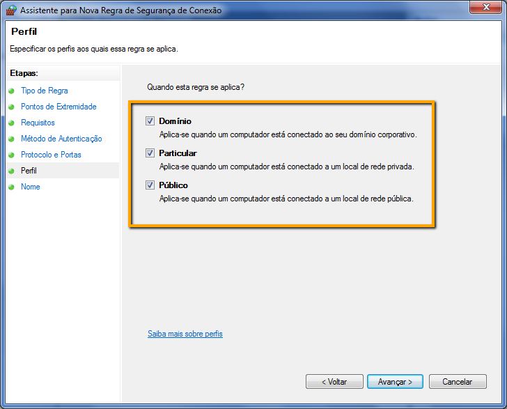

Especifique o nome e a descrição desta regra para Firebird e clique em **Concluir**.

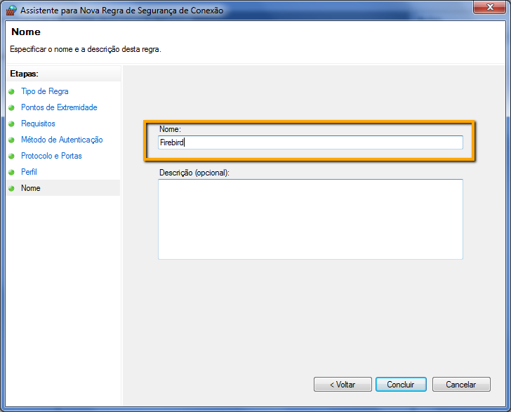

!!!! Regra criada.

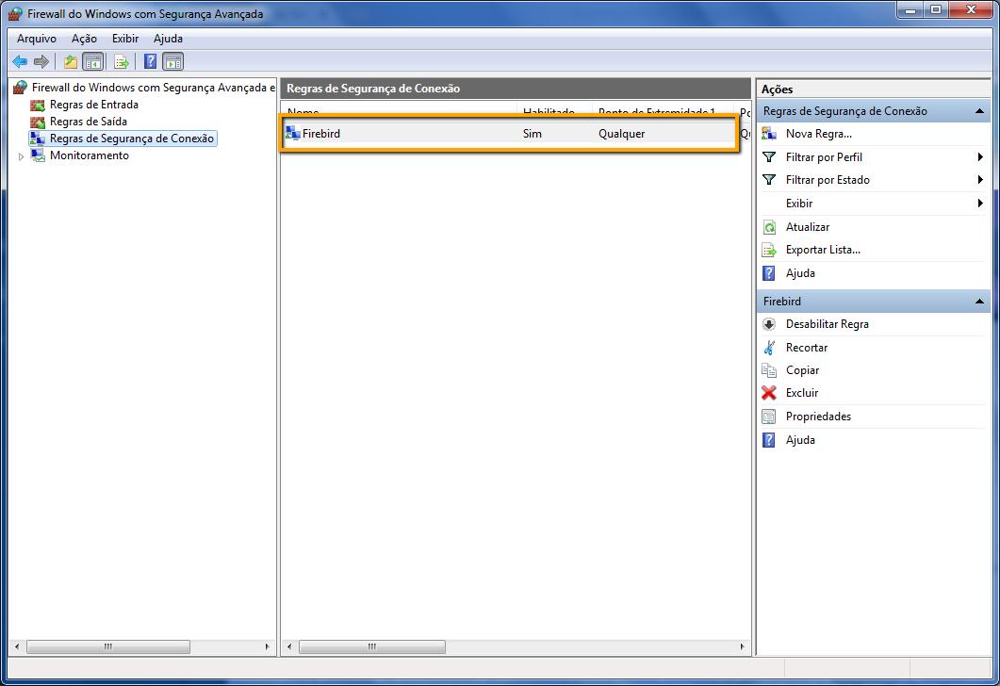

Ainda nas Configurações Avançadas no Firewall selecione a opção **Regras de Entrada** e clique em **Nova Regra**.

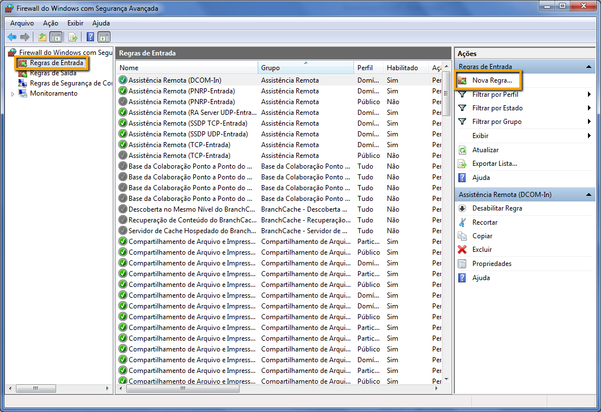

Na tela de **Tipo de regra** selecione a **Porta** e clique em **Avançar**.

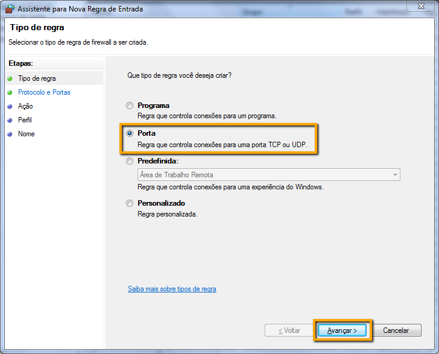

Em seguida marque a opção **TCP** e selecione a opção **Portas locais específicas** informando a porta 3050. Clique em **Avançar**.

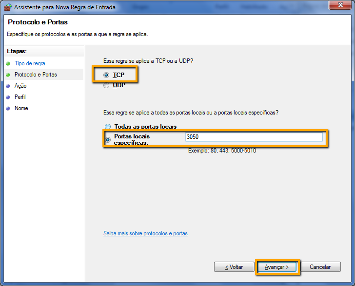

Marque a opção **Permitir Conexão** e clique em **Avançar**.

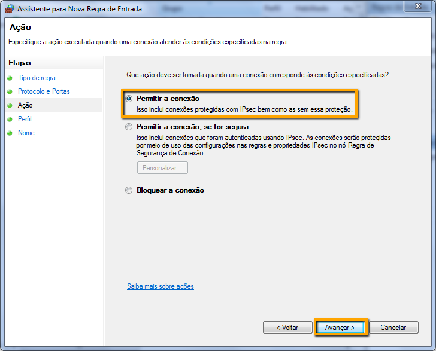

Verifique se todas as opções estão marcadas e clique em **Avançar**.

Especifique o nome e a descrição desta regra para Firebird e clique em **Concluir**.

!!!! Agora os terminais poderão acessar o banco de dados do servidor sem que o Firewall esteja desativado.

! Por questões de segurança, recomendamos que o Firewall do Windows esteja sempre habilitado e o software antivírus atualizado.