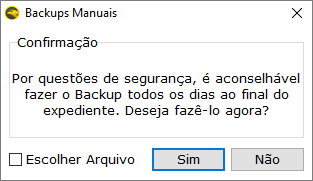
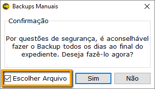
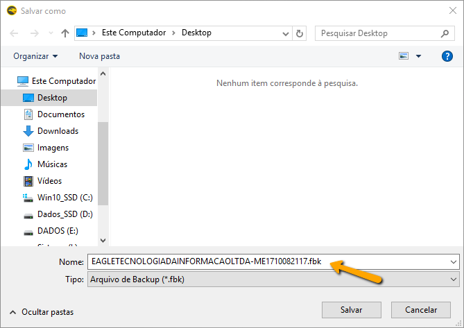
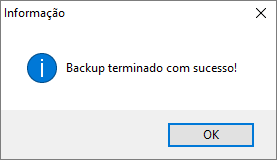

===

O backup é uma cópia de segurança de informações que se encontram armazenadas no computador. É uma boa prática de prevenção e é de extrema importância caso seja necessário restaurar ou recuperar determinados dados.

O sistema Eagle Gestão realiza automaticamente um backup durante a sua abertura, mas se o usuário desejar fazê-lo explicitamente, deverá acessar a opção Utilitários / Backups Manuais. Uma tela de confirmação será exibida e basta escolher a opção Sim para que o Sistema faça a cópia de segurança na pasta padrão.

A opção “**Escolher Arquivo**”, exibida na tela de confirmação de backup, permite ao usuário escolher o local e o nome do arquivo de backup. Esta opção poderá ser usada, por exemplo, se ele desejar fazer uma cópia de segurança num pendrive ou CD.

  
  
Ao final do processo é exibida uma tela de confirmação do backup.
  
 
  
! O Sistema gera automaticamente um nome para o arquivo de backup, mas o usuário poderá alterá-lo, se necessário.