## Introdução

O módulo de Serviços é mais um recurso disponibilizado pelo sistema Eagle Gestão, proporcionando à empresa uma maneira mais eficiente de administrar a demanda de ordens de serviços.
A Ordem de Serviço dedica-se ao gerenciamento dos serviços prestados, possibilitando o controle de entrada, mão de obra, peças ou equipamentos utilizados, e status dos serviços dentro da empresa, proporcionando aos seus clientes um atendimento prático e satisfatório.

 
## Configuração

Inicialmente são configurados os tipos de serviços que a empresa fornece, além do status, subtipo e outras informações que se acharem necessárias.

O sistema já é configurado, como padrão, com três tipos de serviços - a Ordem de Serviços, a Visita Técnica e a Recarga de Cartuchos.
Se houver necessidade, podem ser excluídos os tipos de serviços não utilizados ou, até mesmo, reconfigurados, de acordo com a necessidade de cada empresa e seu ramo de negócio.

Para iniciar a configuração, acesse o menu **Serviços / Tipos de Serviços**.

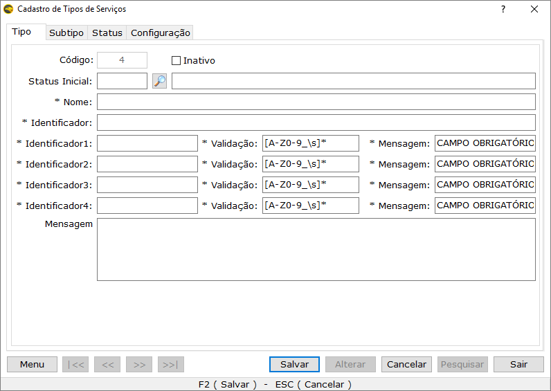

**Guia "Tipo"**

Nesta seção deve-se preencher as informações gerais que representam o Serviço a ser prestado pela empresa.

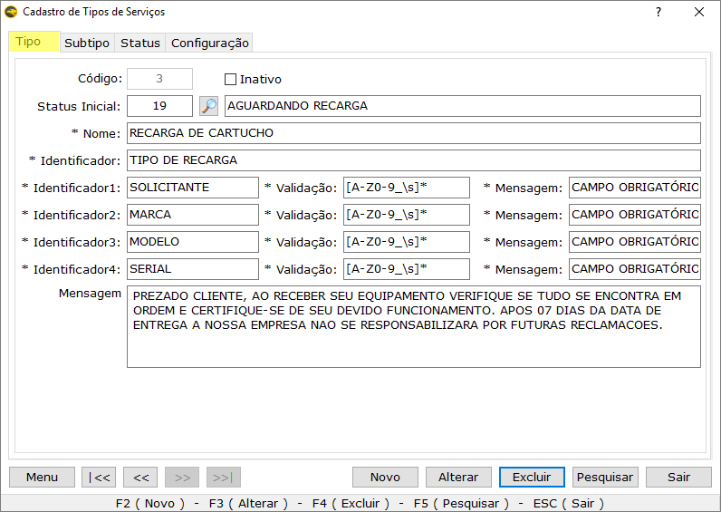

|Campo|Função|
|-----|------|
|Código|Gerado automaticamente para cada cadastro.|
|Inativo|Deixar o registro desativado.|
|Status Inicial|Representa o estado inicial padrão para o Tipo de Serviço em questão.|
|Nome|Nome do serviço.|
|Identificador|Representa o Identificador padrão para o Serviço. Este será o primeiro identificador a ser apresentado na ordem de serviço impressa.|
|Identificador 1,2,3 e 4|Esses identificadores representam o complemento do cadastro do serviço. São configurados de acordo com a demanda de informações para o tipo de serviço, ou seja, cada tipo de serviço poderá conter identificadores distintos. Todos são impressos na ordem de serviço.|
|Validação 1, 2, 3 e 4|Aqui são definidos quais os critérios devem ser utilizados, para que o sistema identifique as restrições de preenchimento. É possível definir, através de expressão regular, se o campo aceita apenas letras ou apenas números, por exemplo.|
|Mensagem 1, 2, 3 e 4|Define-se quais as mensagens serão exibidas durante o cadastro dos Identificadores.|
|Mensagem|Neste campo pode ser inserido algum tipo de mensagem ao cliente que será exibida na ordem de serviço - aviso, advertência, agradecimentos, etc..|

**Guia "SubTipo"**

Aqui deve-se inserir todos os itens que compõem o Serviço.

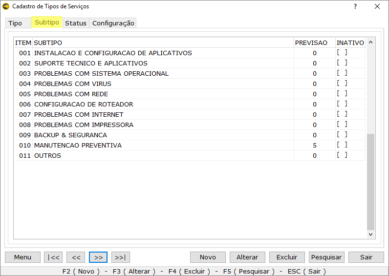

|Campo|Função|
|-----|------|
|Item|Código sequencial do subtipo cadastrado.|
|SubTipo|Descrição do item que compõe o Tipo de Serviço.|
|Previsão|Tempo estimado para a conclusão do serviço.|
|Inativo|Opção para inativar o cadastro, fazendo com que o mesmo não mais apareça em pesquisas durante as aberturas das Ordens de Serviço.|

**Guia "Status"**

O status são os estágios do processo que ocorrem durante o atendimento, considerando todo o ciclo de vida do serviço prestado.

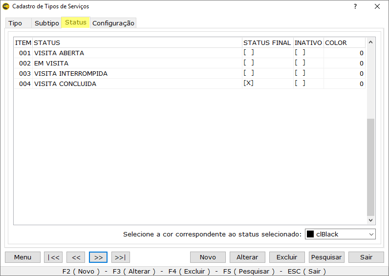

|Campo|Função|
|-----|------|
|Item|Código sequencial do status cadastrado.|
|Status|Nome do Status.|
|Status Final|Identifica se o status representa, ou não, o estágio final do processo.|
|Inativo|Desativa o registro do status, fazendo com que o mesmo não apareça durante a utilização do Tipo de Serviço.|
|Color|A cor de cada status pode ser configurada para facilitar a identificação do mesmo. Na parte inferior da tela seleciona-se a cor correspondente ao status selecionado.|

**Guia "Configuração"**

Na guia Configuração é possível indicar determinados campos como obrigatórios. Esses campos representam os indicadores da Ordem de Serviço.

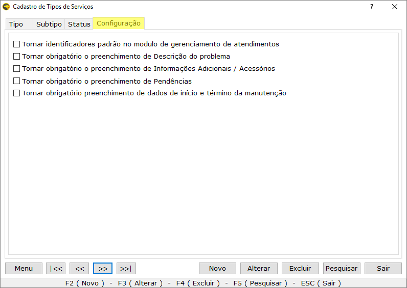

### Configuração dos Usuários

Para que o usuário consiga utilizar o Módulo de Serviços, é preciso que o seu cadastro seja vinculado como "Técnico".
O administrador do sistema deverá acessar o menu Cadastros / Funcionários / Cadastro de Funcionários e marcar a opção correspondente.

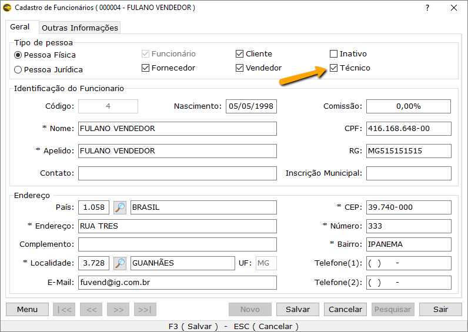

 
## Abertura de Atendimentos

Para realizar um novo atendimento, veja os passos descritos abaixo:

1. Acesse o menu Serviços / Gerenciador de Atendimentos.
2. Clique sobre o botão "Novo".
3. Insira os dados de usuário e senha do atendente.

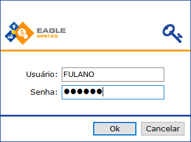

4. Preencha os campos correspondentes.

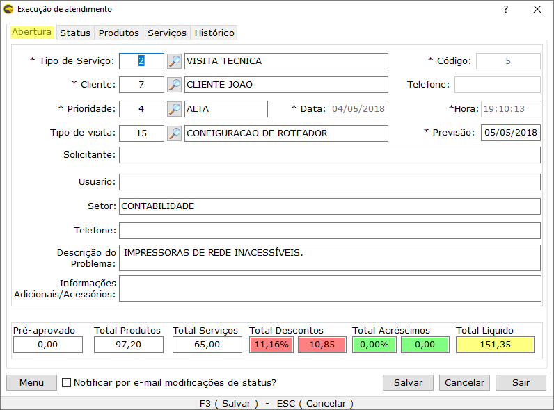

|Campo|Função|
|-----|------|
|Tipo Serviço|Selecionar o serviço correspondente.|
|Código|Gerado automaticamente.|
|Cliente|Informar o cliente (se o mesmo não estiver na base de dados, basta utilizar o botão Menu / Cadastrar Clientes).  Se o cliente estiver inadimplente, o sistema irá bloquear o cadastro da Ordem de Serviço, exceto com a senha do gerente, onde será possível prosseguir com o cadastro.  Neste momento é possuir verificar o histórico de compras e pagamentos do cliente selecionado. Basta acessar o botão Menu / Controle Analítico de Clientes.|
|Telefone|Contato do cliente.|
|Prioridade|Grau de urgência do atendimento.|
|Data / Hora|Momento em que o atendimento é cadastrado. Esta informação é inserida automaticamente.|
|Previsão|Data prevista para efetuar o serviço.|
|Descrição do Problema|Detalhes principais do serviço a ser efetuado.|
|Informações Adicionais / Acessórios|Possíveis observações e dados complementares.|
|Pré-Aprovado|Valor aprovado previamente.|
|Total Produtos|Soma do(s) valor(es) do(s) produto(s) informado(s) na aba "Produtos".|
|Total Serviços|Valor total do(s) serviço(s) informado(s) na aba "Serviços".|
|Total Descontos / Total Acréscimos|Possíveis valores de abatimento ou de complemento.|
|Total Líquido|Valor total final, considerando acréscimos ou descontos.|

! Os campos intermediários podem ser diferentes para cada tipo de atendimento. Veja os detalhes em [Configuração](#configurao). 

5. Clique em Salvar e escolha se deseja imprimir, ou não, o atendimento.

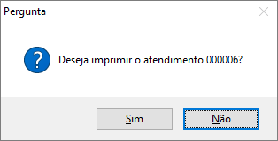

 
## Execução do Atendimento

1. Para dar continuidade ao atendimento, basta selecioná-lo e utilizar o botão Menu / Alterar Atendimento (atalho F8) ou apenas clicar duas vezes sobre o mesmo.

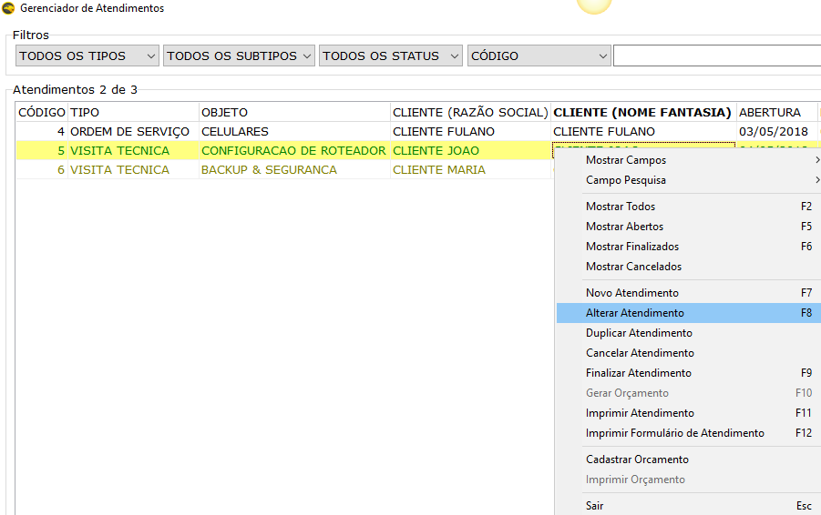

2. Neste momento, o sistema abre a tela de consulta para selecionar o funcionário técnico responsável pelo serviço.

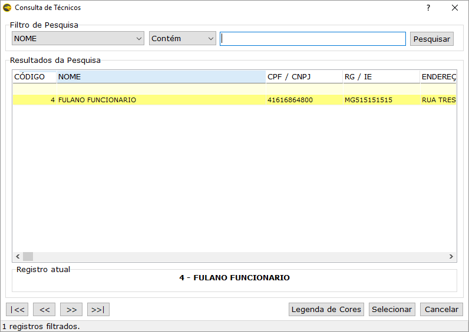

3. Após a constatação do problema, o técnico irá preencher os campos de diagnóstico e solução técnica e trocará o status novamente.

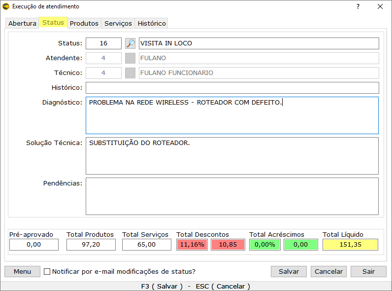

4. Se houver a necessidade de incluir produtos para a execução da tarefa, utilize a aba "Produtos" e selecione-os. Utilize a barra de espaços ou clique duas vezes para abrir a consulta de produtos.

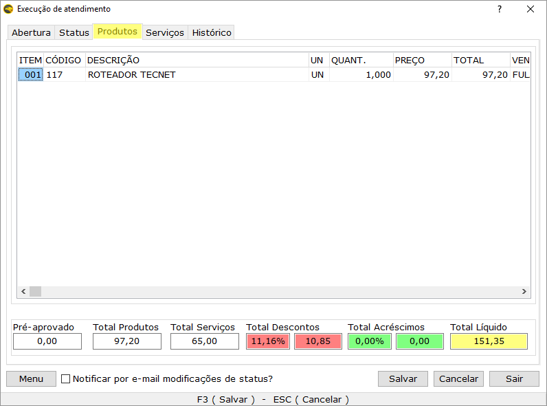

Se o produto não estiver na base de dados, será possível cadastrá-lo imediatamente, acessando Menu / Cadastrar Produtos/Serviços.

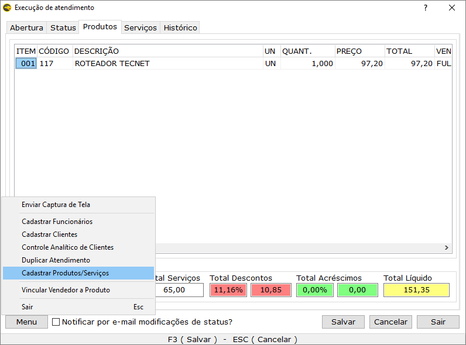

5. Selecione a aba "Serviços" e informe o(s) serviço(s) necessário(s). Utilize a barra de espaços ou clique duas vezes para abrir a tela de consulta. Para cadastrar um novo serviço, basta acessar Menu / Cadastrar Produtos/Serviços.

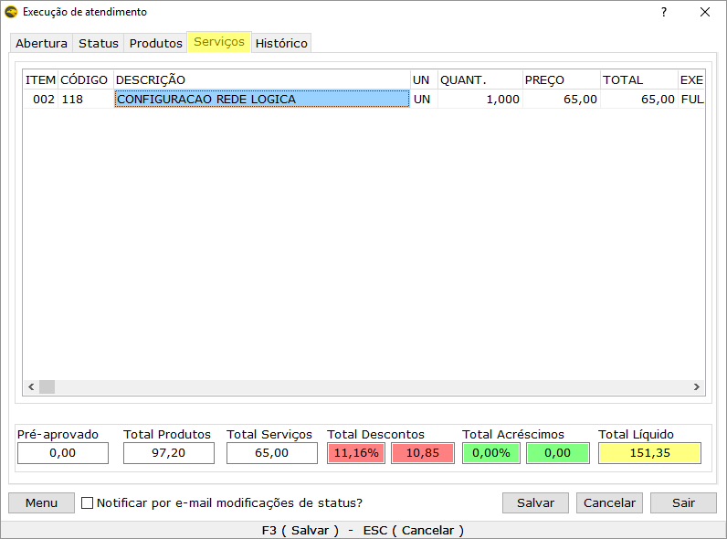

6. A cada situação de execução do serviço é necessário que seja feita a alteração do status no sistema. Na aba histórico estão registradas todas as modificações realizadas no atendimento.

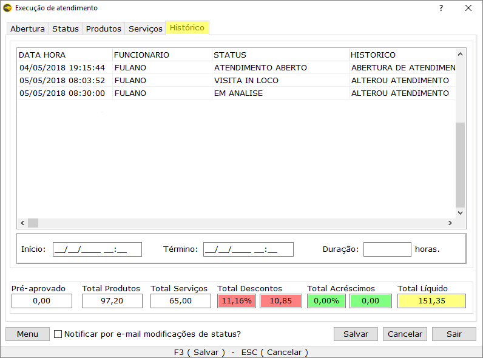

 
## Finalização do Atendimento

A finalização de um atendimento é de extrema importância e o seu registro deve ser feito para que não haja pendências no sistema e o histórico fique correto.

1. Após a conclusão do serviço e a aprovação do cliente, abra o atendimento e utilize a guia "Status" para indicar a situação atual.

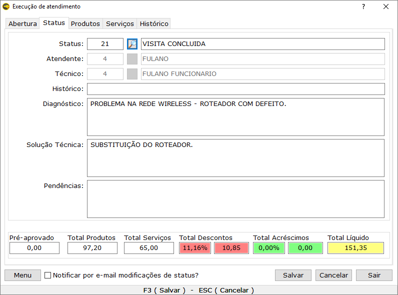

2. Confira o histórico na aba correspondente.

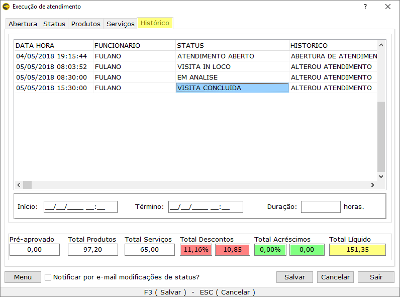

3. Para gerar o documento da Ordem de Serviço, selecione o atendimento e clique com o botão direito do mouse, escolhendo a opção "Imprimir Atendimento".
O botão "Imprimir", localizado na barra inferior, ou a tecla de atalho F11 também poderão ser utilizados para este fim.

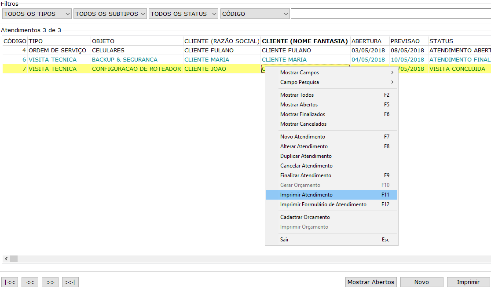

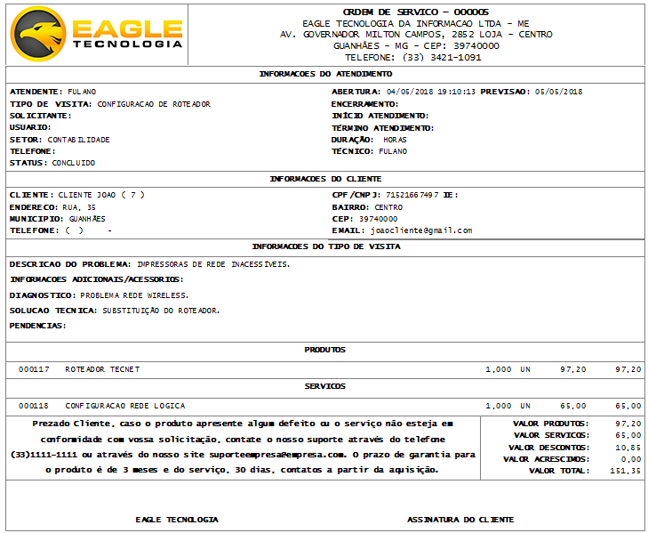

4. Para finalizar o processo, selecione a Ordem de Serviço e acesse Menu / Finalizar Atendimento, ou utilize o atalho F9.

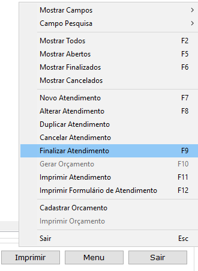

5. Neste momento, entre com o login e senha do técnico responsável.

6. Confirme a mensagem para finalizar o atendimento.

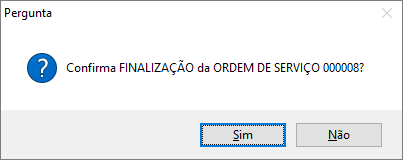

7. Depois de confirmar a finalização do atendimento, o sistema irá perguntar sobre a criação de um orçamento. 
Este orçamento é feito para ordens que possuem serviços ou produtos, com valores a serem pagos.

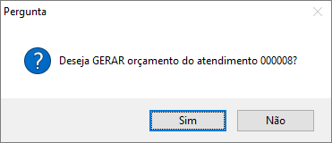

8. O orçamento poderá ser visualizado no menu principal Vendas / Orçamentos.

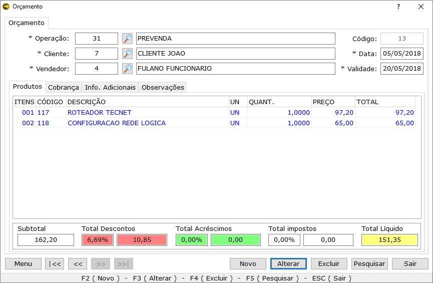

! Após a finalização, não será mais possível efetuar qualquer alteração no Atendimento.

 
## Gerenciador de Atendimentos

No Gerenciador de Atendimentos estarão todas as Ordens de Serviço cadastradas para consulta. Podem ser facilmente localizadas através dos filtros disponíveis. 

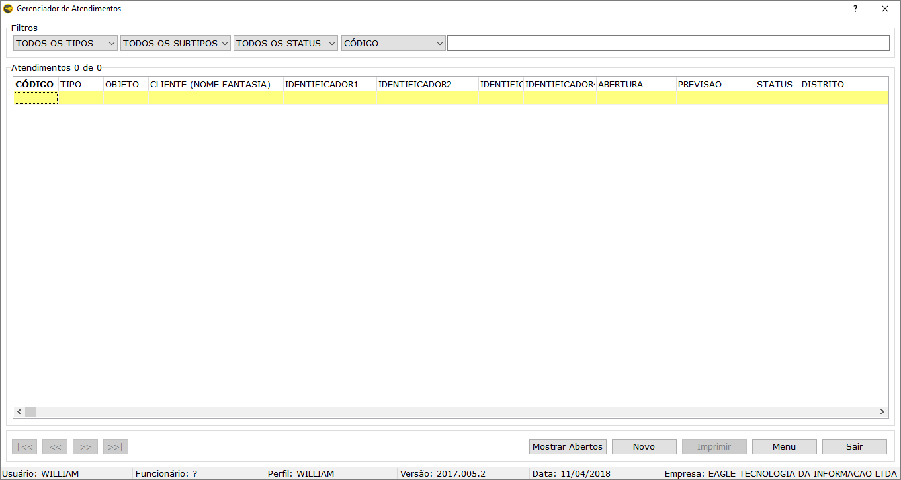

### Menu de Atendimentos

O usuário contará com diversos recursos para gerenciar as demandas de serviço. São eles:

* Mostrar Campos - Configuração que possibilita definir quais os campos dos atendimentos devem aparecer na tela do gerenciador. Estes campos representam os atributos dos chamados.

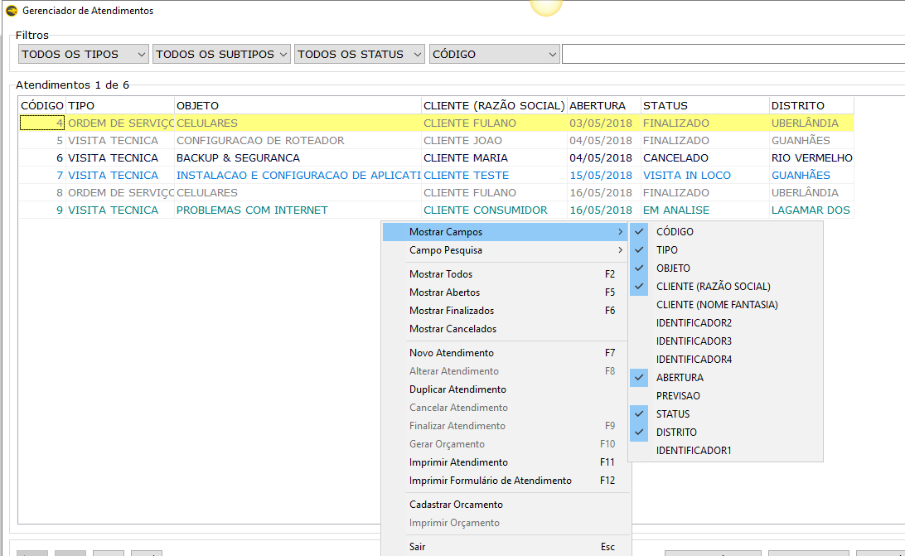

* Campo Pesquisa - É possível definir qual atributo será pesquisado no campo de filtragem, na parte superior da tela.

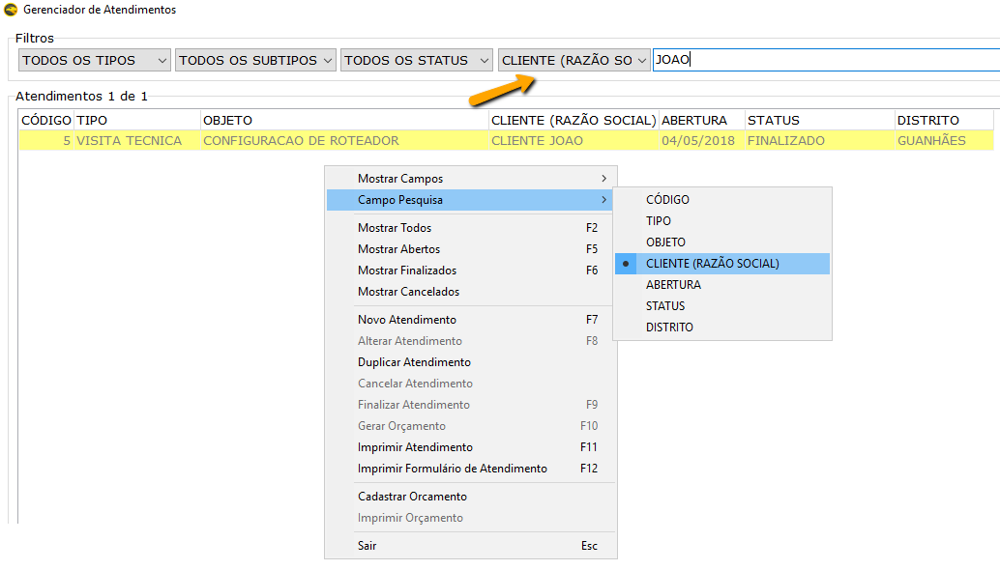

* Mostrar Todos - Mostra todos os atendimentos, independente do status atual. Utilize a tecla F2 como atalho.

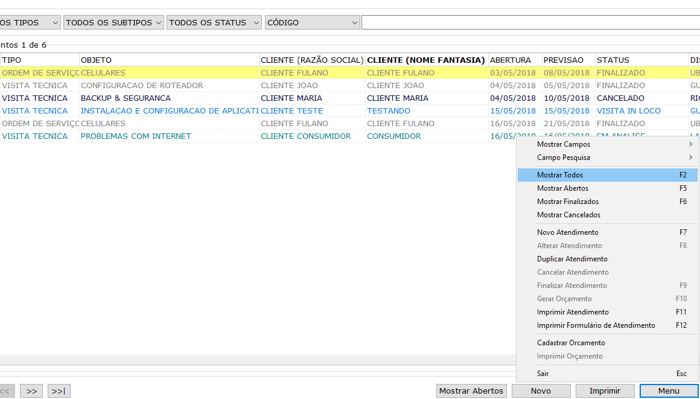

* Mostrar Abertos - Exibe apenas os atendimentos abertos - tecla de atalho F5.
* Mostrar Finalizados - Somente os atendimentos finalizados são exibidos - atalho F6.
* Mostrar Cancelados - Os atendimentos cancelados são exibidos através desta opção. Nenhum atendimento pode ser excluído.
* Novo Atendimento - Abertura de um novo atendimento - atalho F7.
* Alterar Atendimento - Utilizado para modificar o status do atendimento ou para inserir outras informações - atalho F8.
* Duplicar Atendimento - Utilizado para duplicar a ordem de serviço (e alterar apenas determinados campos). Facilita o cadastro de demandas semelhantes.
* Cancelar Atendimento - Após o cancelamento do atendimento não é mais possível realizar alterações.
* Finalizar Atendimento - Finaliza o ciclo do atendimento cadastrado - atalho F9. Após este processo, não é possível realizar modificações.
* Gerar Orçamento - Função utilizada após a finalização do atendimento e que proporciona a facilidade na geração do orçamento a partir da abertura do atendimento - atalho F10.
* Imprimir Atendimento - Impressão do atendimento - atalho F11.

* Imprimir Formulário de Atendimento - Função utilizada para serviços externos, onde se imprime o formulário para a realização do atendimento no local. Tecla de atalho F12.

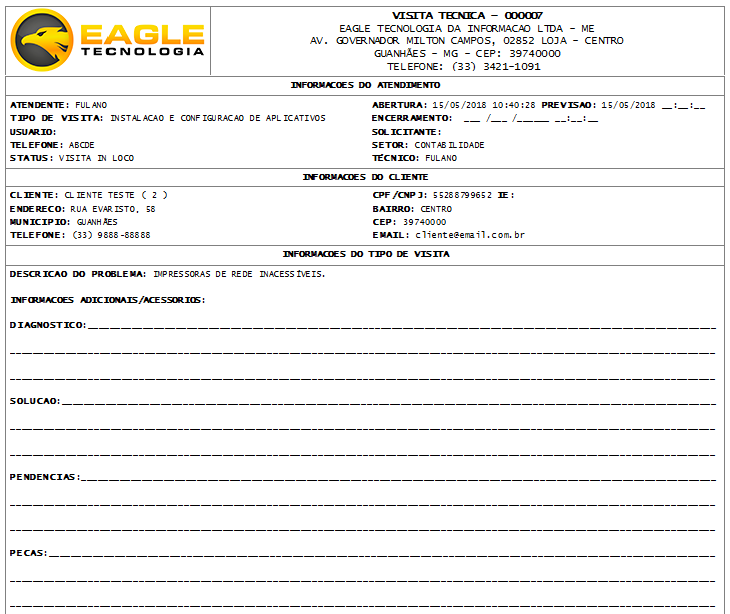

* Cadastrar Orçamento - A Funcionalidade permite o cadastro do orçamento manualmente antes da finalização do atendimento. Orçamento criado no modulo Vendas / Orçamentos.
* Imprimir Orçamento - Permite a Impressão do Orçamento.
* Sair - Fecha a janela do Gerenciador.

 
## Relatórios de Serviços

O sistema conta com diversos relatórios relativos aos Atendimentos registrados, independente do status atual. Para consultá-los, acesse o menu principal "Relatórios" e o submenu "Serviços".

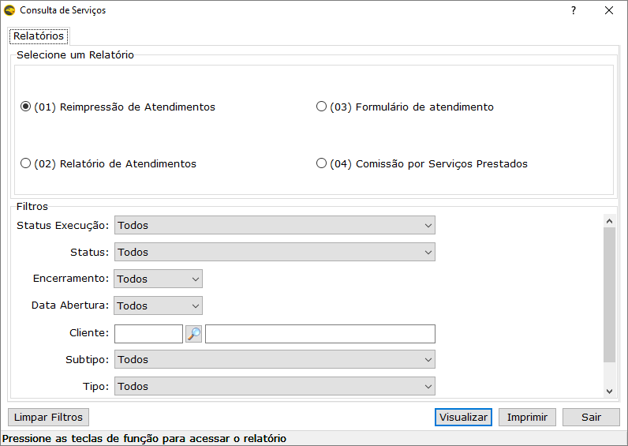

|Campo|Função|
|-----|------|
|Reimpressão de Atendimento|Com esta opção, e com o auxílio dos filtros, é possível reimprimir um ou vários serviços registrados. Equivale ao botão "Imprimir", do Gerenciador de Atendimentos.|
|Relatórios de Atendimentos|Apresenta uma relação contendo todos os atendimentos realizados, em execução ou cancelados, de acordo com os filtros de pesquisas selecionados.|
|Formulário de Atendimento|Através desta opção, é possível imprimir formulários para atendimento externo. Funcionalidade encontrada, também, no Gerenciador de Atendimentos - Menu / Imprimir Formulário de Atendimento.|
|Comissão por Serviços Prestados|Este Relatório exibe a comissão dos serviços prestados. Há de se observar que a comissões deverão estar previamente configuradas nos cadastros dos Serviços.|

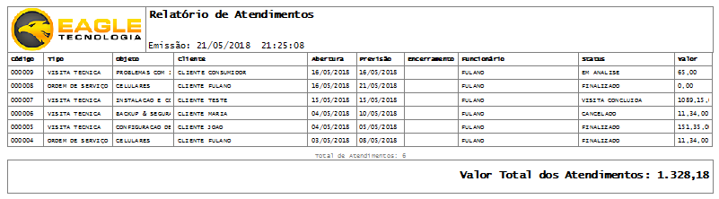