===

## Introdução

O boleto bancário é um documento que representa títulos de cobrança e é amplamente utilizado porque apresenta uma grande praticidade e flexibilidade de pagamento, por parte do sacado (aquele que paga o boleto).
O módulo de boletos é mais uma ferramenta disponibilizada pelo sistema Eagle Gestão, que proporciona à empresa a facilidade na geração de boletos bancários, previamente aprovados pelo Banco.
 O sistema conta com uma interface intuitiva que possibilita a rápida geração dos boletos, através das vendas, das contas a receber, dos contratos e, também, o recebimento automático dos boletos, que ocorre por meio dos arquivos de retorno. 
 Os relatórios também são essenciais e proporcionam um gerenciamento mais apurado sobre as emissões, as baixas, os valores a receber e recebidos.

 
## Configuração do Sistema

A utilização do módulo boletos requer determinadas configurações realizadas no sistema. Somente após o cadastro da conta corrente, do meio de pagamento e da carteira de cobrança, será possível gerar os boletos.  É importante observar que muitas informações inseridas nessa configuração, **são fornecidas pela agência bancária**. São elas:

1. Dados da Conta Corrente:
* Número do Banco
* Número da Agência
* Número da Conta
* Código do Cedente

2. Dados da Carteira de Cobrança:
* Número da Carteira
* Variação
* Convênio
* Espécie do Documento
* Percentual de Multa

3. Padrão do arquivo de remessa - CNAB 240 ou CNAB 400.

 
### Cadastro de Contas Correntes

Acesse a tela de conta corrente através do caminho Cadastros / Financeiro / Cadastro de Contas Correntes.
Lembrando que os campos Banco, Agência, Conta e Código do Cedente devem ser adquiridos junto ao banco.

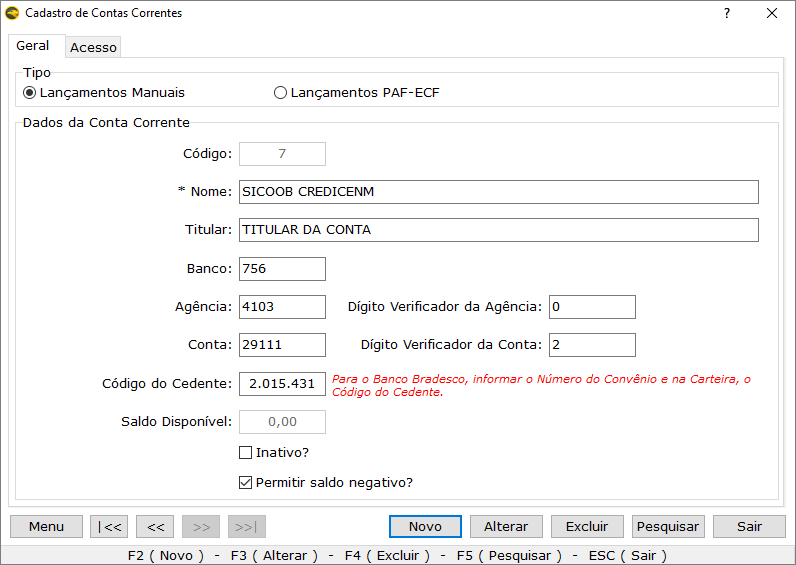

! Para mais detalhes sobre o cadastro de Contas Correntes acesse o [Módulo Cadastros - Conta Corrente](https://ajuda.eagletecnologia.com/manuais/eagle-gestao/modulo-cadastros#cadastro-de-contas-correntes "Módulo Cadastros - Conta Corrente").
 
### Cadastro de Meios de Pagamento

Acesse Cadastros / Financeiro / Cadastro de Meios de Pagamento. Cria-se, no sistema, um meio de pagamento denominado Boleto Bancário. Esse meio de pagamento será utilizado na carteira de cobrança cadastrada, para que seja possível a emissão de boletos.

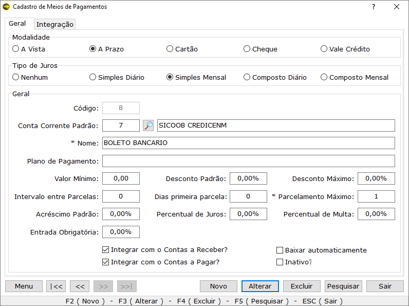

! Veja mais detalhes sobre o cadastro através do Manual de [Cadastros de Meios de Pagamento](https://ajuda.eagletecnologia.com/manuais/eagle-gestao/modulo-cadastros#cadastro-de-meios-de-pagamento).

 
### Cadastro de Carteiras de Cobrança

A Carteira de Cobrança é um recurso utilizado no sistema para possibilitar a emissão de boletos bancários e ela representa um serviço contratado junto ao banco.

Os dados da carteira de cobrança devem ser solicitados junto ao banco onde serão homologados os boletos. As informações nela contidas aparecem na impressão do boleto e devem estar corretas para comprovar a veracidade do documento. Deve-se conferir junto ao banco se sua carteira está autorizada a enviar e receber arquivos e qual remessa será utilizada: padrão CNAB 240 ou CNAB 400.

Acesse Cadastros / Financeiro / Carteiras de Cobrança para inserir as informações repassadas pelo banco.

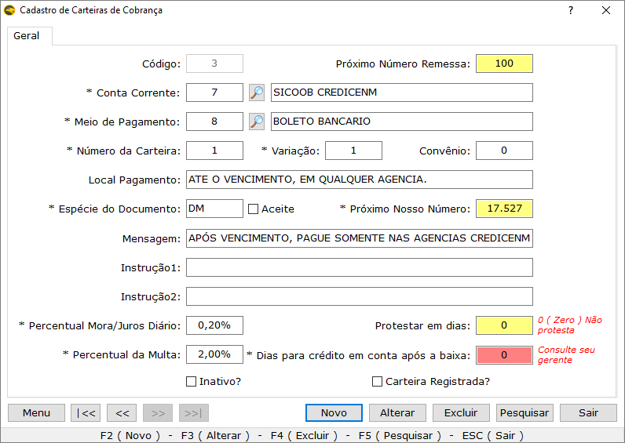

! O campo "Meio de Pagamento" deve estar selecionado como "Boleto Bancário" para que a emissão do boleto seja realizada.

! Para mais detalhes, acesse o Manual de Cadastros, na seção [Carteiras de Cobrança](https://ajuda.eagletecnologia.com/manuais/eagle-gestao/modulo-cadastros#cadastro-de-carteiras-de-cobrana).

 
## Gerar Boletos - Vendas

O sistema Eagle Gestão disponibiliza diversas maneiras para a geração de Boletos Bancários. A tela principal para o gerenciamento de boletos é acessado através do Financeiro / Contas a Receber / Gerenciador de Boletos.

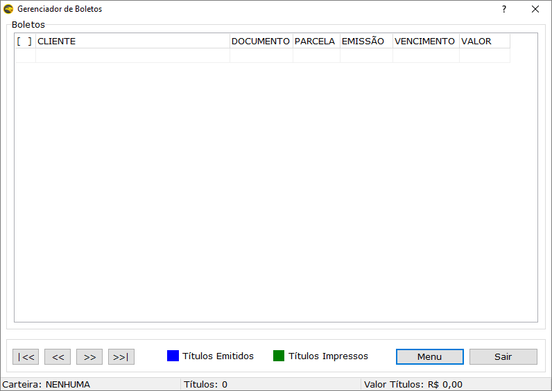

Uma das possibilidades de emissão de boletos se dá através da realização de uma venda:
1. Faça uma venda acessando o caminho **Vendas / Orçamentos**.
2. Escolha uma forma de pagamento a prazo, preferencialmente o meio de pagamento “**boleto bancário**”. Escolha também a conta corrente para a qual o boleto será gerado.

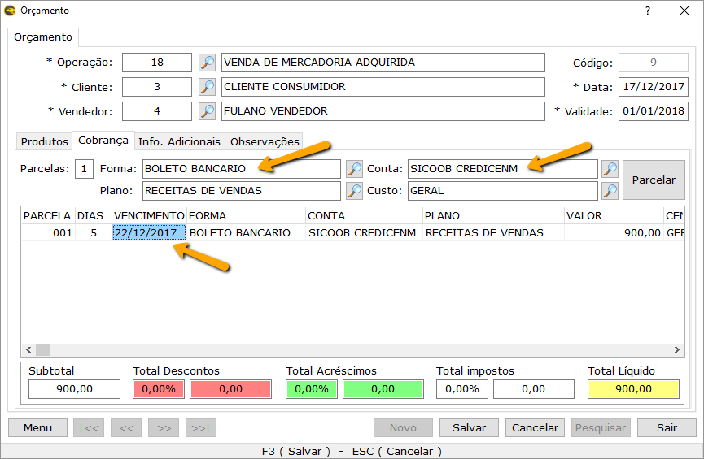

3. Confira a data de vencimento, o valor e **fature** a venda normalmente, através de Vendas / Faturamento.  Para mais detalhes sobre Orçamentos e Vendas, acesse o [Manual de Vendas e Faturamento](https://ajuda.eagletecnologia.com/manuais/eagle-gestao/modulo-vendas-e-faturamento "Vendas e Faturamento").

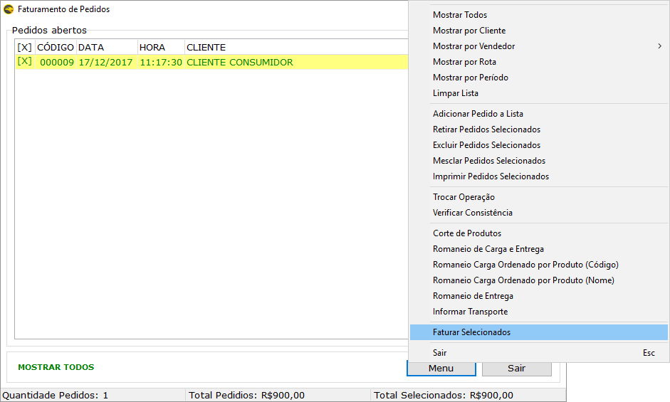

! O boleto gerado poderá ser visualizado através da **Impressão pela Carteira de Cobrança**, **Impressão em 2ª Via** ou **Impressão através da Consulta de Boletos**. Acesse o tópico [**IMPRIMIR BOLETOS**](#imprimir-boletos) e veja o passo a passo.

 
## Gerar Boletos - Contas a Receber

Outra possibilidade de gerar boletos é através das contas a receber. Mesmo não tendo escolhido o meio de pagamento e a conta corrente referentes à emissão de boletos, ainda será possível gerá-lo. É importante que o cliente tenha o seu cadastro completo - endereço, contatos e documentos.

### Selecionar Cliente por Contas a Receber

1. Clique em Financeiro / Contas a Receber / Gerenciador de Boletos.
2. Clique em Menu e escolha a opção "Gerador de Boletos" ou utilize a tecla F11.
3. Vá em Menu e escolha a opção "**Selecionar Cliente por Conta a Receber**" ou tecle F5.
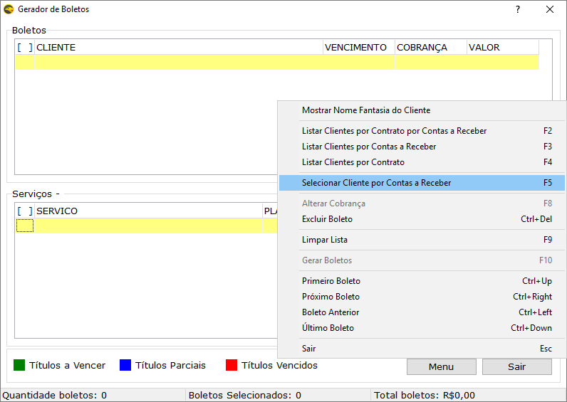

4. Selecione o Cliente e a conta correspondente.
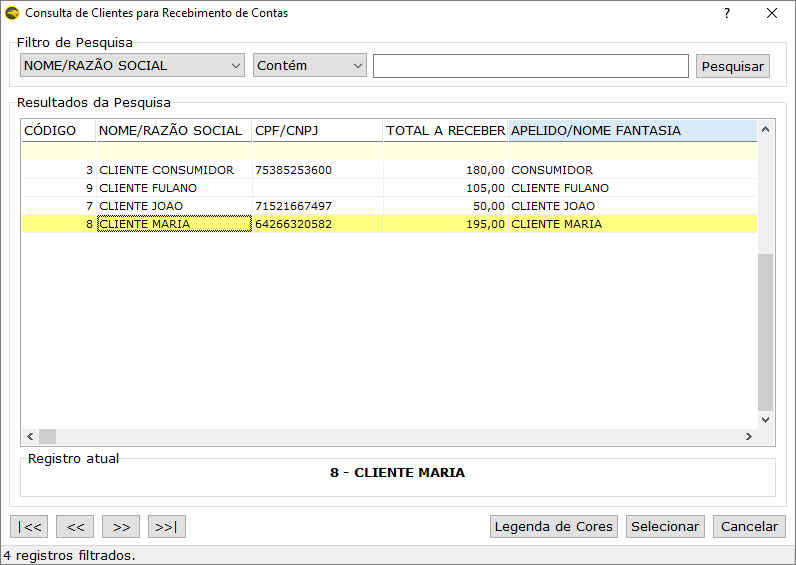

5. Selecione e confirme o meio de pagamento "Boleto Bancário".

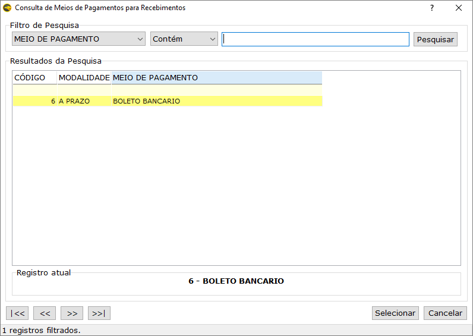

6. Selecione o cliente e a conta correspondente, utilizando a primeira coluna (entre colchetes). Nesta etapa também é possível selecionar vários documentos do mesmo cliente para emissão do boleto com o total das contas.
 Conta(s) correspondentes")

7. Clique em Menu / Gerar Boletos ou pressione F10.

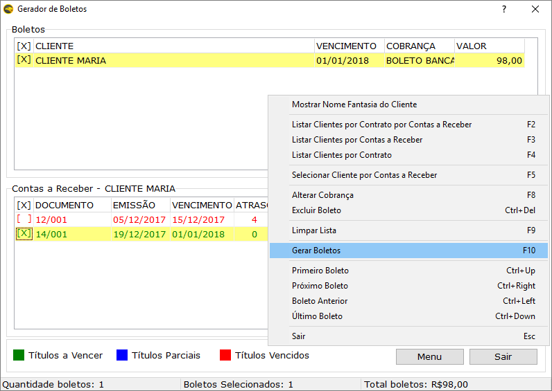

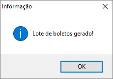

! O(s) boleto(s) gerado(s) poderá(ão) ser visualizado(s) através da **Impressão pela Carteira de Cobrança**, **Impressão em 2ª Via** ou **Impressão através da Consulta de Boletos**. Acesse o tópico [**IMPRIMIR BOLETOS**](#imprimir-boletos) e veja o passo a passo.

 
### Listar Clientes por Contas a Receber

Nesta seção é possível gerar, ao mesmo tempo, boletos para todos os clientes selecionados que tenham contas pendentes.

1. Acesse Financeiro / Contas a Receber / Gerenciador de Boletos
2. Clique em Menu e vá em Gerador de Boletos (F11).
3. Clique em Menu e vá em Listar Clientes por Contas a Receber ou pressione F3.

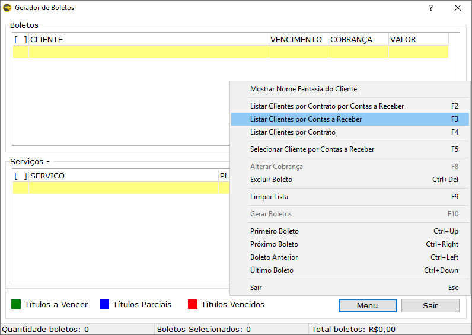

4. Selecione o meio de pagamento "Boleto Bancário".

5. Selecione os clientes e as contas a receber correspondentes. O sistema exibe, na barra de status, o número de boletos e o valor total de todas as contas selecionadas.

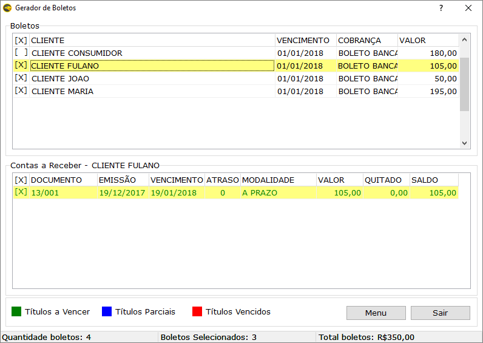

6. Verifique as datas de vencimento e faça as alterações necessárias, clicando uma vez sobre a data antiga e digitando o dia correto.

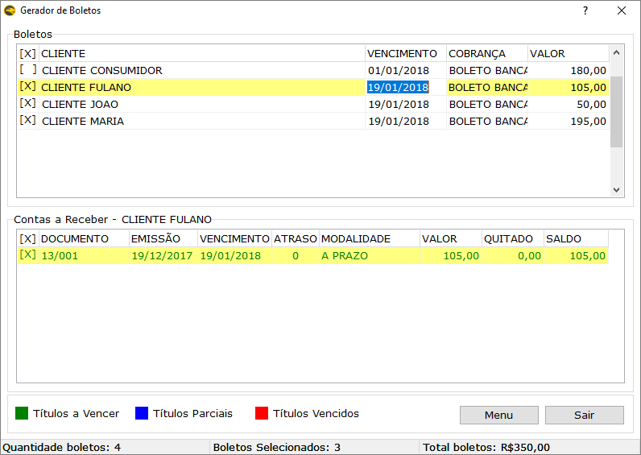

7. Clique em Menu / Gerar Boletos ou pressione F10.

! O(s) boleto(s) gerado(s) poderá(ão) ser visualizado(s) através da **Impressão pela Carteira de Cobrança**, **Impressão em 2ª Via** ou **Impressão através da Consulta de Boletos**. Acesse o tópico [**IMPRIMIR BOLETOS**](#imprimir-boletos) e veja o passo a passo.

 
## Gerar Boletos - Contratos

O uso de contratos é muito útil quando a empresa possui serviços que são entregues aos clientes em intervalos fixos de tempo. Um exemplo seria um clube  recreativo, onde os clientes pagam mensalmente para usufruir das suas dependências. Nesta seção veremos como cadastrar os contratos e gerar os boletos respectivos.

### Cadastrar um Contrato

Para cadastrar um novo contrato vá até Financeiro / Contas a Receber / Contratos e Clique em Novo.

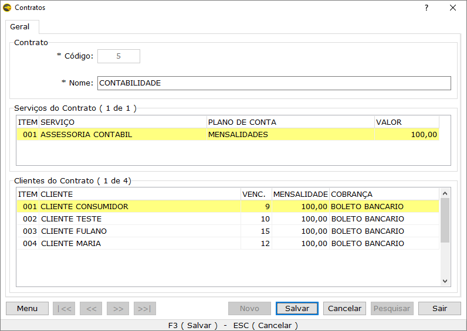

 
**Contrato**

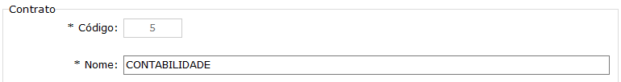

|Campo|Função|
|-----|------|
|Código|Gerado automaticamente pelo sistema.|
|Nome|Informe o Nome para o Contrato de serviços.|

 
**Serviços do Contrato**

 do Contrato")

|Campo|Função|
|-----|------|
|Item|Código identificador do serviço no contrato. Gerado automaticamente.|
|Serviço|Nome do serviço que compõe o contrato. Clique sobre o campo e digite o nome do Serviço. Para adicionar um novo serviço, clique com o botão direito do mouse e escolha "Adicionar Serviço".|
|Plano de conta|Selecione o plano de conta do qual o serviço fará parte clicando com o botão direito do mouse e escolhendo "Alterar Plano de Contas".|
|Valor|Valor do Serviço. Para alterar, clique sobre o campo e digite o novo valor.|

 
**Clientes do Contrato**

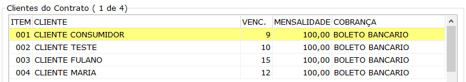

|Campo|Função|
|-----|------|
|Item|Identificador do cliente em relação ao contrato. Gerado automaticamente.|
|Nome|Nome de cada cliente que irá aderir ao contrato. Para selecionar um cliente, pressione espaço ou a tecla F2. O sistema irá solicitar a escolha de um meio de pagamento: escolha um meio de pagamento **Boleto Bancário**. Logo após, aparecerá a tela de pesquisa para a seleção do cliente.|
|Venc.|Dia do mês padrão para vencimento das mensalidades para cada cliente. Para alterar, clique sobre o campo e digite o novo dia.|
|Mensalidade|Valor da mensalidade. Para alterar o valor, basta clicar sobre ele e digitar.|
|Cobrança|Meio de pagamento escolhido no momento da pesquisa do cliente. Se for necessário alterar, pressione F3.|

 
### Listar Clientes por Contrato

Com este recurso, será possível acessar todos os clientes que fazem parte de um determinado contrato e imprimir os respectivos boletos da próxima mensalidade.

1. Acesse Financeiro / Contas a Receber / Gerenciador de Boletos.
2. Clique em Menu / Gerador de Boletos ou pressione F11.
3. Clique em Menu / **Listar Clientes por Contrato** ou pressione F4.

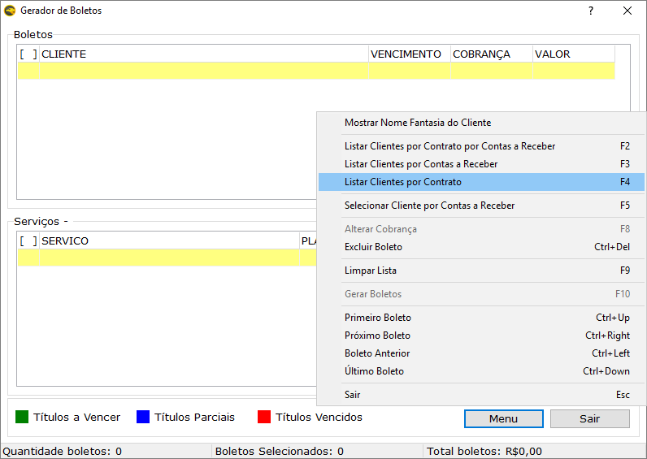

4. Selecione o Contrato

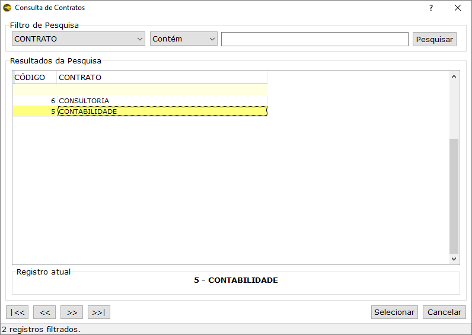

5. Selecione os clientes do contrato para a geração dos boletos. Neste momento, ainda é possível alterar a data de vencimento de cada boleto. Basta clicar sobre a data e digitar o novo dia.

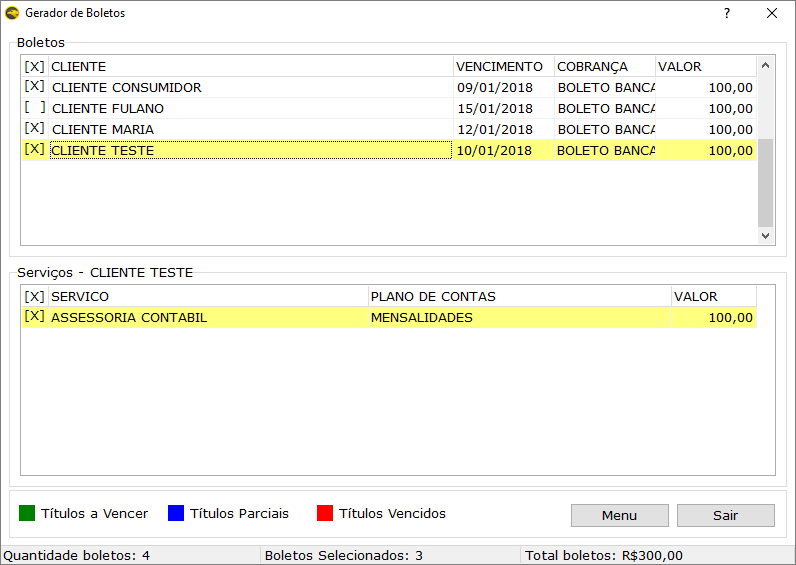

6. Clique em Menu / **Gerar Boletos** ou pressione F10. Neste momento, o sistema, além de gerar os boletos, também registra os documentos de contas a receber.

! O(s) boleto(s) gerado(s) poderá(ão) ser visualizado(s) através da **Impressão pela Carteira de Cobrança**, **Impressão em 2ª Via** ou **Impressão através da Consulta de Boletos**. Acesse o tópico [**IMPRIMIR BOLETOS**](#imprimir-boletos) e veja o passo a passo.

 
### Listar Clientes por Contrato por Contas a Receber

É utilizado quando for necessário gerar boletos para clientes que possuam outras contas na empresa, além dos contratos, já cadastrados.

1. Acesse Financeiro / Contas a Receber / Gerenciador de Boletos.
2. Clique em Menu / Gerador de Boletos ou pressione F11.
3. Clique em Menu / **Listar Clientes por Contrato por Contas a Receber** ou pressione F2.

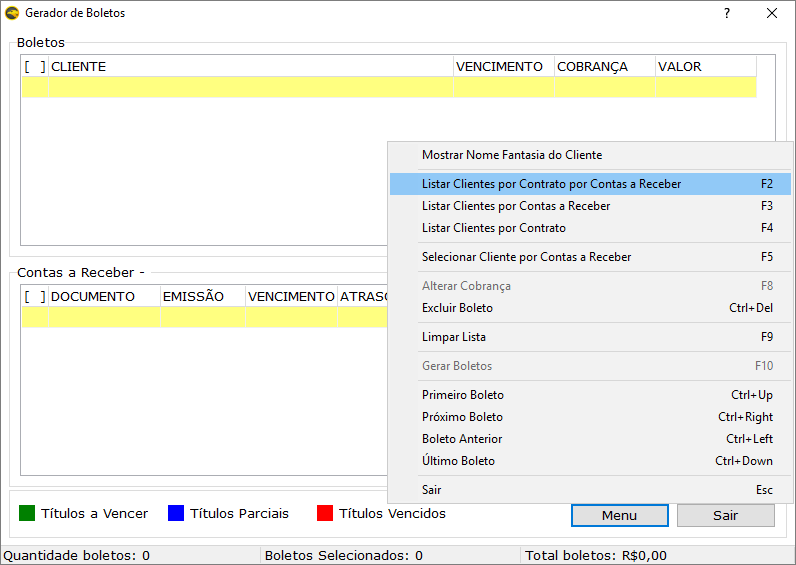

4. Selecione o Contrato

5. Selecione um ou mais clientes e as suas respectivas contas a receber. Lembrando que essas contas não fazem parte dos contratos e podem, portanto, ter vencimentos diferentes.

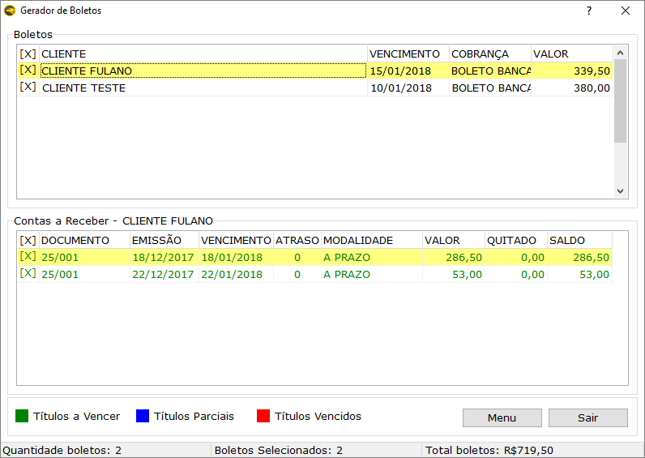

6. Clique em Menu / Gerar Boletos ou pressione F10.

! O(s) boleto(s) gerado(s) poderá(ão) ser visualizado(s) através da **Impressão pela Carteira de Cobrança**, **Impressão em 2ª Via** ou **Impressão através da Consulta de Boletos**. Acesse o tópico [**IMPRIMIR BOLETOS**](#imprimir-boletos) e veja o passo a passo.

 
## Imprimir Boletos

### Impressão através da Carteira de Cobrança

O recurso de impressão utilizando a Carteira de Cobrança, dá a possibilidade de impressão de um ou mais boletos que estejam vinculados à carteira selecionada.

1. Abra o Gerenciador de Boletos através do menu Financeiro / Contas a Receber / Gerenciador de Boletos.
2. Clique em Menu / Selecionar Carteira ou pressione F2.

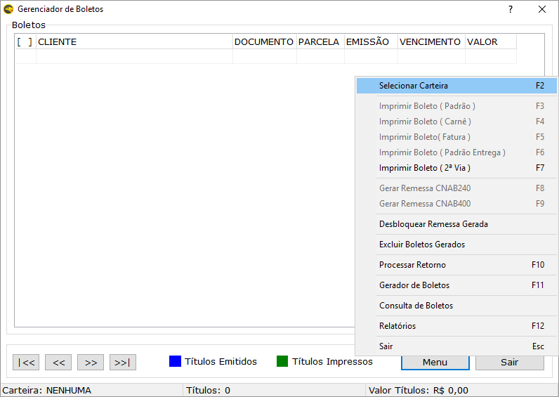

3. Selecione um ou mais boletos para impressão. Utilize a primeira coluna, contendo os colchetes, para a seleção.

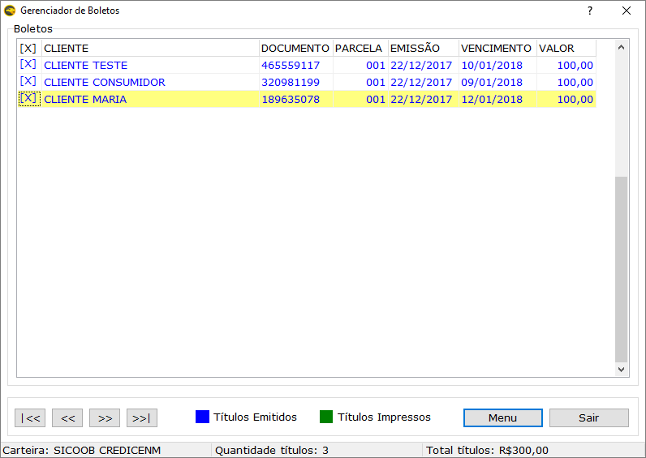

4. Clique em Menu / Imprimir Boleto utilizando uma das opções disponíveis.

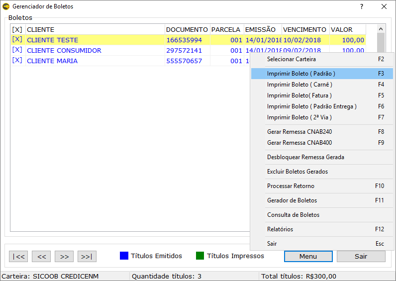

Ao final do processo, os boletos serão exibidos em PDF para impressão.
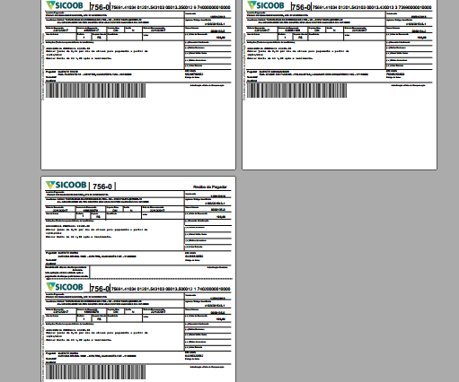

 
### Impressão em Segunda Via

O sistema possui a opção de impressão de boletos em segunda via, permitindo gerar, a qualquer momento, a cópia de um boleto que já foi emitido ou impresso.

1. Abra o Gerenciador de Boletos através do menu Financeiro / Contas a Receber / Gerenciador de Boletos.
2. Clique em Menu / Imprimir Boleto (2ª Via) ou pressione F7 para ativar os formatos de impressão.

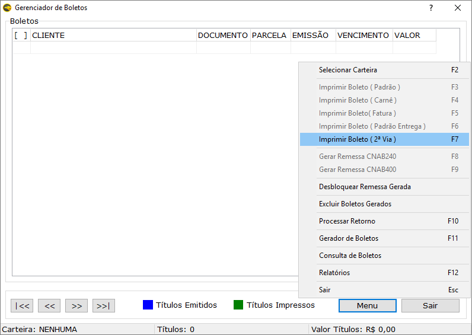

3. Neste momento, já com as opções de impressão ativadas, escolha um formato mais adequado (formato padrão, carnê, fatura ou padrão entrega).

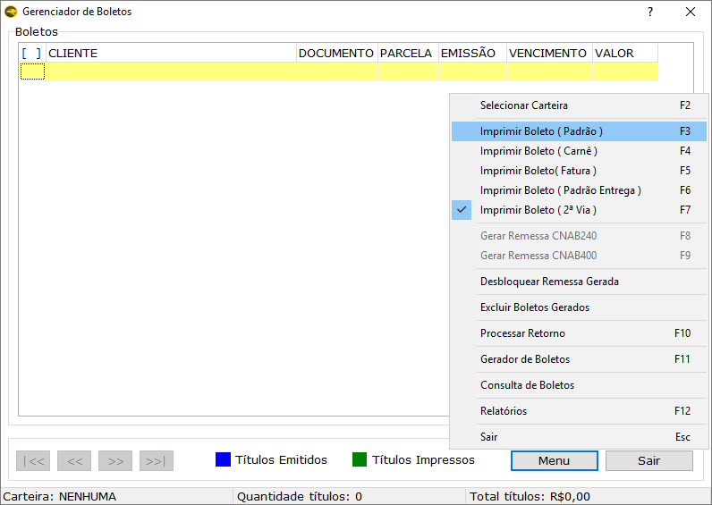

4. Escolha o boleto desejado.

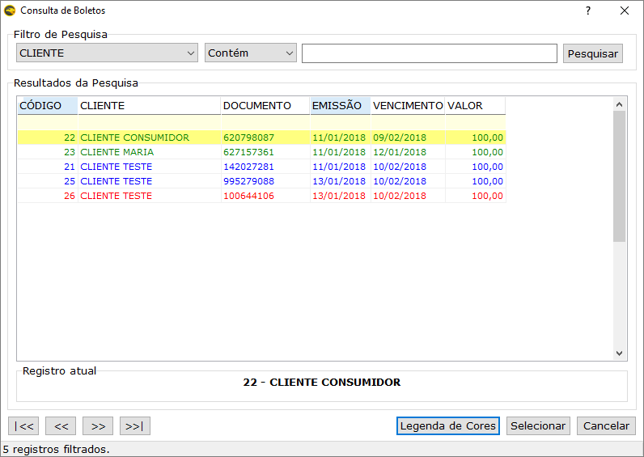
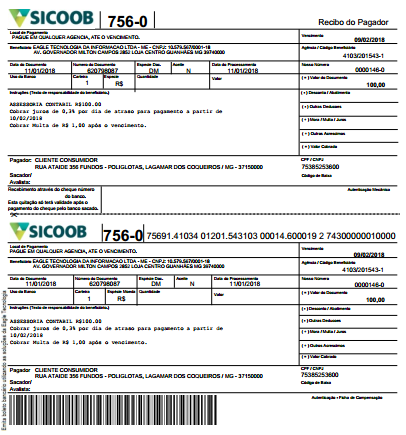

! Durante a consulta, é possível perceber cores diferentes para os boletos. Cada cor representa o estado atual do boleto: {c:green}verde (títulos impressos){/c}, {c:blue}azul (títulos emitidos){/c}, {c:red}vermelho (com arquivo de remessa processada){/c}, {c:grey}cinza (com arquivo de retorno processado){/c} e {c:grey}cinza (com baixa manual no sistema){/c}.

 
### Impressão através da Consulta de Boletos

Também é possível utilizar a seção [CONSULTAR BOLETOS](#consultar-boletos) para fazer a impressão desejada. 

1. Acesse Financeiro / Contas a Receber / Gerenciador de Boletos
2. Clique em Menu / Consulta de Boletos
3. Clique em Menu e escolha uma das quatro formas de consulta (Mostrar Todos, Mostrar por Número, Mostrar por Cliente, Mostrar por Emissão).

4. Selecione o documento desejado, vá em Menu e escolha o formato de impressão mais adequado.

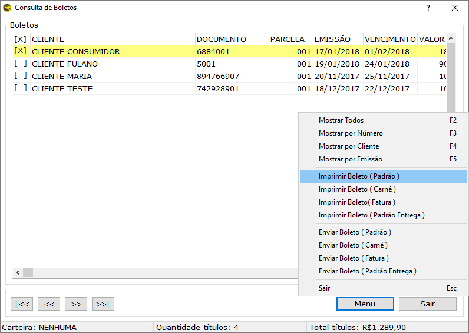

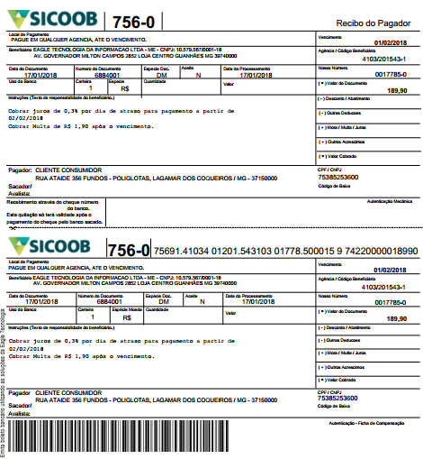

! Para mais informações veja a seção [CONSULTAR BOLETOS](#consultar-boletos).

 
## Gerar Remessa

Através do arquivo de remessa é possível enviar todas as informações envolvendo os boletos gerados dentro de um período específico.
Após a geração do arquivo de remessa, o mesmo é enviado eletronicamente ao banco, que terá, então, conhecimento de todos os boletos pendentes.
 Há duas opções para a geração dos arquivos de remessa, o formato **CNAB240** ou **CNAB400**. Os formatos correspondentes foram estabelecidos pela Febraban e tem por objetivo padronizar e simplificar todo o método de cobrança através de boletos bancários.

A geração do arquivo de remessa está disponível em Financeiro / Contas a Receber / Gerenciador de Boletos.

1. Acesse Menu / Selecionar Carteira ou pressione F2 e escolha a carteira de cobrança correspondente.
2. Selecione todos os títulos emitidos que deverão ser enviados ao banco.
3. Vá em Menu e escolha a opção "Gerar Remessa CNAB240" ou "Gerar Remessa CNAB400".

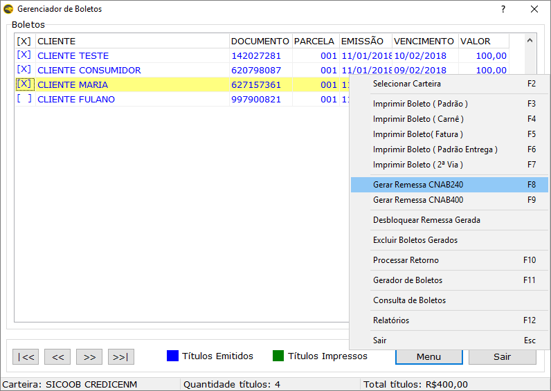

4. Escolha o local onde o arquivo será salvo.

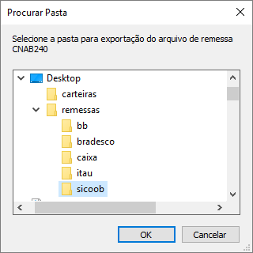

5. Confirme o processo para gerar o arquivo.
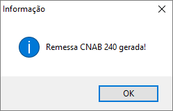
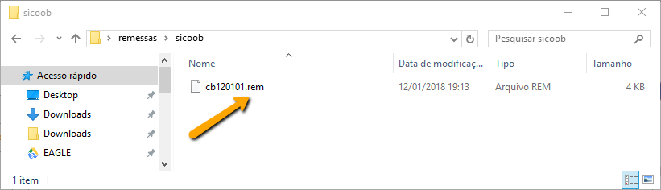

! O arquivo de remessa gerado é enviado para o gerenciador financeiro do banco correspondente.

 
## Desbloquear Remessa Gerada

O desbloqueio é realizado quando há necessidade de alterar ou excluir algum boleto que esteja no arquivo de remessa, considerando que este ainda não foi enviado ao banco.

1. Acesse Financeiro / Contas a Receber / Gerenciador de Boletos.
2. Acesse Menu / Desbloquear Remessa Gerada.
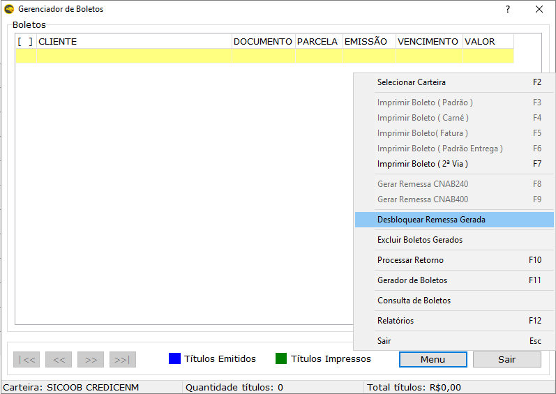

3. Selecione a Remessa desejada e confirme o processo.
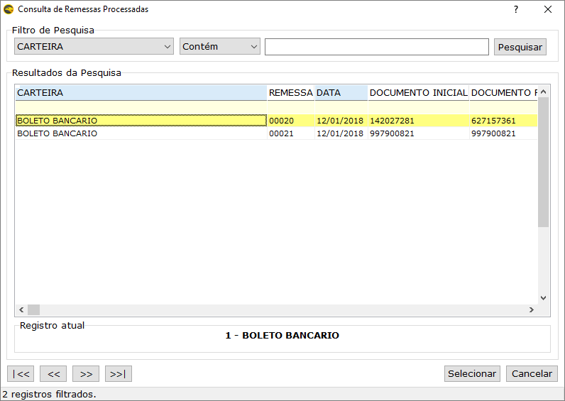
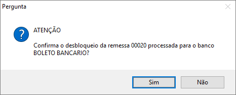

! Após selecionar a carteira de cobrança novamente, é possível visualizar os boletos na tela do gerenciador. 

! Para realizar alterações dos boletos será necessário excluí-los e gerá-los novamente após as correções desejadas. Depois de realizadas as alterações, gere a remessa e envie ao banco.

 

## Excluir Boletos

É possível excluir os boletos gerados pelo sistema e que ainda não foram enviados como remessa para o banco. Basta seguir alguns passos:

1. Acesse o Financeiro / Contas a Receber / Gerenciador de Boletos.
2. Clique em Menu / Excluir Boletos Gerados.

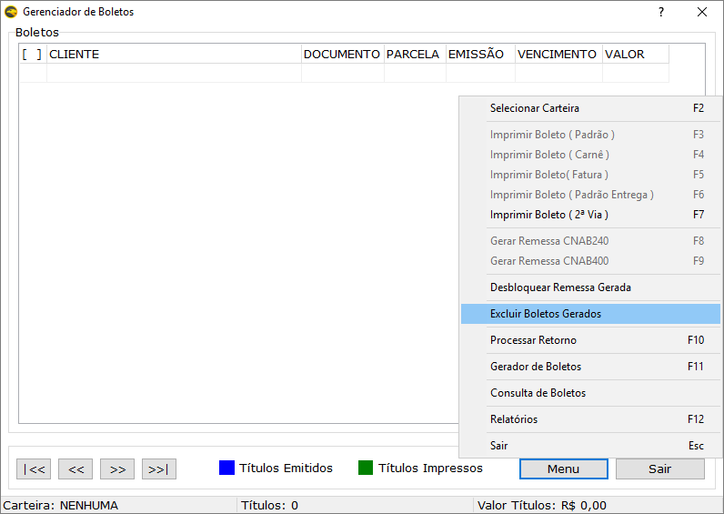

3. Selecione o boleto correspondente.

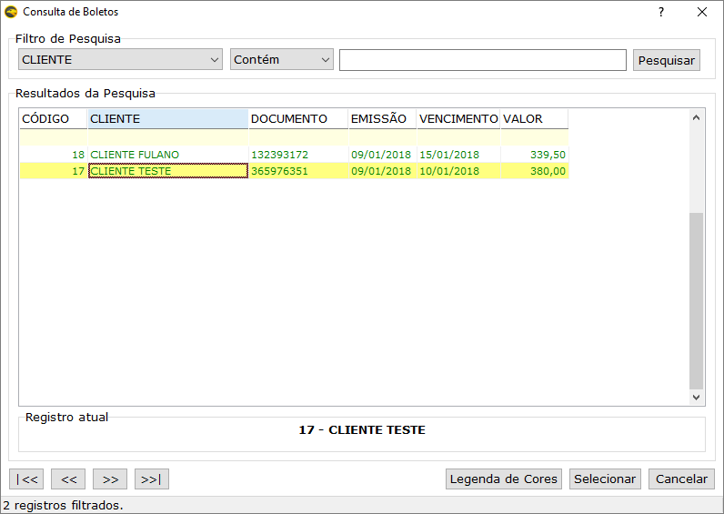

4. Confirme a exclusão.

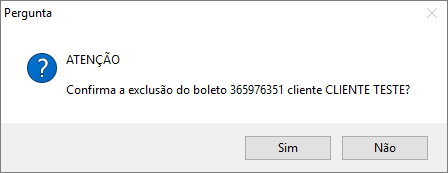
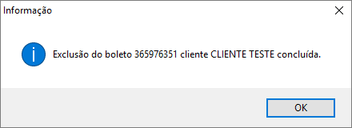

 

## Processar Retorno

Os arquivos de retorno, também padronizados pela Febraban, representam os lotes de recebimento e são fornecidos pelo banco. O processo de retorno facilita a tarefa de recebimento das contas no sistema, proporcionando mais agilidade e confiança.
1. Baixe o arquivo de retorno do gerenciador do banco e salve-o em uma pasta de fácil acesso.
2. Abra o Gerenciador de Boletos no sistema (Financeiro / Contas a Receber / Gerenciador de Boletos).
3. Acesse Menu / Processar Retorno ou pressione F10.

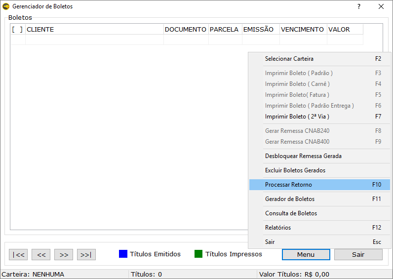

4. Na janela que se abre, selecione a Carteira de Cobrança correspondente.
5. Localize o arquivo de retorno, salvo anteriormente, e selecione-o.

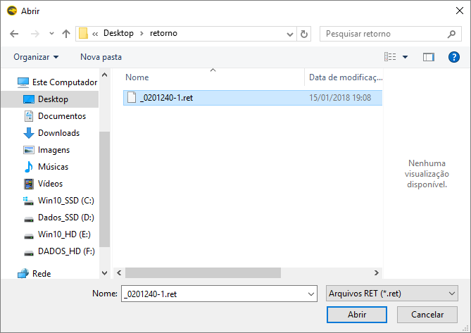

6. Confirme a data do crédito na conta, ou seja, a data do recebimento.

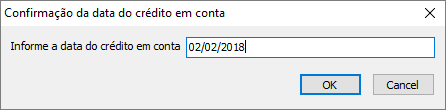

7. Após confirmação de data, será aberto o relatório contendo a lista de clientes do arquivo e seus respectivos boletos com a data da baixa no sistema.

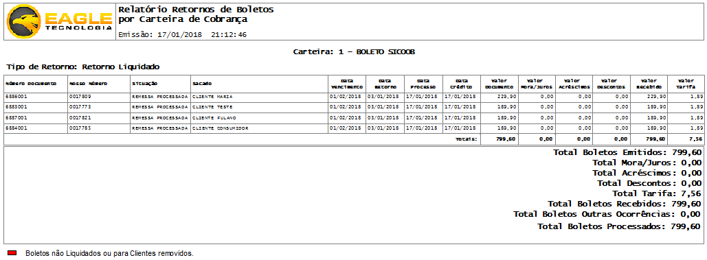

 

## Consultar Boletos

Nesta seção é possível acessar todos os boletos gerados no sistema, independentemente do status de cada um deles. Acesse Menu / Consulta de Boletos e utilize uma das quatro opções disponíveis:

### Mostrar Todos

Exibe todos os boletos gerados, sejam eles emitidos, impressos ou processados como remessa ou retorno.  Basta clicar em Menu / Mostrar Todos ou pressionar a tecla **F2**.

### Mostrar por Número

Para agilizar a consulta de um determinado boleto, é possível acessá-lo diretamente pelo número.  Clique em Menu / Mostrar por Número ou pressione **F3** e entre com o **Número do Documento** do boleto.

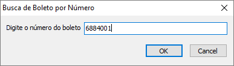
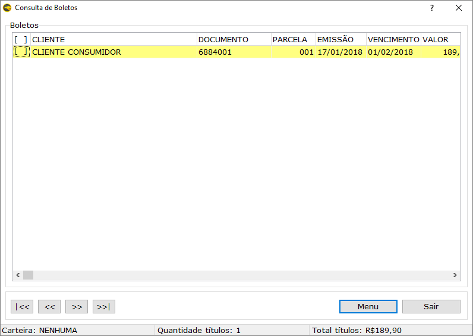

### Mostrar por Cliente

É possível consultar todos os boletos de um determinado cliente.  Acesse Menu / Mostrar Cliente ou pressione **F4** e selecione o cliente desejado.

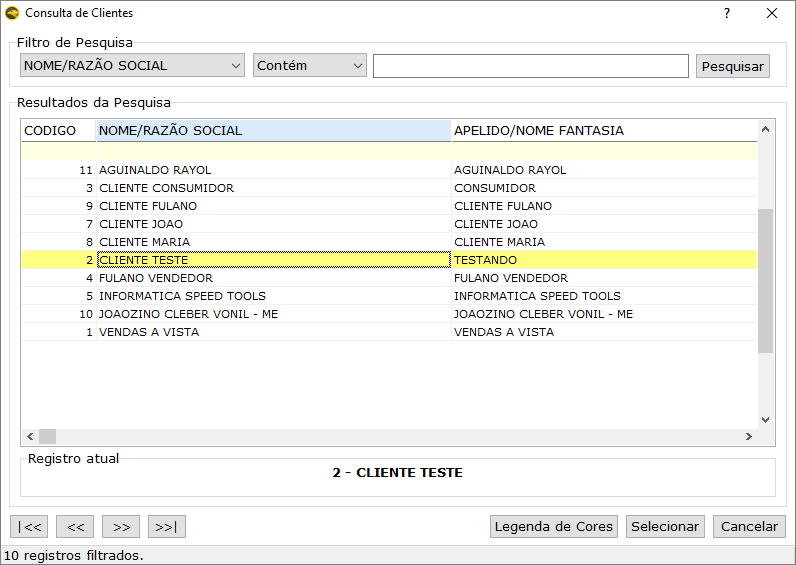
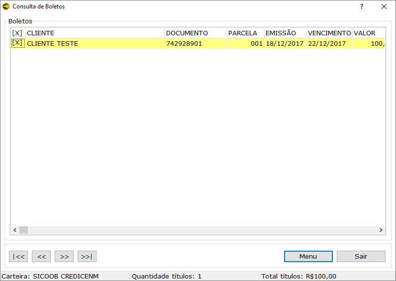

### Mostrar por Emissão

Nesta opção é possível visualizar os boletos emitidos num determinado **período mensal**.  Acesse Menu / Mostrar por Emissão ou pressione **F5**.

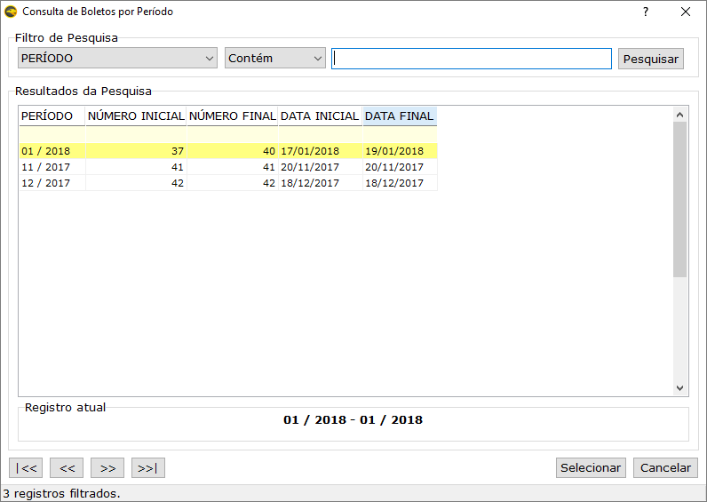
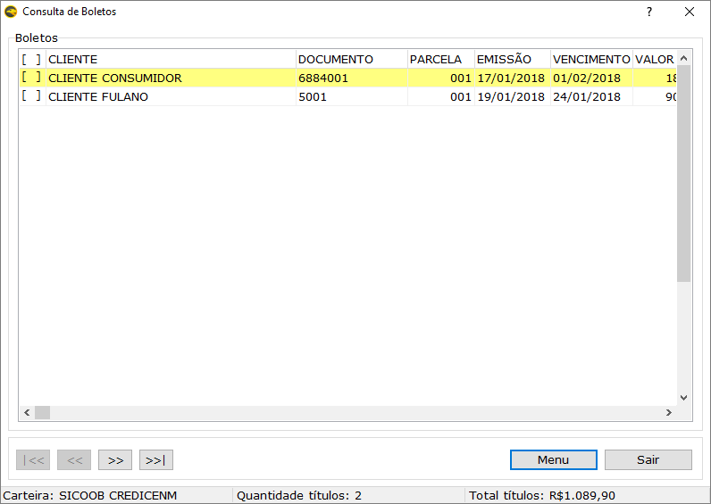

 

### Consultar e Imprimir

Após utilizar qualquer uma das opções anteriores (no exemplo, foi utilizado a opção "Mostrar por Cliente"), é possível imprimir o boleto. Selecione o documento, clique em Menu e escolha o formato apropriado para impressão.

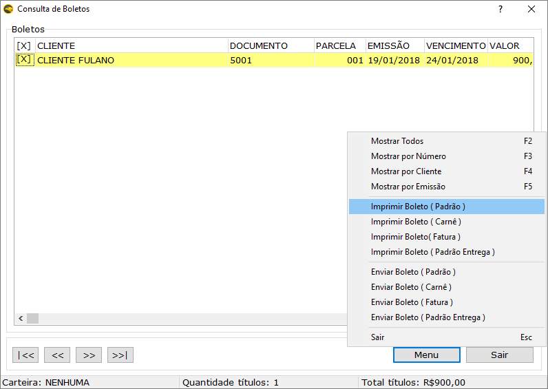
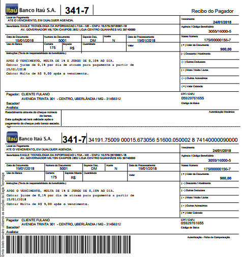

! Veja também a seção [Impressão através da Consulta de Boletos](#impresso-atravs-da-consulta-de-boletos)

 

### Consultar e Enviar por E-mail

Através desta seção, também é possível enviar o boleto diretamente para o e-mail do cliente, proporcionando mais agilidade e economia para a empresa.

1. Acesse o Gerenciador de Boletos (Financeiro / Contas a Receber / Gerenciador de Boletos).
2. Clique em Menu / Consulta de Boletos.
3. Clique em Menu e pesquise o boleto correspondente utilizando uma das quatro opções (Mostrar Todos, Mostrar por Número, Mostrar por Cliente ou Mostrar por Emissão).
4. Selecione o boleto, clique em Menu / Enviar Boleto, escolhendo um dos formatos disponíveis.

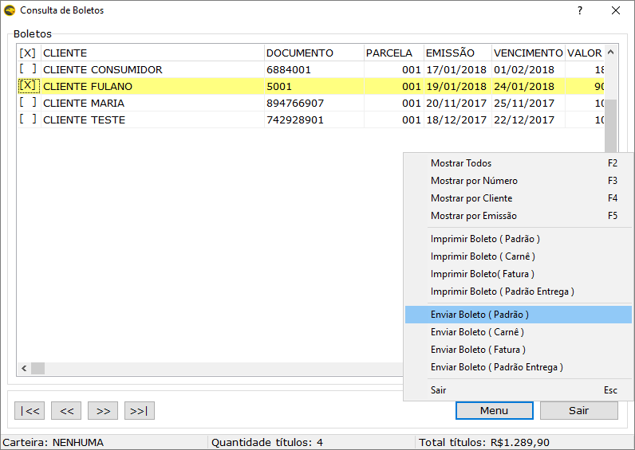

5. Após este processo o boleto estará disponível em PDF para o cliente.
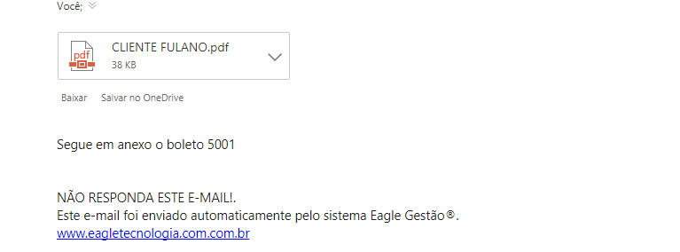

! Para utilizar este recurso é preciso que a empresa tenha o seu cadastro configurado corretamente, incluindo seus dados de e-mail. 
! Os dados do cliente precisam estar atualizados, principalmente seu endereço eletrônico.

 

## Relatórios

O módulo de boletos conta com relatórios específicos que auxiliam o processo de gerenciamento dos títulos. O recurso pode ser acessado em Financeiro / Contas a Receber / Gerenciador de Boletos, através do botão Menu / Relatórios ou pressionando a tecla F12.

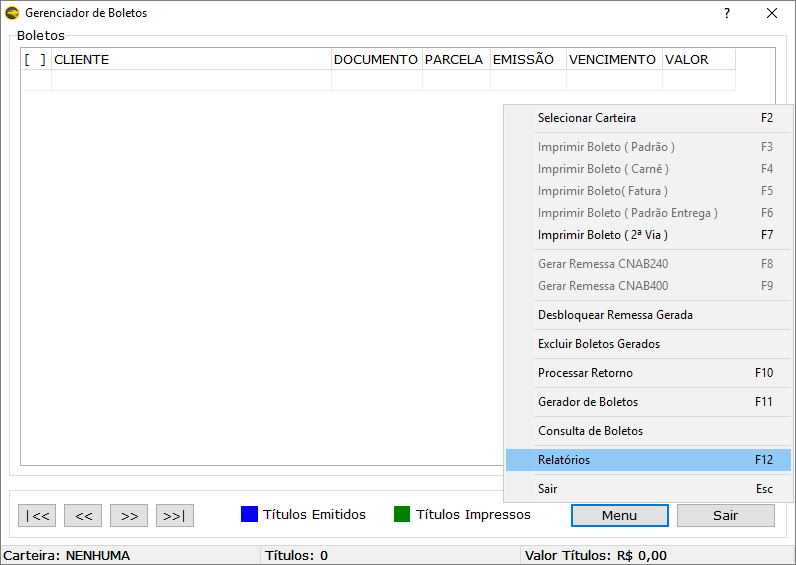

 
Os **Relatórios** podem ser gerados por Carteira de Cobrança, por Contas a Receber ou por Retornos de Boletos. Diversos **Filtros** também podem ser utilizados para otimizar e facilitar a leitura dos dados gerados.

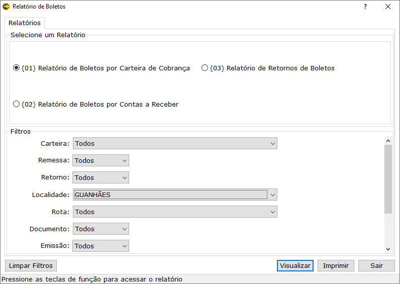

### Relatório de Boletos por Carteira de Cobrança

Através deste relatório, o usuário terá a relação dos boletos, emitidos ou impressos, separados por carteira de cobrança.

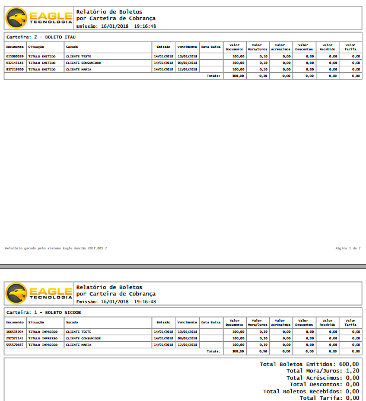

### Relatório de Boletos por Contas a Receber

Apresenta todos os boletos emitidos detalhando as contas a receber vinculadas ao mesmo.

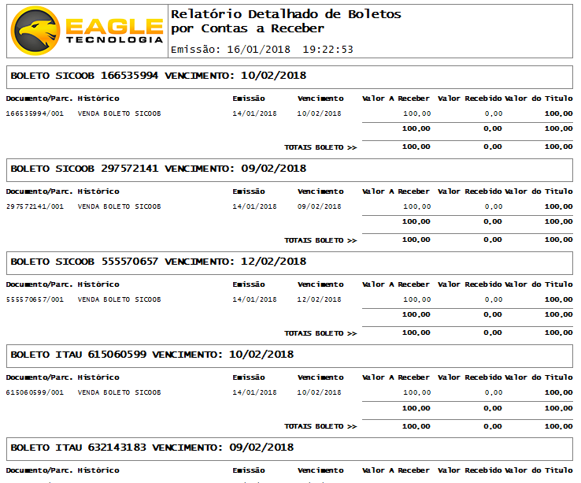

### Relatório de Retornos de Boletos

Detalha os retornos de boletos por carteira de cobrança, apresentando nome do sacado, data de vencimento, data do retorno e data de baixa. Este relatório deve ser observado sempre que for feito um retorno e os valores comparados ao relatório de contas recebidas por meio de pagamento. Com estes dados é possível conferir se o valor do retorno foi igual ao das contas baixadas, pois pode acontecer de algum boleto não ter sido baixado automaticamente por alguns motivos: exclusão de boletos já enviados ao cliente, pagamento duplicado de boletos por parte do cliente e, também, em casos de renegociação.

