===

Módulo utilizado no gerenciamento das dívidas, receitas, cheques e fluxo de caixa da empresa através do lançamento, pagamento, recebimento e estorno de contas.
É possível localizar o **Módulo de Financeiro** acessando o menu superior do sistema ou usando o atalho **ALT+F**. As principais funcionalidades deste módulo estão presentes, também, no Menu Lateral da tela inicial do sistema.

 
## Contas a Pagar

Esta seção inclui os recursos relacionados ao controle dos custos da empresa através do lançamento, pagamento, renegociação e estorno de contas, duplicatas e faturas.

 
### Lançamentos de Contas a Pagar

Caso a empresa tenha despesas que não foram lançadas no sistema por meio das notas de entrada, é possível registrá-las através desse recurso.  
Acesse Financeiro / Contas a Pagar / Lançamentos de Contas a Pagar (atalho **F9**) e clique em Novo.

#### Aba "Geral"

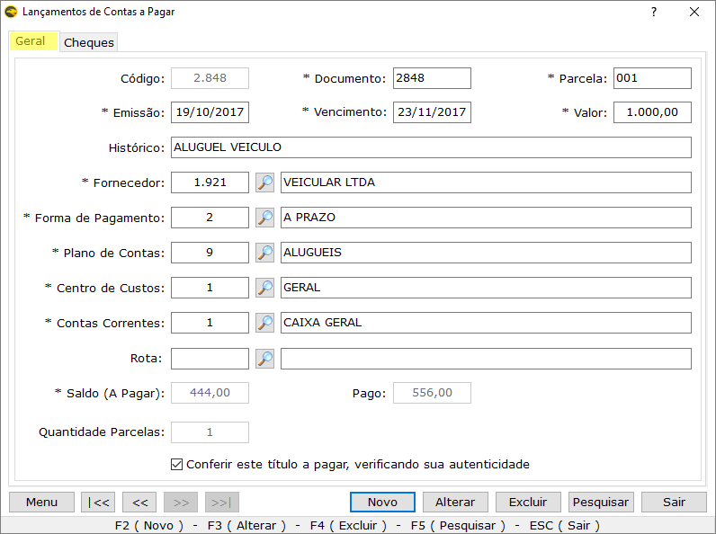

|Campo|Função|
|-----|------|
|Código|Gerado automaticamente.|
|Documento|O sistema preenche automaticamente esse campo com o mesmo código do lançamento, caso haja outro número para identificação, pode-se realizar a  alteração.|
|Parcela|Sequência da parcela da dívida, gerada automaticamente pelo sistema, mas se houver necessidade, pode-se realizar a alteração. 
|Emissão|Preenchido automaticamente, mas pode-se alterar a data manualmente de acordo com a necessidade.| 
|Vencimento|Preenchido automaticamente de acordo com a data de emissão, mas pode ser alterada manualmente.|
|Valor|Informa-se o valor da conta.|
|Histórico|Neste campo faz-se uma breve descrição do motivo do lançamento da conta.|
|Fornecedor|Selecionar o fornecedor - previamente cadastrado - do produto ou serviço.  Caso o fornecedor ainda não esteja no sistema, o usuário poderá acessar o botão "Menu" e utilizar a opção "Cadastrar Fornecedores".|
|Forma de Pagamento|Seleciona-se o modo de pagamento.|
|Plano de Contas|Seleciona-se o tipo de despesa relacionada.|
|Centro de Custos|Informa-se o centro de custo onde foi direcionado a despesa.| 
|Conta Corrente|Seleciona-se a conta que representa a origem do recurso financeiro.|
|Rota|O campo não é obrigatório. Seleciona-se a [rota](https://ajuda.eagletecnologia.com/manuais/eagle-gestao/modulo-cadastros#cadastro-de-rotas) caso a mesma já esteja cadastrada.|
|Saldo (A Pagar)|Mesmo valor apresentado no valor a pagar , podendo sofrer alteração caso realize um pagamento parcial da conta (pagamento de contas).|
|Pago|Valor de algum pagamento parcial, já realizado, da conta.|
|Quantidade Parcelas|Valor padrão é 1, mas poderá sofrer alteração, se for utilizado o recurso de "Replicar Conta a Pagar" através do Menu.|
|Conferir este título a pagar, verificando sua autenticidade|Este campo selecionado representa a real existência da conta a pagar.  Também existe uma integração com as notas fiscais de entrada:  _Ao entrar com a nota fiscal, o sistema pergunta se as duplicatas de fornecedor foram recebidas juntamente com o documento fiscal e, ao clicar em "Sim", as contas a pagar dessa nota são geradas com o campo de autenticidade marcados. Em caso contrário, a conta é gerada com o campo desmarcado. Neste caso, quando as duplicatas da compra chegarem, deve-se voltar ao lançamento da conta a pagar e marcar o campo._|

 
#### Aba "Cheques"

Local onde se vinculam os [Cheques cadastrados](#cheques) à conta a pagar.

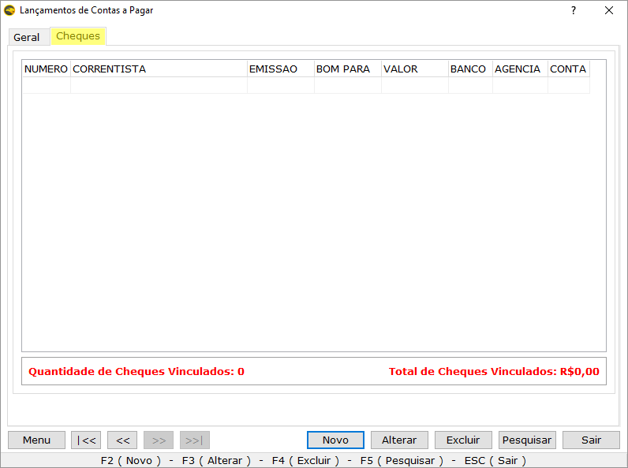

 Após clicar sobre o botão "Alterar", **clique duas vezes** ou **pressione a barra de espaços**, sobre a linha em branco, para abrir a tela de consulta. 

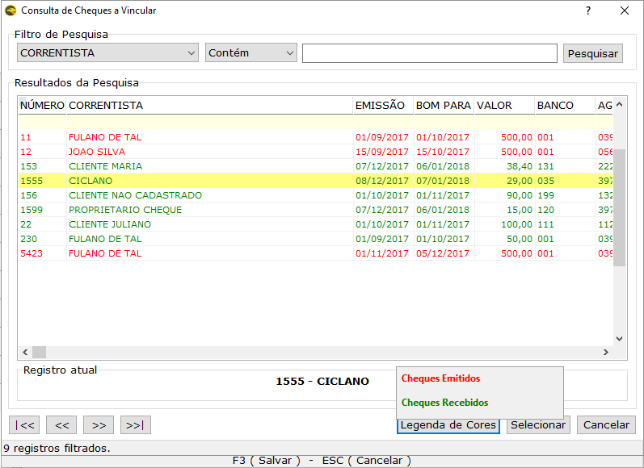

Todas as informações serão preenchidas automaticamente. Nota-se que é possível selecionar um ou mais cheques. Basta clicar em "Alterar" e utilizar o botão "Menu", acessando a opção "**Adicionar Cheque**". Também é possível "**Remover Cheque**" utilizando o mesmo botão.

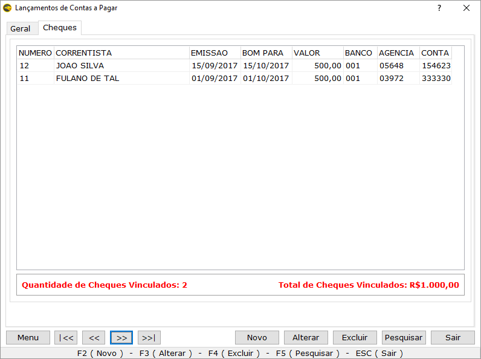

! Caso o cheque ainda não esteja cadastrado, é possível fazê-lo acessando o botão Menu e selecionando a opção "Cadastrar Cheques".

 
#### Menu de Contas a Pagar

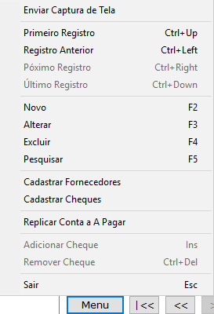

Entre as principais funcionalidades deste menu, temos:
* Cadastrar Fornecedores - Atalho para cadastro de fornecedor a ser utilizado quando ainda não houver o registro do fornecedor no banco.
* Cadastrar Cheques - Acessar o [Cadastro de Cheques](#cheques) quando houver necessidade de realizar algum vínculo com cheques.
* Replicar Contas a Pagar - Utilizado quando o Lançamento de Contas a Pagar tiver mais de uma parcela:

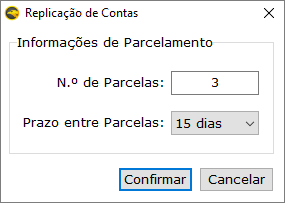

|Campo|Função|
|-----|------|
|Número de Parcelas|Insira  a quantidade de parcelas que deseja criar.|
|Prazo entre as Parcelas|Selecione o prazo entre as parcelas, podendo ser de 7 dias, 15 dias, 1 mês, 2 meses ou 3 meses.|
|Botão "Confirmar"|Ao confirmar as parcelas, serão criados os lançamentos de contas a pagar de acordo com a quantidade de parcelas informadas e com as datas de pagamento.|

* Adicionar Cheques - Atalho para vincular um ou mais cheques em contas a pagar (aba "Cheques").
* Remover cheques - Atalho para excluir o(s) cheque(s) vinculado(s) a conta a pagar. Basta selecionar o cheque desejado na aba "Cheques" e utilizar esta opção.

 
>**Exclusão de Contas a Pagar**

>É possível excluir um registro de uma determinada conta cadastrada no sistema. Provavelmente acontece em casos onde a conta foi cadastrada incorretamente ou não houve a concretização da compra do produto ou do serviço. Qualquer processo de exclusão exige muita atenção por parte do usuário e aconselha-se fazê-lo somente com a permissão de administrador do sistema.  Ao selecionar o cadastro da conta e clicar sobre o botão "Excluir", o sistema exibe uma mensagem para confirmação e, logo em seguida, a tela de autenticação do gerente para excluir o registro. Veja o tópico sobre [**Exclusão de Registros**](https://ajuda.eagletecnologia.com/manuais/eagle-gestao/apresentacao-do-sistema#excluso).

 
### Renegociação de Contas (a Pagar)

Essa seção é utilizada quando se tem uma conta a pagar vencida ou a vencer, e acontece uma renegociação com o fornecedor em relação a nova data e o valor a ser pago.  Ao realizar a renegociação de conta a pagar é gerado um novo documento, ou seja, o lançamento original da conta é substituído.   
Acesse Financeiro / Contas a Pagar / Renegociação de Contas.

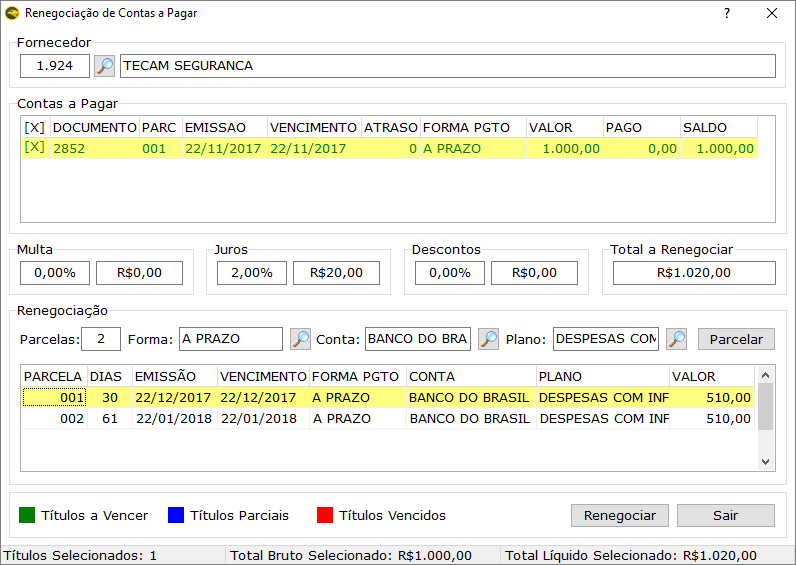

|Campo|Função|
|-----|------|
|Fornecedor|Utilizado para selecionar o fornecedor em que se deseja renegociar a dívida. Basta clicar sobre a lupa ou pressionar a barra de espaços.|
|Contas a Pagar|Exibe as principais informações de todos os documentos de contas a pagar vinculados ao fornecedor selecionado. Deve-se selecionar o(s) documento(s) em que se deseja renegociar utilizando a primeira coluna.|
|Multa / Juros / Descontos|Quando houver algum tipo de acréscimo ou desconto, os valores ou os percentuais devem ser informados nos campos correspondentes.|
|Total a Renegociar|Total da receita selecionada, considerando os acréscimos e descontos.|
|Parcelas|Representa a quantidade de parcelas da dívida do cliente. Utilize o botão "Parcelar" para confirmar o nº de parcelas.|
|Forma|Define a forma de pagamento (à vista, à prazo, cheque, etc.)|
|Conta|Em qual conta corrente cadastrada o recurso será debitado.|
|Plano|Em qual plano de contas será vinculada a conta.|
|Botão "Parcelar"|Utilize-o para realizar a divisão da conta de acordo com o número de parcelas informado anteriormente.|
|Parcela / Dias / Emissão / Vencimento / Forma Pgto / Conta / Plano / Valor|Estas colunas definem como ficam a(s) conta(s) em renegociação. Todos elas ainda podem ser alteradas, com excessão da coluna "Parcela", que neste caso, deve ser alterada utilizando o campo "Parcelas" e o botão "Parcelar".|
|Botão "Renegociar"|Utilize-o para gerar o(s) novo(s) documento(s) de contas a pagar.|

! O sistema conta com a legenda identificada pelas cores {c:green}verde (títulos a vencer){/c}, {c:blue}azul (pagos parcialmente){/c} e {c:red}vermelho (vencidos){/c}.

! Para visualizar as novas contas, acesse [Lançamento de Contas a Pagar](#lanamentos-de-contas-a-pagar) ou [Pagamento de Contas](#pagamentos-de-contas).

 
### Pagamentos de Contas

Acesse Financeiro / Contas a Pagar / Pagamento de Contas ou utilize a tecla **F10**.

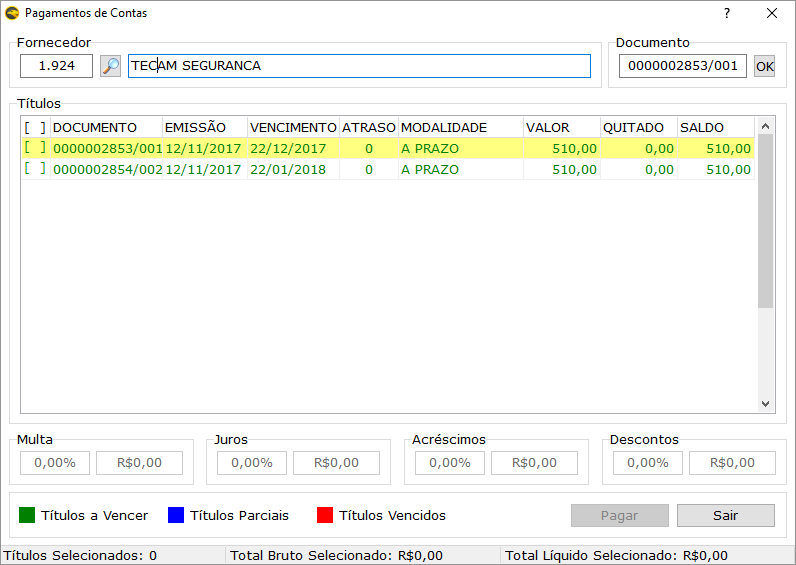

|Campo|Função|
|-----|------|
|Fornecedor|Através deste campo, seleciona-se o fornecedor para que as contas a pagar sejam acessadas.|
|Documento|Outra possibilidade de acessar o documento a ser pago, informando o número do mesmo.|
|Títulos|São exibidas as principais informações dos documentos recuperados, de acordo com o fornecedor ou número de documento escolhido anteriormente. A primeira coluna permite que o(s) documento(s) seja(m) selecionado(s) para efetuar o pagamento.|
|Multa / Juros / Acréscimos / Descontos|Informa-se o possível acréscimo ou desconto do título a pagar.|
|Botão "Pagar"|Antes de utilizar o botão, é necessário selecionar o(s) titulo(s) para efetuar o pagamento.|

 
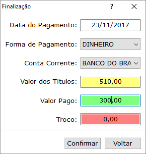

|Campo|Função|
|-----|------|
|Data do Pagamento|A data atual é preenchida automaticamente, mas poderá ser alterada.|
|Forma de Pagamento|Como será efetuado o pagamento.|
|Conta Corrente|Conta que representa a origem do recurso financeiro para o pagamento.|
|Valor dos Títulos|Representa a soma de todos os títulos selecionados.|
|Valor Pago|O valor que será quitado.|
|Troco|Caso o valor pago seja maior que o valor do(s) título(s), este campo será preenchido com a diferença, ou seja, o troco.|

 
Após o processo, será exibida uma mensagem, dando ao usuário a opção para imprimir o comprovante de pagamento. O mesmo poderá ser visualizado a qualquer momento acessando Relatórios / Fornecedores / Reimpressão de Comprovante de Pagamento.

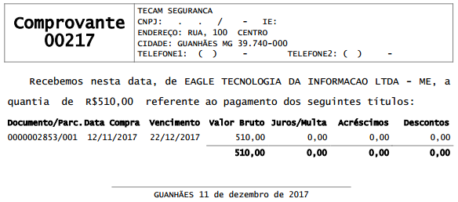

! Após o pagamento, o sistema irá atualizar os documentos, identificando-os, inclusive, com a legenda contendo as cores {c:green}verde (títulos a vencer){/c}, {c:blue}azul (pagos parcialmente){/c} e {c:red}vermelho (vencidos){/c}.

 
### Estorno de Contas Pagas

O Estorno representa a retificação de uma operação lançada indevidamente no sistema. Neste caso, a correção de um lançamento de um pagamento. Quando é feito o estorno, este pagamento passa para a situação de contas a pagar.
Para acessar este recurso, vá em Financeiro / Contas a Pagar / Estorno de Contas Pagas.

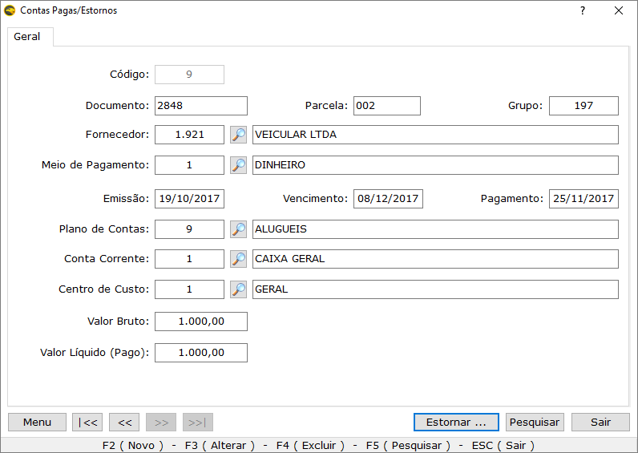

|Campo|Função|
|-----|------|
|Código|O sistema gera automaticamente.|
|Documento|Representa o número do documento que foi lançado no sistema.|
|Parcela|Qual a parcela do documento deverá ser estornada.|
|Grupo|Identifica o número gerado no comprovante de pagamento, no momento em que o(s) documento(s) foi(ram) quitado(s). É importante lembrar que é possível quitar vários documentos do mesmo fornecedor, ao mesmo tempo, gerando o mesmo número de comprovante (grupo).|
|Fornecedor|Identificação do fornecedor que terá o pagamento estornado.|
|Meio de Pagamento|Método de pagamento utilizado. Caso o pagamento a estornar seja proveniente de um lançamento a dinheiro, o sistema exibirá uma mensagem informando ao usuário a necessidade de selecionar um novo meio de pagamento (a prazo).|
|Emissão / Vencimento / Pagamento|Datas que ajudam a identificar, com mais detalhes o documento a ser estornado.|
|Plano de Contas|Classificação utilizada no momento em que foi adquirido o produto ou serviço do fornecedor.|
|Conta Corrente|Origem do recurso utilizado para pagamento.|
|Centro de Custo|Outro tipo de classificação utilizado para identificar o pagamento.|
|Valor Bruto / Valor Líquido|Representam o valor quitado.|
|Botão "Estornar"|Utilizado para realizar o estorno do documento selecionado. Após o processo, ele será redirecionado para a seção de títulos a pagar.|

! Nenhum dos campos que aparecem na tela pode ser alterado.

 
#### Menu de Estorno de Pagamentos

Quando duas ou mais contas são quitadas ao mesmo tempo, o sistema gera um número identificando o grupo de pagamentos. Existe a possibilidade, então, de **Estornar Grupo de Pagamentos** acessando Menu / Estornar Grupo de Pagamentos. Assim todas as contas pagas nesse grupo retornam para a tela de [Pagamentos de Contas](#pagamentos-de-contas).

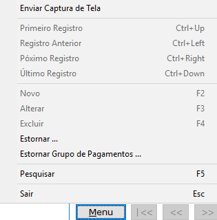

 
## Contas a Receber

Esta seção inclui os recursos relacionados ao gerenciamento das dívidas que os clientes possuem com a empresa através do lançamento de contas a receber, renegociação de contas, recebimento de contas e estornos de contas recebidas.

 
### Lançamentos de Contas a Receber

Caso a empresa tenha receitas que não foram lançadas no sistema por meio das notas de saída ou orçamentos, é possível registrá-las através desse recurso acessando Financeiro / Contas a Receber / Lançamento de Contas a Receber. Pode-se também utilizar o atalho **F7**.

#### Aba "Geral"

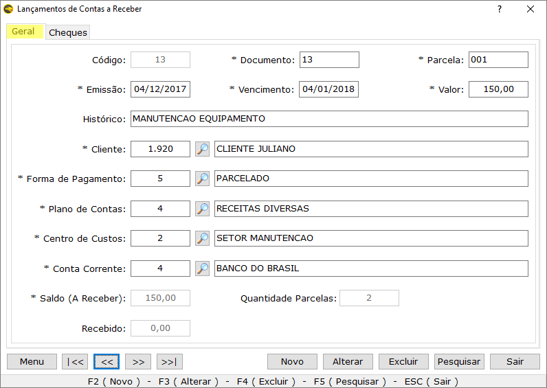

|Campo|Função|
|-----|------|
|Código|Gerado automaticamente.|
|Documento|O sistema preenche automaticamente esse campo com o mesmo código do lançamento, caso haja outro número para identificação, pode-se realizar a  alteração.|
|Parcela|Sequência da parcela da receita, gerada automaticamente pelo sistema, mas se houver necessidade, pode-se realizar a alteração. 
|Emissão|Preenchido automaticamente, mas pode-se alterar a data manualmente de acordo com a necessidade.| 
|Vencimento|Preenchido automaticamente de acordo com a data de emissão, mas podendo ser ajustada com a data correta de vencimento. Este campo só poderá ser alterado se a forma de pagamento for a prazo.|
|Valor|Informa-se o valor da conta a receber.|
|Histórico|Breve descrição do motivo do lançamento da conta.|
|Cliente * |Selecionar o cliente - previamente cadastrado - que possui a dívida.  Caso o cliente ainda não esteja no sistema, pode-se utilizar o botão "Menu" e escolher a opção "Cadastrar Clientes".|
|Forma de Pagamento|Seleciona-se o modo como o cliente irá quitar a dívida. Caso a modalidade escolhida não seja a prazo, o sistema irá realizar o recebimento imediatamente. Neste caso, uma mensagem será exibida para que o usuário confirme a operação.|
|Plano de Contas|Informar a classificação da receita.|
|Centro de Custos|Informa-se o centro de custo onde foi direcionado a receita.| 
|Conta Corrente|Seleciona-se a conta destino da receita.|
|Saldo (A Receber)|Mesmo valor apresentado no valor a receber, podendo sofrer alteração caso haja algum recebimento parcial da conta (recebimento de contas).|
|Recebido|Valor de algum recebimento parcial, já realizado, da conta.|
|Quantidade Parcelas|Valor padrão é 1, mas poderá sofrer alteração, se for utilizado o recurso "Replicar Conta a Receber", através do botão Menu.|

! O sistema exibe a consulta de clientes identificando-os pelas cores {c:black}Preto - Clientes Adimplentes{/c} e {c:red}Vermelho - Clientes Inadimplentes{/c}. 

 
#### Aba "Cheques"

Local onde se vinculam os [Cheques cadastrados](#cheques) à conta a receber.

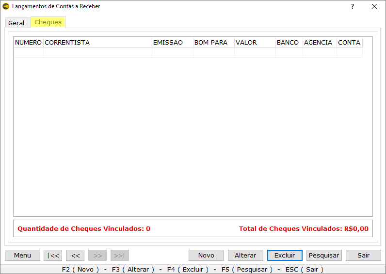

 Após clicar sobre o botão "Alterar", **clique duas vezes** ou **pressione a barra de espaços**, sobre a linha em branco, para abrir a tela de consulta. 

Todas as informações serão preenchidas automaticamente. Nota-se que é possível selecionar um ou mais cheques. Basta clicar em "Alterar" e utilizar o botão "Menu", acessando a opção "**Adicionar Cheque**". Também é possível "**Remover Cheque**" utilizando o mesmo botão.

! Caso o cheque ainda não esteja cadastrado, é possível fazê-lo acessando o botão Menu e selecionando a opção "Cadastrar Cheques".

 
#### Menu de Contas a Receber

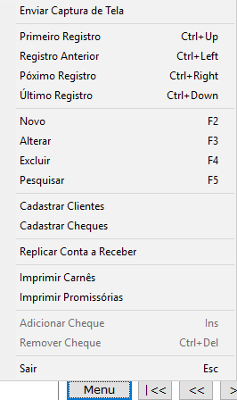

Entre as principais funcionalidades deste menu, temos:
* Cadastrar Clientes - Atalho para cadastro de clientes sem a necessidade de sair da tela de contas a receber. 
* Cadastrar Cheques - Utilizado quando houver necessidade de vincular um cheque à conta a receber e o mesmo ainda não esteja cadastrado no sistema.
* Replicar Contas a Receber - Utilizado quando a conta a receber possui mais de uma parcela.

|Campo|Função|
|-----|------|
|Número de Parcelas|Insira  a quantidade de parcelas que deseja criar.|
|Prazo entre as Parcelas|Selecione o prazo entre as parcelas, podendo ser de 7 dias, 15 dias, 1 mês, 2 meses ou 3 meses.|
|Botão "Confirmar"|Ao confirmar as parcelas, serão criados os lançamentos de contas a receber de acordo com a quantidade de parcelas informadas e com as datas de pagamento.|

* Imprimir Carnês - Gera os carnês de acordo com as informações cadastradas e se o meio de pagamento for a prazo.

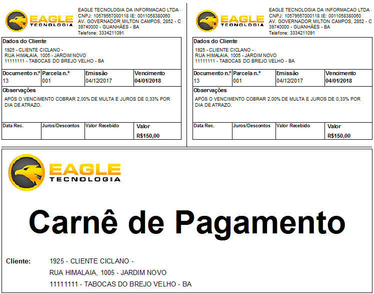

* Imprimir Promissórias - Caso a conta a receber seja a prazo, o sistema gera as notas promissórias de acordo com as parcelas informadas.

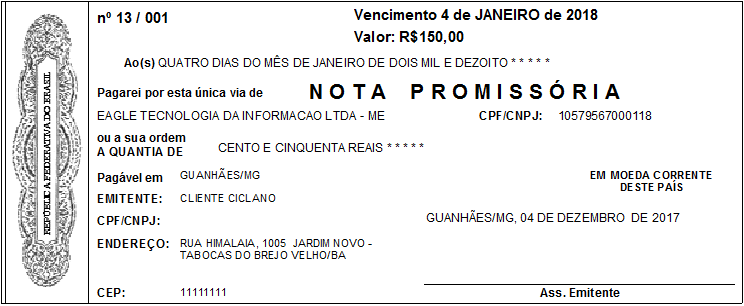

* Adicionar Cheques - É possível incluir cheques que serão vinculados à conta a receber, através da aba "Cheques".
* Remover Cheques - Utilizado quando for necessário excluir algum cheque vinculado incorretamente na aba "Cheques". Basta selecionar o cheque desejado para removê-lo.

 
>**Exclusão de Contas a Receber**

>É possível excluir um registro de uma determinada conta cadastrada no sistema. Provavelmente acontece em casos onde a conta foi cadastrada incorretamente ou não houve a concretização da compra do produto ou do serviço. Qualquer processo de exclusão exige muita atenção por parte do usuário e aconselha-se fazê-lo somente com a permissão de administrador do sistema.  Ao selecionar o cadastro da conta e clicar sobre o botão "Excluir", o sistema exibe uma mensagem para confirmação e, logo em seguida, a tela de autenticação do gerente para excluir o registro. Veja o tópico sobre [**Exclusão de Registros**](https://ajuda.eagletecnologia.com/manuais/eagle-gestao/apresentacao-do-sistema#excluso).

 
### Renegociação de Contas (a Receber)

Essa seção é utilizada quando se tem uma conta a receber vencida ou a vencer, e acontece uma renegociação com o cliente em relação a nova data e o valor a ser pago.  Ao realizar a renegociação de conta a receber é gerado um novo documento, ou seja, o lançamento original da conta é substituído.   
Acesse Financeiro / Contas a Receber / Renegociação de Contas.

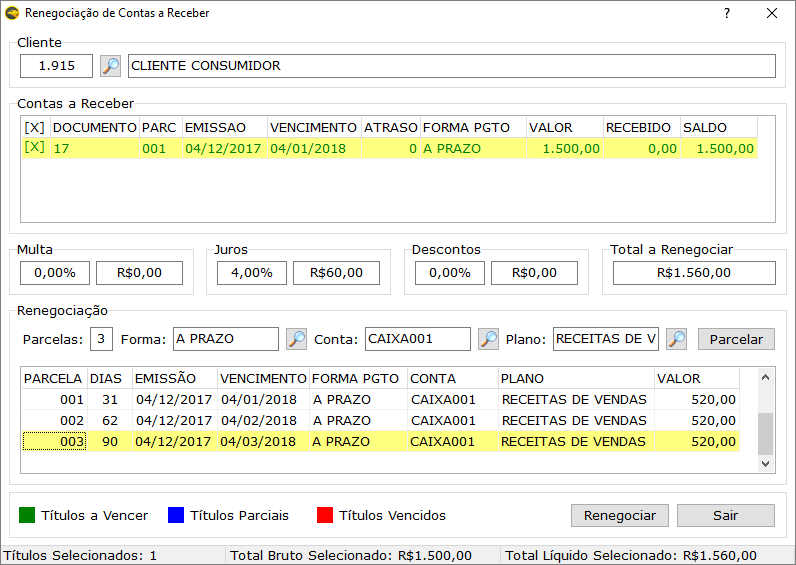

|Campo|Função|
|-----|------|
|Cliente|Utilizado para selecionar o cliente com o qual se deseja renegociar a dívida. Basta clicar sobre a lupa ou pressionar a barra de espaços.|
|Contas a Receber|Exibe as principais informações de todos os documentos de contas a receber vinculados ao cliente selecionado. Utilizando a primeira coluna, identificada por colchetes, selecionam-se o documentos que podem ser renegociados.|
|Multa / Juros / Descontos|Quando houver algum tipo de acréscimo ou desconto, os valores ou os percentuais devem ser informados nos campos correspondentes.|
|Total a Renegociar|Total da despesa selecionada, incluindo os acréscimos ou os descontos.|
|Parcelas|Representa a quantidade de parcelas da despesa. Utilize o botão "Parcelar" para confirmar o nº de parcelas.|
|Forma|Define a forma de pagamento (à vista, à prazo, cheque, etc.)|
|Conta|Em qual conta corrente cadastrada o recurso será creditado.|
|Plano|Em qual plano de contas será vinculada a conta.|
|Botão "Parcelar"|Utilize-o para realizar a divisão da conta de acordo com o número de parcelas informado no campo "Parcelas".|
|Parcela / Dias / Emissão / Vencimento / Forma Pgto / Conta / Plano / Valor|Estas colunas definem como ficam a(s) conta(s) em renegociação. Todos elas ainda podem ser alteradas, com excessão da coluna "Parcela", que neste caso, deve ser alterada utilizando o campo "Parcelas" e o botão "Parcelar".|
|Botão "Renegociar"|Utilize-o para gerar o(s) novo(s) documento(s) de contas a receber.|

! O sistema conta com a legenda identificada pelas cores {c:green}verde (títulos a vencer){/c}, {c:blue}azul (pagos parcialmente){/c} e {c:red}vermelho (vencidos){/c}.

! Para visualizar as novas contas, acesse [Lançamento de Contas a Receber](#lanamentos-de-contas-a-receber) ou [Recebimento de Contas](#recebimentos-de-contas).

 
### Recebimentos de Contas

Este recurso permite à empresa dar baixa nas contas a receber dos clientes, ou seja, informar o pagamento das mesmas. Acesse Financeiro / Contas a Receber / Recebimento de Contas ou utilize a tecla **F8**.

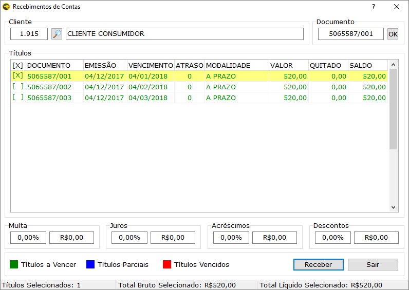

|Campo|Função|
|-----|------|
|Cliente|Através deste campo, seleciona-se o cliente para que suas contas sejam acessadas. Utilize a lupa ou a barra de espaços.|
|Documento|Outra possibilidade de acessar o documento a ser recebido, informando o número do mesmo.|
|Títulos|São exibidas as principais informações dos documentos recuperados, de acordo com o cliente ou número de documento escolhido anteriormente. A primeira coluna permite que o(s) documento(s) seja(m) selecionado(s) para informar o recebimento.|
|Multa / Juros / Acréscimos / Descontos|Informa-se o possível acréscimo ou desconto do título a receber.|
|Botão "Receber"|Ao clicar sobre o botão, abre-se a tela de confirmação do recebimento. Não se pode esquecer de selecionar o(s) titulo(s) para o recebimento.|

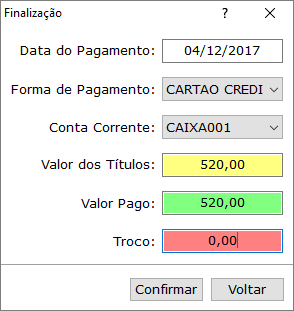

|Campo|Função|
|-----|------|
|Data do Pagamento|A data atual é preenchida automaticamente, mas poderá ser alterada.|
|Forma de Pagamento|Como o cliente fez o pagamento.|
|Conta Corrente|Conta que representa o destino do recurso recebido.|
|Valor dos Títulos|Representa a soma de todos os títulos selecionados.|
|Valor Pago|O valor que será quitado.|
|Troco|Caso o valor pago seja maior que o valor do(s) título(s), este campo será preenchido com a diferença, ou seja, o troco.|
|Confirmar|Utilize o botão para finalizar o processo. Neste momento, o sistema dá a possibilidade de imprimir, ou não, o recibo.|

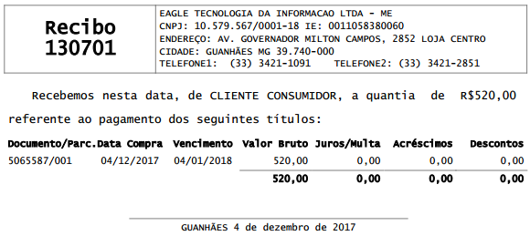

#### Opções Adicionais

Nesta tela existem duas funcionalidades que podem ser acessadas clicando com o **botão direito do mouse**.

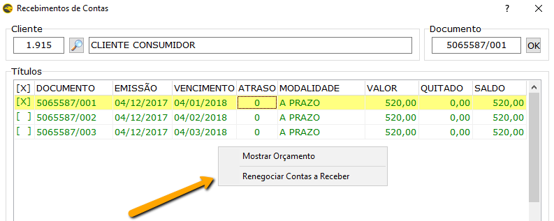

* Mostrar Orçamento - Caso a dívida seja proveniente de algum orçamento faturado no sistema, será possível visualizar os produtos ou serviços que originaram a conta selecionada.
* Renegociar Contas a Receber - Abre-se a tela para renegociar as contas sem a necessidade de fechar a janela atual. Veja a seção [Renegociação de Contas (a receber)](#renegociao-de-contas-a-receber).

 
### Estorno de Contas Recebidas

O Estorno representa a retificação de uma operação lançada indevidamente no sistema. Neste caso, a correção de um lançamento de um recebimento. Quando é feito o estorno, este recebimento passa para a situação de contas a receber.
Para acessar este recurso, vá em Financeiro / Contas a Receber / Estorno de Contas Recebidas.

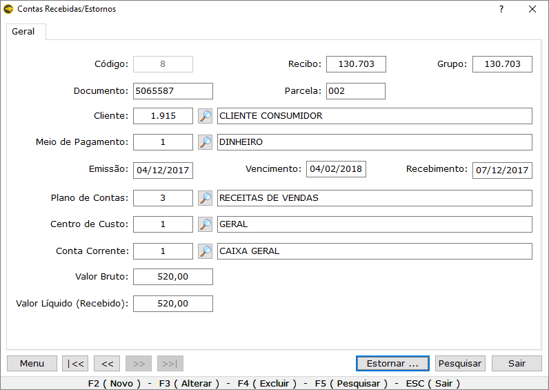

|Campo|Função|
|-----|------|
|Código|O sistema gera automaticamente.|
|Recibo|Número do Recibo.|
|Grupo|Identifica o documento ou o conjunto de documentos recebidos simultaneamente. É importante lembrar que é possível receber vários documentos do mesmo cliente, ao mesmo tempo, gerando o mesmo número (grupo).|
|Documento|Representa o número do documento que poderá ser estornado.|
|Parcela|Qual a parcela do documento poderá ser estornada.|
|Cliente|Qual cliente está vinculado ao documento identificado anteriormente.|
|Meio de Pagamento|Caso o pagamento a estornar seja proveniente de um lançamento a dinheiro, o sistema irá solicitar um novo meio de pagamento (a prazo).|
|Emissão / Vencimento / Recebimento|Datas que ajudam a identificar, com mais detalhes, o documento a ser estornado.|
|Plano de Contas|Classificação utilizada no momento em que foi vendido o produto ou serviço para o cliente.|
|Centro de Custo|Outro tipo de classificação utilizada para identificar a venda.|
|Conta Corrente|Destino selecionado para o creditar o pagamento.|
|Valor Bruto / Valor Líquido|Representam o valor recebido.|
|Botão "Estornar"|Utilizado para realizar o estorno do documento selecionado. Após o processo, ele será redirecionado para a seção de títulos a receber.|

! Nenhum dos campos que aparecem na tela pode ser alterado.

 
#### Menu de Estorno de Recebimentos

Quando duas ou mais contas são quitadas pelo cliente ao mesmo tempo, o sistema gera um número identificando o grupo de recebimentos. Existe a possibilidade, então, de **Estornar Grupo de Recebimentos** acessando Menu / Estornar Grupo de Recebimentos. Assim todas as contas recebidas nesse grupo retornam para a tela de [Recebimentos de Contas](#recebimentos-de-contas).

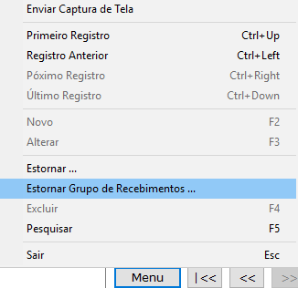

 
## Cheques

Esta é uma ferramenta disponibilizada pelo sistema Eagle Gestão, proporcionando à empresa um total controle de cheques emitidos e recebidos e o vínculo dos mesmos com as contas a pagar e a receber, possibilitando, também, ter o controle dos depósitos realizados. 

 
### Cadastro de Cheques

Para realizar o controle de cheques pelo sistema, é necessário realizar o cadastro dos mesmos, seja ele emitido ou recebido. Para realizar o processo, acesse Financeiro / Cheques.

#### Aba "Geral"

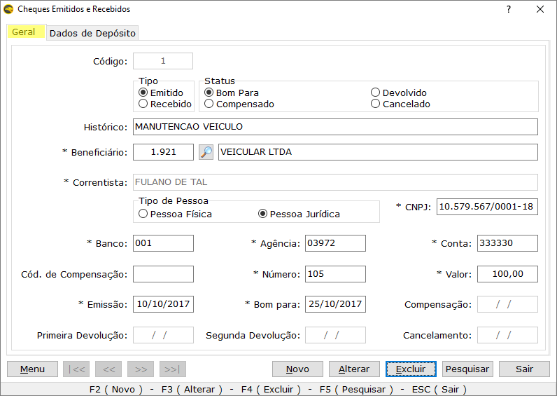

|Campo|Função|
|-----|------|
|Código|Gerado automaticamente.|
|Tipo|Definir o tipo do cheque.  - Cheque **Emitido**, deve-se selecionar o fornecedor que irá recebê-lo - (campo "Beneficiário").  - Cheque **Recebido**, seleciona-se o cliente  que entregou o cheque - (campo "Emitente").|
|Status|Define-se a situação atual do cheque: de acordo com o status selecionado, os campos correspondentes (últimos campos da tela de cadastro) são liberados para preenchimento.|
|Histórico|O campo pode ser preenchido com dados que esclareçam o motivo pelo qual o cheque foi emitido ou recebido.|
|Beneficiário / Emitente|Este campo é alterado de acordo com o campo "Tipo" definido anteriormente. Define-se quem está emitindo ou quem está recebendo o cheque.|
|Correntista| - Cheque **Emitido** - o campo poderá ser preenchido automaticamente de acordo com as informações da empresa registradas durante a implantação do sistema. O correntista também poderá ser selecionado de acordo com a conta corrente cadastrada no sistema. Neste caso, utilizar o campo "Banco" para fazer a seleção.  - Cheque **Recebido** - o sistema dá a opção de preencher o campo correntista com o mesmo nome do emitente ou deixar em branco, para que o próprio usuário preencha.|
|Tipo de Pessoa|Física ou Jurídica.|
|CNPJ / CPF|Informar o número do documento.|
|Banco|Seleciona-se, através da barra de espaço, as contas correntes válidas cadastradas no sistema: os campos "Banco", "Agência" e "Conta" serão preenchidos automaticamente.|
|Cód. de Compensação|Informar o número do Código de Compensação do cheque (campo "Comp").|
|Número|Informa-se o número do cheque.|
|Valor|Qual valor apresentado no cheque.|
|Emissão|Data em que o cheque foi emitido.|
|Bom Para|Data informada no cheque.|
|Data de Compensação / Primeira Devolução / Segunda Devolução / Cancelamento|Devem ser preenchidas de acordo com o status do cheque no decorrer do processo.|

 
#### Aba "Depósito"

Informações de depósito do cheque cadastrado.

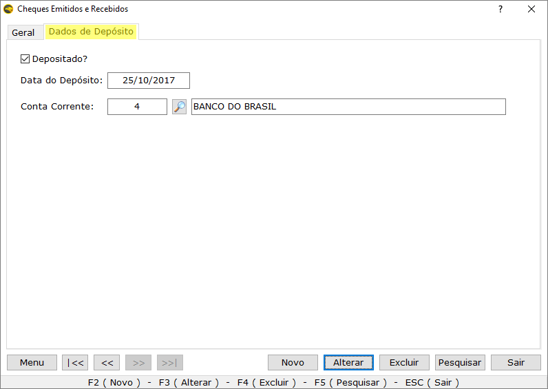

|Campo|Função|
|-----|------|
|Depositado?|Informar se o cheque foi ou não depositado.|
|Data de Depósito|A data deve ser igual ou posterior à data de compensação, informada na aba "Geral".|
|Conta Corrente|Para informar a conta, a mesma já deve estar cadastrada no sistema. Acesse [Cadastro de Contas Correntes](https://ajuda.eagletecnologia.com/manuais/eagle-gestao/modulo-cadastros#financeiro).|

 
#### Menu de Cheques

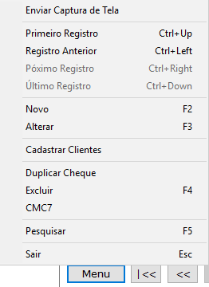

Entre as principais funcionalidades deste menu, estão:

* Cadastrar Clientes - acesso à tela de Cadastro de Clientes sem a necessidade de sair do Cadastro de Cheques.
* Duplicar Cheque - Utilizado, quando se tem mais de um cheque emitido (para o mesmo beneficiário) ou recebido (do mesmo cliente). Ao duplicar o cheque, deve-se alterar o seu número, a data de vencimento e o valor, caso seja diferente do cheque anterior.
* CMC7 - O Cadastro de um cheque pode ser feito através do código identificador do cheque, o CMC7. Ao inserir o código, o restante das informações serão preenchidas automaticamente.

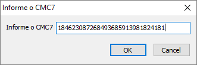

 
### Vinculação de Cheques

O vínculo de cheques serve para associá-lo a contas a receber ou a pagar. Quando um cheque é vinculado a uma conta, assim que o mesmo é compensado, o sistema dá baixa na conta com o valor do cheque. Ao receber ou pagar uma conta, o cheque é compensado. 

 
#### Vincular Cheques no Momento da Venda

O vínculo de cheques recebidos com suas respectivas contas, proporciona um maior controle do movimento de cheques dentro da empresa e agiliza as consultas dos mesmos. Pode-se vincular um ou mais cheques à mesma conta. Quando se realiza a venda e se cadastra o cheque no ato da mesma, o sistema relaciona, automaticamente, o cheque à conta a receber. Veja um exemplo:

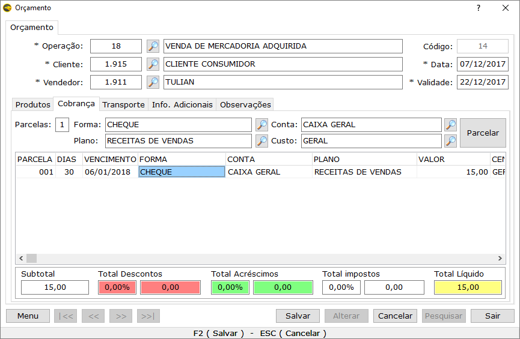

Utilizando o botão Menu e acessando a opção "Cheques Recebidos" (atalho **F9**), é possível cadastrar o cheque rapidamente. Veja a figura.

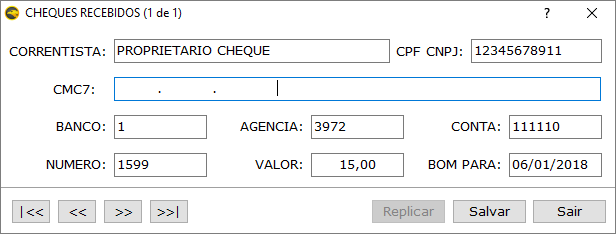

|Campo|Função|
|-----|------|
|Correntista|Nome do proprietário do cheque.|
|CPF CNPJ|Documento de identificação do proprietário do cheque.|
|CMC7|Código identificador do cheque - ao inserir o código, o restante das informações serão preenchidas automaticamente.|
|Banco / Agência / Conta / Número|Preencher apenas se não for informado o CMC7.|
|Valor|O valor do cheque já é preenchido pelo sistema de acordo com o valor da venda realizada.|
|Data|Também é preenchida de acordo com a data de vencimento da venda.|

! Para que o processo seja efetivado, é preciso **salvar o cadastro** do cheque, **salvar a venda** e, posteriormente, **faturá-la**. Para mais detalhes acesse o [Modulo de Vendas e Faturamento](https://ajuda.eagletecnologia.com/manuais/eagle-gestao/modulo-vendas-e-faturamento "Módulo de Vendas e Faturamento"). Através do caminho Financeiro / Cheques, é possível conferir o cheque vinculado.

 
#### Vincular Cheques com Contas a Receber

Também é possível realizar a vinculação posteriormente. Para isso é necessário que a venda seja realizada ou que se faça o lançamento da conta a receber. Veja a seção [Lançamento de Contas a Receber com Cheques](#aba-cheques-1 "Lançamento de Contas a Receber com Cheques").

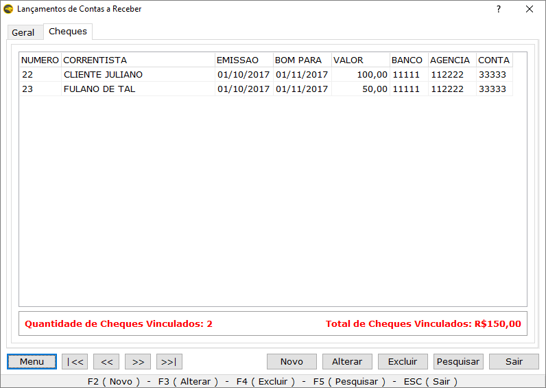

 
#### Recebimento de Contas com Cheques Vinculados

Para que as contas vínculadas aos cheques sejam recebidas, há duas opções:
* **Compensação do Cheque** - para realizar a compensação, deve-se acessar Financeiro / Cheques e mudar o status do cheque para "Compensado". Ao pesquisar pela conta vinculada a ele, verifica-se que essa conta não estará mais pendente.

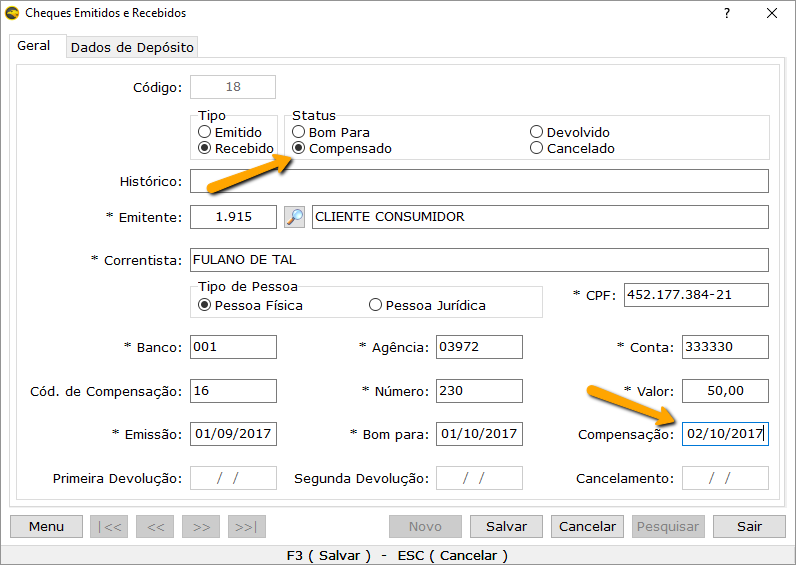

* **Recebimento da Conta** - para realizar o recebimento, deve-se acessar Financeiro / Contas a receber / Recebimento de Contas. Basta selecionar a conta, clicar sobre o botão "Receber" e confirmar o processo.

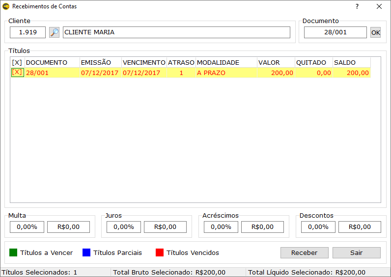

 
#### Vincular Cheques com Contas a Pagar

O vínculo de cheques em contas a pagar procede da mesma forma que em contas a receber e também pode-se vincular um ou mais cheques à mesma conta. Para realizar um vínculo com uma conta a pagar acesse Financeiro / Contas a Pagar / Lançamentos de Contas a Pagar. Basta localizar a conta, acessar a aba "Cheques" e fazer a vinculação do mesmo. Veja a seção [Lançamento de Contas a Pagar com Cheques](#aba-cheques "Lançamento de Contas a Pagar com Cheques").

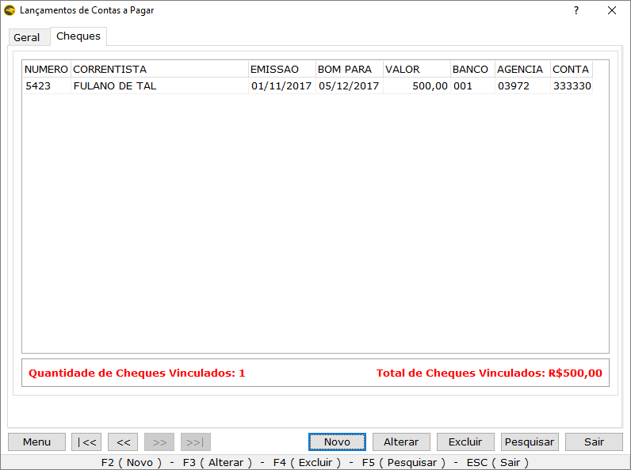

 
#### Pagamento de Contas vinculadas ao Cheque 

Para que as contas sejam pagas, há duas maneiras:

* **Compensação do Cheque** - de maneira semalhante ao recebimento de contas, acesse Financeiro / Cheques e altere o status para "Compensado". Verifica-se, após esse processo, que a conta foi quitada.

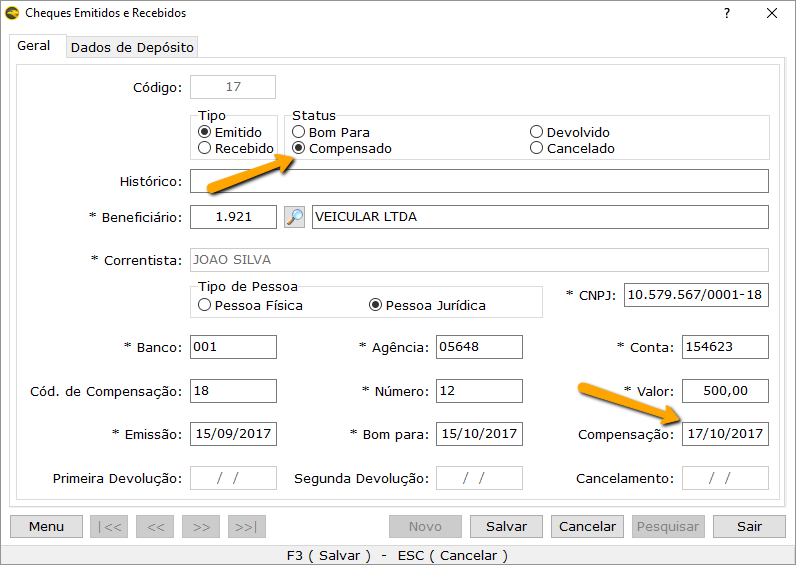

* **Pagamento da Conta** - para realizar o pagamento da conta vinculada ao cheque acesse Financeiro / Contas a Pagar / Pagamentos de Contas. Basta selecionar a conta a pagar, confirmar o pagamento e a compensação do cheque.

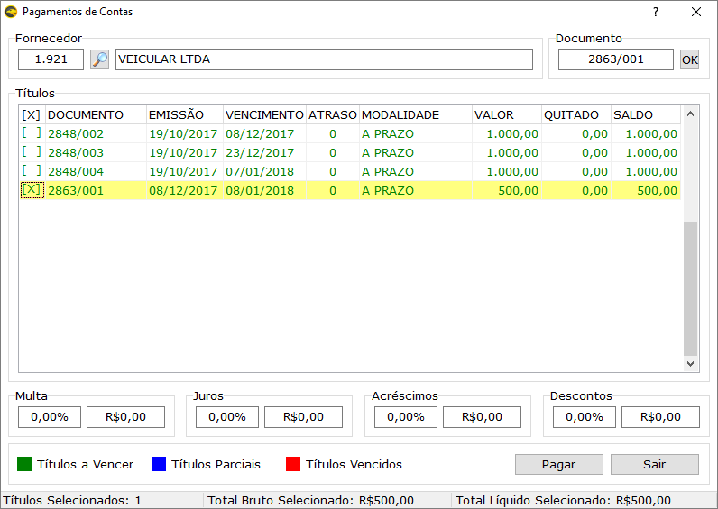

! Após o pagamento o cheque também poderá ser consultado em Financeiro / Cheques.

 
## Conciliação Bancária

A funcionalidade de Conciliação Bancária permite um controle comparativo entre suas movimentações bancárias e lançamentos realizados no sistema. A conciliação bancária é muito importante para a garantia de que o saldo disponível das contas bancárias da empresa possa ser realmente considerado para tomada de decisões.  Para ser realizada, deve-se possuir o arquivo no formato **OFX** (_Open Financial Exchange_) que é uma estrutura de informações que os bancos oferecem para representar o extrato. Esta informação será importada pelo sistema e os registros do extrato bancário vinculados aos lançamentos realizados. 
 Para que o processo abaixo seja efetuado, é preciso que a conta corrente correspondente esteja cadastrada no sistema. Caso seja necessário cadastrar uma nova conta corrente, acesse Cadastros / Financeiro / [Cadastro de Contas Correntes](https://ajuda.eagletecnologia.com/manuais/eagle-gestao/modulo-cadastros#financeiro).
 Acesse Financeiro / Conciliação Bancária.

1. Selecione o arquivo no formato OFX clicando sobre a lupa.
2. As informações da conta, do período e do saldo serão preenchidas de acordo com o extrato contido no arquivo.

3. Ao clicar em "Avançar", ou na aba "Conciliação", aparecerão as movimentações da conta bancária e a movimentação do fluxo de caixa.
4. Selecione a movimentação bancária e o lançamento realizado no sistema correspondente e clique em "Conciliar". Neste momento, o movimento ficará em verde, representando a conciliação. É importante observar que o valor do movimento bancário deve ser igual àquele informado no fluxo de caixa.

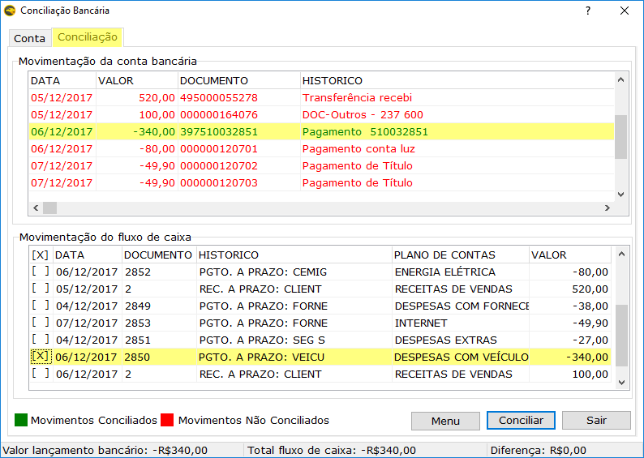

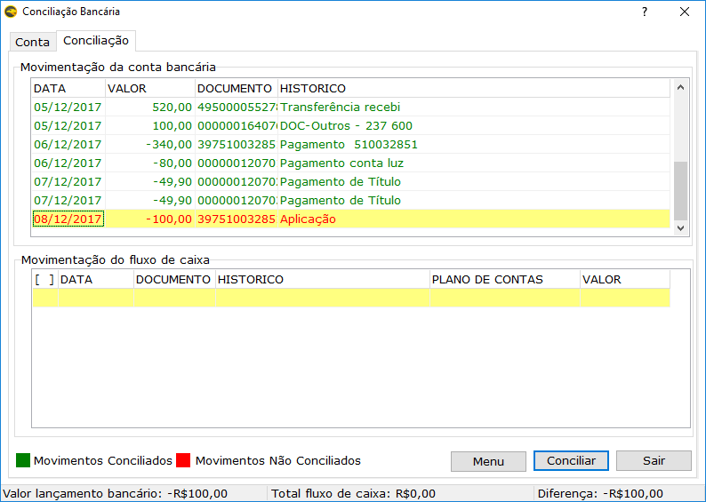

Exemplo de um processo concluído.

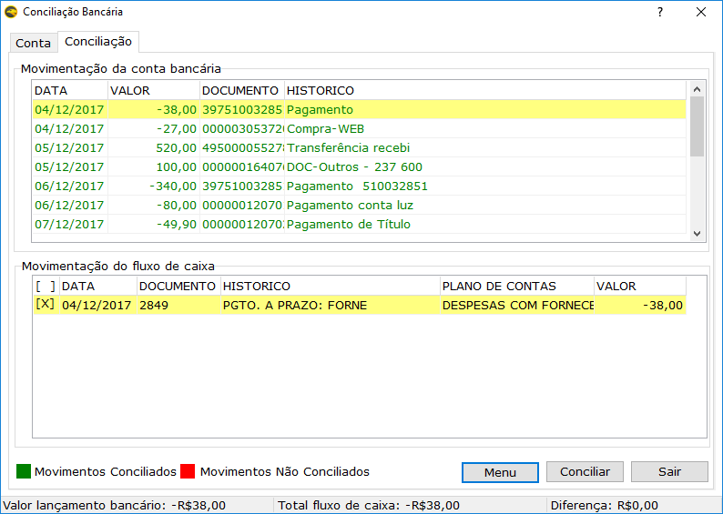

#### Menu de Conciliação Bancária

Este menu possui funcionalidades importantes que tem o propósito de auxiliar no processo de conciliação:

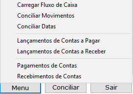

* Carregar Fluxo de Caixa - utilize-o para atualizar a movimentação do fluxo de caixa (parte inferior da tela), caso alguma alteração recente seja efetuada.
* Conciliar Movimentos - equivalente ao botão "Conciliar" - faz a conciliação entre a movimentação bancária e o fluxo de caixa selecionados.
* Conciliar Datas - realiza a conciliação entre todos os movimentos bancários e os lançamentos do fluxo de caixa, desde que possuam dados equivalentes. Após este processo, todos os movimentos bancários conciliados ficarão em verde.
* Lançamento de Contas a Pagar –atalho da tela de lançamento de conta a pagar para que lançamentos não realizados sejam feitos e conciliados aos movimentos bancários.
* Lançamento de Contas a Receber – atalho da tela de lançamento de conta a receber para que lançamentos não realizados sejam feitos e conciliados aos movimentos bancários.
* Pagamento de Contas – Atalho da tela de pagamento de contas para realização de pagamentos que não estejam no fluxo de caixa.
* Recebimento de Contas – Atalho da tela de recebimento de contas para realização de recebimentos que não estejam no fluxo de caixa.

 
## Lançamentos de Contas Correntes

Toda a movimentação financeira realizada dentro do sistema gera um lançamento financeiro numa determinada conta corrente, seja como débito ou como crédito. O recurso de lançamento de contas correntes possui todos os registros relacionados a qualquer movimentação financeira, desde que os mesmos estejam quitados. Este recurso representa mais uma alternativa de controlar o módulo financeiro e a possibilidade de incluir novas despesas ou receitas. Acesse Financeiro / Lançamentos de Contas Correntes.

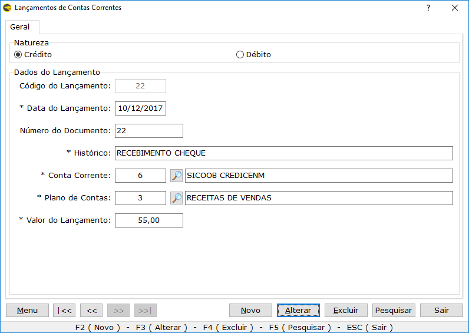

|Campo|Função|
|-----|------|
|Natureza|Define se é uma operação de **Crédito** ou **Débito**. O campo Plano de Contas é atualizado de acordo com a natureza selecionada.|
|Código|Gerado automaticamente.|
|Data do Lançamento|Dia em que ocorreu a operação. A data atual é carregada automaticamente, mas pode ser alterada.|
|Número do Documento|Identificador da operação. O sistema informa o mesmo número do código, mas pode ser alterado.|
|Histórico|Descrição sucinta da operação.|
|Conta Corrente|Origem ou destino do recurso financeiro. Caso seja necessário cadastrar uma nova conta corrente, acesse Cadastros / Financeiro / [Cadastro de Contas Correntes](https://ajuda.eagletecnologia.com/manuais/eagle-gestao/modulo-cadastros#financeiro).|
|Plano de Contas|Em qual categoria se enquadra a movimentação. O sistema exibe, automaticamente, a lista de planos de contas equivalentes à natureza da operação.|
|Valor do Lançamento|Valor do crédito ou débito.|

! Todos os movimentos financeiros realizados através de Pagamentos de Contas, Recebimentos de Contas e Vendas não podem ser alterados e nem excluídos nesta seção.

 
## Transferência entre Contas Correntes

Recurso destinado ao controle do saldo financeiro das contas correntes, cadastradas no sistema, através da movimentação de valores entre elas. Acesse Financeiro / Transferência entre Contas Correntes.

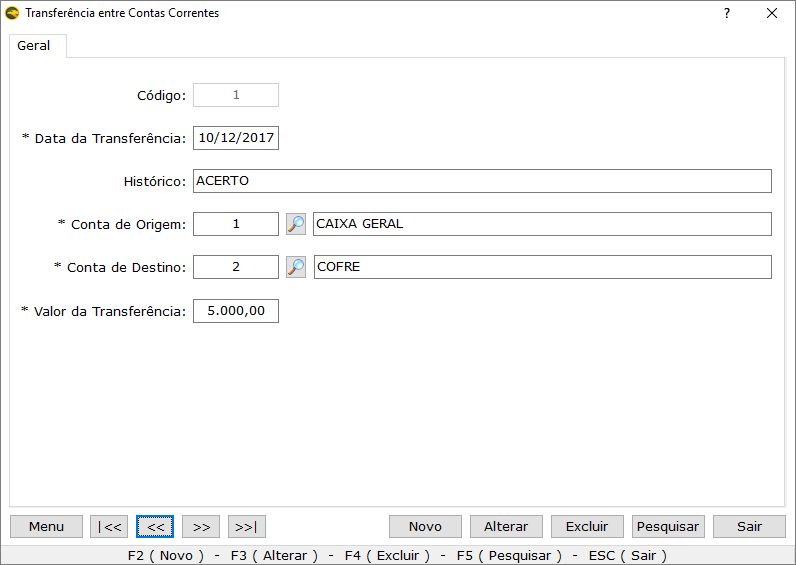

|Campo|Função|
|-----|------|
|Código|Número da operação.|
|Data da Transferência|Data em que a operação foi realizada.|
|Histórico|Descrição sucinta da operação.|
|Conta de Origem|Em qual conta corrente o valor foi retirado (mostra o saldo disponível).|
|Conta de Destino|Conta para onde a quantia foi depositada (mostra o saldo disponível).|
|Valor da Transferência|Valor financeiro transferido.|

 
## Fechamento de Contas Correntes

Use o fechamento de conta corrente para finalizar ou bloquear qualquer operação financeira na conta selecionada. Operações de Pagamentos, Recebimentos e Transferências, utilizando a conta em questão, não serão permitidos, considerando-se a data de bloqueio. Acesse Financeiro / Fechamento de Contas Correntes.

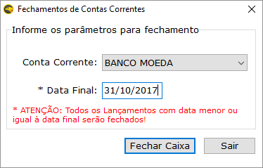

|Campo|Função|
|-----|------|
|Conta Corrente|Escolha a conta para realizar o bloqueio.|
|Data Final|Informe a data final – os movimentos financeiros, utilizando a conta selecionada e com data **anterior** ou **igual** à informada, serão **bloqueados**.
|Botão "Fechar Caixa"|Clique neste botão para confirmar o bloqueio.|

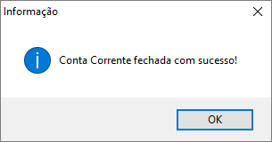

Exemplo de um bloqueio de movimentação na conta "BANCO MOEDA" ao tentar realizar um pagamento no dia 15/10/2017 (a data está no período informado para bloqueio).

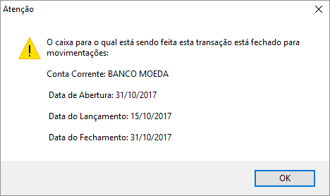

Se, ao tentar acessar a fechamento de contas correntes, todas elas já estiverem fechadas, o sistema exibirá a seguinte mensagem.

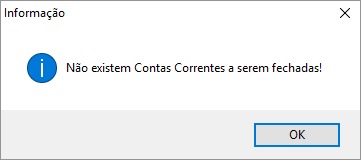

 
## Reabertura de Contas Correntes

Use o reabertura de conta corrente para reativar uma conta que foi bloqueada anteriormente. Qualquer operação financeira na conta selecionada será permitida, considerando-se a data de desbloqueio.  Acesse Financeiro / Reabertura de Contas Correntes.

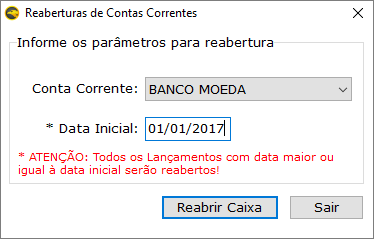

|Campo|Função|
|-----|------|
|Conta Corrente|Escolha a conta para realizar a reabertura.|
|Data Inicial|Informe a data inicial – os movimentos financeiros, utilizando a conta selecionada e com data **igual** ou **posterior** à informada, serão **desbloqueados**.
|Botão "Reabrir Caixa"|Clique neste botão para confirmar o desbloqueio.|

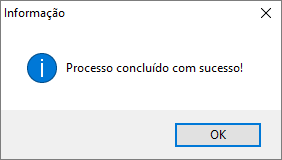

Se, ao tentar acessar a reabertura de contas correntes, todas elas já estiverem abertas, o sistema exibirá a seguinte mensagem.

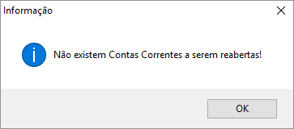