===

## Introdução

A Gestão de Estoque possibilita o controle das entradas e saídas assegurando a disponibilidade dos produtos de maneira eficiente.
O objetivo é evitar o excesso ou a falta de produtos, propiciando uma boa utilização do espaço físico, além de ajudar a controlar as finanças da empresa.
  Neste módulo, serão abordados o controle de Entradas e Saídas, Composições e Decomposições, Alteração de Preços, Impressão de Etiquetas e Ranking de Produtos.

 
## Notas de Entrada - XML

Todas as notas fiscais recebidas dos fornecedores devem ser lançadas no sistema para que o estoque dos produtos e as contas a pagar estejam sempre atualizados.
Para executar o processo, há duas alternativas: através da **importação do arquivo XML** ou da **entrada manual** (digitação de todos os dados da nota fiscal).

 
### Importação do XML

É um processo bem prático e que economiza muito tempo do usuário em relação ao modo manual.

Toda transação comercial deve ser registrada eletronicamente num **arquivo XML**. 
Esse arquivo representa a própria Nota Fiscal Eletrônica e possui, portanto, validade fiscal.
Já o **DANFE** (Documento Auxiliar de Nota Fiscal Eletrônica) é uma versão simplificada e impressa da Nota Fiscal Eletrônica. 
Apesar de não ter validade fiscal, ele é utilizado para o transporte de mercadorias.

O processo para importação do arquivo XML é bem prático e agiliza o processo de entrada de mercadorias.
Para isso é preciso que o usuário tenha o arquivo XML (nota fiscal propriamente dita) ou pelo menos a chave de acesso que consta no DANFE da nota. 
O arquivo XML deve ser enviado pelo fornecedor.

Para se ter acesso à tela de importação de Nota Fiscal, siga as etapas:

1. Vá ao menu Estoque / Entradas ou utilize a tecla de atalho F11.
2. Clique em Menu / NF-e Importar XML

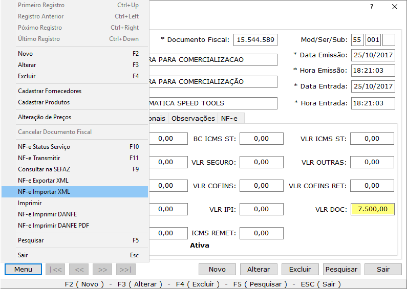

**Menu de ajustes para importação da NF-e**

Neste momento, o sistema conta um menu de funcionalidades que podem ser utilizadas quando há a necessidade de realizar determinados ajustes antes de finalizar a importação.

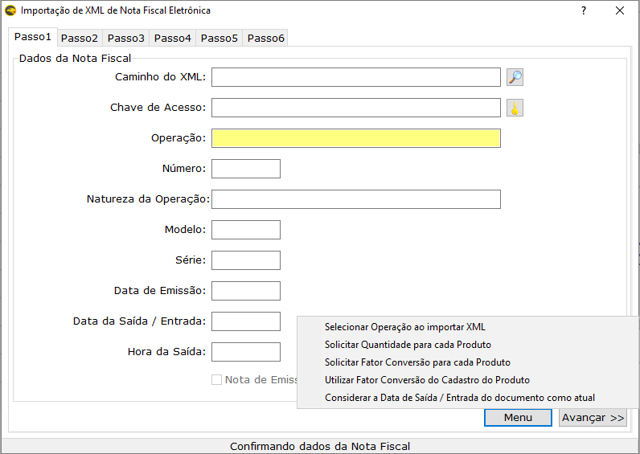

* **Selecionar Operação ao importar XML** - Função que proporciona a mudança de operação antes de concluí-la. É utilizada quando a nota representar um outro tipo de operação como, por exemplo, de uso e consumo. 
* **Solicitar Quantidade para cada Produto** -  Utilizada quando os produtos da nota vierem, por exemplo, em pacote ou em caixa e se a venda for em unidades. 
Ao utilizá-la, pode–se marcar essa opção e inserir a quantidade de cada produto. Exemplo: Compra de 1 caixa de lápis com 50 unidades -  deve ser indicado 50 unidades. 
* **Solicitar Fator de Conversão para cada Produto** – Também utilizado em agrupamento de produtos. Exemplo: 60 ovos são comprados e indica-se o fator de conversão 12, ou seja, aquelas 60 unidades irão se transformar em 5 dúzias de ovos. 
* **Utilizar Fator de Conversão do Cadastro do Produto** - Ao selecioná-la, o sistema irá pegar o valor de fator de conversão indicado do cadastro do produto. Neste caso não é necessário digitar o fator ao importar o XML.
* **Considerar a Data de Saída / Entrada do documento como atual** - Ao selecionar essa opção e ao concluir a entrada da nota, o sistema irá considerar a data atual para a operação de entrada.

! Nunca se deve selecionar as duas opções "Solicitar Quantidade para Cada Produto" e "Solicitar Fator Conversão para Cada Produto" ao mesmo tempo.

3. Informe o local onde arquivo XML está armazenado (clique sobre a lupa).

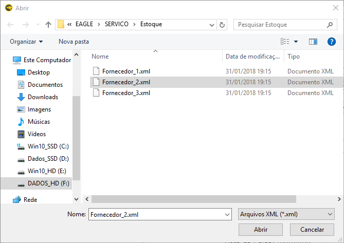

4. Neste momento, o sistema pergunta se o usuário deseja visualizar o DANFE (Documento Auxiliar de Nota Fiscal). Independentemente da escolha, o usuário deverá continuar seguindo os próximos passos, que serão representados em **Abas**.

**Aba "Passo 1"**

Confira os dados apresentados e, caso seja necessário, corrija o campo de **operação de entrada** e clique em Avançar.

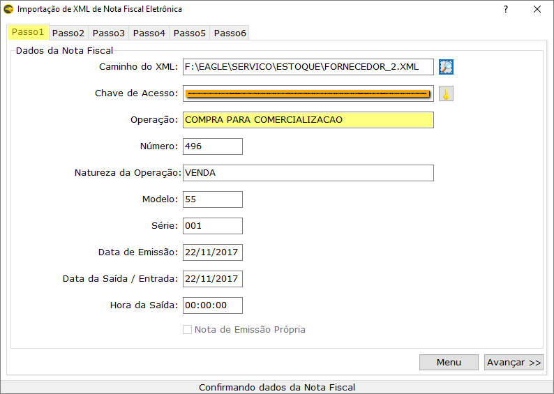

**Aba "Passo 2"**

Na segunda aba são exibidos os **dados do emitente**. Clique em Avançar.

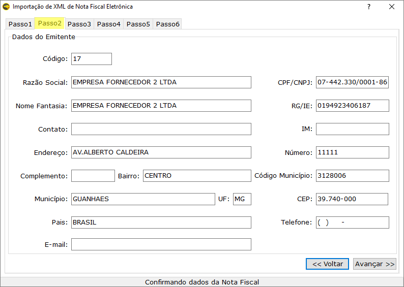

** Aba "Passo 3"**

Mostra os **dados do destinatário**. Clique em Avançar.

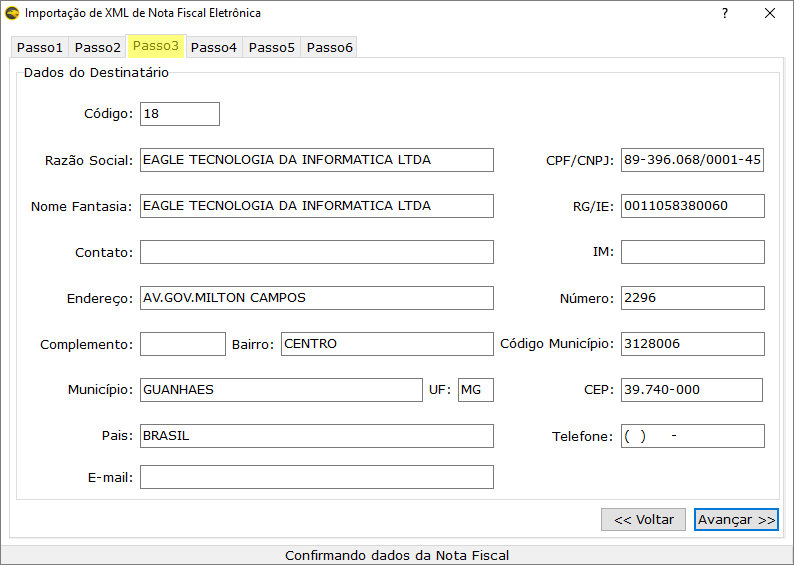

**Aba "Passo 4"**

Esta seção lista os **produtos da nota**. Aqui se exige uma atenção maior, pois os produtos relacionados podem já estar cadastrados com códigos e nomes diferentes se comparado à relação do fornecedor.

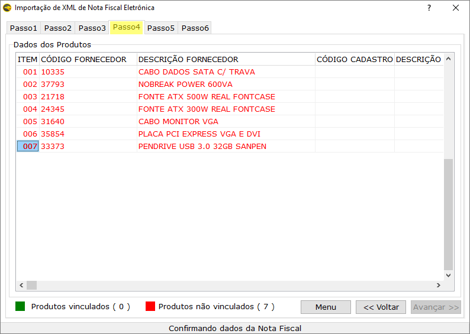

**Menu de Produtos**

Esta seção conta com recursos do Menu para ajustes de vinculação de produtos.

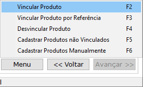

* **Vincular Produtos F2** – Usado para acessar a tela de cadastro de produtos e vincular algum produto já existente, na base do sistema, com um determinado produto da nota.
* **Vincular Produtos por Referência F3** - Caso saiba a referência do produto, não há a necessidade de abrir a tela de cadastro de produtos para realizar o vínculo. Apenas digite a referência para que os produtos fiquem vinculados.
* **Desvincular Produtos F4** - Utilize essa função caso tenha ocorrido o vínculo incorreto do produto. Após este comando, o produto será desvinculado. 
* **Cadastrar Produtos não Vinculados F5** -  Cadastra automaticamente os produtos que ainda não estão na base de dados e que, consequentemente, não estejam vinculados.  Ao realizar esse cadastro o produto fica com a descrição da nota do fornecedor.
* **Cadastrar Produtos manualmente F6** -  Use essa função caso queira cadastrar os produtos com descrição diferente da nota do fornecedor. Através deste recurso, faz-se o cadastro manual e depois vincula-se o mesmo ao produto da nota.

 
Neste passo, o usuário deverá verificar quais produtos já estão cadastrados e se possuem a vinculação.
Primeiramente, deve-se vincular os produtos já cadastrados na base do sistema:

1. Clique 2 vezes sobre o produto ou selecione-o e acesse o botão Menu / **Vincular Produtos F2**.

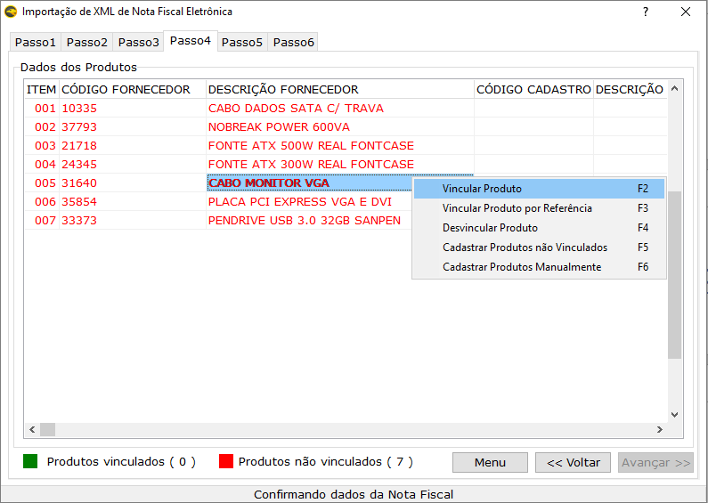

2. Selecionar o seu correspondente no cadastro de produtos.

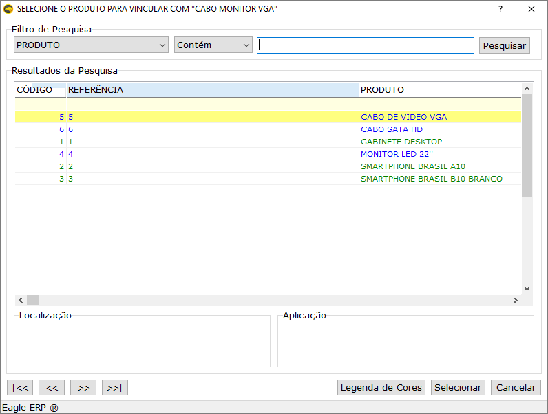

3. Neste ponto, é possível verificar o produto já vinculado e representado pela cor {c:green}verde{/c}.

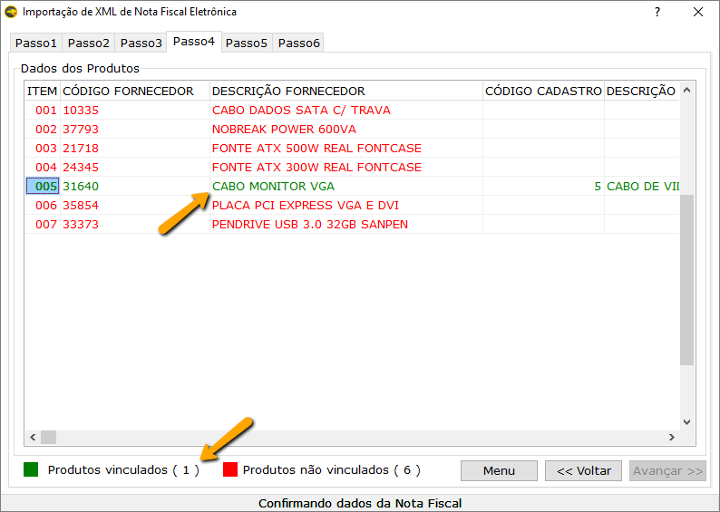

! É importante frisar que não será mais necessário vincular esse **mesmo produto** para as próximas notas desse **mesmo fornecedor**.

! Se o usuário vincular o produto incorretamente, basta selecionar o produto novamente e clicar em Menu / Desvincular Produto F4.

 
Para os produtos que continuam em vermelho e não estão cadastrados no sistema, faça o seguinte processo:

1. Clique em Menu / **Cadastrar Produtos não Vinculados  F5**. 
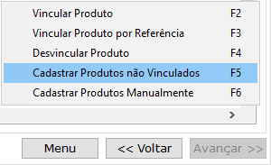

2. Confirme a mensagem exibida pelo sistema.
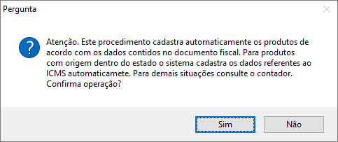

3. Eles serão cadastrados com a mesma descrição informada pelo fornecedor.
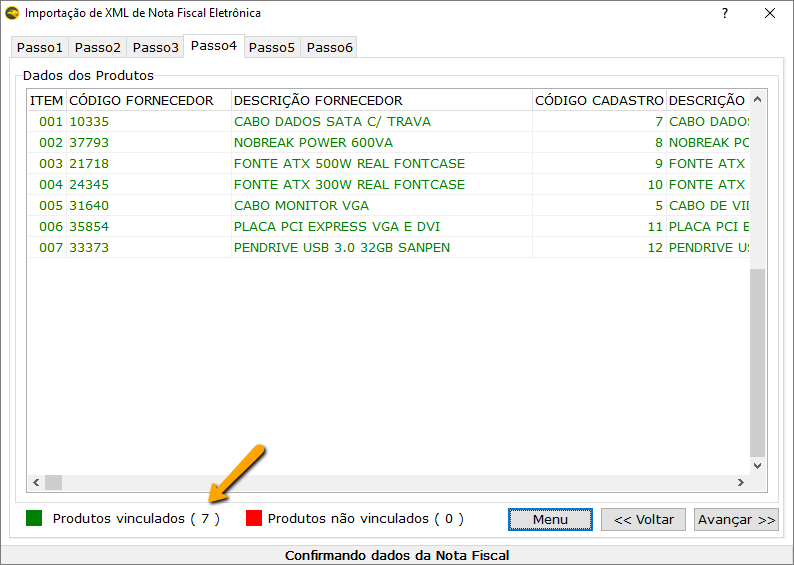

! Os produtos cadastrados automaticamente deverão ser analisados posteriormente pelo usuário. O mesmo deverá conferir e completar os dados, observando, principalmente, a unidade e os dados tributários.

 
**Aba "Passo 5"**

Aqui são exibidos os dados de **Cobrança** da nota detalhando as parcelas respectivas. Após a conferência, clique em avançar.

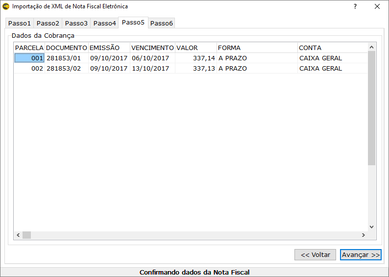

 
**Aba "Passo 6"**

Na última aba, são exibidos os totais da nota, incluindo os impostos, frete, desconto e o valor total dos produtos.

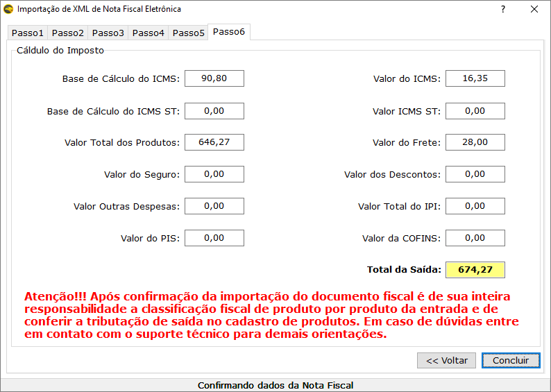

Para finalizar o processo clique em "Concluir". Neste momento, o usuário também poderá importar outro arquivo xml apenas confirmando a mensagem exibida pelo sistema.

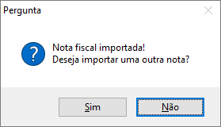

Se a resposta for negativa, será aberta uma nova caixa de diálogo dando a opção para a revisão de preços dos produtos da NFE importada.

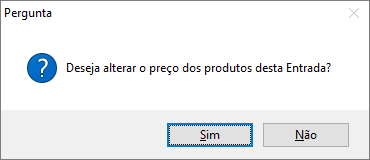

### Alteração de Preços - NF-e

Nesta tela são exibidos os produtos e os detalhes referentes ao preço de compra, de custo e de venda.

A revisão de preços é um processo importante tendo em vista que não se pode levar em consideração apenas o preço de compra do produto.
Para que seja calculado uma margem de lucro coerente, é necessário saber o preço de custo final do produto, ou seja, os custos adicionais também são processados (impostos e frete, por exemplo).

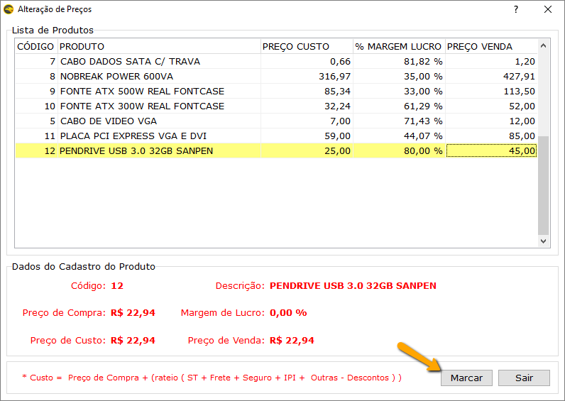

 
**Lista de Produtos**

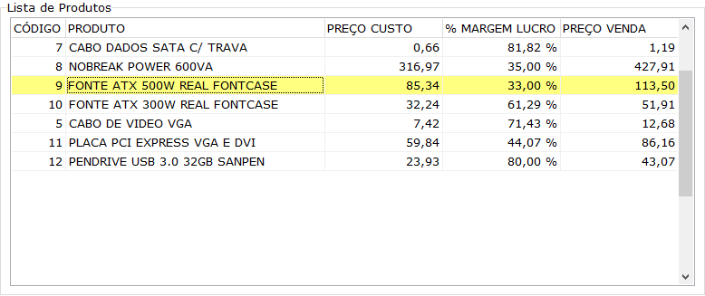

|Campo|Função|
|-----|------|
|Código|Sequência de identificação do produto na base de dados.|
|Produto|Descrição do produto cadastrado.|
|Preço Custo|Preço de compra do produto somado ao rateio de custos adicionais e subtraído de possíveis descontos. Este campo é calculado automaticamente, mas se for necessário alterá-lo, deve-se clicar sobre ele e digitar o novo valor.|
|% Margem Lucro|Percentual de lucro sobre o produto. Deve ser informado selecionando o campo e digitando a nova porcentagem. Se os outros campos forem alterados, a Margem de Lucro também será atualizada.|
|Preço Venda|Valor final para venda. O valor poderá ser informado selecionando o campo e digitando o novo valor. Este campo também se atualiza caso os outros sejam alterados.|

 
**Dados do Produto**

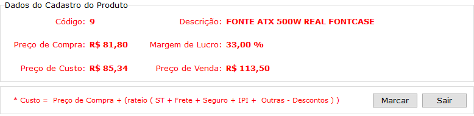

|Campo|Função|
|-----|------|
|Código|Sequência de identificação do produto na base de dados.|
|Descrição|Nome do produto cadastrado.|
|Preço de Compra|Valor do produto adquirido sem levar em consideração os custos adicionais ou descontos.|
|Preço de Custo|Valor do preço de compra somando-se o rateio dos custos e descontos da nota fiscal.|
|Margem de Lucro|Percentual de lucro calculado sobre o Preço de Custo.|
|Preço de Venda|Valor do Produto calculado sobre o Preço de Custo, utilizando a Margem de Lucro.|
|Botão **Marcar**|Utilizado para confirmar as alterações efetuadas, fazendo com que o cadastro de produtos seja atualizado.|
|Botão **Sair**|Fecha a tela de Alteração de Preços.|

! A tela de Alteração de Preços poderá ser acessada a qualquer momento através do menu principal Estoque / Entradas. Basta selecionar a Nota cadastrada e clicar sobre o botão Menu / Alteração de Preços.

! Também é possível modificar os preços através do menu [Estoque / Alteração de Preços](#alterao-de-preos).

 
## Notas de Entrada - Manual

Para realizar o cadastro da Nota Fiscal de Entrada manualmente, acesse Estoque / Entradas ou pressione F11.

Clique em "Novo" e comece a preencher os campos correspondentes de acordo com o documento.

**Guia Geral**

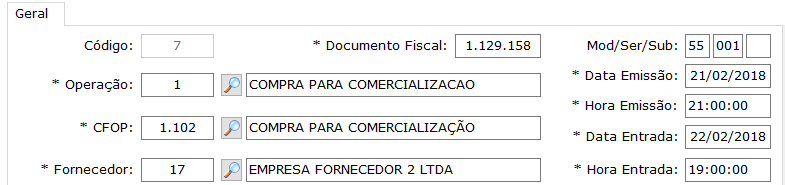

|Campo|Função|
|-----|------|
|Código|Identificador gerado automaticamente durante o cadastro da nota fiscal.|
|Documento Fiscal|Informar o número da NF-e, exibido na parte superior do DANFE.|
|Operação|Está diretamente relacionado com o campo CFOP (Códigos Fiscais de Operações e Prestações). Clique sobre a lupa para escolher a operação adequada.|
|CFOP|Em notas com mais de um CFOP, considerar o que aparece mais vezes na nota e informar no cadastro o código correspondente. Para Todo CFOP do Fornecedor, existe um outro relacionado para cadastro de entrada da nota. Observar a compatibilidade com a UF, ou seja, iniciado por 1 ou 5 nas operações internas, 2 ou 6 nas interestaduais e 3 ou 7 nas importações /exportações.|
|Fornecedor|Escolher o fornecedor através da lupa. Se o mesmo não for encontrado, poderá ser cadastrado, acessando o botão Menu / Cadastrar Fornecedores.|
|Mod/Ser/Sub|Modelo e Série da Nota. Preenchido automaticamente de acordo com a operação escolhida.|
|Data Emissão|Dia de emissão da nota. O sistema preenche automaticamente, mas poderá ser alterado.|
|Hora Emissão|Hora de emissão da nota. É preenchido automaticamente, mas também poderá ser atualizado.|
|Data Entrada|Dia em que a nota é registrada no sistema. Preenchido automaticamente.|
|Hora Entrada|Hora em que a nota é registrada no sistema. Preenchido automaticamente.|

 
**Aba "Totais"**

Observar a DANFE com atenção e repassar todos os valores nela contidos para os campos correspondentes na tela de cadastro.

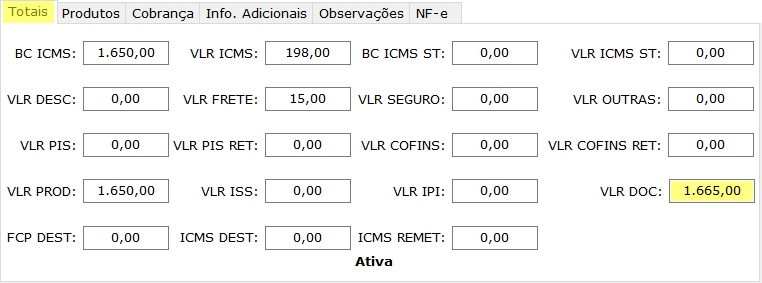

 
**Aba "Produtos"**

Relaciona todos os produtos listados na Nota Fiscal.

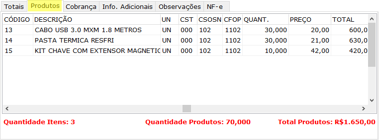

* Para **alterar um produto** - basta pressionar a barra de espaços e localizar o produto desejado na tela de pesquisa.
* Para **inserir um produto** - clique em Menu / Adicionar Produto à Lista ou pressione a tecla Insert. Logo após, pressione a barra de espaços para localizar o produto.
* Para **retirar um produto** - clique em Menu / Retirar Item da Lista ou pressione CTRL e Delete.

Ao **clicar duas vezes sobre algum produto**, uma nova tela se abre exibindo todos os campos referentes ao mesmo.

|Campo|Função|
|-----|------|
|CFOP|Observar o CFOP (Código Fiscal de Operações) da Nota Fiscal e entrar com o seu correspondente.|
|QUANT|Informar a quantidade de determinado produto.|
|VLR UNIT|Informar o valor unitário de determinado produto.|
|VLR TOTAL|Calculado automaticamente pelo sistema (quantidade x valor unitário).|
|CST ICMS|Entrar com o CST (Código da Situação Tributária) que vem na Nota. Se for necessário cadastrar um produto, o CST ou CSOSN deve ser convertido.|
|BC ICMS|Informar a Base de Cálculo do ICMS de acordo com a Nota.|
|AL ICMS|Alíquota do ICMS (dado em porcentagem) de acordo com a Nota.|
|VLR ICMS|Valor do ICMS calculado de acordo com a porcentagem anterior.|
|MVA|Margem de Valor Agregado.|
|BC ICMSST|Base de Cálculo ICMS Substituição Tributária.|
|AL ICMSST|Alíquota do ICMS Substituição Tributária.|
|VLR ICMSST|Valor correspondente aos registros anteriores.|
|CST PIS / BC PIS / AL PIS / VLR PIS|Dados correspondentes ao PIS: CST, Base de Cálculo, Alíquota e Valor.|
|CST COFINS / BC COFINS / AL COFINS / VLR COFINS|Dados correspondentes ao COFINS: CST, Base de Cálculo, Alíquota e Valor.|
|CST IPI / BC IPI / AL IPI / VLR IPI|Dados correspondentes ao IPI: CST, Base de Cálculo, Alíquota e Valor.|
|DESCONTOS|Desconto(s) concedido(s) pelo fornecedor. Se a nota possuir mais de um produto, este valor deve ser rateado.|
|FRETE|Valor de frete. Este valor deve ser rateado entre os produtos cadastrados.| 
|SEGURO|Valor de seguro. Também observar o rateio do valor entre os produtos.|
|OUTRAS|Outros valores de despesas (observar, também, o rateio de valor).|
|TOTAL LIQ|Total líquido do produto após inclusão de outras despesas ou descontos.|
|VALIDADE|Validade do produto, utilizado para controle e emissão de relatórios de validades.|
|PED. COMP|Pedido de compra.|
|ITEM PED|Item do pedido de compra.| 
|Partilha do ICMS|São informações a serem preenchidas em notas de saída.|

! Após o preenchimento, o sistema grava as informações automaticamente. Basta preencher o campo e mudar o foco utilizando a tecla TAB ou clicando com o mouse em outro campo.

! Nessa janela ainda é possível incluir um produto através do botão **"Novo"**, **"Excluir"** o produto da nota fiscal ou, simplesmente, **"Sair"** da tela.

 
**Aba "Cobrança"**

Insira as parcelas e a forma de pagamento e clique em "Parcelar".

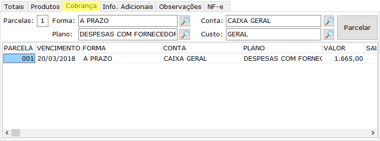

 
**Aba "Informações Adicionais"**

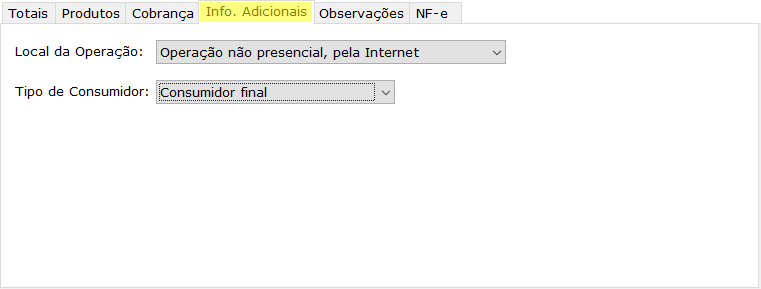

|Campo|Função|
|-----|------|
|Local da Operação|Define se a operação de compra é presencial ou não.|
|Tipo de Consumidor|Escolha entre consumidor normal ou final.|

 
**Aba "Observações"**

Nesta seção são inseridas algumas informações complementares que se fizerem necessárias.

 
**Aba "NF-e"**

Detalha o tipo de Nota Fiscal Eletrônica. Quando importado via XML, as informações são preenchidas automaticamente.

 
Neste ponto, ao salvar a nota, o sistema verifica possíveis inconsistências entre os valores informados e dá ao usuário a possibilidade de visualizar um relatório contendo os valores divergentes, quando for o caso.

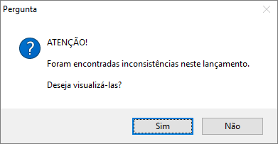

Através do relatório, é possível analisar os dados e fazer as correções que se fizerem necessárias.

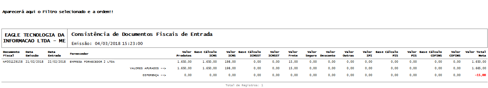

! Quando houver inconsistências, deve-se observar os totais (aba "totais") informados na nota e os valores atribuídos para cada produto (aba "produtos"). Exemplo: Se a nota vem com um frete de R$ 15,00, o total do documento deve ser igual ao valor dos produtos mais o frete. Além disso, o frete deve ser rateado entre os produtos.

Ao final do processo, o sistema solicitará uma informação referente a duplicata da Nota Fiscal.

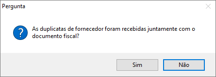

Caso as duplicatas declaradas na cobrança tenham sido recebidas com a nota fiscal, clique em "Sim". Se a resposta for "Não", a cobrança dessa nota ficará pendente de autenticação. 

 
** Alteração de Preços após a Entrada Manual**

Após preencher a nota de entrada, é possível saber os valores de cada produto levando-se em consideração todos os impostos incluídos. 
O usuário poderá realizar os ajustes de preço baseando-se nos valores que o sistema sugere (valor inicial dos produtos + despesas – descontos). 
Para executar o processo, faça da seguinte forma:
1. Clique em Menu / Alteração de Preços.
2. Selecione o produto e confira os preços de custos.
3. Faça as alterações no preço de venda ou insira a margem de lucro desejada. 
4. Clique em **Marcar**.

! Para mais informações, acesse [Alteração de Preços - NF-e](#alterao-de-preos-nf-e), detalhada na seção de Importação de XML.
! A revisão de preços também poderá ser acessada através do menu [Estoque / Alteração de Preços](#alterao-de-preos).

 
### Menu de Documentos Fiscais de Entrada

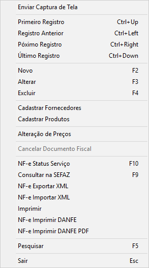

Principais funcionalidades:

* Cadastrar Fornecedores - Acesso rápido ao Cadastro de Fornecedor, caso o mesmo ainda não esteja na base de dados.
* Cadastrar Produtos - Atalho para acesso ao Cadastro de Produtos.
* Alteração de Preços - Utilizado para realizar ajustes dos preços dos produtos. Saiba mais em [Alteração de Preços - NF-e](#alterao-de-preos-nf-e).
* NF-e Transmitir F11 - Transmissão da Nota Fiscal Eletrônica - NF-e.
* NF-e Exportar XML - Exporta o arquivo XML da NF-e.
* NF-e Importar XML - Importação de XML para que a Nota de Entrada seja cadastrada automaticamente. 
* Imprimir - Gera um relatório da Nota Fiscal para impressão.
* NF-e Imprimir DANFE - Impressão  do DANFE (Documento Auxiliar de Nota Fiscal Eletrônica).
* NF-e Imprimir PDF - O DANFE abre em PDF para consulta ou impressão.

 
## Notas de Saída

Nesta seção, o sistema apresenta todos os orçamentos baixados ou faturados, as vendas de cupom fiscal e todas as outras notas fiscais de saída, como, por exemplo, as notas fiscais eletrônicas.

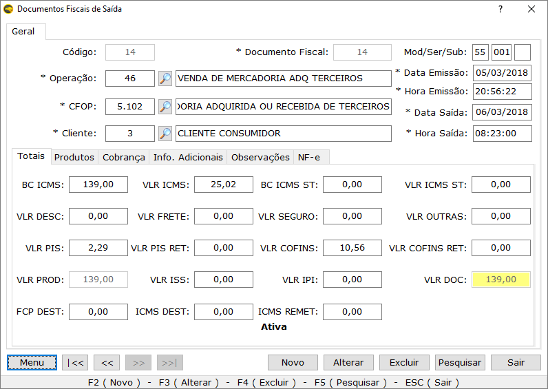

Para iniciar o processo de cadastro e emissão de uma Nota Fiscal de Saída, acesse o menu Estoque / Saídas ou pressione F12.
Após clicar em "Novo", preencha os campos correspondentes.

 
**Guia Geral**

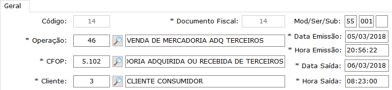

|Campo|Função|
|-----|------|
|Código|Identificador gerado automaticamente durante o cadastro da nota fiscal.|
|Documento Fiscal|Código na nota fiscal gerado pelo sistema.|
|Operação|Está diretamente relacionado com o campo CFOP (Códigos Fiscais de Operações e Prestações). Clique sobre a lupa para escolher a operação adequada.|
|CFOP|Insira o código correspondente, clicando sobre a lupa.|
|Cliente|Selecionar o cliente que compra o produto ou serviço. Se o mesmo não for encontrado, poderá ser cadastrado, acessando o botão Menu / Cadastrar Clientes.|
|Mod/Ser/Sub|Modelo e Série da Nota. São preenchidos de acordo com a operação escolhida.|
|Data Emissão|Dia de emissão da nota. O sistema preenche automaticamente, mas poderá ser alterado.|
|Hora Emissão|Hora de emissão da nota. É preenchido automaticamente, mas também poderá ser atualizado.|
|Data Saída|Dia em que a nota é despachada.|
|Hora Saída|Hora em que a nota é despachada.|

 
**Aba "Totais"**

Informar, nos campos apropriados, os valores referentes a impostos, descontos, fretes, seguros ou outras despesas. O campo "VLR PROD" é calculado de acordo com os produtos informados.

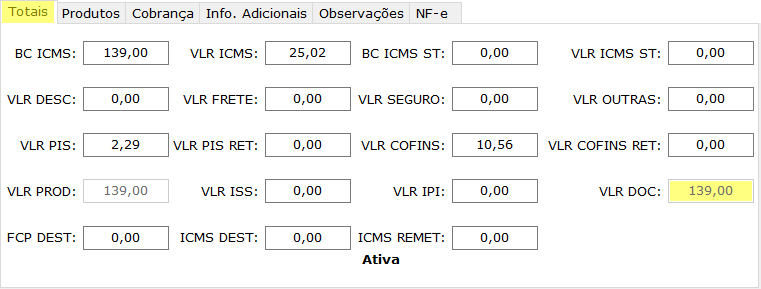

 
**Aba "Produtos"**

Nesta aba, informam-se todos os produtos que compõem a nota.
A aba produtos exibe os principais campos (código, descrição, unidade, CST, CFOP, quantidade, preço e total).

 da Nota")

* Para **alterar um produto** - basta pressionar a barra de espaços e localizar o produto desejado na tela de pesquisa.
* Para **inserir um produto** - clique em Menu / Adicionar Produto à Lista ou pressione a tecla Insert. Logo após, pressione a barra de espaços para localizar o produto.
* Para **retirar um produto** - clique em Menu / Retirar Item da Lista ou pressione CTRL e Delete.

Ao **clicar duas vezes sobre algum produto**, uma nova tela se abre exibindo todos os campos referentes ao mesmo.

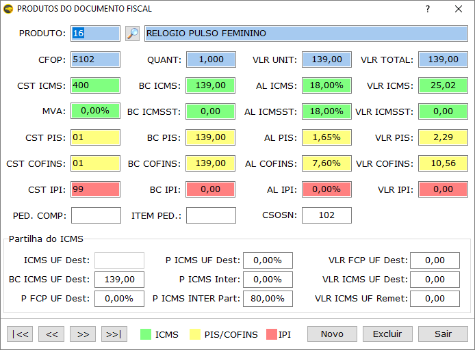

|Campo|Função|
|-----|------|
|CFOP|Observar o CFOP (Código Fiscal de Operações) da Nota Fiscal e selecionar o código correspondente.|
|QUANT|Informar a quantidade do produto selecionado.|
|VLR UNIT|Informar o valor unitário do produto selecionado.|
|VLR TOTAL|Calculado automaticamente pelo sistema (quantidade x valor unitário).|
|CST ICMS|Entrar com o Código da Situação Tributária equivalente ao produto.|
|BC ICMS|Informar o valor da Base de Cálculo do ICMS, quando for o caso.|
|AL ICMS|Alíquota do ICMS (dado em porcentagem) de acordo com o campo BC ICMS.|
|VLR ICMS|Valor do ICMS calculado de acordo com os campos BC ICMS e AL ICMS.|
|MVA|Margem de Valor Agregado.|
|BC ICMSST|Base de Cálculo ICMS Substituição Tributária.|
|AL ICMSST|Alíquota do ICMS Substituição Tributária.|
|VLR ICMSST|Valor correspondente aos campos anteriores.|
|CST PIS / BC PIS / AL PIS / VLR PIS|Dados correspondentes ao PIS: CST, Base de Cálculo, Alíquota e Valor.|
|CST COFINS / BC COFINS / AL COFINS / VLR COFINS|Dados correspondentes ao COFINS: CST, Base de Cálculo, Alíquota e Valor.|
|CST IPI / BC IPI / AL IPI / VLR IPI|Dados correspondentes ao IPI: CST, Base de Cálculo, Alíquota e Valor.|
|PED. COMP|Número do Pedido.|
|ITEM PED|Item do pedido de compra.| 
|Partilha do ICMS|São informações fiscais de ICMS, dependo do estado do cliente destinatário da nota. Essas informações de alíquotas são preenchidas no cadastro do produto.|

! Alguns campos permitem realizar a pesquisa de registros - CFOP, ICMS, PIS e COFINS, por exemplo. Basta selecionar o campo e pressionar a barra de espaços.
! **Em caso de dúvidas quanto ao preenchimento dos tributos, consulte a Contabilidade**.

 
**Aba "Cobrança"**

Insira as parcelas e a forma de pagamento e clique em "Parcelar".

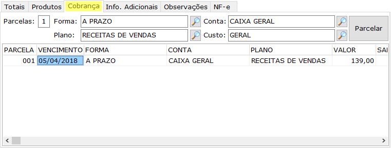

 
**Aba "Transporte"**

Nesta aba, é informado se há ou não o frete e, em caso positivo, os detalhes sobre o transporte poderão ser preenchidos.

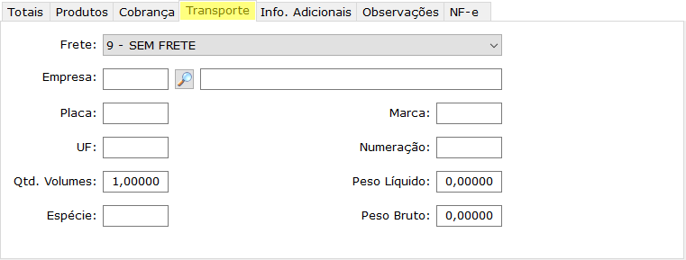

! A aba "Transporte" poderá ou não ser exibida, dependendo da operação selecionada (através do campo "Operação") ou de como a mesma está configurada no cadastro de operações.

 
**Aba "Informações Adicionais"**

|Campo|Função|
|-----|------|
|Local da Operação|Define se a operação de venda é presencial ou não.|
|Tipo de Consumidor|Consumidor normal ou final. Esse dado provém do Cadastro do Cliente, na aba "Fiscal".|

 
**Aba "Observações"**

Nesta seção são inseridas algumas informações complementares que se fizerem necessárias - impostos, número do pedido e outros.

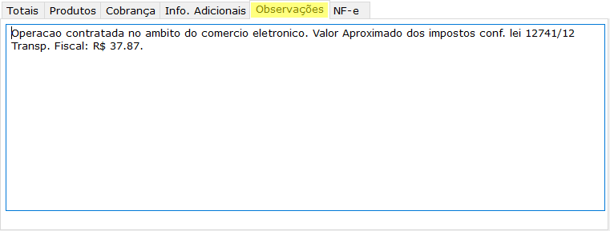

 
**Aba "NF-e"**

Define o tipo de emissão da Nota Fiscal Eletrônica. A chave de acesso e dados do envio são gerados após a emissão.

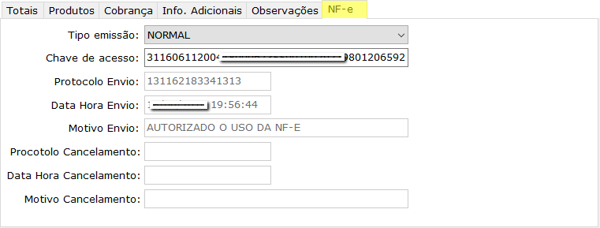

 
### Menu de Documentos Fiscais de Saída

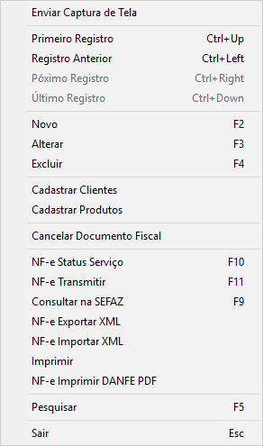

Principais funcionalidades:

* Cadastrar Clientes - Acesso rápido ao Cadastro de Cliente, caso o mesmo ainda não esteja na base de dados.
* Cadastrar Produtos - Atalho para acesso ao Cadastro de Produtos. 
* Cancelar Documento Fiscal - Função de cancelamento da nota fiscal emitida. Ressalta-se que o prazo para cancelamento é de até 24 horas após a emissão. Após esse período, somente com autorização da Secretaria da Fazenda – SEFAZ.
* NF-e Status Serviço F10 - O sistema consulta o servidor da SEFAZ para verificar a disponibilidade para a Emissão da Nota, retornando mensagem de ativo ou inativo inoperante. 
* NF-e Transmitir F11 - Transmissão da Nota Fiscal Eletrônica - NF-e.
* Consultar na SEFAZ F9 - O sistema faz uma nova consulta à SEFAZ. É utilizado quando ocorre algum erro na transmissão ou a mesma não retorna como emitida para o sistema. 
* NF-e Exportar XML - Exporta o arquivo XML da NF-e.
* NF-e Importar XML - Importação de XML de nota fiscal de saída. 
* Imprimir - Gera um relatório da Nota Fiscal para impressão.
* NF-e Imprimir PDF - O DANFE abre em PDF para consulta ou impressão.

! Para mais informações sobre NF-e de saída, acesse [Emissão de Nota Fiscal Eletrônica](https://ajuda.eagletecnologia.com/manuais/eagle-nf-e-ct-e/manual-de-usuario-eagle-emissor).

 
## Composição de Produtos

Sabe-se que um produto composto é aquele que possui, em sua produção, um conjunto de outros produtos, que são considerados insumos ou componentes.
 Ao efetuar um lançamento de uma Composição, a empresa certamente irá facilitar o processo de venda e, automaticamente, o controle de estoque, já que a entrada ou a saída de um produto composto passa a ser um processo mais eficiente. A partir do momento em que se lança uma composição, os totais de estoque de cada item que formam o produto composto são subtraídos. Consequentemente, eles serão adicionados ao estoque do produto composto.
 Para que seja efetuado um lançamento de um produto composto, é necessário que ele já exista no [cadastro de produtos](https://ajuda.eagletecnologia.com/manuais/eagle-gestao/modulo-cadastros#aba-componentes).
 Exemplo: Pressupõe-se que um Computador  é composto por placa mãe, fonte e processador. O usuário do sistema pode, então, cadastrar um produto composto denominado "Computador Completo I3" e colocar três itens como componentes.

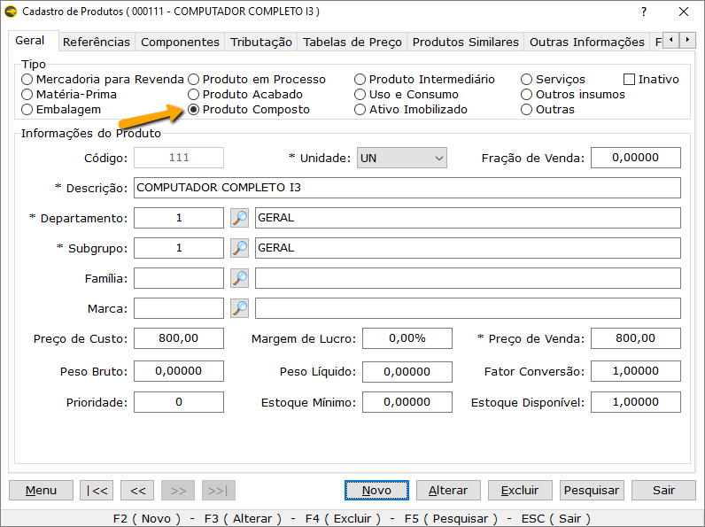

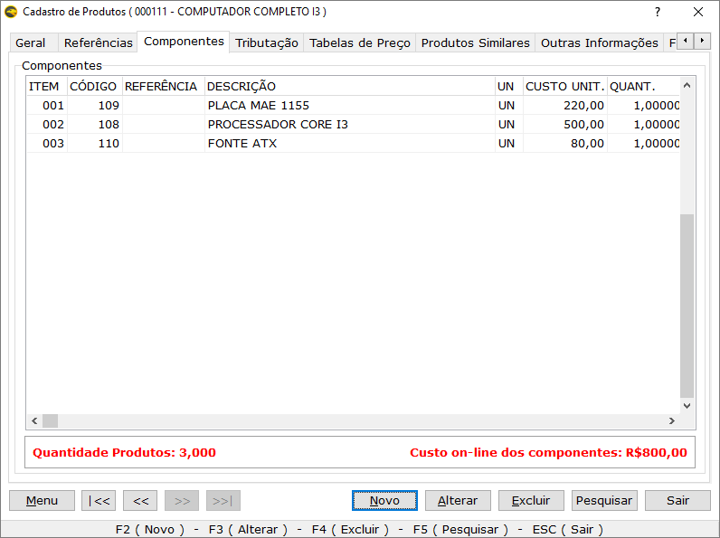

 
Neste exemplo, a empresa deverá montar dois computadores para venda e ela possui o seguinte estoque:

|Produto Simples|Estoque|
|---------------|-------|
|Processador I3|03|
|Placa Mãe|03|
|Fonte|06|

 
**Partindo-se das afirmativas anteriores, o usuário do sistema deverá seguir os seguintes passos:**

1. Clicar em Estoque / Composições de Produtos.
2. Clicar em Novo.

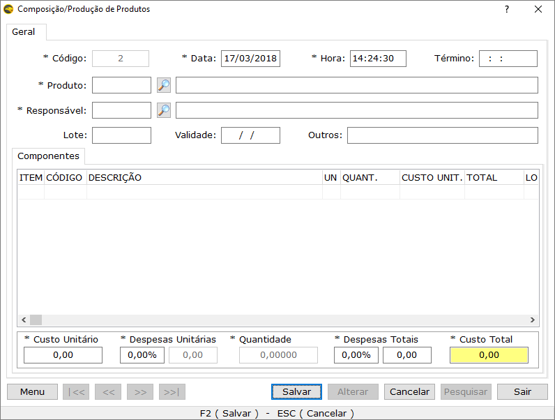

3. Selecionar o produto composto, lembrando que o mesmo já deverá estar cadastrado. 
Neste momento, os itens que o compõem são apresentados na parte inferior.

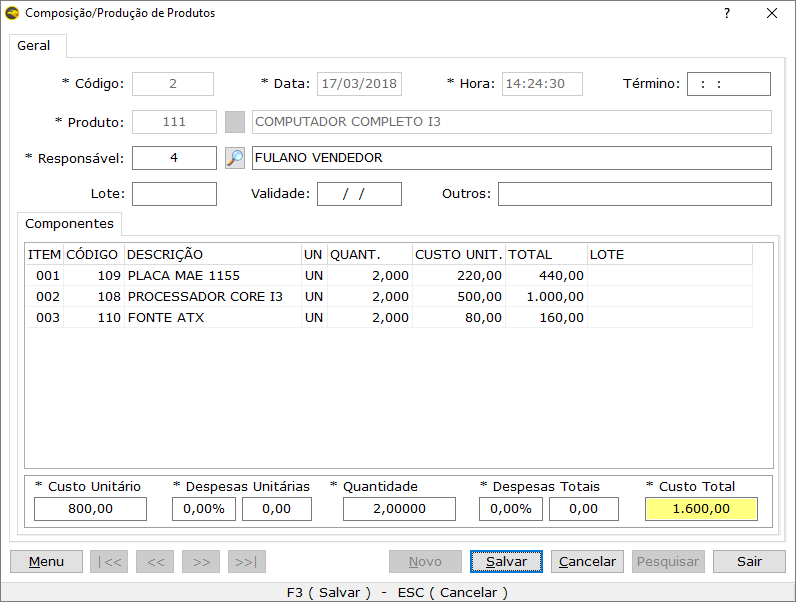

|Campo|Função|
|-----|------|
|Código|Identificador da composição na base de dados. Gerado automaticamente.|
|Data / Hora / Término|Dados que representam o momento em que foi gerada a composição.|
|Produto|Utilizado para selecionar o produto composto a partir do banco de dados do sistema. É necessário que o produto composto esteja cadastrado.|
|Responsável|Selecionar o funcionário responsável pela composição.|
|Lote|Informar, quando for o caso, o número do lote de produção.|
|Validade|Inserir esta informação, caso o produto tenha validade.|
|Outros|Informações adicionais que se fizerem necessárias.|
|Componentes|Detalhes de cada produto que compõe o produto composto. As principais informações acerca desses produtos são exibidas nesta seção.|
|Custo Unitário|Soma do valor de todos os componentes.|
|Despesas Unitárias|Se houver algum custo adicional na composição do produto, insira a porcentagem (campo 1) ou o valor (campo 2). Se houver alteração, os outros campos serão recalculados.|
|Quantidade|Número de produtos que serão compostos ou produzidos. Neste exemplo, informou-se 2.|
|Despesas Totais|Representa o resultado de "Despesas Unitárias" multiplicadas pela "Quantidade".|
|Custo Total|Exibe o total final considerando custos e quantidades.|

4. Após o preenchimento dos campos, salve o cadastro da composição. Neste momento, o sistema exibe a seguinte mensagem:

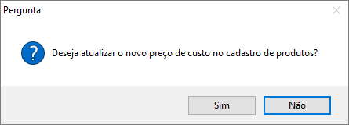

Caso tenha inserido outras despesas na composição do produto e queira que as mesmas fiquem no preço de custo do produto e no cadastro do mesmo, clique em Sim. Do contrário, clique em Não.

A partir deste instante, o estoque dos itens (processador, placa e fonte) é reduzido e o estoque do computador aumenta. 

Neste momento, o estoque passa a ser de:

|Produto|Estoque|
|-------|-------|
|Processador I3|01|
|Placa Mãe|01|
|Fonte|04|
|Computador Completo I3|02|

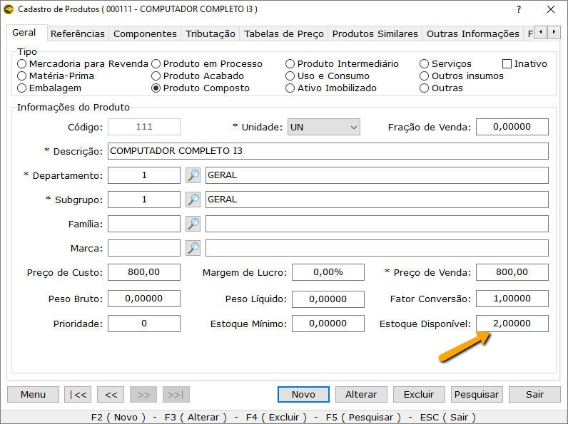
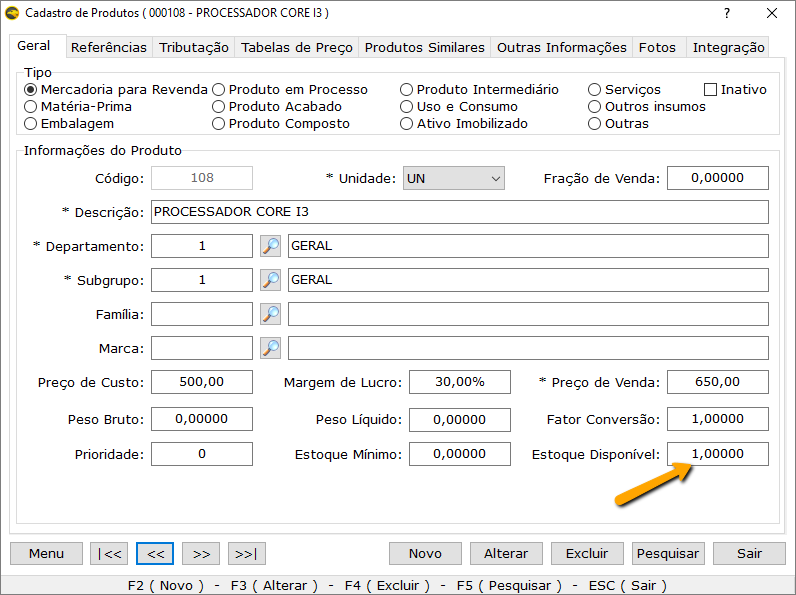

! O registro de orçamentos e a baixa de orçamentos para Produtos Compostos são feitos seguindo-se os mesmos procedimentos descritos nas seções de vendas e saídas.

! Para alterar um lançamento de Composição, abre-se a tela de lançamento de composição e seguem-se os mesmos princípios de alteração demonstrados nas seções anteriores. 

 
### Menu de Composição de Produtos

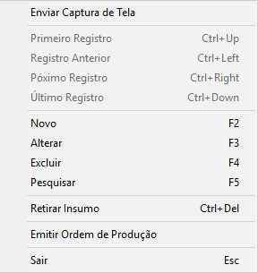

Principais funcionalidades:

* Retirar Insumo - Caso tenha a necessidade de retirar algum dos produtos da composição, ou seja um dos insumos, selecione o produto com o botão direito do mouse (ou CTRL + Delete) e utilize esta funcionalidade.
Se efetuada a retirada, o sistema atualiza o estoque do insumo retirado da composição.

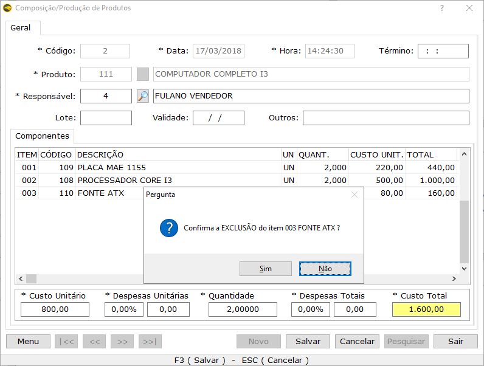

* Emitir Ordem de Produção - Utilize esta função quando for preciso imprimir a ordem de produção do produto a ser composto.

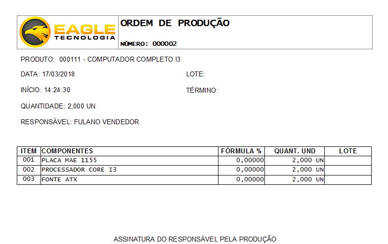

 
## Decomposição de Produtos

A partir do momento em que se lança uma decomposição, uma determinada quantidade dos itens que compõem o produto composto é desvinculada deste.
Exemplo: supõe-se que existam 2 computadores no estoque da empresa (composto por processador i3, fonte e placa mãe). 
O usuário efetua um comando de decomposição de 1 Computador Completo I3. O novo estoque deste produto composto diminui e, automaticamente, os estoques de processador, fonte e placa mãe serão aumentados em 1 unidade.

Passos para se efetuar uma decomposição:

1.	Estoque / Decomposições de Produtos.
2.	Clique em Novo (F2).
3.	Pesquise o Produto Composto que terá sua desvinculação.
4.	Informe a quantidade de decomposições.

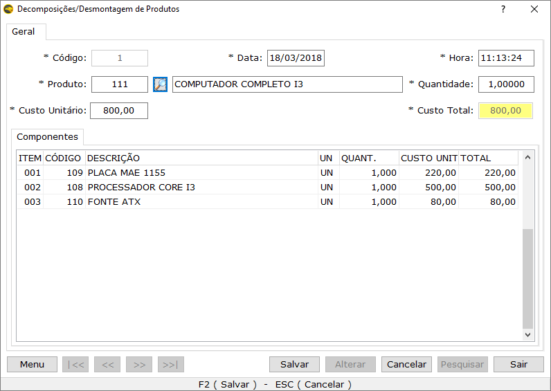

5.	Clique em Salvar. Neste momento os estoques para o produto composto e para os produtos simples são atualizados.

O estoque do computador passou de 2 para 1 após a decomposição.

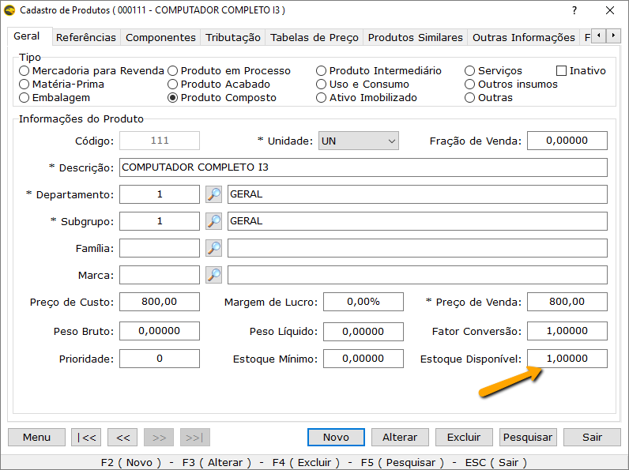

Neste exemplo, um dos produtos simples, denominado "Fonte ATX", passou de 4 unidades, para 5.
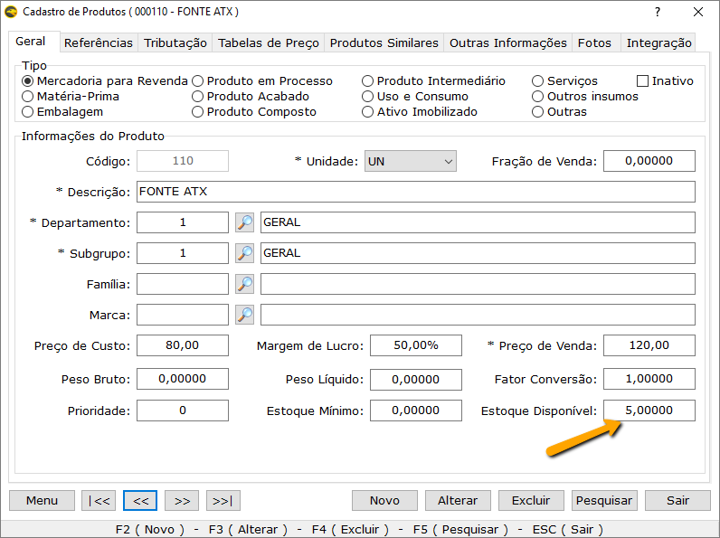

 
## Alteração de Preços

Através deste recurso é possível reajustar, rapidamente, o preço de custo, margem de lucro ou preço de venda de um ou de vários produtos, ao mesmo tempo.

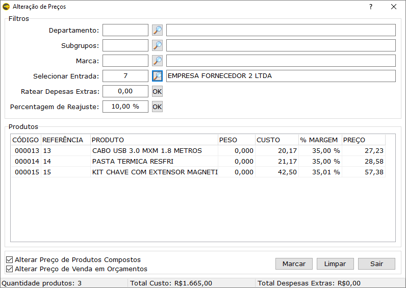

 
**Filtros** - utilizado para realizar ajustes de preço de um lote ou de um grupo de produtos.

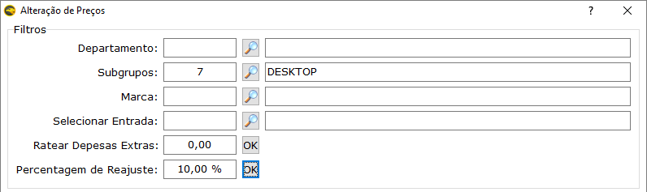

|Campo|Função|
|-----|------|
|Departamento|Se desejar alterar o preço de um lote de produtos pertencentes a um Departamento específico, selecione-o através deste campo. A lista de produtos será exibida na parte inferior da tela.|
|Subgrupos|Caso seja necessário realizar uma seleção um pouco mais específica, utilize um Subgrupo para definir quais produtos serão atualizados.|
|Marca|Todos os produtos da marca selecionada serão exibidos para a alteração de preços.|
|Selecionar Entrada|Este campo permite a seleção de todos os produtos de uma determinada nota fiscal de entrada, independente de grupo ou marca.|
|Ratear Despesas Extras|Ao informar o valor, o mesmo será dividido entre os produtos proporcionalmente. Os preços de custo e as margens de lucro serão recalculados. Utilize o botão "Ok", ao lado, para visualizar o reajuste. O processo só será confirmado ao clicar em "Marcar".|
|Percentagem de Reajuste|O percentual indicado neste campo reajusta o preço de venda de todos os produtos. Utilize o botão "Ok", ao lado, para visualizar o reajuste. O processo só será confirmado ao clicar em "Marcar".|

 
**Produtos** - nesta seção, é possível atualizar valores individuais.

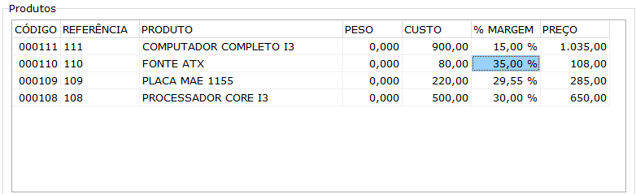

|Campo|Função|
|-----|------|
|Código|Identificador do Produto na base de dados. Pode ser utilizado para pesquisar o produto pelo código.|
|Referência|É também um código identificador, podendo ser, por exemplo, um código de barras ou o código de cadastro, e que pode ser utilizado para pesquisar o produto.|
|Produto|Descrição do produto. Utilize a barra de espaços para pesquisar o produto.|
|Peso|Informa o "Peso Líquido" do produto preenchido no cadastro.|
|Custo|Valor de custo do produto na base de dados. Este campo poderá ser alterado, fazendo com que o Preço de Venda também seja modificado.|
|Margem|Percentual representando a margem entre Preço de Custo e Preço de Venda. Ao alterá-lo, o Preço de Venda será recalculado.|
|Preço|Representa o Preço de Venda do Produto. Ao modificá-lo, a Margem de Lucro também será atualizada.|

 
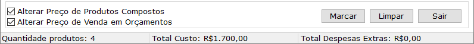

|Campo|Função|
|-----|------|
|Alterar Preço de Produtos Compostos|Atualiza os novos valores para os produtos compostos.|
|Alterar Preço de Venda em Orçamentos|Ao marcar os novos preços, todos os orçamentos também serão reajustados.|
|Botão **Marcar**|Utilizado para confirmar as alterações efetuadas, fazendo com que o cadastro de produtos seja atualizado.|
|Botão Limpar|Todos os campos da tela ficam em branco, facilitando uma nova consulta.|
|Botão Sair|Fecha a tela. As possíveis alterações serão registradas somente após a utilização do botão "Marcar".|

! Se o preço de um produto pertencente a uma determinada Família for alterado, os outros produtos vinculados à mesma Família também terão o seu preço atualizado para o mesmo valor.

 
## Impressão de Etiquetas

Através do sistema é possível gerar e imprimir etiquetas, em diversos formatos, dos produtos cadastrados.

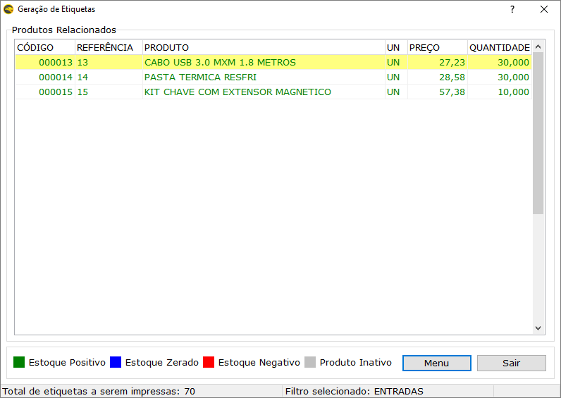

1. Acesse o menu Estoque / Impressão de Etiquetas.
2. Utilize o botão Menu para selecionar o(s) produto(s) por Tabela de Preços, por Grupos, Subgrupos ou por Entradas (produtos informados em determinada Nota Fiscal).

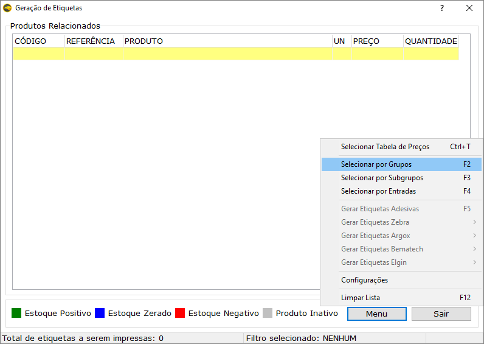

! Também é possível inserir um ou mais produtos específicos apenas pressionando a barra de espaços e localizando os produtos desejados.

3. Clique em Menu / Gerar Etiquetas Adesivas (tecla de atalho F5), ou utilize algum outro modelo, caso possua um impressora específica para impressão de etiquetas.

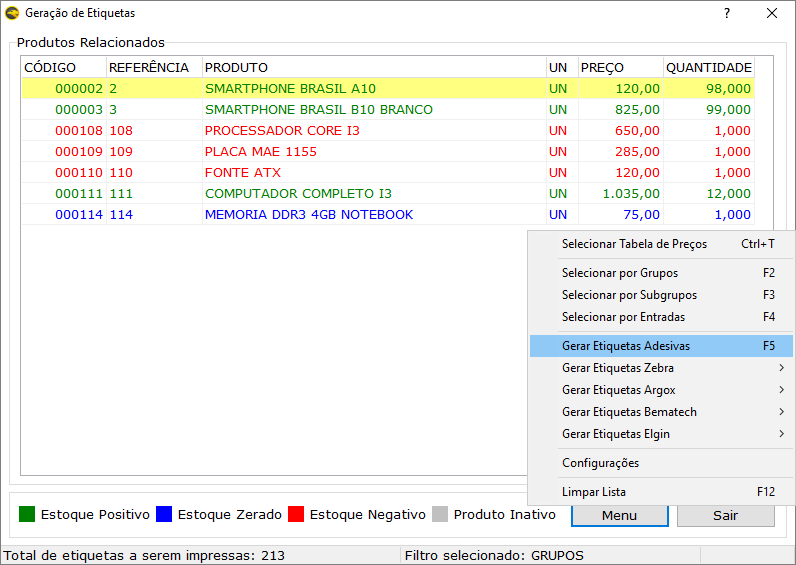

! Através da legenda em cores, é possível visualizar a condição atual do estoque de cada produto.

4. Selecione o Modelo de etiqueta a ser gerado e a [Tabela de Preço](https://ajuda.eagletecnologia.com/manuais/eagle-gestao/modulo-cadastros#cadastro-de-tabelas-de-preo) a ser utilizada e clique em Visualizar.

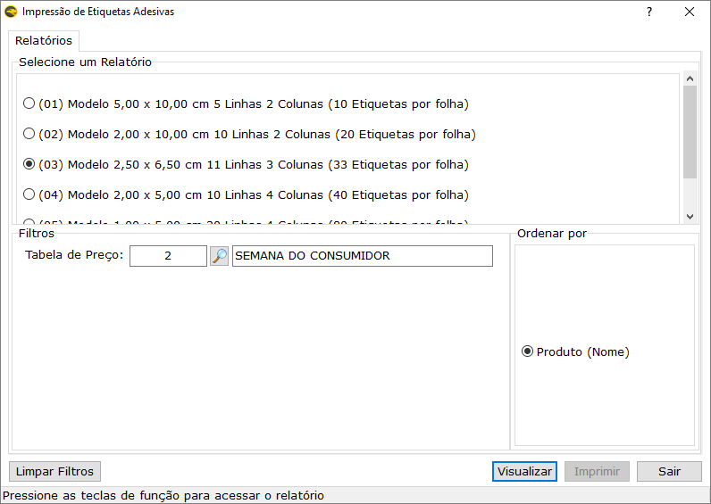

5. Escolha a partir de qual linha da folha será iniciada a impressão (utilize esta opção caso deseje aproveitar alguma folha já utilizada parcialmente). Se desejar que o sistema exiba o código de barras, marque a opção correspondente.

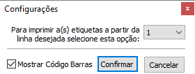

Após a confirmação, o sistema irá exibir as etiquetas.

 
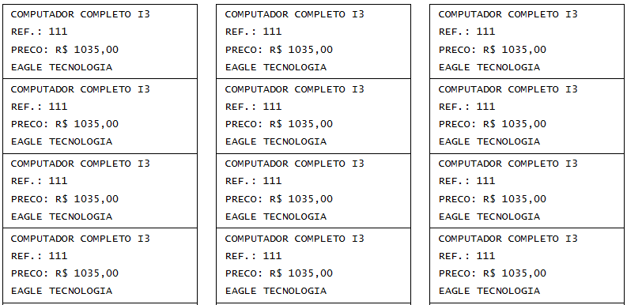

 
## Ranking de Produtos

Na logística, a Curva ABC é muito usada para controlar o estoque. Alguns produtos são mais importantes que outros e precisam ser tratados como tal. Eles podem ser separados segundo algum critério: proporção sobre o faturamento, margem de lucro, custo do estoque ou outro parâmetro escolhido.
Para que a empresa saiba qual o produto ou o grupo de produtos é o mais rentável e, consequentemente, deve ser tratado com maior prioridade, existe o recurso de classificação desses produtos no sistema Eagle Gestão.

1. Acesse este recurso através do menu Estoque / Ranking de Produtos.
2. Informe o tipo de classificação que será processado (classificação Geral, por Departamento, por Grupo, por Subgrupo ou por Marca). A classificação Geral considera todos os produtos e apresenta o relatório de maneira unificada.
3. Insira o Período Considerado (data inicial e data final das vendas).
4. Clique em Ranking.

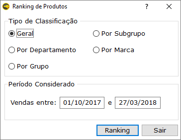

O relatório exibido logo a seguir irá apresenta os produtos em três categorias: A, B e C. 
Os produtos classificados como A, podem ser considerados os mais importantes para empresa dentro do período de vendas informado. 

As colunas apresentam as seguintes informações: o Rank de classificação, o Código e a Descrição do Produto, a Quantidade e Valor Total Vendido, a Margem de Contribuição - MC (%), a Margem de Contribuição Acumulada – MCA (%) e a Classe à qual pertence esse produto.

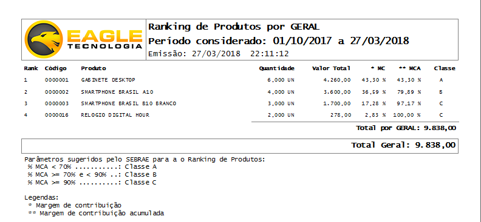

