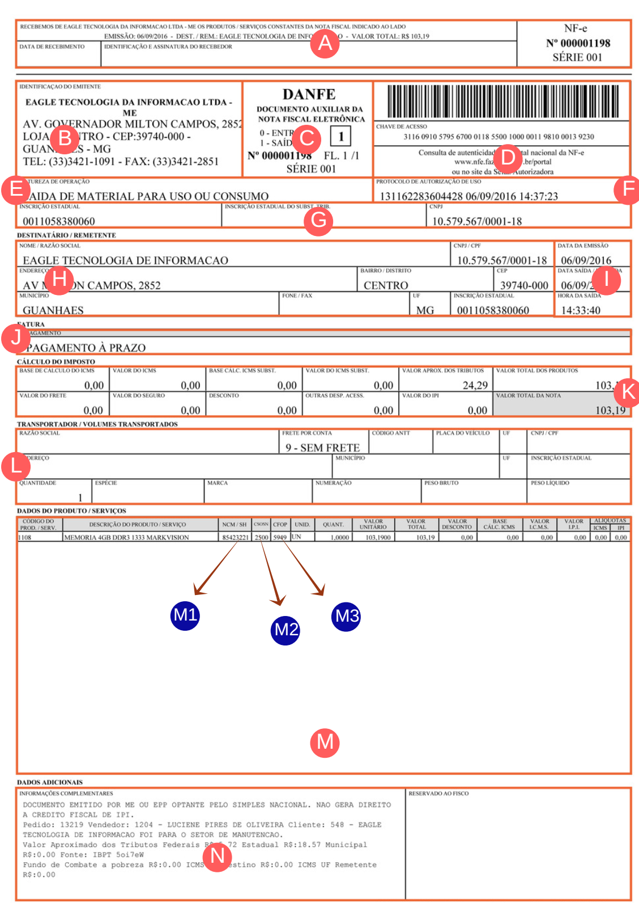

===
## Introdução

Peter Drucker, considerado como o pai da administração moderna, em seu livro The Process of Management fundamentou a análise SWOT que divide as organizações em quatro quadrantes: Forças, Fraquezas, Oportunidades e Ameaças sendo as duas últimas relacionadas ao ambiente externo.

Rememoramos este conceito para ilustrar que, as decisões do governo quanto as normas tributárias que complicam a vida das empresas devem ser encaradas como um desafio e não um impecílio. O empreendedor não deve colocar a legislação como um obstáculo do qual se deve desviar, mas sim como uma variável do ambiente externo que não está sob o seu controle.

A carga tributária é um custo que tem que ser conciliado com o caixa e as políticas internas da empresa. Afinal, a maior parte dos tributos incide sobre a venda de mercadorias ou prestação de serviços ao contribuinte que é quem realmente paga os impostos.

A criação do sistema público de escrituração digital transferiu para as pequenas empresas a responsabilidade de lidar com informações fiscais através de sistemas informatizados. Esta mudança fez surgir novos mercados e oportunidades e quem não está se adaptando está ficando para trás. O conhecimento e a informação estão sendo o diferencial para as empresas que precisam quebrar estes os novos paradigmas.

Para se ter uma ideia da complexidade da nossa legislação, em nosso país são editadas em média 789 normas por dia útil. As únicas ferramentas que o empresário tem para lidar com esta burocracia é o conhecimento e a informação. A informação pura não é conclusiva, não transforma a empresa, não toma decisões nem cria oportunidades. Para que ela tenha seu valor é preciso utilizar as habilidades humanas de análise e síntese, habilidades estas que são concebidas através do conhecimento que utiliza a informação e a tecnologia como insumos.

Atualmente, na disputa das organizações para conquistar espaço, valem mais o talento, a criatividade, a inovação e os conhecimentos postos em produção, do que o capital propriamente dito. O conhecimento fornece subsídios para que na prática possamos perceber e nos adaptar às mudanças, almejando o crescimento sustentável e contínuo das organizações, tendo como aliada a tecnologia da informação.

Frente a estas mudanças, o papel da tecnologia da informação nas organizações é crucial para fornecer informações com velocidade e precisão. Da mesma forma o domínio destas tecnologias são condições para a sobrevivência das empresas com cada vez mais obrigações fiscais.

O entendimento da tributação que envolve as empresas deve ser assimilado pelos maiores interessados que são os empresários que devem estar sempre acompanhando as mudanças na legislação que impactam o seu negócio tendo o contador como parceiro de negócio para juntos poder conviver de maneira harmoniosa, segura e consciente.

## Termos frequentes

|Termo|Explicação|
|-----|----------|
|**Base de Cálculo**|Valor instituído pela lei e geralmente expresso em moeda corrente, cujas principais funções são dimensionar o fato jurídico passível de tributação da importância devida pelo contribuinte ou responsável.|
|**Alíquota**|Fração, parte ou percentual da base de cálculo que pertence ao Estado. Possibilita a quantificação do tributo.|
|**ICMS**|O Imposto Sobre Operações Relativas a Circulação de Mercadorias e Serviços é o imposto que representa a maior fonte de arrecadação para os Estados. Sua base de cálculo é obtida pelo valor da operação de circulação de mercadoria ou da prestação de serviço e suas alíquotas variam conforme o Estado e a natureza do produto. Por isto é importante consultar o contador para não cometer equívocos ao emitir documentos fiscais.|
|**IPI**|O Imposto Sobre Produtos Industrializados é cobrado sobre a industrialização de produtos. Na realidade quem suporta é o consumidor final, embora sua incidência ocorra na etapa de industrialização. Este imposto vem destacado na nota fiscal quando devido. Sua base de cálculo é obtida pelo valor da operação e suas alíquotas variam em função da essencialidade da mercadoria.|
|**CST**|O Código de Situação Tributária (CST) é um código utilizado para identificar a tributação pelo ICMS de mercadorias e serviços. Esta informação consta nos documentos fiscais de entrada e saída discriminados respectivamente em cada produto do documento fiscal|
|**CSOSN**|O Código de Situação das Operações no Simples Nacional (CSOSN) é um código utilizado para identificar a tributação pelo ICMS de produtos e serviços.|
|**CEST**|O CEST (Código Especificador da Substituição Tributária), regulamentado através do [Convênio ICMS 92/15](http://www.confaz.fazenda.gov.br/legislacao/convenios/convenio-icms/2015/convenios-icms-92-15),  constará nos produtos sujeitos a substituição tributária e foi criado com objetivo estabelecer uma forma de uniformizar e identificar as mercadorias e bens passíveis de sujeição ao regime de substituição tributária.|
|**CFOP**|Código Fiscal de Operações e de Prestações das Entradas de Mercadorias e Bens e da Aquisição de Serviços.|
|**NCM**|Código da Nomenclatura Comum do MERCOSUL. Este código é utilizado para emissão da Nota Fiscal Eletrônica e será obrigatório para adequação da lei 12.741/2012 para calcular o valor aproximado de impostos.|
|**SINTEGRA**|Obrigação acessória onde os contribuinte do ICMS usuários de Processamento Eletrônico de Dados devem apresentar à administração fazendária em meio digital os dados relativos às operações de compra e venda que tenham praticado.|
|**Certificado Digital**|Basicamente, um certificado digital é um arquivo eletrônico que contem dados que identificam pessoas (físicas ou jurídicas) no mundo virtual. Este por outro lado pode ser utilizado para assinar documentos eletrônicos.|
|**SPED**|Sistema Público de Escrituração Digital, é instrumento que unifica as atividades de recepção, validação, armazenamento e autenticação de livros e documentos que integram a escrituração contábil e fiscal dos empresários e das pessoas jurídicas, inclusive imunes ou isentas, mediante fluxo único, computadorizado, de informações. Os principais voltados para o ambiente empresarial são o SPED Fiscal, SPED PIS/COFINS, NF-e, CT-e, MDF-e, NFS-E e mais recentemente o NFC-e.|

## Conhecendo o DANFE

Para acompanhar o trânsito da mercadoria será impressa uma representação gráfica simplificada da Nota Fiscal Eletrônica intitulada DANFE ( Documento Auxiliar da Nota Fiscal Eletrônica). O DANFE não é nota fiscal, nem a substitui servindo apenas como instrumento auxiliar para consulta da NF-e, pois contem a chave de acesso da NF-e que permite que o destinatário realize a consulta do documento através do Portal da Nota Fiscal Eletrônica.

|Campo|Função|
|-----|------|
|A|Comprovante de recebimento da NF-e que deve ser assinado por quem recebe a mercadoria colocando a data de do recebimento.|
|B|Identificação do emitente da NF-e (razão social, endereço e telefone).|
|C|Traz a frase DANFE (Documento Auxiliar da Nota Fiscal Eletrônica). O número e a série da NF-e. O tipo de operação, se é Entrada (0) ou Saída (1). O número total de folhas do documento.|
|D|Chave de acesso e o código de barras da NF-e que permite que o destinatário realize a consulta do documento através do Portal da Nota Fiscal Eletrônica.|
|E|Natureza da operação, ou seja, tipo de operação que está sendo realizada. Exemplo: venda para dentro do estado, venda para fora do estado, compra para industrialização, devolução de mercadorias.|
|F|Protocolo de autorização de uso da NF-e, indica a data e o recebimento da NF-e pela SEFAZ.|
|G|CNPJ, Inscrição Estadual, Inscrição Estadual de Substituto Tributário, se houver, do emitente da NF-e.|
|H|Identificação do destinatário da NF-e (razão social, endereço, telefone, CNPJ e inscrição estadual).|
|I|Data de emissão da NF-e, data e hora da saída da mercadoria do estabelecimento.|
|J|Forma de pagamento e vencimento das parcelas geradas.|
|K|Totais dos impostos da NF-e.|
|L|Dados sobre a transportadora, quem entregará a mercadoria e sobre a carga a ser transportada.|
|M|Código, impostos e descrição dos produtos ou serviços que compõem a NF-e.|
|M1| NCM do produto informado pelo fornecedor. Você pode usar o NCM que veio na NF-e para cadastrar seu produto, porém é importante conferir os dados através de algum software específico ou com a sua contabilidade. Isso porque o fornecedor pode ter no cadastro dele o NCM errado.|
|M2|O CST do ICMS deverá ser informado no cadastro de produtos seguindo a correlação de CST do ICMS de Entrada para CST do ICMS de Saída de acordo com as orientações da contabilidade.|
|M3|Ao lançar o documento fiscal de entrada verifique o CFOP de entrada correto.|
|N|Informações complementares da NF-e.|

! A Receita Federal do Brasil (RFB) só pode disponibilizar informações fiscais para o próprio contribuinte ou para quem autorizou. Reforçamos que o destinatário deverá verificar a validade e autenticidade da NF-e e a existência de Autorização de uso da NF-e, tenha ele recebido o arquivo digital da NF-e ou o DANFE acompanhando a mercadoria.

! O emitente e o destinatário deverão armazenar o arquivo digital (XML) das NF-e pelo prazo estabelecido na legislação tributaria para a guarda dos documentos fiscais, devendo ser apresentadas à administração tributária, quando solicitado. Caso o destinatário não tenha condições de receber o arquivo digital, deverá armazenar o DANFE pelo prazo decadencial.

## Código de Situação Tributária
O Código de Situação Tributária (CST) é um código utilizado para identificar a tributação pelo ICMS de produtos e serviços. Esta informação consta nos documentos fiscais de entrada e saída discriminados respectivamente em cada produto do documento fiscal. O CST é composto de três dígitos no formato ABB onde o primeiro dígito (A) indica a origem da mercadoria ou serviço com base na Tabela A e os 2° e 3°dígitos, a tributação pelo ICMS, com base na Tabela B.

### Tabela A - Origem
|Código|Origem|
|------|------|
|0|Nacional|
|1|Estrangeira - Importação direta|
|2|Estrangeira - Adquirida no mercado interno|
|3|Nacional - Conteúdo de Importação superior a 40%|
|4|Nacional - Processos produtivos básicos|
|5|Nacional - Conteúdo de Importação inferior a 40%|
|6|Estrangeira - Importação direta, sem similar nacional|
|7|Estrangeira - Adquirida no mercado interno, sem similar nacional|
|8|Nacional, mercadoria ou bem com Conteúdo de Importação superior a 70% (setenta por cento)|

### Tabela B - Situação Tributária
|Código|Tratamento Tributário|
|------|---------------------|
|00|Tributada integralmente|
|10|Tributada e com cobrança do ICMS por substituição tributária|
|20|Com redução de base de cálculo|
|30|Isenta ou não tributada e com cobrança do ICMS por substituição tributária|
|40|Isenta|
|41|Não tributada|
|50|Suspensão|
|51|Diferimento|
|60|ICMS cobrado anteriormente por substituição tributária|
|70|Com redução e base de calculo e cobrança de ICMS por substituição tributária|
|90|Outras|

! Os códigos CST vem destacados no documento fiscal por produto no formato ABB e lembre-se que o primeiro dígito se refere a Origem da Mercadoria ou Serviço.

## Tabela de códigos de situações das operações do simples nacional
O Código de Situação das Operações no Simples Nacional (CSOSN) é um código utilizado para identificar a tributação pelo ICMS de produtos e serviços. Esta informação consta nos documentos fiscais de entrada e saída discriminados respectivamente em cada produto do documento fiscal. O CSOSN é composto de quatro dígitos no formato ABBB onde o primeiro dígito (A) indica a origem da mercadoria ou serviço com base na Tabela A e os 2° e 3° e 4°dígitos, a tributação pelo ICMS, com base na Tabela B.

### Tabela B - Situação no Simples Nacional
|Código|Tratamento Tributário|CST|
|------|---------------------|---|
|101|Tributada pelo Simples Nacional com permissão de crédito|00 ou 20|
|102|Tributada pelo Simples Nacional sem permissão de crédito|00 ou 20|
|103|Isenção do ICMS no Simples Nacional para faixa de receita bruta|Consulte seu Contador|
|201|Tributada pelo Simples Nacional com permissão de crédito e com cobrança do ICMS por substituição tributária|10 ou 30 ou 70|
|202|Tributada pelo Simples Nacional sem permissão de crédito e com cobrança do ICMS por substituição tributária|10 ou 30 ou 70|
|203|Isenção do ICMS no Simples Nacional para faixa de receita bruta e com cobrança do ICMS por substituição tributária|40|
|300|Imune – Classificam-se neste código as operações praticadas por optantes pelo Simples Nacional contempladas com imunidade do ICMS|50 ou 51|
|400|Não tributada pelo Simples Nacional|40 ou 41|
|500|ICMS cobrado anteriormente por substituição tributária (substituído) ou por antecipação|60|
|900|Outros – Classificam-se neste código as demais operações que não se enquadrem nos códigos 101, 102, 103, 201, 202, 203, 300, 400 e 500|90|

! Utilize esta tabela para entrada de documentos fiscais emitidos por empresas Optantes pelo Simples Nacional.

## Cadastro de produtos
Para que o cadastro de produtos seja consistente é necessário observar alguns pontos que são de extrema importância: 
! O CST do ICMS deverá ser informado no cadastro de produtos seguindo a correlação de CST do ICMS de Entrada para CST do ICMS de Saída de acordo com as orientações da contabilidade.
! Apesar dos materiais para Uso ou Consumo poderem ser cadastrados genericamente, recomendamos sua individualização em função da hipótese posterior de circulação ou apropriação na produção bem como a geração de direito a crédito.
! Para operações com Bens de Ativo Imobilizado e Materiais para Uso ou Consumo cadastrar os produto com a CST 90 ( Outras ).

### Tabela Auxiliar de Correlação de CST do ICMS de Entrada para CST do ICMS de Saída
|CST Nota Fiscal|CSOSN Nota Fiscal|CST Cadastro|CSOSN|Alíquota CADASTRO|
|---|-----|------------|-----|-----------------|
|A10 / A30 / A60 / A70|A201 / A202 / A500|A60|A500|0%|
|A00|A101 / A102|A00|A101 / A102|Consulte seu Contador|
|A20|A101 / A102|A20|A101 / A102|Consulte seu Contador|
|A40|A400|A40|A400|0,00%|
|A41|A400|A41|A400|0,00%|
|A90|A900|A90|A900|Consulte seu Contador|

! A Origem da Mercadoria (Tabela A) deve ser observada no documento fiscal de aquisição de produtos destinados à revenda para o cadastro de produtos.

## Operações de entradas mais comuns
|Operação|CFOP Saída|CFOP Entrada|CST|
|--------|:----------:|:------------:|:---:|
|Aquisição de Serviço|5933 6933|1933 2933|90|
|Compra para Comercialização|5101 ou 5102 6101 ou 6102|1102 2102|00 20 40 41|
|Compra para Comercialização ST|5403 ou 5405 6403 ou 6404|1403 2403|10 30 60 70|
|Compra para Industrialização|5101 6101|1101 2101|00 20 40 41|
|Compra para Industrialização ST|5401 6401|1401 2401|10 30 60 70|
|Devolução de Venda|5101 ou 5102 6101 ou 6102|1201 ou 1202 2201 ou 2202|00 20 40 41|
|Devolução de Venda ST|5410 ou 5411 6410 ou 6411|1410 ou 1411 2410 ou 2411|10 30 60 70|
|Devolução de Transferência|5209 6209|1209 2209|090|
|Compra de Energia Elétrica|5253 6253|1253 2253|090|
|Aquisição de Serviço e Comunicação|5303 6303|1303 2303|90|
|Aquisição de Serviço de Transporte|5353 6353|1353 2353|90|
|Compra de bem ativo imobilizado|5551 6551|1551 2551|00 20 40 41|
|Compra de bem ativo imobilizado ST|5406 6406|1406 2406|10 30 60 70|
|Compra de material para uso ou Consumo|5101 ou 5102 6101 ou 6102|1556 2556|00 20 40 41|
|Compra de material para uso ou consumo ST|5403 ou 5405 6403 ou 6405|1407 2407|10 30 60 70|
|Compra de combustível ou lubrificante|5655 6655|1652 2652|10 30 60 70|
|Entrada de bonificação, doação ou brinde|5910 6910|1910 2910|90|
|Entrada de Amostra grátis|5911 6911|1911 2911|90|
|Entrada para conserto ou reparo|5915 6915|1915 2915|90|
|Retorno de conserto ou reparo|5916 6916|1916 2916|90|
|Entrada de vasilhame ou sacaria|5920 6920|1920 2920|90|
|Retorno de vasilhame ou sacaria|5921 6921|1921 2921|90|
|Transferência para comercialização|5152 6152|1152 2152|00 20 40 41|
|Transferência para comercialização ST|5409 6409|1409 2409|60|
|Transferência de bem do ativo imobilizado|5552 6552|1552 2552|90|
|Transferência de material para uso ou consumo|5557 6557|1557 2557|90|
|Outras entradas (consulte contador)|5949 6949|1949 2949|90|

! Nas operações de entradas, deverá ser informado o CST que constar no documento fiscal de aquisição dos produtos, salvo se a legislação da unidade federada dispuser em contrário. Para o IPI, usar o código 49.

! Para outras informações não contidas neste documento consulte seu contador.

## Operações de saídas mais comuns
|Operação|CFOP Saída|CFOP Entrada|CST|
|--------|:----------:|:------------:|:---:|
|Prestação de Serviço|5933 6933|1933 2933|90|
|Venda de mercadoria adquirida ou recebida de terceiros|5102 6102|1102 2102|00 20 40 41|
|Venda de mercadoria adquirida ou recebida de terceiros ST|5403 ou 5405 6403 ou 6404|1403 2403|10 30 60 70|
|Venda de produção do estabelecimento|5101 6101|1102 2102|00 20 40 41|
|Venda de produção do estabelecimento ST|5401 6401|1403 2403|10 30 60 70|
|Devolução de compra para comercialização|5202 620202|1201 ou 1202 2201 ou 2202|00 20 40 41|
|Devolução de compra para comercialização ST|5411 6411|1410 ou 1411 2410 ou 2411|10 30 60 70|
|Venda de combustível ou lubrificante|5606 6656|1653 2653|10 30 60 70|
|Remessa de bonificação, doação ou brinde|5910 6910|1910 2910|90|
|Remessa de amostra grátis|5911 6911|1911 2911|90|
|Remessa de mercadoria ou bem p. conserto ou reparo|5915 6915|1915 2915|90|
|Remessa de vasilhame ou sacaria|5920 6920|1920 2920|90|
|Devolução de vasilhame ou sacaria|5921 6921|1921 2921|90|
|Baixa de estoque decorrente de perda, roubo ou deterioração|5927|não se aplica|90|
|Transferência de mercadoria adquirida|5152 6152|1152 2152|00 20 40 41|
|Transferência de mercadoria adquirida ST|5409 6409|1409 2409|10 30 60 70|
|Transferência de bem do ativo imobilizado|5552 6552|1552 2552|90|
|Transferência de material para uso ou consumo|5557 6557|1557 2557|90|
|Outras saídas (consulte contador)|5949 6949|1949 2949|90|

! Para outras informações não contidas neste documento consulte seu contador.

## Tabelas de documentos fiscais
|Código|Série|Tratamento tributário|Registro SPED (PIS/COFINS)|Registro SPED (Fiscal)|
|------|-----|---------------------|-----------------------------|-------------------------|
|01|1..N|Nota Fiscal|C100 (aquisição)|C100|
|1B|1..N|Nota Fiscal Avulsa|C100 (aquisição)|C100|
|2|D|Nota Fiscal de Venda a Consumidor|C380 (aquisição)|C300 ou C350 ou C400|
|2D| |Cupom Fiscal|C400 (aquisição)|C400|
|2E| |Cupom Fiscal Bilhete de Passagem|D350 (aquisição)|D350|
|4|1..N|Nota Fiscal de Produtor|C100 (aquisição)|C100|
|6|B,C,U|Nota Fiscal/Conta de Energia Elétrica|C500 (aquisição)|C500 (aquisição)|
|7|B,C,U|Nota Fiscal de Serviço de Transporte|D100 (aquisição)|D100|
|8|B,C,U|Conhecimento de Transporte Rodoviário de Cargas|D100 (aquisição)|D100|
|8B|B,C,U|Conhecimento de Transporte de Cargas Avulso|D100 (aquisição)|D100|
|21|B,C,U|Nota Fiscal de Serviço de Comunicação|D500 (aquisição)|D500 (aquisição)|
|22|B,C,U|Nota Fiscal de Serviço de Telecomunicação|D500 (aquisição)|D500 (aquisição)|
|28| |Nota Fiscal / Conta de Fornecimento de Gás Canalizado|C500 (aquisição)|C500 ou C600|
|29| |Nota Fiscal / Conta de Fornecimento de Água Canalizada|C500 (aquisição)|C500 ou C600|
|55|1...N|Nota Fiscal Eletrônica (operação de vendas)|C100 e C180|C100|
|57|1..N|Conhecimento de Transporte Eletrônico – CTe|D100 (aquisição)|D100|
|59|1..N|Cupom Fiscal Eletrônico (CF-e-SAT)|C800 (aquisição)|C800 ou C850|
|60|1..N|Cupom Fiscal Eletrônico (CF-e-ECF)|C400 (aquisição)|C400|
|65|1..N|Nota Fiscal Eletrônica ao Consumidor Final (NFC-e)|C100 (aquisição)|C100|

! Ao escriturar documentos fiscais de entradas em seu Sistema ERP verifique o modelo do documento fiscal e a série.

## Trocas e devoluções
A devolução de mercadoria é o procedimento adotado quando há aquisição de um determinado bem e opta-se por devolvê-la ao seu fornecedor. A devolução ocorre por motivos tais como, defeito de fabricação ou desistência da compra.  
No caso das empresas varejistas vale lembrar o que diz o CDC (Código de Defesa do Consumidor) em seu artigo 49, Capítulo VI: “O consumidor pode desistir do contrato, no prazo de sete dias a contar de sua assinatura ou do ato de recebimento do produto ou serviço, sempre que a contratação de fornecimento de produtos e serviços ocorrer fora do estabelecimento comercial, especialmente por telefone ou a domicílio.”.  
A devolução possui duas finalidades: 
1. Estorno - o estorno é realizado quando o cliente deseja devolver a mercadoria e cancelar a negociação realizada, ou seja, ele não quer levar outro produto e sim obter o valor negociado de volta. 
1. Troca - a troca acontece quando o cliente deseja devolver a mercadoria e utilizar o crédito para a aquisição de outro produto.

Para efeito da legislação do imposto, a operação de devolução tem por objetivo anular todos os efeitos da operação anterior, inclusive os tributários. Assim, a tributação a ser utilizada na operação de devolução será a mesma aplicada na operação original. De acordoo com Artigo 76 do Regulamento do ICMS (RICMS) de Minas Gerais: 
> 
§ 3º Não será permitida a apropriação de crédito: 
I - em devolução ou troca de mercadoria adquirida com emissão de Cupom Fiscal, exceto em relação àqueles documentos que contenham a informação do número do CPF ou CNPJ do adquirente impresso por Equipamento Emissor de Cupom Fiscal (ECF); 
II - no recebimento, em virtude de garantia, de parte ou peça de mercadoria remetida ao adquirente. 
§ 4º O estabelecimento que receber mercadoria, em devolução ou troca, emitirá nota fiscal na entrada, relativamente à mercadoria devolvida, da qual constarão o número, a série e a data do documento fiscal emitido por ocasião da saída. 
§ 5º A nota fiscal emitida quando do recebimento de mercadoria, em devolução ou troca, será arquivada em separado, juntamente com os documentos fiscais, ou cópia, que acobertaram a remessa e o retorno da mercadoria. 

## Procedimentos para fechamento de mês junto a contabilidade
1. Conferir o relatório de Consistência de Documentos Fiscais de Entrada
1. Conferir relatório de Documentos Fiscais de Entrada
1. Conferir o relatório de Consistência de Documentos Fiscais de Saída
1. Conferir relatório de Documentos Fiscais de Saída
1. Gerar Livro de Apuração de ICMS
1. Gerar o CMV ( Custo das Mercadorias Vendidas )
1. Conferir o valor das entradas do CMV com os CFOP de venda do Livro de ICMS
1. Gerar e validar o Sintegra
1. Gerar e validar o SPED Fiscal / PIS / COFINS
1. Enviar os Documentos para a Contabilidade
1. Aguardar retorno da contabilidade em caso de alguma inconsistência

! De acordo com a lei nº 8.137, de 27 de dezembro de 1990, utilizar ou divulgar programa de processamento de dados que permita ao sujeito passivo da obrigação tributária possuir informação contábil diversa daquela que é, por lei, fornecida a Fazenda Pública constitui crime contra a ordem tributária dentre outras infrações descritas nesta lei.

! Sem a automação completa das operações e sua consequente contabilização, a empresa poderá correr o risco de ser autuada por fornecer informações incoerentes ou equivocadas ao fisco.

! Este documento NÃO é um guia completo sobre o assunto muito menos definitivo.