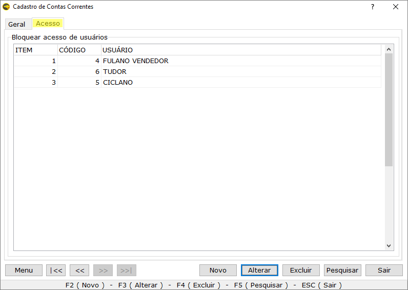

===

Nesta seção será abordado o processo de cadastro de informações no sistema. O módulo de cadastros é composto pelas funcionalidades de Inclusão, Alteração e Exclusão de dados relacionados a **Clientes, Fornecedores, Funcionários, Produtos, Financeiro** e **Logística**.

É possível localizar o **Módulo de Cadastros** acessando o menu superior do sistema ou usando o atalho **ALT+C**. 

Através do Menu localizado na barra inferior de cada tela, existe a opção de acessar, mais rapidamente, outros cadastros relacionados, enviar captura de tela, duplicar cadastros e acessar funcionalidades adicionais.

É importante destacar que no sistema Eagle Gestão todos os campos marcados com asterisco (*) são de preenchimento obrigatório.

  
## Cadastro de Clientes

Pior que não vender, é vender e não receber. Se todos os clientes que entrarem em seu estabelecimento comercial comprarem sempre à vista tudo seria perfeito, não existiria serviço de proteção ao crédito, cobradores e muito menos inadimplência. O fato real é que temos que conceder crédito aos clientes, sendo necessário estabelecer processos de cadastro e cobrança eficientes para que os recebimentos de vendas a prazo sejam garantidos.

O processo de cadastro de clientes tem seu início quando um cliente entra na loja para comprar a prazo e sua ficha cadastral precisa ser aprovada pelo crediário. Após o cadastro e aprovação de crédito do cliente, é aconselhável que seja criado um envelope que será utilizado para guardar os documentos assinados pelo mesmo ou pelos autorizados.

O instrumento que você deve utilizar para levantar os dados cadastrais dos seus clientes é a **Ficha Cadastral**. Nela são anotadas as informações necessárias para a avaliação dos clientes, ou seja, para formar um conceito a respeito da capacidade e condição dos clientes de pagarem as prestações geradas pela venda a prazo.

 
### Tipos de Cliente

Além do próprio cadastro de clientes, é possível cadastrar tipos de clientes e convênios. O sistema permite agrupar clientes de acordo com características que eles possuem em comum, cadastrando tipos e vinculando os clientes posteriormente. Isso facilita a análise de informações nos relatórios gerados, uma vez que é possível visualizar informações por tipo de cliente. 

Para cadastrar um tipo de cliente acesse Cadastros / Clientes / Cadastro de Tipos de Clientes e clique em Novo.

|Campo|Função|
|-----|----|
|**Código**|É gerado automaticamente.|
|**Nome**|Descrição do tipo de cliente.|
|**Inativo**|Inativa o tipo de cliente.|

 
### Convênios

O convênio é usado para conceder descontos nas vendas para os clientes.  
Para cadastrar um convênio acesse Cadastros / Clientes / Cadastro de Convênios e clique em Novo. 

|Campo|Função|
|-----|----|
|**Código**|É gerado automaticamente.|
|**Nome**|Nome do convênio.|
|**Empresa conveniada**|Caso esse convênio tenha relação com terceiros, como uma empresa, por exemplo, informe nesse campo clicando na lupa e localizando o nome da empresa conveniada, que deverá estar cadastrada como cliente.|
|**Desconto**|Valor do desconto concedido no momento da venda para todos os clientes vinculados ao convênio.|
|**Convênio Inativo**|Ao selecionar este campo, o convênio não aparecerá no cadastro de clientes.|

 
### Cadastrando Clientes

Para cadastrar um cliente acesse Cadastros / Clientes / Cadastro de Clientes ou utilize a tecla de atalho **F2** ou o Menu lateral. Clique em Novo e preencha o maior número de informações possíveis, lembrando que todos os campos contendo asterisco são obrigatórios.

 
#### Aba "Geral"

 
**Tipo de Pessoa**

|Campo|Função|
|-----|------|
|Pessoa física, jurídica ou produtor rural|Deve ser marcado segundo a situação do cliente quanto à definição do fisco.|
|Cliente|Estará marcada ao pedir um novo cadastro de clientes.|
|Fornecedor|Será marcada se o cliente também for um fornecedor da empresa, não havendo, portanto, a necessidade de realizar o cadastro separadamente, evitando duplicidade.|
|Funcionário|Será marcada se o cliente também for funcionário da empresa, não havendo a necessidade de realizar o cadastro do funcionário.|
|Inativo|Não se aconselha realizar a exclusão de registro de clientes, devido a consultas futuras e relatórios correspondentes. Deve-se inativar o cadastro, marcando a opção inativo.|
|Inadimplente|Será marcada automaticamente se o sistema estiver configurado para tornar clientes inadimplentes por certo período de atraso. Também pode ser selecionada manualmente.| 
|Checar limite de crédito|Selecione a opção se deseja que o limite de crédito do cliente, definido na aba **_Financeiro_**, seja verificado no ato da venda.|

 
**Identificação do Cliente**

|Campo|Função|
|-----|------|
|Código|Gerado automaticamente.|
|Fundação ou nascimento|Data de fundação da empresa no caso de cliente pessoa jurídica, ou data de nascimento para pessoa física ou produtor rural.|
|Regime|Campo para clientes que trabalham com controle fiscal, sendo as opções: simples nacional, simples nacional com sublimite e regime normal.| 
|Nome ou Razão social|Nome completo do cliente ou empresa.|
|CPF ou CNPJ|Número do documento do cliente. Não pode ser digitado incorretamente, pois é uma sequência lógica validada pelo sistema.|
|Apelido ou Nome fantasia|Nome pelo qual o cliente é popularmente conhecido.|
|RG ou IE|Número do documento de identidade ou inscrição estadual do cliente.|
|Contato|Nome de outra pessoa em que se pode entrar em contato, caso o cliente não seja localizado.|
|Inscrição Municipal|Número de identificação do cliente no cadastro tributário municipal.|

 
**Endereço**

Dados de localização e contato do cliente. É importante o preenchimento de todos os campos, mesmo aqueles não obrigatórios.

! Para que não haja duplicidade de cadastros de clientes, é importante sempre pesquisar antes de incluir um novo registro no sistema.

 
#### Aba "Tipo de Cliente"

Nessa aba é possível relacionar o cliente a algum tipo previamente cadastrado conforme visto no item [_**Tipos de Cliente**_](#tipos-de-cliente). Clique duas vezes no campo _**Código**_ ou no campo _**Descrição**_ ou aperte a tecla espaço para pesquisar os tipos.

 
#### Aba "Relacionamento"

Informações complementares e referenciais do cliente.

|Campo|Função|
|-----|------|
|Nome do Pai|Nome do pai do cliente, caso seja pessoa física.|
|Nome da Mãe|Nome da mãe, somente para pessoa física.|
|Referências Comerciais|Lugares que o cliente compra regularmente.|
|Referências Profissionais|Local atual de emprego ou algum outro onde o cliente já trabalhou.|
|Principal atividade| Escolha uma atividade relacionada ao cliente. Esta atividade deverá estar previamente cadastrada na seção Fornecedores.|
|Convênio| Convênio do qual o cliente faz parte.|
|Rota|Rota à qual o cliente pertence (veja [Logística / Cadastro de Rotas](#cadastro-de-rotas)).|
|Vendedor Padrão|Pode ser escolhido um vendedor padrão para o cliente.|
|Cliente desde|Data em que a pessoa ou a empresa se tornou cliente.|

 
#### Aba "Financeiro"

A aba Financeiro controla as condições de vendas para o cliente.

|Campo|Função|
|-----|------|
|Bloquear Meios de Pagamentos|O bloqueio de vendas por meios de pagamentos é um recurso que pode ser utilizado tanto para clientes com o cadastro recente quando para clientes inadimplentes que precisam ser bloqueados até que sua situação seja regularizada. Qualquer solicitação de compra realizada com os meios de pagamentos bloqueados deverá ser recusada ou examinada por instância superior da empresa.|
|Limite de Crédito|Valor de limite **definido** para o cliente.|
|Limite Utilizado|Valor do limite de crédito **utilizado** pelo cliente.|
|Limite Disponível|Valor do limite de crédito **disponível** para o cliente.|

! Os limites "Utilizado" e "Disponível" são atualizados de acordo com os débitos e pagamentos realizados pelo cliente.

! O sistema automaticamente bloqueia a venda, caso esses limites sejam ultrapassados.

! Mais de um meio de pagamento poderá ser configurado para bloqueio. Por exemplo: cheque e cartão.

 
#### Aba "Fiscal"

|Campo|Função|
|-----|------|
|Contribuinte ICMS|Existem três tipos: Contribuinte, Contribuinte Isento e Não Contribuinte. **Contribuinte**: Esta opção indica que o destinatário da NF-e é contribuinte do ICMS e com isso, espera-se que uma inscrição estadual seja informada. Um contribuinte pode ser uma pessoa jurídica ou física (produtor rural)  **Contribuinte isento**: O contribuinte isento é a pessoa que não possui uma inscrição estadual e está isento da contribuição do ICMS. Alguns estados não permitem contribuintes isentos, como, por exemplo AM, BA, CE, GO, MG, MS, MT, PE, RN e SE. Nestes estados é usada a opção "Não Contribuinte"  **Não contribuinte**: O não contribuinte é aquele que está desobrigado a possuir uma inscrição estadual, por não contribuir com o ICMS. A maioria das pessoas físicas são não contribuintes e também é o caso dos prestadores de serviço e de alguns órgãos públicos.|
|Tipo Consumidor|Consumidor Final ou Consumidor Normal. O tipo de consumidor também vai variar de acordo com a finalidade da NF-e: para pessoas que são contribuintes de ICMS, ou seja, se estão comprando para revender, escolha a opção “**Consumidor Normal**”.|

 
#### Aba "Outras Informações"

Podem ser registradas informações extras que poderão aparecer em alguns relatórios.

 
#### Aba "Vale Crédito"

O vale crédito funciona como um crédito virtual gerado para o cliente a partir do lançamento de contas a pagar no módulo financeiro do sistema.  
O consumo desse crédito pode ser viabilizado através de vendas ou recebimento de contas que o cliente em questão possa ter com a empresa.

|Campo|Função|
|-----|------|
|Data|Data da inclusão do vale crédito ou da movimentação financeira.|
|Saldo Anterior|Saldo que o cliente possuía antes da movimentação atual.|
|Valor Crédito|Saldo do vale crédito do cliente.|
|Valor Débito|Valor da despesa do cliente na data correspondente.|
|Saldo Atual|Saldo resultante da diferença entre o vale e as despesas do cliente.|

 
#### Menu de Clientes

Pelo Menu, localizado na parte inferior da tela de Clientes, é possível acessar algumas funcionalidades adicionais. 

Entre as principais, temos:
* Gerenciar alguns cadastros relacionados (rotas e vendedores).
* Consultar a situação do cliente, analisando o histórico de compras e pagamentos realizados, por meio do "Controle Analítico".
* Consultar Vale Crédito.
* Trocar Vendedor Padrão.

  
## Fornecedores
Nesta seção encontramos o Cadastro de Atividades e o Cadastro de Fornecedores.

 
### Atividades
O cadastro de atividades possibilita a vinculação de um Fornecedor, Funcionário ou Cliente a uma determinada Atividade ou ramo de atuação.  
Relatórios específicos poderão ser consultados através deste tipo de classificação.  
Para acessá-lo, vá em Cadastro / Fornecedores / Cadastro de Atividades.

 
### Cadastrando Fornecedores

Para cadastrar um Fornecedor acesse Cadastros / Fornecedores / Cadastros de Fornecedores. As outras opções de acesso são a tecla de atalho **F3** e o menu lateral do sistema.

 
#### Aba "Geral"

A aba Geral da tela de Fornecedores é bem semelhante à tela de Cadastro de Clientes.  

 
**Tipo de Pessoa**

|Campo|Função|
|-----|------|
|Pessoa física, jurídica ou produtor rural|Deve ser marcado segundo a situação do Fornecedor quanto à definição do fisco.|
|Fornecedor|Estará marcado ao pedir um novo cadastro de fornecedores.|
|Cliente|Será marcada se o fornecedor também for um cliente da empresa, não havendo, portanto, a necessidade de realizar o cadastro separadamente, evitando duplicidade.|
|Funcionário|Será marcada se o fornecedor também for funcionário da empresa, não havendo a necessidade de realizar o cadastro do funcionário.|
|Transportadora|Vincula o fornecedor ao perfil de Transportadora.|
|Inativo|Não se aconselha realizar a exclusão de registro de fornecedores, devido a consultas futuras e relatórios correspondentes. Deve-se inativar o cadastro, marcando a opção inativo.|

 
**Identificação do Fornecedor**

|Campo|Função|
|-----|------|
|Código|Gerado automaticamente.|
|Fundação ou nascimento|Data de fundação da empresa ou data de nascimento para pessoa física ou produtor rural.|
|Regime|Campo para fornecedores que trabalham com controle fiscal, sendo as opções: simples nacional, simples nacional com sublimite e regime normal.| 
|Nome ou Razão social|Nome completo da pessoa ou empresa.|
|CPF ou CNPJ|Número do documento do fornecedor. Não pode ser digitado incorretamente, pois é uma sequência lógica validada pelo sistema.|
|Apelido ou Nome fantasia|Nome popular da empresa.|
|RG ou IE|Número do documento de identidade ou inscrição estadual do fornecedor.|
|Contato|Nome de uma pessoa em que se possa entrar em contato.|
|Inscrição Municipal|Número de identificação do fornecedor no cadastro tributário municipal.|

 
**Endereço**

Dados de localização e contatos do fornecedor.

 
#### Aba "Relacionamento

|Campo|Função|
|-----|------|
|Atividade|Vincula-se o fornecedor a uma atividade previamente cadastrada.|
|Plano de Contas Padrão|Usado para estabelecer uma classificação às entradas financeiras relacionadas ao fornecedor. Exemplos: despesas com fornecedor, combustível, energia elétrica.|
|Fornecedor Desde|Data inicial do vínculo com o fornecedor.|

 
#### Aba "Fiscal"

A aba Fiscal de Fornecedores possui as mesmas opções da tela correspondente dentro do Cadastro de Clientes.

|Campo|Função|
|-----|------|
|Contribuinte ICMS|Existem três tipos: Contribuinte, Contribuinte Isento e Não Contribuinte. **Contribuinte**: Esta opção indica que o destinatário da NF-e é contribuinte do ICMS e com isso, espera-se que uma inscrição estadual seja informada. Um contribuinte pode ser uma pessoa jurídica ou física (produtor rural)  **Contribuinte isento**: O contribuinte isento é a pessoa que não possui uma inscrição estadual e está isento da contribuição do ICMS. Alguns estados não permitem contribuintes isentos, como, por exemplo AM, BA, CE, GO, MG, MS, MT, PE, RN e SE. Nestes estados é usada a opção "Não Contribuinte"  **Não contribuinte**: O não contribuinte é aquele que está desobrigado a possuir uma inscrição estadual, por não contribuir com o ICMS. A maioria das pessoas físicas são não contribuintes e também é o caso dos prestadores de serviço e de alguns órgãos públicos.|
|Tipo Consumidor|Consumidor Final ou Consumidor Normal. O tipo de consumidor também vai variar de acordo com a finalidade da NF-e: para pessoas que são contribuintes de ICMS, ou seja, se estão comprando para revender, escolha a opção “**Consumidor Normal**”. Caso contrário, se a compra for para uso próprio, então escolha “**Consumidor Final**”. Para não contribuintes deve-se sempre colocar Consumidor Final.|

 
#### Outras Informações

Registro de informações adicionais ou observações importantes.

  
## Funcionários

Para acessar a tela correspondente, vá em Cadastros / Funcionários / Cadastros de Funcionários.

### Aba "Geral"

#### Tipo de Pessoa
Nesta seção, o funcionário poderá ser vinculado a outras entidades: ele também poderá ser um **fornecedor**, **vendedor**, **cliente** ou **técnico**.
A opção **inativo** também está presente para que o funcionário seja inativado sem a necessidade de ser excluído.

#### Identificação do Funcionário
Aqui serão informados a data de nascimento, nome, documentos e o percentual de comissão do funcionário.

#### Endereço
Dados de localização e contatos do fornecedor. 

 
### Aba "Outras Informações"

São informações complementares acerca do funcionário: "Admissão", "Salário" e "Observações".

  
## Produtos

Para categorizar os produtos da empresa, o sistema oferece a possibilidade de vincular os mesmos a determinados Departamentos, Grupos, Subgrupos e Marcas, facilitando as pesquisas e enriquecendo os relatórios.

 
### Cadastro de Departamentos

O departamento oferece no sistema uma divisão num nível mais abrangente, ou seja, dentro de um departamento, por exemplo, podem existir diversos grupos, subgrupos e marcas. Por padrão, o departamento “Geral” já vem registrado na base de dados e é vinculado aos produtos no momento do cadastro.  
Um exemplo de uso desses agrupamentos é ter um departamento de "CARNES", com o grupo "BOVINA" e os subgrupos "CARNE PRIMEIRA", "CARNE SEGUNDA" e "CARNE TERCEIRA".
Para cadastrar um determinado departamento, acesse Cadastros / Produtos / Cadastro de Departamentos e clique em Novo.

|Campo|Função|
|-----|------|
|Código|Gerado automaticamente pelo sistema.|
|Nome|Nome do departamento.|
|Departamento de Balança|Todo o produto vinculado a um departamento que esteja marcado como "Departamento de balança", requer um código de balança. Deve ser usado em produtos pesáveis.|
|Inativo|Torna o departamento inativo, fazendo com que ele não apareça nas pesquisas na tela de cadastro de produto.|

 
### Grupos e Subgrupos

Os Grupos definem as seções dos produtos dentro de determinado Departamento e os Subgrupos representam as subdivisões dos grupos.  
Para realizar o cadastro, vá em Cadastros / Produtos / Cadastro de Subgrupos.

 
**Dados do Grupo**

|Campo|Função|
|-----|------|
|Código|Gerado automaticamente pelo sistema.|
|Nome|Nome do grupo.|
|Inativo|Torna o grupo inativo, fazendo com que ele não apareça nas pesquisas na tela de cadastro de produtos.|

 
**Dados do Subgrupo**

|Campo|Função|
|-----|------|
|Item|Numeração sequencial gerada dentro daquele grupo.|
|Código|Numeração sequencial gerada automaticamente, levando em conta todos os grupos e subgrupos anteriores.|
|Nome do subgrupo|Nome que identifica o subgrupo.|
|Comissão|Para trabalhar com comissão por produto vendido. Em vez de informar a comissão para cada produto cadastrado, o usuário poderá colocar o percentual para o subgrupo fazendo com que todos os produtos associados possuam a referida comissão.|
|Aplicar|Marque esse campo para ativar a comissão informada anteriormente.|
|Veículo|Ao marcar essa opção, na tela de cadastro de produtos que estejam vinculados a esse subgrupo, aparecerá uma aba chamada “veículos” para a inserção de diversas informações veiculares do produto.|

! Vários Subgrupos podem ser criados dentro de um mesmo Grupo.

 
### Unidades

Utilizado para cadastrar alguma unidade de medida além das unidades padrões do sistema, o Cadastro de Unidades é encontrado acessando o caminho Cadastros / Produtos / Cadastro de Unidades.

|Campo|Função|
|-----|------|
|Código|Gerado automaticamente.|
|Nome|Identificação da unidade - máximo de 10 caracteres.|
|Sigla|Sigla representativa da unidade - máximo de 2 caracteres.|
|Unidade Fracionária|Deixe-o desmarcado se a unidade aceitar somente números inteiros.|
|Inativo|Desativar a unidade.|

 
### Marcas

Usado para cadastrar as marcas e vinculá-las, posteriormente, através do cadastro de produtos.
A marca do produto é outra opção de filtro que pode ser utilizado na geração de relatórios.
Para inserir marcas acesse Cadastros / Produtos / Cadastro de Marcas.

 
### Cadastro de Localização

Esse cadastro é útil para facilitar a localização de produtos. Acesse Cadastros / Produtos / Cadastro de Localização.

|Campo|Função|
|-----|------|
|Código|Gerado automaticamente pelo sistema.|
|Nome|Nome da localização, por exemplo, Setor 1, Prateleira 2.|
|Inativa|Deixa a localização desativada.|

! O processo de vinculação entre produto e localização será realizado durante o cadastro do produto, na aba "Outras Informações".

 

### Famílias

Usado para marcar produtos de mesma natureza. Muito útil para atualizar informações de todos os produtos de uma determinada natureza. Ao alterar o preço de um produto, por exemplo, todos os outros pertencentes à mesma família terão seus valores atualizados.  
Acesse Cadastros / Produtos / Cadastro de Famílias.

 

### Cadastro de Tabelas de Preço

Com essa funcionalidade é possível obter várias tabelas de preço com valores diferentes para todos os produtos. É possível escolher no momento da venda qual tabela será usada e também determinar a tabela principal para determinado produto. Acesse Cadastros / Produtos / Cadastro de Tabelas de Preço.

#### Aba "Geral"

|Campo|Função|
|-----|------|
|Código|Gerado automaticamente pelo sistema.|
|Nome|Nome da tabela de preço.|
|Método de Markup|Marque se o método de markup (porcentagem de desconto ou acréscimo) será baseado no preço de venda ou de custo.|
|Validade de Início|Data em que a tabela começará a ser usada.|
|Validade de Término|Data de descontinuação da tabela.|
|Inativo|Marca se a tabela está inativa.|

 
#### Aba "Produtos/Serviços"

Lista todos os produtos ou serviços cadastrados no sistema, onde é possível visualizar ou editar as características de venda para cada um deles.

|Campo|Função|
|-----|------|
|Código|Gerado pelo sistema.|
|Produto Nome|Nome do produto ou serviço já cadastrado no sistema.|
|Preço Base|É usado o preço definido no cadastro de tabela de preço – preço de custo ou preço de venda.|
|Markup|É a porcentagem de acréscimo ou de desconto padrão concedida para o produto na tabela. O percentual será calculado sobre o preço base.|
|Preço Tabela|Preço de venda do produto para a tabela determinada.|
|Desconto Máximo|Desconto máximo que pode ser concedido.|
|Comissão|A comissão em porcentagem que o funcionário irá receber na venda usando a tabela de preço.|
|Margem de Crédito|Margem de crédito que pode ser dada com a tabela.|

! As colunas:“Código”, “Produto nome” e “Preço Base” têm valores fixos. Para cada produto é possível alterar o preço através do “markup” ou “preço tabela”.

 
#### Aba "Vendedores"

Essa aba permite vincular funcionários à tabela cadastrada e atribuir uma comissão quando for o caso.

|Campo|Função|
|-----|------|
|Código|O vendedor pode ser selecionado através do código de vendedores.|
|Vendedor Nome|Seleciona-se o vendedor, já cadastrado na base de dados, através do nome.|
|Comissão|Informa-se o percentual de comissão que será vinculado ao vendedor dentro da tabela de preços em questão.|

 
### Cadastro de Tributação por UF

Acesse Cadastros / Produtos / Cadastro de Tributação por UF.  
Nesta seção é possível cadastrar a tributação de ICMS de cada produto de acordo com cada Estado selecionado (veja também a [guia de Tributação](#aba-tributao "Tributação") no cadastro de produtos).

Para realizar o processo, faça:
1. Clique sobre o botão **"Editar"**
2. Selecione um Estado através do campo **"UF"**
3. Vá em **"Menu"** / **"Adicionar Produtos"**. Uma lista com todos os produtos será carregada. 
4. Defina os valores de **"CST"**, **"Alíquota"**, **"Redução de BC"** e **"MVA"** (quando for o caso), para os produtos que precisar. O campos **"CSOSN"** e **"CSOSN Crédito"** serão modificados automaticamente, de acordo com o CST.
5. Ao final do processo, utilize o botão **"Salvar"**.

! Para facilitar a localização do produto, utilize o campo **“Produto”** para realizar a busca.

! Consulte seu contador para informar os valores corretos de tributação.

  
### Cadastrando Produtos

Para cadastrar um produto acesse o menu Cadastros / Produtos / Cadastro de Produtos. Também poderá acionar o Menu Lateral do sistema, com a opção correspondente ou, ainda, utilizar a tecla **F4**.

 
#### Aba "Geral"

Nesta guia, deve-se informar os dados gerais do produto que representam, basicamente, a sua descrição, classificação e preço.

 
**Tipo**

Categorização do produto de acordo com sua classificação (ver regulamentação atual do SPED), indicando o destino ou estado do produto.

! Caso haja necessidade de cadastrar um produto composto (formado por 2 ou mais produtos), é necessário informar quais os produtos que farão parte do mesmo através da aba "Componentes".

! Também é possível marcar o produto como inativo, ao invés de excluí-lo.

 
**Informações do Produto**

|Campo|Função|
|-----|------|
|Código|É automático.|
|Unidade|Informe o tipo de unidade para o produto (UN, KG, MT). Se houver necessidade, basta cadastrar uma nova unidade  [Acesse Cadastro de Unidades](#unidades "Acesse Cadastro de Unidades").|
|Fração de Venda|A fração de venda de um produto define a quantidade padrão do mesmo. Exemplo: Bandeja de iogurte definida com fração de venda igual a 6, não poderá haver venda em uma bandeja com quantidade menor que 6 unidades.|
|Descrição|Identificação do produto (é altamente recomendável evitar acentos, espaços antes e depois do nome e espaços duplicados).|
|Departamento|Setor ou seção do produto.  [Acesse Cadastro de Departamentos](#cadastro-de-departamentos "Acesse Cadastro de Departamentos").|
|Subgrupo|Categoria a qual o produto pertence.  [Acesse Cadastro de Grupos e Subgrupos](#grupos-e-subgrupos "Acesse Cadastro de Grupos e Subgrupos").|
|Família|Utilizado para a classificar e agrupar os produtos de mesma natureza. Ao alterar o preço de um produto de uma determinada família, todos os outros pertencentes àquela família terão seus valores atualizados. [Acesse Cadastro de Familias](#famlias "Acesse Cadastro de Familias").|
|Marca|Outra opção de classificação do produto. [Veja Cadastro de Marcas](#marcas "Veja Cadastro de Marcas").|
|Preço de Custo|Valor pago ao fornecedor pelo produto. É importante ficar atento aos custos adicionais, como frete e outros acréscimos e realizar o rateio desses custos para compor o preço de custo do produto.|
|Margem de Lucro|Porcentagem de lucro sobre o preço de custo do produto.|
|Preço de Venda|Valor do preço de custo adicionado à margem de lucro - valor com o qual o produto é comercializado.|
|Peso bruto|Peso total do produto, incluindo a embalagem. Utilizado em carregamentos para entregas, transportes.|
|Peso Líquido|Representa o peso exclusivo do produto. Também utilizado em carregamentos e entregas.|
|Fator de Conversão| O fator de conversão é usado para relacionar uma unidade de medida à outra. Exemplo: se o produto é cadastrado como unidade, no campo "Fator de Conversão" é possível inserir quantas unidades do produto cabem em uma caixa.|
|Prioridade|Diz respeito à ordem de preferência na pesquisa do produto. É utilizado como parâmetro para o sistema de força de vendas (Falcon). Para quem trabalha com o Frente de Caixa DJPDV, é utilizada para produtos que tenham identificadores, tais quais: IMEI, serial, ID.|
|Estoque Mínimo|Indica qual a quantidade mínima ideal de produtos no estoque. Utilizado no relatório de Produtos Faltantes. Veja também a opção de Calcular Estoque Mínimo no [botão Menu](#menu-de-produtos).|
|Estoque Disponível|Estoque atual do produto. O campo não pode ser editado. Quantidade de produtos aumenta ou diminui de acordo com sua movimentação, compras e vendas.|

 
#### Aba "Referências"

A aba "Referências" é utilizada para inserir os possíveis códigos utilizados para o produto. Não é obrigatória a inserção de referências e o produto pode ter mais de uma. Também pode ser escolhida uma referência padrão.

|Campo|Função|
|-----|------|
|Item|Gerado automaticamente.|
|Referência|Insere-se o código utilizado. Pode ser um código de barras, um código interno da empresa. E quando não houver, o próprio código do sistema será também a sua referência.|
|Multiplicador|Se o produto tiver mais de uma referência, o multiplicador pode ser utilizado para identificar quantidades diferentes - em kits, por exemplo. A primeira referência pode ser usada para o produto unitário e a(s) outra(s) para mais de um produto.|
|Observações|Informação sobre a referência.|
|Código Balança|Caso o produto pertença a um departamento de balança ([Veja Cadastro de Departamentos](#cadastro-de-departamentos "Veja Cadastro de Departamentos")), esse campo será ativado e o seu o preenchimento será obrigatório.|

 
#### Aba "Componentes"

Nessa aba são cadastrados os produtos que compõem o produto composto. É muito utilizado em montagem de kits ou produtos derivados de dois ou mais produtos considerados insumos. Alguns exemplos: cesta básica, caixa de ferramentas, jogo de toalhas, etc. Os "subprodutos" devem estar cadastrados no sistema para, então, serem pesquisados e selecionados.

|Campo|Função|
|-----|------|
|Item|Código gerado automaticamente.|
|Código|Código do subproduto, pode ser utilizado para pesquisar o(s) subproduto(s).|
|Referência|Outro código que pode ser utilizado para selecionar o(s) subproduto(s).|
|Descrição|Nome de cada subproduto selecionado.|
|Un|Tipo de Unidade de Medida de cada subproduto.|
|Custo Unit.|Preço de custo do subproduto. O sistema recupera automaticamente o valor, mas este poderá ser alterado manualmente.|
|Quantidade|Quantitativo necessário de cada subproduto.|
|Fórmula %|A fórmula indica o percentual que o subproduto representa do produto composto.|
|Total|Valor do campo 'Custo Unitário' multiplicado pela 'Quantidade'.|

! O sistema exibe, na parte inferior da tela, a **quantidade de produtos** que compõem o produto composto, além da soma de todos os valores, representada pelo termo **custo on-line dos componentes**. 

! Para mais detalhes, acesse o tópico [Composição de Produtos](https://ajuda.eagletecnologia.com/manuais/eagle-gestao/modulo-estoque#composio-de-produtos), presente no módulo de Estoque.

 
#### Aba "Tributação"

Essa aba traz informações fiscais dos produtos, essenciais para a emissão de documentos fiscais (cupons e notas fiscais eletrônicas).

 
***Guia Geral***

|Campo|Função|
|-----|------|
|NCM|Nomenclatura Comum do Mercosul – aqui deve-se informar ou pesquisar o código correspondente ao produto. O NCM é composto por 8 (oito) dígitos e é obrigatório caso a empresa emita Nota Fiscal Eletrônica (NF-e). Esse código é informado nas Notas Fiscais de Entrada. O usuário poderá, se necessário, cadastrar NCM através do menu Fiscal / NCM.|
|ANP|Agência Nacional de Petróleo – código correspondente ao produto derivado de petróleo, contendo 9 dígitos. É obrigatório para emissão de NF-e.|
|IAT|Indicador de Arredondamento ou Truncamento - já possui valor padrão e não há necessidade de ser alterado.|
|IPPT|Índice de Produção Própria ou de Terceiro - por padrão o sistema utiliza a opção Terceiros (mercadoria adquirida de terceiros), mas caso o produto seja fabricado na empresa deve-se usar a opção "Produção Própria".|
|Modalidade de determinação da Base de Cálculo|Determina se a base de cálculo é calculada sobre o total bruto ou sobre o lucro bruto.|
|Produto importado|Marque esse campo caso o produto seja de origem estrangeira.|

 
***Guia ICMS***

Nessa aba é possível definir configurações diferentes de cálculo de ICMS de acordo com estados de destino para um produto específico. Na parte superior é definida a tributação dentro do estado e na parte inferior podem ser acrescentadas tributações para outros Estados conforme a necessidade.

 
***Tributação Estadual***

|Campo|Função|
|-----|------|
|CST padrão para as Saídas|Classificação de Situação Tributária correspondente ao produto cadastrado que é utilizado em notas fiscais de saída.|
|Redução da Base de Cálculo|Dependendo do CST, poderá haver ou não a redução. Informe a porcentagem de redução, se for o caso.|
|Alíquota de ICMS Intra|Porcentagem correspondente ao ICMS do produto dentro do Estado de destino. Calculado sobre a base de cálculo.|
|MVA|Porcentagem da Margem de Valor Adicionado aplicada sobre o produto. Geralmente utilizado por empresas que fabricam os produtos.|
|CEST|O CEST é a abreviatura de Código Especificador da Substituição Tributária, o código no qual constará nos produtos sujeitos a substituição tributária.|

! Antes de informar o CEST, veja se o campo NCM está preenchido na guia 'Geral'.

 
***Tributação Interestadual***

|Campo|Função|
|-----|------|
|UF|Escolha o estado no qual incidirão os impostos.|
|CST|Classificação de Situação Tributária correspondente ao produto.|
|CSOSN e CSOSN Créd|Código de Situação da Operação no Simples Nacional é preenchido automaticamente conforme o valor de CST declarado.|
|ICMS Intra|Porcentagem correspondente ao ICMS do produto ***dentro do Estado de destino***. Calculado sobre a base de cálculo.|
|ICMS Inter|Porcentagem correspondente ao ICMS do produto ***entre os estados de origem e destino***. Calculado sobre a base de cálculo.|
|Redução BC|Redução da Base de Cálculo - dependendo do CST, poderá haver ou não a redução. Informe a porcentagem de redução, se for o caso.|
|MVA|Porcentagem da Margem de Valor Adicionado aplicada sobre o produto. Geralmente utilizado por empresas que fabricam os produtos.|
|Mod BC ICMS|Deve ser escolhido o código da Modalidade de Base de Cálculo de ICMS.|
|Mod BC ICMS ST|Deve ser escolhido o código da Modalidade de Base de Cálculo de ICMS Substituição Tributária.|

 
***Guia IPI***

Essa aba é utilizada caso a empresa seja uma indústria ou equiparada. Trata-se do Imposto sobre Produtos Industrializados (IPI).

|Campo|Função|
|-----|------|
|CST padrão de Saídas|Caso não precise ser utilizado nas notas, preencher com 99 que indica “outras saídas”.|
|Redução da Base de Cálculo|Informar porcentagem da redução somente se necessário.|
|Alíquota do Imposto IPI|Preencher somente se necessário. Calculada sobre o parâmetro anterior.|
|Código EX da TIPI|Informar, apenas se necessário, o código de exceção da Tabela de Incidência do Imposto sobre Produtos Industrializados.| 
|Cód. Enquadramento do IPI|Campo para seleção do Código de Enquadramento do produto.|

 
***Guias PIS e COFINS***

Essas duas abas possuem os mesmos campos, a primeira trata-se do PIS e a outra corresponde ao COFINS.

|Campo|Função|
|-----|------|
|CST padrão nas Saídas|Código de Situação Tributária. Para empresas do Simples, utiliza-se, geralmente o código 07.|
|Alíquota do imposto nas Saídas|Dependendo do CST de saída, o campo pode ser ou não preenchido.|
|CST padrão nas Entradas|Informar ao sistema qual o CST deverá ser utilizado automaticamente nas notas fiscais de entrada para determinado produto.|
|Alíquota do Imposto nas Entradas|Qual alíquota será cadastrada para certo produto nas notas de entrada. É vinculada ao CST anterior.|
|Natureza da Receita (PIS e COFINS)|Código referente à categoria do produto. É preenchido em determinados casos.|
|Código de crédito (PIS e COFINS)|Informação preenchida de acordo com regimento da empresa.|
|Código da Receita (PIS e COFINS)|São preenchidos automaticamente de acordo com o NCM.|

 
#### Aba "Tabelas de Preço"

Essa aba lista as tabelas de preço cadastradas no sistema (no cadastro de Tabelas de Preço) e permite definir quais os valores os produtos terão na tabela. Também é possível definir esses valores no [Cadastro de Tabelas de Preço](#cadastro-de-tabelas-de-preo "veja Cadastro de Tabela de Preços").

|Campo|Função|
|-----|------|
|Código|Gerado pelo sistema.|
|Nome|Informe um nome sugestivo para a tabela, de acordo com a ocasião.|
|Preço Base|É usado o preço definido no cadastro de tabela de preço – preço de custo ou preço de venda.|
|Markup|É a porcentagem de acréscimo ou de desconto padrão concedida para o produto na tabela. O percentual será calculado sobre o preço base.|
|Preço Tabela|Preço de venda do produto para a tabela determinada.|
|Desconto Máximo|Desconto máximo que pode ser concedido.|
|Comissão|A comissão em porcentagem que o funcionário irá receber na venda usando a tabela de preço.|
|Margem de Crédito|Margem de crédito que pode ser dada com a tabela.|

 
#### Aba "Produtos Similares"

Nesta seçao podem ser referenciados produtos parecidos com o produto em questão. Este recurso é útil para sugerir produtos similares quando o produto principal estiver em falta no estoque.  
Para inserir um produto na lista, basta realizar a pesquisa pelo produto previamente cadastrado e selecioná-lo.

 
#### Aba "Veículo"
Esta aba aparecerá ***apenas*** se o produto for vinculado a um [subgrupo](#grupos-e-subgrupos "subgrupo") de veículo. 
Ou seja, se na aba "Geral" o produto for relacionado a um subgrupo que esteja marcado como "veículo", esta aba ficará disponível para preenchimento.

 
#### Aba "Outras Informações"

Aqui podem ser registradas informações adicionais sobre o produto.

|Campo|Função|
|-----|------|
|Aplicação|Insira nesse campo uma descrição informando a utilidade do produto.|
|Localização|As [localizações](#cadastro-de-localizao "localizações"), que já devem estar cadastradas no sistema, são pesquisadas, clicando-se na lupa, e adicionadas através do botão “Adicionar”. Para desvincular uma localização basta selecioná-la e clicar sobre o botão “Remover”.|
|Informações Adicionais|Essas informações aparecerão na nota fiscal.|

 
#### Aba "Fotos"

Através desta aba é possível vincular uma ou mais fotos para o produto. O usuário poderá adicionar ou excluir fotos a qualquer momento, utilizando os botões correspondentes. Os formatos permitidos são \*.jpg, \*.jpeg e \*.png.

 
#### Aba "Integração

Determina quais produtos serão enviados para o sistema <a href="https://ajuda.eagletecnologia.com/manuais/falcon-fv/manual-operacional" target="_top">***Falcon FV***</a>. Somente os produtos com a Flag marcada serão sincronizados. Por padrão o produto terá esta opção ativada.

 
#### Menu de Produtos

Através do botão "Menu", localizado na parte inferior da tela de Produtos, é possível acessar diversas funcionalidades. Entre as principais, estão:

* Gerenciamento dos cadastros de todas as seções que fazem parte deste Módulo (Departamentos, Subgrupos, Famílias, Unidades, Marcas, Localização, Tabelas de Preço).
* Realizar a Composição / Decomposição de Produtos.
* Alterar Quantidade em Estoque - Recurso utilizado para acerto de estoque do produto. Deve-se observar que o modo padrão para alteração do estoque acontece, automaticamente, através das notas fiscais de entrada e de saída.
* Busca Rápida de Produtos - Maneira bem prática para localizar um produto utilizando apenas o código de cadastro.
* Duplicar Produto - Funcionalidade muito útil quando se deseja cadastrar produtos semelhantes. Após a duplicação, altera-se apenas os campos específicos para a diferenciação do produto em relação ao anterior.
* Ficha Kardex Detalhada - Relatório contendo o histórico de movimentação de um determinado produto, facilitando a apuração de entradas e saídas.
* Impressão de Etiquetas - Contém diversos modelos de etiquetas que podem ser impressas, baseando-se nas informações do(s) produto(s) selecionados.
* Recomputar Estoque - Realiza o reprocessamento do estoque para o produto selecionado.
* Calcular Estoque Mínimo - Informa o mínimo necessário para o estoque do produto baseando-se na movimentação de vendas, no prazo de fornecimento e no tempo de disponibilidade.

  
## Financeiro

Para gerenciar os cadastros financeiros, acesse o menu Cadastros / Financeiro. Para o preenchimento dos dados, muitas informações devem ser consultadas no banco.

 
### Cadastro de Contas Correntes

É possível direcionar as entradas e saídas financeiras para contas específicas, como o caixa, uma conta no banco ou um cofre, por exemplo. Para gerenciar o cadastro de contas correntes, acesse Cadastros / Financeiro / Cadastro de Contas Correntes e clique um "Novo".

 
#### Guia "Geral"

|Campo|Função|
|-----|------|
|Lançamentos Manuais Lançamentos PAF-ECF|Lançamentos Manuais - Configura a conta para receber apenas os lançamentos manuais, sem vinculação com o frente de caixa.  Lançamentos PAF-ECF - os lançamentos realizados em um programa PAF-ECF (Programa Emissor de Cupom Fiscal) como, por exemplo, o [**Eagle PDV**](https://ajuda.eagletecnologia.com/manuais/eagle-pdv/manual-operacional "Eagle PDV"), são vinculados à conta.|
|Código|Código da conta corrente.|
|Nome|Nome da conta corrente. Deve ser escolhido um que seja de fácil identificação.|
|Titular|Nome do titular a conta corrente.|
|Banco|Número de identificação do banco.|
|Agência / Dígito Verificador da Agência|Número da agência e seu dígito verificador.|
|Conta / Dígito Verificador da Conta|Número da conta e dígito verificador.|
|Código do Cedente|Informação fornecida pelo banco para utilização em boletos.|
|Saldo Disponível|Preenchido pelo sistema de acordo com as entradas e saídas na conta.|
|Inativo|Inativa a conta corrente sem a necessidade de excluí-la.|
|Permitir Saldo Negativo|Permite saldo negativo na conta corrente.|

! Para utilização de uma conta corrente bancária, todos os campos devem ser preenchidos, principalmente, em casos onde for utilizado o [módulo de boletos](https://ajuda.eagletecnologia.com/manuais/eagle-gestao/modulo-boletos).

 
#### Guia "Acesso"

Utilizado para criar restrições ao acesso de usuários às contas correntes cadastradas. O preenchimento dos campos é feito por meio da busca dos registros.

|Campo|Função|
|-----|------|
|Item|Número sequencial gerado automaticamente.|
|Código|Usado para pesquisar o usuário pelo código.|
|Usuário|Pesquise o usuário pelo nome do funcionário. O usuário do sistema deve, portanto, ser um funcionário cadastrado.|

 
### Cadastro de Meios de Pagamento

Acesse Cadastros / Financeiro / Cadastro de Meios de Pagamento.

#### Aba "Geral"

|Campo|Função|
|-----|------|
|Modalidade|Deve ser escolhida uma forma de pagamento à qual o meio de pagamento pertencerá.|
|Tipo de Juros|Define-se a forma do cálculo de juros.|
|Código|Gerado automaticamente pelo sistema.|
|Conta Corrente Padrão|Uma [conta corrente](#cadastro-de-contas-correntes) já cadastrada no sistema deve ser selecionada.
|Nome|Nome do meio de pagamento deve ser sugestivo.|
|Plano de Pagamento|Descreva o plano de pagamento de acordo com os dias de vencimento das parcelas, contando a partir da data da venda/compra realizada com aquele meio de pagamento. Insira os valores separados por ponto e vírgula. Exemplo: Se o vencimento for a cada 7 dias o campo deve ser preenchido com 7;14;21;28.|
|Valor Mínimo|Define um valor mínimo de movimentação em que essa conta pode ser usada.| 
|Desconto Padrão|Aqui é determinado um desconto pré-definido e que pode ser alterado.|
|Desconto Máximo|Valor máximo de desconto para esse meio de pagamento.|
|Intervalo entre Parcelas|O intervalo entre as parcelas deve estar de acordo com os intervalos de dias descrito no plano de pagamento.|
|Dias primeira Parcela|Define-se um dia padrão para a primeira parcela.|
|Parcelamento Máximo|Número máximo de parcelas.|
|Acréscimo Padrão|Valor adicional gerado pelo meio de pagamento e por atrasos em pagamentos.|
|Percentual de Juros|Juros gerado pelo atraso.|
|Percentual de Multa|Multa gerada pelo atraso.|
|Entrada Obrigatória|Percentual do valor à vista que deve ser pago usando esse meio de pagamento.|
|Integrar com o Contas a Receber|Define-se a utilização, ou não, do meio de pagamento durante o recebimento de contas.| 
|Integrar com o Contas a pagar|Durante o pagamento de contas poderá, ou não, ser utilizado o meio de pagamento.|
|Baixar Automaticamente|Contas correntes vinculadas a meios de pagamento marcados para baixar automaticamente terão valores debitados ou creditados de contas a pagar ou a receber, que usam esse meio de pagamento e estão vencendo nesta data.|
|Inativo|Inativa o meio de pagamento.|

! Para mais informações sobre juros e multas, consulte: [Valor de Juros e Multas](https://ajuda.eagletecnologia.com/faq/qual-valor-de-juros-e-multas-que-posso-colocar-no-boleto-bancario).

 
#### Aba "Integração"

|Campo|Função|
|-----|------|
|ECF - Imprimir Confissão de Dívida|Caso este campo esteja marcado, para vendas que usam ECF (Emissor de Cupom Fiscal) será possível imprimir a confissão de dívida quando o meio de pagamento em questão for usado.|

 
### Cadastro de Carteiras de Cobrança

Este recurso representa um serviço contratado junto ao banco para gerar os boletos bancários. Todos os campos devem ser preenchidos cuidadosamente para garantir a correta emissão do boleto.  Acesse Cadastros / Financeiro / Carteiras de Cobrança.

|Campo|Função|
|-----|------|
|Código|Gerado automaticamente pelo sistema.|
|Próximo Número Remessa|Essa informação é fornecida pelo banco e gerada (atualizada) automaticamente pelo sistema conforme as remessas enviadas. Esse número não deve ser alterado pelo usuário sem antes consultar o banco.|
|Conta Corrente|Deve ser escolhida uma [conta corrente](#cadastro-de-contas-correntes) cadastrada.|
|Meio de Pagamento|Deve ser escolhido um [meio de pagamento](#cadastro-de-meios-de-pagamento) cadastrado.|
|Número da Carteira, Variação e Convênio|Dados fornecidos pelo banco.|
|Local Pagamento|Pode ser definido se o pagamento será no banco ou na própria empresa, por exemplo.|
|Espécie do Documento, Aceite e Próximo Nosso Número|Essas informações são fornecidas pelo banco e só podem ser inseridas ou alteradas após consultá-lo.|
|Mensagem, Instrução 1 e Instrução 2|Textos escritos aqui aparecerão no campo de instruções de boletos gerados por essa carteira de cobrança. Podem ser escritas instruções como local de pagamento, por exemplo.|
|Percentual Mora/Juros Diário|Define o percentual de acréscimo por atraso.|
|Protestar em Dias|Define a partir de qual dia de atraso o título será protestado. Ao deixar zero, não haverá protesto.|
|Percentual de Multa|Qual porcentagem de multa será aplicada.|
|Dias para crédito em conta após a baixa|Define a partir de qual dia o valor do título pago entrará na conta, após o pagamento do mesmo. Informação fornecida pelo banco.|
|Inativo|Marque a carteira como inativa caso não queira utilizá-la.|
|Carteira Registrada|Esta informação também deverá ser tratada com o banco para definir se a cobrança será registrada ou não.|

 
### Cadastro de Plano de Contas

O Plano de Contas representa uma classificação para as entradas e saídas financeiras da empresa com o intuito de criar uma lógica de organização e análise dos dados. Sem ele, o usuário iria, simplesmente, inserir entradas e saídas sem saber a sua origem ou razão.  
Acesse Cadastros / Financeiro / Cadastro de Plano de Contas.

**Planos de Conta** 

Se dividem em **Receitas** e **Despesas**. Para cadastrar um novo plano, clique com o botão direito em cima do plano pai e clique em "Novo". Para excluir, o procedimento é parecido e deve-se clicar em "Excluir", porém um plano de conta que já foi usado em alguma transação não poderá ser excluído.

**Dados do Plano de Conta**

Para acessar o modo de edição de um plano de conta é preciso dar dois cliques sobre ele. Após o preenchimento dos campos, será preciso clicar sobre o botão "Confirmar" para que as informações sejam salvas.

|Campo|Função|
|-----|------|
|Plano Pai|Define um plano de conta que está hierarquicamente um nível acima do plano em questão, ou seja, mostra em qual plano de contas o plano atual está inserido.|
|Código|Código gerado automaticamente.|
|Tipo de Conta|Podem ser contas fixas, contas variáveis ou		 investimentos.|
|Nome|Descrição da finalidade do plano de contas. Por exemplo: Um plano de contas com a finalidade de pagamento de comissão, teria o nome COMISSÃO.
|Valor Previsão|Valor anual previsto para despesa ou receita.|
|Inativo|Tornar o plano inativo, desativado.|
|Compor DRE Financeiro/Contábil|Marque essas opções caso queira que esse plano de conta componha o Relatório Demonstrativo de Resultados do Exercício.|

 
### Cadastro de Centro de Custos

O centro de custos é uma maneira de agrupar despesas e receitas, definindo em qual área ou setor será aplicado ou utilizado o recurso.  
Acesse Cadastros / Financeiro / Cadastro de Centro de Custos.

|Campo|Função|
|-----|------|
|Código|Gerado automaticamente.|
|Nome|Nome do centro de custo.|
|Inativo|Marque essa opção para inativar o Centro de custo.|

  
## Logística

Através desse módulo é possível ter controle sobre a forma de distribuição dos produtos, armazenando e gerenciando informações sobre veículos e vinculando clientes e funcionários a determinados locais.

 
### Cadastro de rotas

Agrupa os clientes de acordo com uma localidade em comum. Acesse Cadastros / Logística / Cadastro de Rotas.

|Campo|Função|
|-----|------|
|Código|Gerado automaticamente.|
|Rota|Nome da rota a qual o cliente pertence (veja a vinculação de [rotas no cadastro de cliente](#aba-relacionamento)).|
|Markup|Percentual de desconto dado aos clientes cadastrados nessa rota.|
|Vendedor Padrão|Nome do vendedor responsável pelas vendas na rota.|
|Inativo|Ao marcar esta opção, a rota não irá aparecer na lista de rotas do cadastro de clientes.|  

 
Através do botão "Menu" é possível acessar a opção "Vincular Vendedor aos Clientes da Rota", que fará com que todos os clientes associados à mesma rota sejam vinculados ao vendedor informado no campo "Vendedor Padrão".

 
### Cadastro de Roteiros

Roteiros podem ser usados para organização de vendas externas ou entregas de mercadorias. Acesse Cadastros / Logística / Cadastro de Roteiros.

 
**Dados do Grupo**

|Campo|Função|
|-----|------|
|Código|Gerado automaticamente pelo sistema.|
|Nome|Nome que identifica o roteiro.|
|Inativo|Inativa o roteiro.|

 
**Roteirização**

|Campo|Função|
|-----|------|
|Prioridade|Identifica a sequência de prioridade dos clientes no roteiro.|
|Cliente/Cidade/UF|Identifica os dados do cliente.  Clique com o botão direito na linha amarela para "Carregar Clientes da Rota", "Retirar Clientes da Lista" ou "Limpar a Lista".|
|Para cima / Para baixo|Esses botões servem para alterar a ordem de prioridade entre os clientes.|

 
### Cadastro de Veículos

Este recurso também é necessário para a emissão de CT-e (Conhecimento de Transporte Eletrônico).  
Acesse Cadastros / Logística / Cadastro de Veículos.

|Campo|Função|
|-----|------|
|Código|Gerado automaticamente pelo sistema.|
|Funcionário Condutor|Nome do funcionário condutor do veículo.|
|Proprietário do Veículo|Deve estar cadastrado como fornecedor - é o dono do veículo no documento.|
|Marca/Modelo|Descrição da marca e do modelo do veículo.|
|Chassi, Placa, Renavan e UF|Preencher os campos de acordo com o documento do veículo.|
|RNTRC|Registro Nacional de Transportadores Rodoviários de Carga. O código do cadastro da empresa pode ser localizado no adesivo do veículo.|
|CIOT|Informar o Código Identificador da Operação de Transporte. Um número que identifica cada operação de transporte (frete) a ser paga.|
|Combustível|Tipo de combustível do veículo.|
|Tara, Capacidade KG, Capacidade M3, Ano Fabricação, Ano Modelo e Cor Predominante, KM Inicial, KM Atual e KM Próxima troca de óleo|Dados específicos sobre o veículo. É importante o preenchimento do máximo de informações possível.|
|Inativo|Marca o veículo como inativo.|

