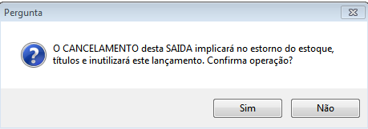

## 1. EMISSÃO DE NOTAS FISCAIS EM ORÇAMENTO
! Geralmente a emissão da nota fiscal diretamente no orçamento acontece, quando o cliente solicita a nota fiscal no ato da compra. Para que a emissão ocorra perfeitamente todos os produtos devem estar devidamente cadastrados com a tributação correta e a operação da nota a ser emitida configurada com CFOP apropriado.
1.1 Acesse: Vendas; Orçamentos. 

1.2 Insira o certificado digital na máquina, caso o modelo de certificação seja em forma em pen 	drive ou cartão.

1.3 Clique Novo (F2).

1.4 Preencher seguintes campos:
		* **Operação** – Clicar na lupa e escolher a operação adequada (relacionado ao CFOP).
		* **Código** -  Código automático do orçamento.
		* **Cliente** – Selecionar o cliente que compra o produto.
		* **Vendedor** - Selecione o vendedor.
		* **Data e Validade** - Data do orçamento (venda) e validade do mesmo.
		* **Produtos** – Informar todos os produtos que compõem a venda. A aba produtos exibe os principais campos (código, descrição, unidade, quantidade, preço e total).

	* **Cobrança** – Definir o número de parcelas e a forma de pagamento, escolher o caixa onde se vai receber a quantia e selecionar o  plano de contas a ser utilizado que é padrão  receitas de vendas. Depois clicar em **Parcelar**.

	
* **Transporte–** Informar se há ou não o frete e possíveis informações adicionais.
* **Observações-** Se for necessário, inserir alguma informação adicional (evitar usar 		         caracteres especiais).

1.5 Após inserir todos dados, clique em Salvar (F3).

1.6 Após salvar, vá a **MENU**, Fa**turar orçamentos (F6)**.  Com o faturamento da nota, a mesma não se encontrará mais no módulo de orçamentos.

1.7 Por se tratar de uma operação fiscal, apresentará seguinte mensagem, indicando o número do documento fiscal gerado, sendo esse número sequencial. 

1.8 Em seguida clique em **Menu ; Notas Fiscais Eletrônicas.**

1.9 No Gerenciador de Notas Fiscais Eletrônicas a nota estará azul, ou seja, pendente de transmissão.

1.10 Selecione a nota fiscal:
		***  Acesse Menu**
		***  Transmitir (F11) **

1.11 Clique em **Sim** para confirmar o envio das notas fiscais selecionadas para o servidor da Receita.

1.12 Responda a pergunta: Deseja a impressão das notas fiscais após a transmissão: **SIM OU NÃO.**

1.13 Após escolha da impressão apresentará a tela de processos da transmissão: Como envio da nota; Recebimento das informações e Impressão da nota.

1.14 Depois do processo de transmissão concluído a Nota fiscal retornará verde com status de autorizada no gerenciador.

1.15 Caso Necessite realizar impressão da nota fiscal, vá a **Menu ; Imprimir Danfe.**

1.16 Clique em sim para confirmar o envio das notas fiscais selecionadas para o servidor da Receita.

1.17 Responda a pergunta: Deseja a impressão das notas fiscais após a transmissão: SIM OU NÃO

1.18 Após escolha da impressão apresentará a tela de processos da transmissão: Como envio da nota; Recebimento das informações e Impressão da nota.

1.19 Depois do processo de transmissão concluído a Nota fiscal retornará verde com status de autorizada no gerenciador.

1.20 Caso Necessite realizar impressão da nota fiscal, vá a **Menu ; Imprimir Danfe.**

1.21 **Enviar por Email** é mais uma facilidade proporcionada pelo sistema, sendo apenas necessário que no cadastro do cliente já possua o email para contato. 

1.22 **Acesse Menu; Enviar por Email**, que automaticamente é realizado o envio do arquivo XML e DANFE PDF da nota fiscal emitida para o Cliente. 
 
1.23 As opções encontradas no Menu do gerenciador de notas eletrônicas são:
		* **Mostrar Todas e Mostrar por Período**: São filtros a serem utilizados para pesquisa de 				Notas fiscais já emitidas ou não. 
		* **Consultar na Sefaz:** A Consulta no servidor da Sefaz de Minas Gerais realiza-se quando 			acontece algum erro na transmissão que não retorne o XML da nota fiscal.
		* **Status de Serviço**: Consulta se o servidor da Sefaz está operante, ou seja, se o 					serviço se emissão está funcionando.
		* **Transmitir:** Botão de comando transmissão da Nota Fiscal Eletrônica.
		* **Cancelar:**  Botão de comando de cancelamento de Nota fiscal Eletrônica 
		* **Importar XML:** A importação de XML de saídas, ocasionalmente a entrada de nota fiscal 				emitida que não esteja no sistema.
		* **Exportar XML:** A exportação acontece quando se tem a necessidade de enviar ou utilizar  			 XML da nota fiscal emitida.
		* **Enviar por Email:** Realização do envio da nota fiscal em arquivo PDF e XML emitida para  			  email do cliente da nota fiscal.
		* **Imprimir DANFE:** Realização da impressão da nota fiscal. 
		* **Imprimir DANFE PDF:** Impressão em arquivo PDF.
		* **Alterar data da saída:** Caso tenha necessidade de alterar data da saída da nota fiscal, 			realiza-se esse procedimento antes da emissão da nota fiscal.
		* **Inutilizar numeração:** Função realizada para inutilizar números fiscais que não foram 				utilizados.
		* **Carta de Correção:** Função acontece quando existe a necessidade de corrigir uma 					informação de algum campo da nota fiscal que já foi emitida.

## 2.	EMISSÃO DE NOTAS FISCAIS EM SAÍDAS
Nesta seção, o sistema apresenta todos os orçamentos baixados ou faturados, as vendas de cupom fiscal e todas as outras notas fiscais de saída. Passos para se realizar um cadastro de nota fiscal de saída:

2.1 Acesse: Estoque; Saídas.

2.2 Clicar em Novo (F2).

2.3 Preencher os seguintes campos:
**Cabeçalho da NF-e:**
		* **Operação:** Clicar na lupa e escolher a operação adequada (relacionado ao CFOP)
		* **CFOP (Código Fiscal de Operações)**: Inserir o seu correspondente de acordo com a sua 				finalidade. Ao selecionar a operação, o CFOP correspondente é vinculado automaticamente.
		* **Cliente:** Selecionar o cliente que compra o produto ou serviço
		* **Nº Nota Fiscal / Modelo:** São preenchidos automaticamente na medida em que se inicia o 			cadastro da Nota de 	Saída. O modelo da Nota varia de acordo com o tipo de operação
		* **Data e Hora de saída e emissão**: Data e hora  em que a Nota está sendo emitida 					(informado automaticamente).

! OBS: Data e hora podem ser alteradas: A data pode ser retroativa e a hora pode ser futura dependo da necessidade e situação encontrada.

		* **Totais da Nota** 
	Informar, nos campos apropriados, os valores referentes a descontos, fretes, seguros ou outras despesas. O campo Total da Saída é calculado de acordo com os produtos informados. Os campos de impostos e valor do documento (VLR DOC) são preenchidos automaticamente.
Imagem - Totais da Nota Fiscal 
! Deixe os totais para preencher após inserir os produtos na nota que é o próximo passo.
		* **Produtos** 
Nesta aba informe todos os produtos que compõem a venda. A aba produtos exibe os principais campos (código, descrição, unidade, CST, CFOP, quantidade, preço e total). CST e CFOP são preenchidos automaticamente de acordo com cadastro de produto e a natureza da operação respectivamente.

O usuário poderá visualizar mais detalhes de cada produto clicando duas vezes sobre ele, na tela de detalhamento de item para inserir um produto basta clicar no botão NOVO. Para fechar esta tela basta clicar em  SAIR para voltar a  tela principal.

Assim como na nota de entrada, são exibidos, além dos campos principais citados anteriormente, as informações acerca do ICMS, ICMS ST, PIS, COFINS e IPI.

* **Cobrança** 
Na ABA Cobrança defina o número de parcelas e a forma de pagamento e clique em **Parcelar**. Os valores inseridos serão mostrados no DANFE.

* **Transporte** 
A aba transporte informe se há ou não o frete e possíveis informações adicionais

* **Observações** 
Na aba Observação se for necessário, inserir alguma informação adicional (evitar usar  caracteres especiais “|”).

* **NF-e** 
Aba NF-e apresenta todas as informações da nota fiscal a ser emitida, após transmissão as informações ficam preenchidas.

Caso o servidor da SEFAZ esteja com algum problema é possível emitir nota trocando o Tipo da emissão.
Após preencher todos os campos, clique em **Salvar** (F2). Acesse **Menu****; NF-e Transmitir.**
Após a transmissão a nota fiscal abrirá em arquivo PDF, possibilitando a impressão da mesma.

## 3. CANCELAMENTO DE NOTA FISCAL ELETRÔNICA
O cancelamento de nota fiscal acontece quando ocorre algum erro na informação de dados na nota fiscal ou o cancelamento do pedido pelo cliente.  O cancelamento de imediato da nota fiscal acontece até 24 horas após sua transmissão, após esse período o contador responsável pela empresa poderá solicitar o cancelamento extemporâneo da mesma.
O cancelamento extemporâneo de uma NF-e pode ser solicitado a qualquer momento. Porém o cancelamento extemporâneo após o prazo de 168 horas, contado do momento da concessão de Autorização de Uso, está sujeito à penalidade nos termos do inciso XLI do art. 216 do RICMS.

3.1 Cancelamento gerenciador de notas fiscais.
			* Acesse: **Fiscal** ; **Notas Fiscais Eletrônicas.**
			* Clique em Menu e selecione um das opções que melhor lhe ajudará na consulta da nota 				  fiscal a ser  cancelada

			* Selecione a nota fiscal desejada, clique em **Menu ; Cancelar F12 **

! Realiza-se o envio da informação para o servidor da Receita e a nota fiscal retornará com status em **vermelho de cancelada**.

3.2 **Cancelamento em estoque saídas.**
* Acesse: Estoque
* Saídas 
* Pesquise a nota deseja a ser cancelada.	
* Acesse MENU.
* Cancelar Documento Fiscal

3.4 Apresenta mensagem de confirmação de cancelamento, clique em SIM.	

3.5 Realiza-se o envio das informações para o servidor da  Receita e a nota fiscal retornará 
com a seguinte mensagem:

## 4.	CARTA DE CORREÇÃO
A Carta de Correção é emitida quando há necessidade de corrigir algum campo da nota fiscal emitida que esteja errado, desde que correção não altere valores de produtos ou quantidades, dados de destinatários ou rementes e data de emissão ou saída da nota fiscal.
Acesse: **Fiscal; Notas Fiscais Eletrônicas; Selecione a Nota Fiscal a qual vai inserido a carta de correção ; Menu ; Carta de Correção**

4.1 Ao selecionar a nota fiscal de origem a sua chave aparecerá vinculada á carta de correção.

4.2 Insira a correção, podendo a mesma nota fiscal chegar a ter até 20 correções. O campo Sequência é preenchido automaticamente.

4.3 Clique em Transmitir, Confirme a Operação.

4.4 Acontecerá o envio das informações para o servidor da Receita e o vínculo da correção na nota fiscal.  

4.5 Retornará para impressão da carta de correção, clique em imprimir caso deseje.

## 5.	INUTILIZAÇÃO DE NÚMEROS FISCAIS 

Para realizar inutilização de números de fiscais acesse o FAQ: [Inutilização de numeração fiscal](https://ajuda.eagletecnologia.com/faq/inutilizacao-de-numeros-fiscais)