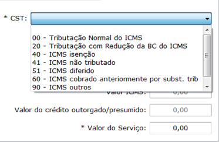
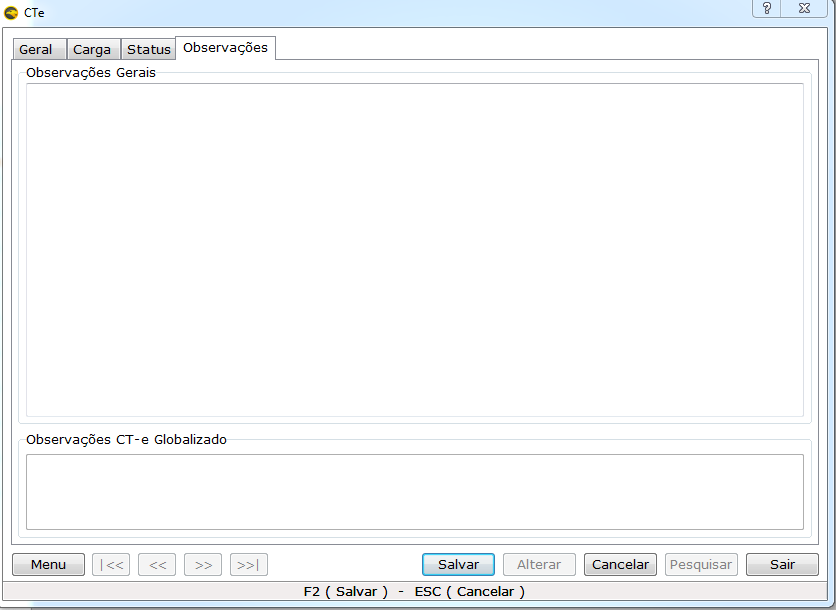

O Conhecimento de Transporte eletrônico (CT-e) é o novo modelo de documento fiscal eletrônico, instituído pelo AJUSTE SINIEF 09/07, de 25/10/2007, que poderá ser utilizado para substituir um dos seguintes documentos fiscais:
* Conhecimento de Transporte Rodoviário de Cargas, modelo 8.
* Conhecimento de Transporte Aquaviário de Cargas, modelo 9.
* Conhecimento Aéreo, modelo 10.
* Conhecimento de Transporte Ferroviário de Cargas, modelo 11.
* Nota Fiscal de Serviço de Transporte Ferroviário de Cargas, modelo 27.
CT-e é um documento de existência exclusivamente digital, emitido e armazenado eletronicamente, com o intuito de documentar uma prestação de serviços de transporte, cuja validade jurídica é garantida pela assinatura digital do emitente e a Autorização de Uso fornecida pela administração tributária do domicílio do contribuinte.

## Emissão de CTE – Conhecimento de Transporte Eletrônico – Eagle Gestão 

Antes de emitir o CTE são necessários alguns cadastros, são eles: Veículos, Motorista, Tomador, Recebedor. 
O cadastro do Tomador é feito como cliente. O recebedor é cadastrado de acordo com as notas fiscais inseridas, caso precise ele pode ser cadastrado na tela de cliente ou fornecedor.  
O motorista na tela de Funcionário, **Acesse:  Cadastro : Funcionário**. 

Preencha todos os dados e salve. 

O cadastro do Veículo pode ser feito na tela de emissão do CTE pelo Menu; Cadastrar Veículos  ou  previamente pela opção **Cadastro**; **Logística ; Cadastro de Veículos**.  
! O cadastro de veículo é obrigatório, pois a Sefaz não aceita o CTE sem o mesmo.  Os campos marcados com * são obrigatórios.

* **Funcionário condutor**: Motorista condutor do veículo;
* **Proprietário:** Deve estar cadastrado como fornecedor é o dono do veículo no documento.
* **Marca/modelo**: Descrição da marca e do modelo do veículo.
* **Chassi, Renavan e UF:** Ver documento do veículo;
* **RNTRC:** Código do cadastro da Empresa pode ser encontrado no adesivo dentro do caminhão
* **CIOT:** Cadastro para a geração de Código Identificador da Operação de Transporte e regulamenta a remuneração dos caminhoneiros autônomos. 
* **COMBUSTIVEL:** Tipo de combustível do veículo. 

## EMITINDO UM CTE
* Acesse: **Logística; Conhecimento de Transporte Eletrônico** 
* Clique em **Novo** 
A tela principal é onde os dados vão ser inseridos. Os dados são divididos em quatro abas, Geral, Carga, Status, Observações.
* **Geral**: Dados fiscais 
* **Selecionar a operação**: Previamente configurada
* **Documento Fiscal e MOD/SER**: Provenientes de operação configurada 
* **CFOP:** Proveniente da operação 
* **Tomador do serviço**: Quem contratou o serviço de Transporte – Previamente cadastrado em 			  cadastro de clientes.
* **Expedidor:** Preenchido apenas quando for a situação de Redespacho Intermediário ou Serviço Vinculado a Multimodal.
* **Recebedor:** Quem recebe a mercadoria, destinatário, podendo ser o tomador do serviço.

## COMPONENTES DO VALOR DO SERVIÇO
* **Nome do Serviço** :  Insira o nome do serviço prestado . Exemplo : Transporte 
* **Valor do Serviço**: Insira o valor total do serviço prestado , ou seja, o valor do CT-e.
	
## CST 
* **CST:** Informações que devem ser consultadas com a contabilidade do cliente 

* **Data prevista da Entrega:** Inserir data da Entrega.

## Carga- Transporte
### 1.	Veículos
* **Marca/Modelo:** Cadastro do caminhão feito previamente em cadastros de veículos. Podendo ser feito também pelo atalho: Menu; Cadastrar Veículos.
* **Placa:** Cadastro vinculado ao do veículo.
Ao selecionar o veículo estes dados serão preenchidos.

### 2.	Motoristas 
* **Nome do Motorista:** Cadastro realizado em cadastro de funcionários.
* **CPF do Motorista:** Proveniente do cadastro do funcionário

### 3.	Quantidades da Carga

* **Unidade de medida:** Selecione a unidade de medidas. Utilize a unidade da nota fiscal ou de outros documentos que acompanhe mercadoria transportada.
* **Tipo de Medida:**  Digite a medida  utilizada na nota fiscal da mercadoria ou de outros documentos que acompanhe a carga.
* **Quantidade da carga:** Insira a quantidade descriminada na nota fiscal da mercadoria , ou de outros documentos que acompanhe a mercadoria.

### 4.	Seguros 

* **Responsável:** Insira um dos códigos acima para preencher o campo responsável.

! Caso possua todas as informações, preencher o que se pede, se não pode-se deixar em branco.

## Carga- Documentos Fiscais

* **Notas fiscais Eletrônicas**
Ao transportar uma carga, deve-se ter um documento da mercadoria transportada . Se for nota fiscal eletrônica deve-se baixar o xml da nota fiscal , no site da receita: 
[Receita Federal](http://www.nfe.fazenda.gov.br/portal/consulta.aspxtipoConsulta=completa&tipoConteudo=XbSeqxE8pl8)
[FSIST](https://www.fsist.com.br)
* **CNPJ/Chave:** Com o XML já baixado , busque (clicando) no campo, abrirá uma tela para pesquisa do XML  da nota fiscal , assim preenchendo todos os campos com as informações da nota.  Podendo ser inseridas quantas Notas Fiscais Eletrônicas forem necessárias desde que sejam do mesmo emitente e destinátario. 
* **Outros Documentos** 
Não tendo a mercadoria uma nota fiscal eletrônica a mesma tem que apresentar outro tipo de documentação, como nota manuais, declarações ou outros. 
Todos os campos devem ser preenchidos manualmente (digitados) com as informações do documento que acompanham a mercadoria .
* **Produto Predominante** 
Identificar a mercadoria que esta sendo transportada . Ex: Ração Bovina 
* **Outras caracteristicas do produtos** 
Caso tenha alguma descrição mais detalhada da carga . Ex : Milho Moido.
* **Valor da Mercadoria** 
Valor será o mesmo dos totais das notas fiscais eletrônicas e/ou 

## Status
Nesta aba constas as informações de emissão do CT-e. 

* **Modal:** Selecione o Modal a ser utilizado, sendo por rodovias o modal é Rodoviário
* **Tomador:** Identifique o tomador do serviço, podendo o mesmo ser o destinatário, remetente, expedidor, recebedor ou outros .
* **Formas de Pagamentos:** Selecione a forma de pagamento do serviço realizado
* **Finalidade de Emissão:** Selecione a finalidade da emissão. Geralmente Norma
* **Tipo de Serviço:** Selecione o tipo de serviço. Geralmente Normal 
* **Forma de Emissão:** Depende da forma de transmissão do CT-e, geralmente é normal, mas caso o servidor da SEFAZ não esteja funcionando, utilizará outro como SVCAN [Consulte a disponibilidade](http://www.cte.fazenda.gov.br/portal/disponibilidade.aspx?versao=1.00&tipoConteudo=XbSeqxE8pl8). 
* **Situação do CTE:** Informações serão preenchidas automaticamente, após a transmissão de CTE.
* **Observações:** 

* Inserir observações no Conhecimento de Transporte Eletrônico caso tenha.
* ! O campo Observações CT-e Globalizado está destinado a esse tipo de documento. 

## Transmissão do CT-e
* Para transmitir o CT-e Cadastrado acesse o gerenciador de CT-e todos os documentos cadastrados estão na tela. O acesso pode ser feito no menu principal ou no menu da tela de cadastro do CTe. Acesse: Menu; Gerenciador CT-e 

* Ao clicar em Gerenciador de CT- e, abre-se a tela do gerenciador onde o CT-e consta em azul (pendente de envio).

* Selecione o CT-e, acesse Menu; Transmitir F11.
* Retornará com Status de autorizada (verde), podendo assim ser impressa.
* Impressão: Menu; Imprimir DACTE.

