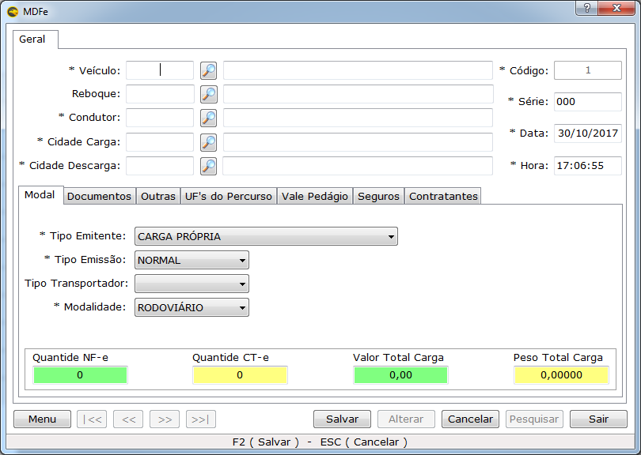
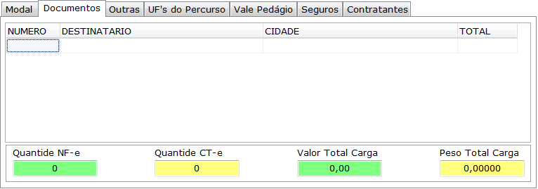
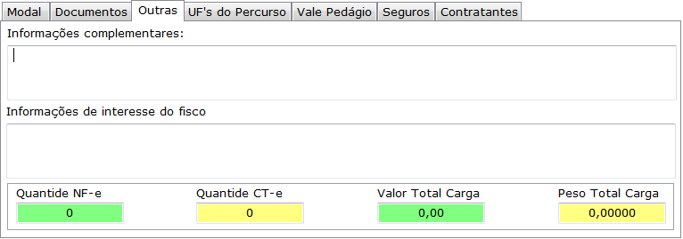
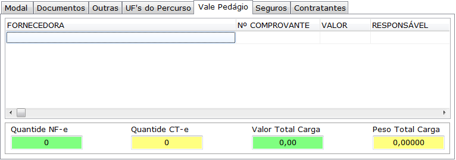

O Manifesto Eletrônico de Documentos Fiscais (MDF-e), modelo 58, é o documento emitido e armazenado eletronicamente, de existência apenas digital, para vincular os documentos fiscais transportados na unidade de carga utilizada, cuja validade jurídica é garantida pela assinatura digital do emitente e autorização de uso pelo Ambiente Autorizador.
Para emissão do MDF-e não é necessário credenciamento específico, pois todos os contribuintes credenciados como emissores de NF-e e CT-e junto a SEF/MG estão automaticamente credenciados para emissão do MDF-e.
A obrigatoriedade de emissão do MDF-e será imposta aos contribuintes de acordo com o cronograma publicado no Ajuste SINIEF 10/13.
## Emitindo um MDF-e
Para emitir um MDF-e na tela principal acesse **Logística; Lançamento de Manifesto de Carga.**

O cadastro do MDF-e é bem simples de ser feito. Alguns dados como veículos, condutor, reboque já devem estar cadastrado ou podem ser feitos usando o Menu na tela de registro.

## MODAL
* **TIPO DO EMITENTE:** Essa informação aparece de acordo com a configuração cadastrada no Cadastro da Empresa, com essa opção ela pode ser alterada.
* **TIPO DA EMISSÃO**: O sistema já trará preenchido a opção “1-Normal”, caso o usuário deseja fazer o MDF-e em contingência, basta alterar para a opção “2-Contingência”.
* **TIPO DO TRANSPORTADOR:** 
* ETC: Cooperativa de Transporte;
* TAC: Empresa de Transporte Rodoviário de Cargas 
* CTC: Cooperativa de Transporte Rodoviário de Cargas 
* **MODALIDADE:** Tipo de transporte

## DOCUMENTOS 

Esse campo é onde deve ser informado os documentos que devem está contido no MDF-e.
## OUTRAS

Onde deve ser informado quaisquer tipo de informação complementar no MDF-e.
## UF’S DO PERCURSO
Estado por onde a carga passará em caso de viagens interestaduais.

Após o cadastro para emitir o MDF-e acesse o menu conforme a imagem abaixo:

O manifesto trabalha com Status. Os Status são Pendente, Autorizado, Cancelado e Encerrado

## Vale Pedágio
Quando houver vale pedagio é necessário que esta informação esteja contida no MDF-e, para isso a empresa Forncedora do Vale Pedágio deve está cadastrada no Eagle Gestão, e após inserir a Fornecedora deve-se preencher as demais informações do Vale.

## SEGURO
Quando o transporte tiver algum seguro:
* Contratante do Seguro; Emitente ou Contrante
* Nome Responsável - O Responsável deve está cadastrado.
* Nome Seguradora
* Número da Averbação
* Número da Apólice
!Para empresas que o Tipo do emitente é Transportadora o seguro é obrigatório.

## CONTRATANTE
O contrante ou tomador é obrigatório quando não houver vale pedágio e o tipo do emitente seja Tranportadora.

* **Transmitir:** Enviar para a SEFAZ o MDF-e.
* **Encerrar:** Após finalizar o transporte é necessário informar ao fisco. Essa prestação de contas é feita encerrando o MDF-e.
! Só após o encerramento do MDF-e é possível emitir um novo para o determinado veículo.
* **Cancelar:** É possível cancelar um MDF-e, porém antes de realizar o evento, é preciso saber que não é permitido realizar o cancelamento do documento em algumas **situações previstas na lei:**
* Após o MDF-e que se deseja cancelar tenha sido encerrado
* Após ter sido vinculado ao MDF-e que deseja cancelar um registro de passagem.
* Ter ocorrido o fato gerador que exige o documento fiscal, ou seja, o transporte já ter sido realizado ou mesmo iniciado.

## RELATÓRIOS

No Eagle Emissor NF-e / CT-e você irá encontrar os relatórios que precisa para gerenciar as emissão de documentos fiscais e os relatórios obrigatórios para sua contabilidade.
No Menu Relatórios estarão disponíveis os seguintes:
* **Clientes:** relatórios para controle e analise de clientes.
* **Fornecedores:** relatórios para controle e análise de fornecedores.
* **Fiscais:** para controle e consulta dos documentos emitidos, valores, modelos, datas e etc.
* **Contábeis:** mostram de forma mais prática e resumida os dados sobre o contexto econômico-financeiro de uma empresa em determinado período.
* **Logística:** Mostram os documentos emitidos, CT-e e MDF-e .

