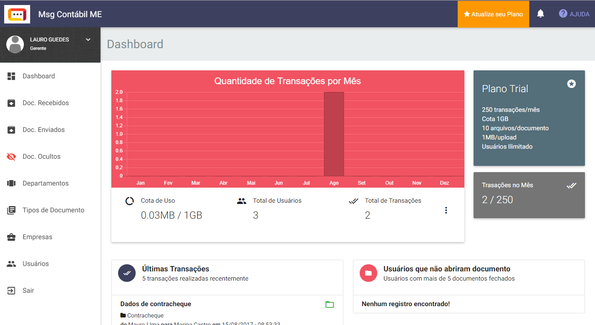
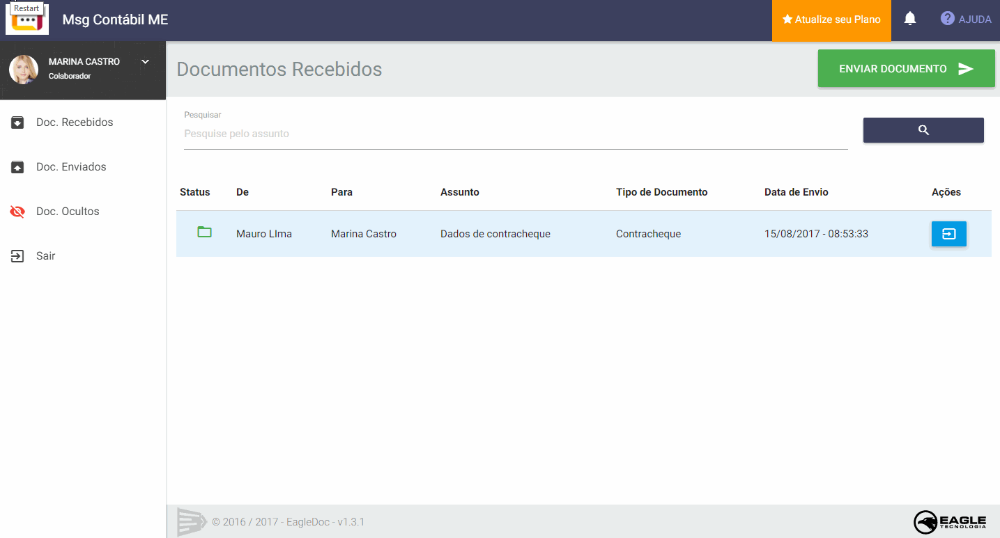
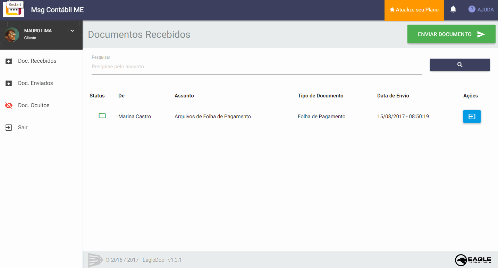
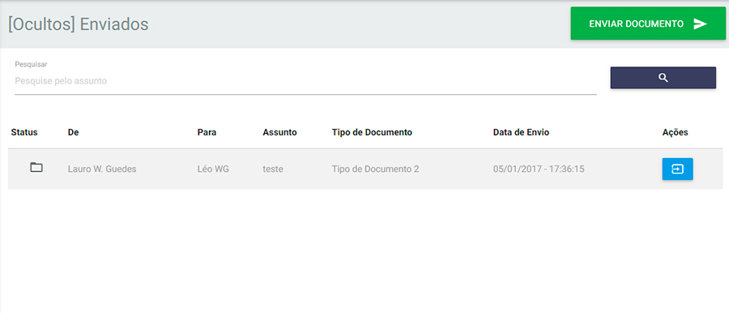
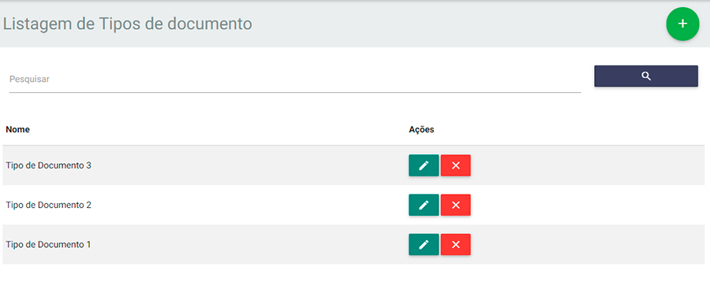
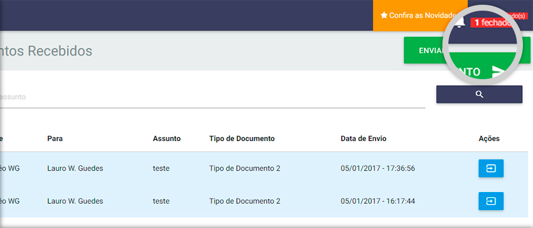
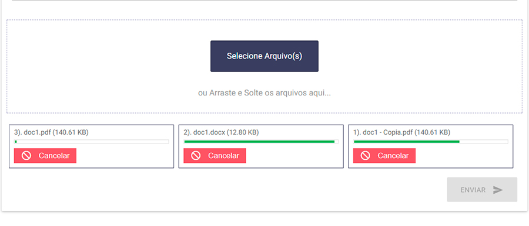
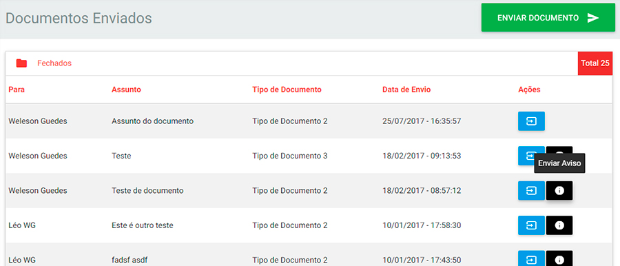

O _EagleDoc_ é um sistema focado em manter documentos organizados e centralizados em um local de fácil acesso e seguro para Empresas que precisam enviar documentos entre seus clientes como escritórios de contabilidade.

O principal objetivo do _EagleDoc_ é evitar que as caixas de e-mail tanto da empresa como o do cliente fiquem aborrotados de e-mails despadronizados e desorganizados. Com o _EagleDoc_ os documentos ficam localizados na ferramenta e não no e-mail, o e-mail servirá somente como aviso de que um documento foi enviado, evitando assim que tanto o cliente ou a empresa que receberam o documento se esqueçam de abri-lo.

## Características

* **Organização**: Tenha os documentos enviados e recebidos bem organizados por departamento ou por usuário. Os documentos fechados e abertos possui uma divisão e ainda é possível ocultar documentos antigos.
* **Tudo na Nuvem**: A solução roda em vários servidores, o que faz com que o acesso dos documentos possa ser feito de qualquer lugar com um computador conectado a internet. Acesso fácil e rápido.
* **Segurança**: O envio ou recebimento de um documento dentro do _EagleDoc_ é feito através do protocolo https, o que significa que todos os documentos são trafegados pela internet de forma encriptada, o que evita qualquer pessoal sem autorizaçao interceptar os dados.

## Processo de envio de documentos simplificado

Cada documento enviado pelo _EagleDoc_ segue uma estrutura muito familiar ao envio de um e-mail, porém com algumas informações que facilitam a organização desse documento no sistema. Isso ajuda na hora da pesquisa de um documento e na identificação exata de quem enviou, quem recebeu e de quem abriu. Cada documento pode conter 1 ou diversos arquivos.

## Funcionalidades

O _EagleDoc_ comtém diversas funcionalidades para um gerenciamento eficiente dos documentos enviados e recebidos com uma interface amigável e intuitiva.

### Painel de Dados

Acompanhe os dados consumidos no seu plano, quantos documentos foram enviados, documentos enviados recentimente e veja quais clientes ainda não abriram os documentos. Tudo em um painel claro e objetivo.

### Filtro por Empresa e Departamento

Antes de enviar o documento é possível filtrar o usuário que irá recebe-lo. No lado da empresa pode-se filtrar por cliente e escolher qual usuário irá receber, no lado cliente pode-se filtrar por departamento e escolher enviar para todos ou para um usuário específico.

### Documentos Ocultos

Como o fluxo de documentos recebidos e enviados pode ser grande, com essa funcionalidade o sistema limpa de tempos em tempos a área de documentos que já foram abertos e move para uma área de documentos ocultos, deixando o ambiente mais limpo.

### Categorização de Documentos

Com o cadastro de **Tipos de Documetnos**, permite-se uma categorização no qual pode ser selecionada no formulário de envio do documento. Isso faz com que os documentos enviados e recebidos fiquem mais organizados no ambiente.

### Sistema de Notificação

Após envio de todo documento, o destinatário irá receber uma notificação tanto na plataforma em tempo real como também por e-mail. Isso pode servir como lembrete e alerta de novos documentos a serem abertos.

### Envio múltiplo de arquivos

Em um único documento pode ser anexado múltiplos arquivos de uma vez, com possibilidade de cancelamento no processo de envio e exclusão caso envie um anexo incorreto.

### Aviso de documentos fechados

As vezes o usuário que recebeu um documento se esquece de abrir ou simplesmente não ver a notificação de novo documento. Com o sistema de aviso é possível enviar uma nova notificação para o usuário que está a algum tempo sem abrir um documento específico, servindo como lembrete.

