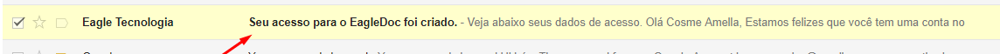
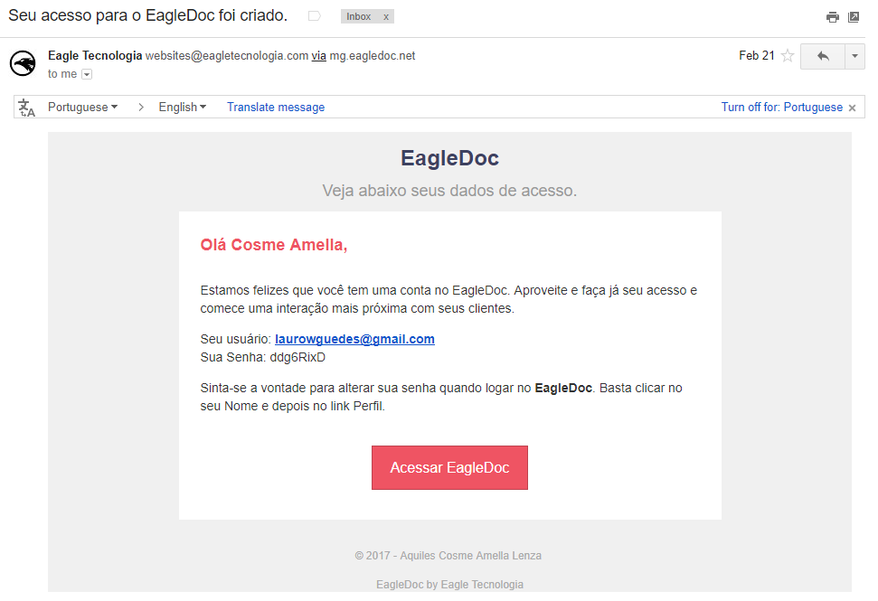

Após realizado o registro no EagleDoc, o período de 15 dias de teste passará a valer e o acesso ao sistema será enviado no e-mail fornecido no registro imediatamente após os dados informados no cadastro ser efetuado. Deve-se procurar pelo seguinte assunto na caixa de entrada do e-mail.

Caso o e-mail não apareça na caixa de entrada, deve-se entrar em contato com a [Eagle Tecnologia](https://eagletecnologia.com) pelo chat ou e-mail (**comercial@eagletecnologia.com**) para solicitar o acesso.

É importante verificar a caixa de SPAM, pois dependendo do e-mail, o provedor pode recusar a mensagem do sistema. O e-mail pode ter sido digitida incorretamente é importante que seja feita essa verificação também.

## Após o acesso ser efetuado

Ao inserir os dados de acesso no formulário de login o acesso será redirecionado para a conta na página **Documentos Recebidos**.

! É altamente recomendado a troca da senha após efetuado o login com a senha padrão gerada. Basta clicar no **nome** e depois clicar em **perfil**, clique no botão **editar**, preencha os campos referentes a senha e salve. É possível também colocar uma foto de perfil para uma melhor identificação, basta inserir uma foto no campo **inserir foto**.

!!! Insira ou troque a logomarca. Assim os clientes irão identificar melhor sua empresa. Essa funcionalidade está disponível somente para usuários gerente. Basta clicar em cima da logo, buscar a imagem da logo e inserir.

No processo de registro o sistema já cria algumas informações necessárias para que seja possível efetuar alguns cadastros. Veja quais são essas informações criadas automaticamente:

* **Usuário Gerente**: Esse é o usuário criado a partir do e-mail fornecido no registro. Ele é um usuário do tipo **gerente** o que significa que tem privilégios tanto para enviar documentos como também gerenciar usuários, empresas, tipos de documento e departamentos.
* **Empresa**: É a prórpria empresa dona da conta, isso permite os usuários da empresa enviarem documentos entre si.
* **Departamento Administrativo**: Essa informação é gerada para facilitar o envio do primeiro documento. Ela é cadastrada como `Administrativo` e é vinculada ao mesmo e-mail da conta.

Qualquer uma dessas informações podem ser alteradas a qualquer momento por usuários do tipo gerente.

## O que cadastrar primeiro

Para que o fluxo de envio de documentos funcione, é ncessário alguns cadastros antes de algum envio em si. A ordem de cadastro é a seguinte:

1. [Cadastre os Departamentos](https://ajuda.eagletecnologia.com/manuais/eagledoc/cadastros#departamentos);
1. [Cadastre os Usuários Funcionários](https://ajuda.eagletecnologia.com/manuais/eagledoc/cadastros#usurios-funcionrios);
1. [Cadastre as Empresas](https://ajuda.eagletecnologia.com/manuais/eagledoc/cadastros#empresas);
1. [Cadastre os Usuários Cliente](https://ajuda.eagletecnologia.com/manuais/eagledoc/cadastros#usurios-cliente);
1. [Cadastre os Tipos de Documento](https://ajuda.eagletecnologia.com/manuais/eagledoc/cadastros#tipos-de-documento);

Essa ordem é necessário, pois alguns cadastros são dependentes de outros. Seguindo a ordem o cadastramento das informações é mais rápido.

Ao cadastrar os usuários **Cliente** e **Funcionário**, eles receberão em seu e-mail os dados de acesso ao _EagleDoc_ automaticamente.

! Não é obrigatório a inserção da senha no cadastro dos usuários, pois o sistema gerará uma senha automaticamente para eles.

!! O Sistema não permite cadastro de e-mails iguais para contas diferentes e nem para departamentos diferentes.

Após efeutado todos os cadastros necessários, o primeiro documento já pode ser enviado. É importante que faça um teste e envie um documento para um cliente ou para um colaborador da empresa.