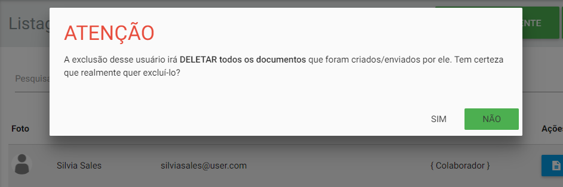
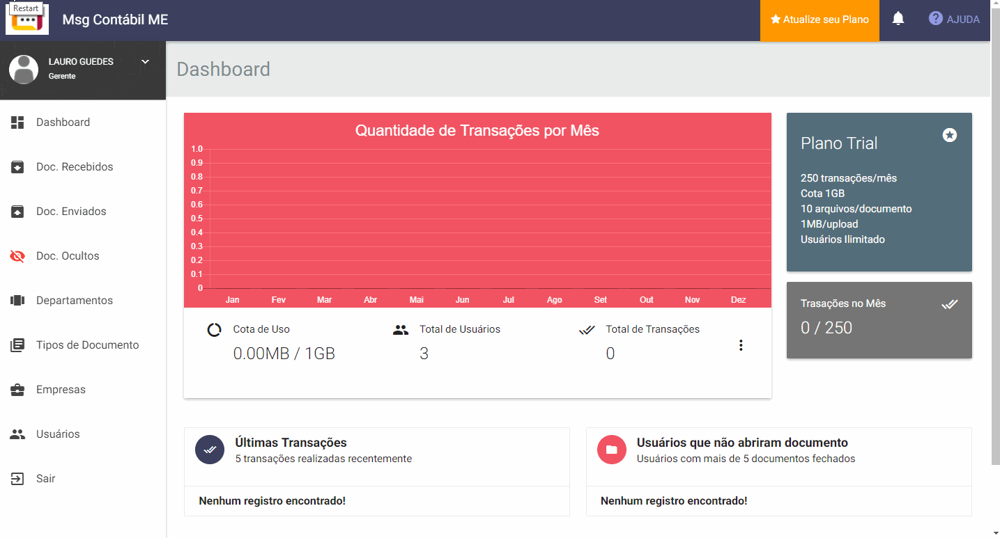

Todos os cadastros são muito simples e intuitivo de serem realizados, basta preencher os formulários e salvar. A qualquer momento é possível editar ou excluir.

## Departamentos

O cadastro de departamentos é necessário para que o cliente consiga escolher para qual setor da empresa ele deve enviar o documento. Com isso, esse documento será destinado aos usuários que estão vinculados a esse departmento escolhido, evitando confusões na abertura do documento.

Para cadastrar um departamento siga os passos na demonstração abaixo:

**Por que preciso fornecer um e-mail no cadastro do departamento?**

Isso é necessário pois o cliente tem a opção de enviar para todos os usuários vinculados a um departamento, com isso o documento é enviado para o e-mail do departamento no qual todos com o acesso a esse e-mail receberão o aviso e o documento fica registrado no departamento escolhido.

!! O Sistema não permite cadastrar um mesmo e-mail para departamentos distintos.

!! O Sistema não permite excluir um departamento caso ele esteja vinculado a algum documento.

## Usuários Funcionários

Esses usuários são os que farão parte da equipe que enviará documentos para os clientes. Cada usuário funcionário pode fazer parte de um ou mais departamentos e ele será vinculado automaticamente à própria empresa gestora da conta no _EagleDoc_.

Ao efetuar um cadastro de um usuário funcionário, ele receberá automaticamente o acesso em seu e-mail.

Para cadastrar um usuário funcionário siga os passos na demonstração abaixo:

! Não é obrigatório a inserção da senha no cadastro do usuário, pois o sistema gerará uma senha automaticamente para ele.

!! O Sistema não permite cadastro de um mesmo e-mail para contas distintas.

{c:red}Observação{/c}: Ao clicar em excluir um usuário, será emitido um alerta de **atenção**, pois caso exclua uma conta, todos os documentos que o usuário excluído enviou, serão também excluidos e no campo `De` dos documentos recebidos aparecerá a informação `Desconhecido` para o usuário que recebeu o documento.

## Empresas

As empresas serão referente ao cliente que ganhará acesso para envio de documentos. Cada empresa cadastrada poderá ter um ou mais usuários vinculados.

Para cadastrar uma empresa siga os passos na demonstração abaixo:

!! O Sistema não permite excluir uma empresa caso ela esteja vinculada a algum documento.

## Usuários Cliente

Esses usuários são os contatos de uma empresa que é cliente. Cada usuário cliente pode fazer parte de um ou mais empresas filiais.

Ao efetuar um cadastro de um usuário cliente, ele receberá automaticamente o acesso em seu e-mail.

! Antes de cadastrar um usuário cliente certifique-se que já tenha a empresa que ele será vinculado cadastrada.

Para cadastrar um usuário cliente siga os passos na demonstração abaixo:

! Todos os alertas feitos para **usuários funcionário** servem também para usuários cliente.

## Tipos de Documento

Os tipos de documento são equivalentes à categoria de um documento. No formulário de envio de documento, deve-se selecionar qual será o tipo de documento que será enviado.

Para cadastrar um tipo de documento siga os passos na demonstração abaixo:

!! O Sistema não permite excluir um tipo de documento caso ele esteja vinculado a algum documento.
