===

## Introdução
O sistema Falcon FV é um software que funciona em dispositivos móveis e é voltado para empresas que possuem vendedores externos. Com ele o vendedor terá as informações necessárias quando estiver de frente com seu cliente e poderá realizar pedidos de forma instantânea.

A comunicação entre a base (sistema que se encontra no servidor da empresa) e os aparelhos, acontece através da tecnologia Web Service , um recurso moderno que permite a interoperabilidade entre os pontos de forma prática e eficaz utilizando-se da internet.

Com o Falcon FV a empresa terá um aperfeiçoamento de todo o processo de vendas, melhor administração dos pedidos, redução no prazo de entrega de mercadorias, transmissão segura e eficiente dos dados e, principalmente, a redução de custos na comunicação entre empresa e vendedores externos.

## Requisitos
Os aparelhos aptos a executar o sistema devem seguir as seguintes especificações:
1. Smartphone ou tablet com sistema android na versão 2.3 ou superior, exceto a 4.1;
1. Recurso GPS;

## Iniciando o Sistema

Para abrir o Facon FV dê um toque sobre o ícone correspondente. Caso o sistema não esteja instalado em seu dispositivo clique [aqui](http://www.falconfv.com/app/FalconFV_4_01_01.apk) para baixar.

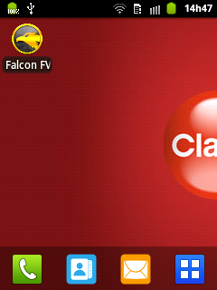

Após esta ação o sistema será aberto e terá inicio as verificações de inicialização. 

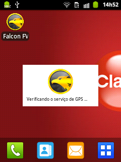

!!!! Ao término da inicialização será exibida a tela de login ou a tela de registro do sistema como apresentado a seguir. 

## Primeira Inicialização

Durante a primeira inicialização será exigido o registro da instalação do sistema. Este registro tem por finalidade habilitar o sistema ao uso do Web Service para troca de dados por meio do processo de sincronização.

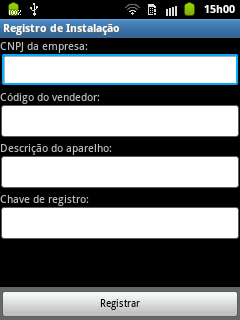

! Caso não seja realizado o registro da instalação do sistema, o mesmo não poderá ser utilizado.

## Primeiro Login

Caso seja a primeira vez que o software é aberto deverá ser utilizado o usuário e senha padrão informada pela Eagle Tecnologia. Posteriormente as informações de usuário e senha deverão ser trocadas para evitar brechas de segurança. A troca das credencias pode ser realizada na tela de configuração do sistema.

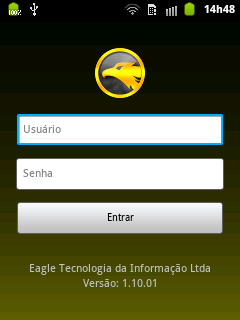

Após realizado o login será apresentada a tela principal do sistema.

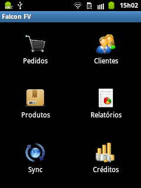

## Realizando uma Pesquisa

Para fazer uma pesquisa, basta selecionar o ícone desejado na tela principal do programa. Será exibida uma lista de todos os registros cadastrados com um campo de pesquisa para que o usuário possa digitar o nome desejado.

Por padrão, o sistema faz uma pesquisa comparando o que o usuário digitou com qualquer parte do nome do registro. Por exemplo: se o resultado desejado for Maria da Conceição Silva, o usuário poderá digitar “Conceição”, “cão”, “silva”. Quaisquer dos três parâmetros irão localizar o registro. (ver seção Configurações – Tipo de Pesquisa)

## Pesquisando um Produto

O vendedor poderá acessar a lista de produtos da empresa contendo as informações mais importantes como o código, descrição, quantidade em estoque e preço. Para abrir a tela de pesquisa, basta clicar sobre o ícone Produtos.

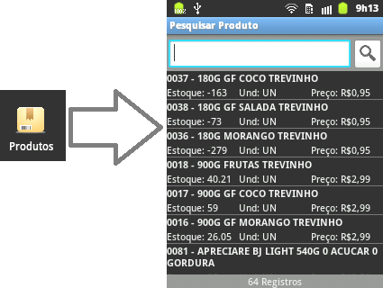

**Filtragem / Ordenação**

O usuário também poderá escolher a forma como o sistema irá pesquisar e/ou ordenar um determinado registro. Para tanto basta acionar o menu do sistema através do botão de menu do aparelho.

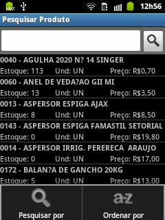

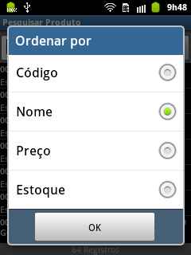

**Configurando o modo de identificação do produto**

Identificar por código ou por referencia

**Recurso de histórico de pesquisa**

Recorda a última palavra digitada no campo de pesquisa

## Pesquisando um cliente

Esta funcionalidade permite ao usuário visualizar os detalhes do cliente selecionado (razão social, nome fantasia, endereço, telefone) e o seu histórico (consumo a vista, a prazo, saldo devedor, última compra, etc.). Para visualizar mais detalhes sobre o recurso de pesquisa, veja a seção Fazendo uma pesquisa.

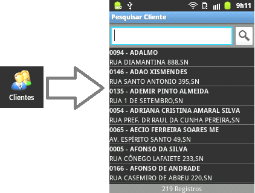

**Filtragem / Ordenação**

Assim como na pesquisa de produtos o sistema prover filtros para refinamento da pesquisa e ordenação dos registros.

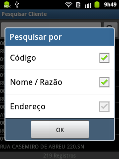

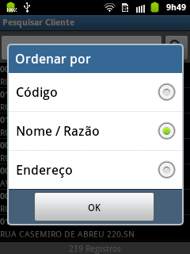

## Detalhamento de Clientes
Na tela de pesquisa de cliente, quando esta foi invocada através da tela principal, selecionando-se o cliente o software irá exibir os detalhes do registro que são divididos em três tipos de informações – os detalhes de cadastro e os dados financeiros:

|Aba|Função|
|---|------|
|**Aba Detalhes**|Exibe as informações referentes ao código, razão social, nome fantasia, endereço, bairro, localidade e telefone do cliente|
|**Aba Finanças**|Exibe as informações referentes ao consumo à vista, a prazo, em cheque, no cartão, limite de crédito, saldo devedor, saldo devedor vencido, média de atraso, cliente desde e de última compra.|
|**Aba Titulos**|Exibe a lista de títulos em aberto do cliente.|

Caso a tela de pesquisa seja invocada durante o processo de lançamento de pedido, o detalhamento dos dados do cliente será acionado quando o registro do cliente ficar selecionado pelo período de um segundo.

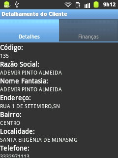

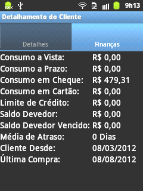

## Localizando o Endereço do Cliente via Google Maps
A fim de prover facilidades ao vendedor, o sistema disponibiliza a localização geográfica do endereço do cliente, com exibição do endereço através do serviço de mapas do Google.

## Realizando um Novo Pedido

Para fazer um pedido, o usuário deverá acionar o ícone correspondente (Pedidos) na tela inicial e em seguida acionar o botão **Novo Pedido** na parte inferior da lista de pedidos

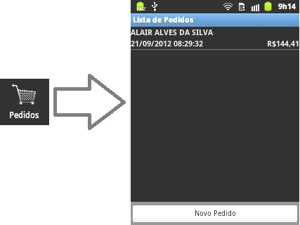

Após solicitar um novo pedido será apresentada a tela de pesquisa de cliente para o pedido.

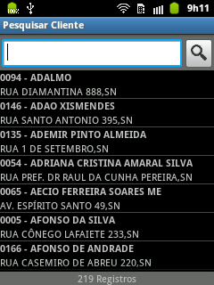

Pesquise o cliente e pressione sobre o mesmo para que seja selecionado.

Selecione a Operação para o pedido. 

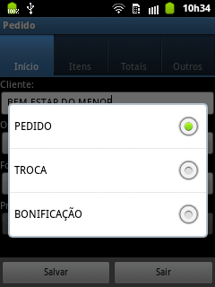

Em seguida, você deverá informar a Forma de Pagamento desejada bem como o prazo, caso a forma de pagamento permita.

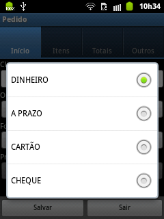

! Caso seja selecionada uma operação diferente a de **PEDIDO**, o sistema bloqueará as opções de forma de pagamento, prazo, acréscimo e de desconto.

## Adicionando Itens

Na tela de pedidos, selecione a  **Aba Itens**. Nesta aba será listados todos os itens do pedido, bem como o acesso as opções de adição, edição e remoção de itens. Para adicionar um novo item ao pedido, basta tocar no botão **Adicionar**, que está localizado na parte inferior da tela.

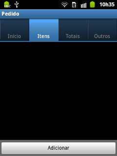

Ao solicitar a adição de um novo item será aberta a tela de pesquisa de produto, onde o usuário deverá selecionar o produto desejado. 

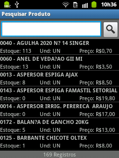

Selecionando-se o produto, será aberta a tela de cadastro de item, onde o sistema pré lançará os valores base para os campos de valor e quantidade, bem como exibirá as demais informações referentes ao item.

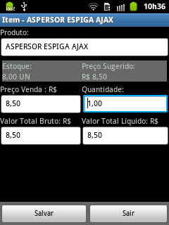

O Falcon FV permite ao vendedor alterar o valor de venda do produto para mais ou para menos, ou seja, permite adicionar acréscimo ou conceder descontos. 

**Controle de Crédito e Débito** 

Caso o vendedor eleve o valor de venda do produto o sistema irá registrar um crédito baseando-se na diferença entre o valor de venda e o valor mínimo informado no Sistema de Gestão. Caso seja concedido um desconto, o sistema irá debitar este desconto do saldo de créditos disponíveis para uso.

! O desconto máximo permitido é estipulado com base nas informações enviadas pelo Sistema de Gestão e pelo saldo de créditos disponíveis.

**Controle de estoque**

O sistema realiza o controle de estoque local em cada aparelho, baseado nos dados de estoque informados durante a sincronização com o Web Service. Desta forma será bloqueada a venda de um item cujo estoque seja menor ou igual a zero. No entanto, o administrador do sistema poderá indicar ao sistema por meio de configuração a possibilidade de venda com estoque negativo.

**Menu de opções**

Ao se pressionar o botão de menu do aparelho estando na tela de cadastro de item será exibido o menu de opções descrito a seguir.

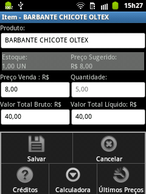

|Opção|Ação|
|-----|----|
|**Salvar**|Salva os dados do item e exibe a lista de itens na tela de pedido.|
|**Cancelar**|Cancela o cadastro do item.|
|**Créditos**|Exibe o detalhamento dos créditos disponíveis.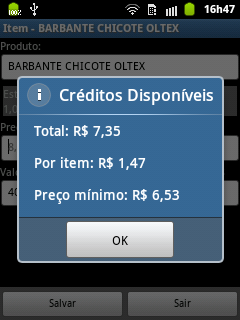Será exibido o crédito total, o crédito disponível para ser gasto no item e o valor mínimo que o item pode ser vendido.|
|**Calculadora**|Exibe a calculadora do sistema.|
|**Últimos Preços**|Exibe a lista dos preços já praticados para o produto indicado no item. O histórico de preços esta ordenado de forma decrescente. Caso o usuário deseje utilizar um dos valores listados basta selecionar o registro na lista. Após a seleção será exibido uma mensagem solicitando a confirmação do uso.|

## Editando Itens

Para se editar um item já cadastro no pedido, o usuário deverá ter selecionado na lista de itens. Após selecionar o item que deseja será exibido o menu de ações.

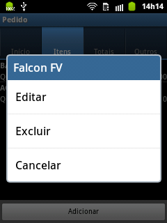

Ao ser exibido o menu de ações escolha a opção **Editar**, para que o item selecionado seja aberto para edição.

## Excluindo Itens

Para se excluir um item do pedido, basta selecionar o item desejado na lista de itens. Ao se abrir o menu de ações, escolha a opção **Excluir**. Após selecionar a opção de exclusão o sistema solicitará a confirmação da exclusão do item.

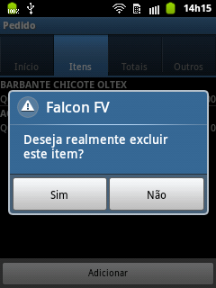

## Totalizando um Pedido

Na tela de pedidos, selecione a **Aba Totais**. Nesta aba o sistema agrupa as opções de acréscimo e desconto a serem aplicados ao valor total do pedido.

Para se adicionar um acréscimo ou desconto ao pedido, informe o valor percentual ou monetário desejado, sendo que, acréscimo e descontos são mutuamente excludentes, ou seja, não se pode adicionar um acréscimo e posteriormente conceder um desconto.

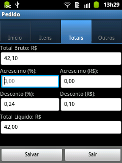

! Caso o valor do acréscimo ou desconto infrinja alguma regra de negocio ativa no sistema, será exibido uma mensagem de alerta indicando o ocorrido.

## Menu de Opções da Tela de Pedidos

Ao se pressionar o botão de menu do aparelho estando na **Aba Início** será exibido o menu de opções descrito a seguir.

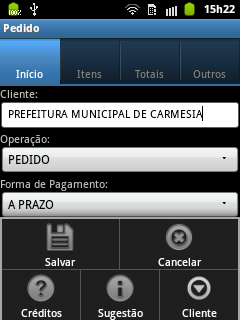

|Opção|Ação|
|-----|----|
|**Salvar**|Salva o pedido e exibe a tela de listagem de pedidos.|
|**Cancelar**|Exibe a mensagem de confirmação de cancelamento do cadastro.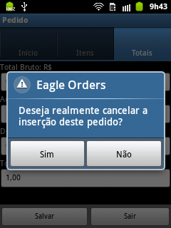|
|**Créditos**|Ao ser acionado exibe o detalhamento dos créditos iniciais, gerados pelo pedido, gastos no pedido e o saldo restante (Disponíveis). 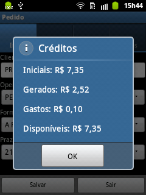|
|**Cliente**|Exibe as opções disponíveis para acesso às informações do cliente indicado no pedido. 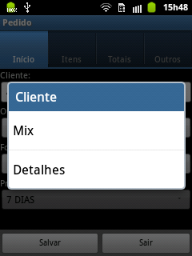|

## Repetindo um Pedido

O recurso de repetição de pedidos pode ser acionada de 2 formas no sistema como se segue:

1.  Na **Tela de Pedidos**, acione o menu do sistema e clique na opção cliente. Na lista de opções apresentada, selecione a opção **MIX**. Na tela de listagem do mix do cliente acione o menu do sistema novamente para que seja exibido a opção de repetição de pedidos. Na lista que será exibida escolha o pedido indicado pela data de sua realização.
1. Na **Tela de Histórico de Pedidos**, selecione um pedido. Na lista de opções que será apresentada, selecione a opção repetir pedido.

! Este recurso permite ao vendedor gerar um pedido contendo todos os itens solicitados pelo seu cliente no pedido selecionado para repetição.

## Histórico de Pedidos

O Falcon FV mantém um histórico completo dos pedidos realizados em cada aparelho. Desta forma o vendedor pode consultar tais informações para propósitos variados.

Para se acessar o histórico de pedidos, acesse a tela de gerenciamento de pedidos e acionar o menu da aplicação. Será exibido um menu com a opção de exibição do histórico de pedidos. 

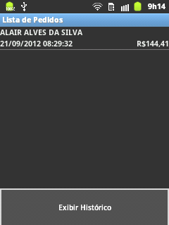

Ao acionar esta opção será exibido a tela de pesquisa e gerenciamento de histórico.

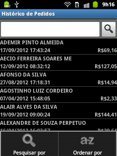

## Sincronizando Dados

A sincronização de dados é processo de enviar as informações dos pedidos para o servidor e, também, de trazer as informações atualizadas do servidor para o aparelho. Esse processo é extremamente necessário para que os pedidos e estoque fiquem sempre atualizados.

Para acessar a função, selecione o ícone de sincronização na tela principal.

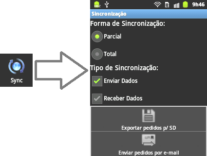

! Opções exibidas quando o usuário seleciona o recurso Menu do Android.

Escolha a forma e o tipo de sincronização. A sincronização parcial atualiza somente o que foi modificado (opção mais usada). 
 
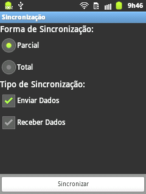

## Relatórios

Ao clicar sobre o ícone relatórios será exibido os tipos de relatórios disponíveis. Atualmente, o sistema conta com o Resumo de Pedidos que mostra o valor total de pedidos por clientes e os respectivos descontos. 

## Configurações
O Falcon FV possui inúmeras configurações e utilitários que controlam e auxiliam o usuário no gerenciamento de sua aplicação.

Para acessar a tela de Opções ou Configurações, basta acionar o menu do sistema quando a tela principal estiver sendo exibida.

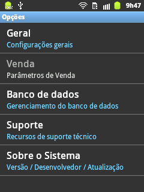

