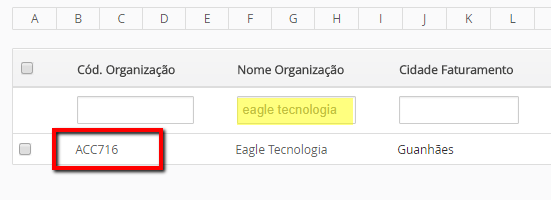
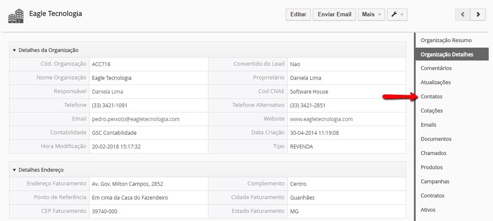
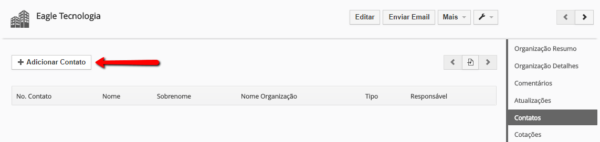
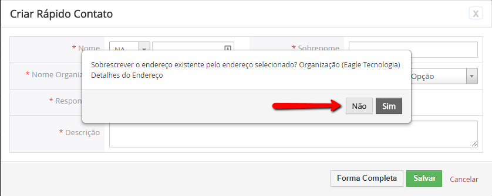
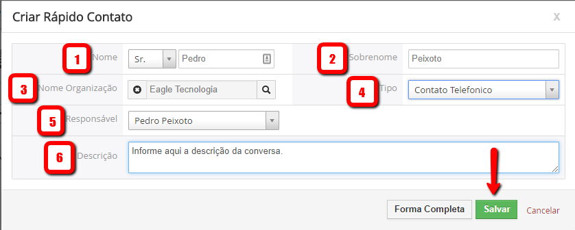
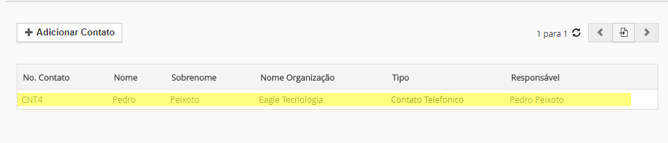
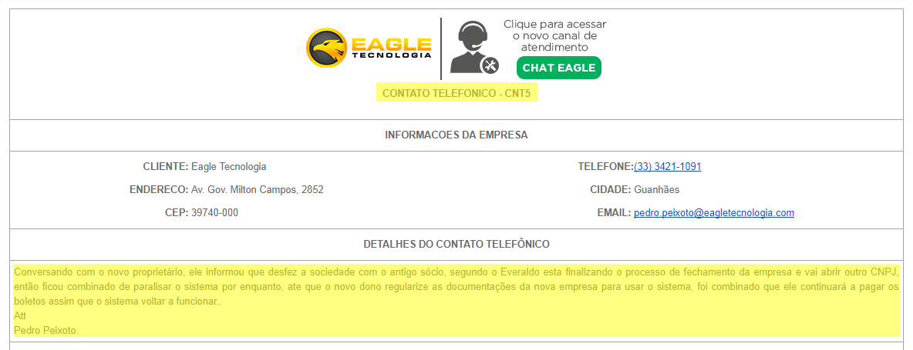

## OBJETIVOS

Orientar profissionais do setor Comercial e Administrativo a registrar um contato importante e ao mesmo tempo formalizar via e-mail junto aos envolvidos neste contato. 

## REGISTRO DE CONTATO

1. O usuário seleciona uma empresa;

!!!! **Passos** 1) Pesquise o cliente no Módulo de Organizações; 2) Selecione o registro com um clique.

1. O sistema exibe os detalhes da organização

!!!! **Passos** 1) Clique em Contatos.

1. O usuário solicita um novo contato

!!!! **Passos** 1) Clique em Adicionar Contatos.

1. O sistema exibe uma mensagem.

!!!! **Passos** 1) Clique em Não.

1. O sistema exibe a tela de registro de contatos

!!!! **Passos** 1) Informe o Nome; 2) Informe o Sobrenome; 3) Verifique a Organização; 4) Selecione o Tipo de Contato (**Telefônico** ou **Comercial**); 5) Selecione o Responsável; 6) Informe o conteúdo da conversa com o cliente ou prospect; 7) Clique em Salvar.

1. O sistema exibe o contato salvo

1. O sistema notifica o cliente do contato realizado.

