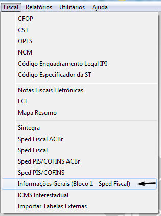
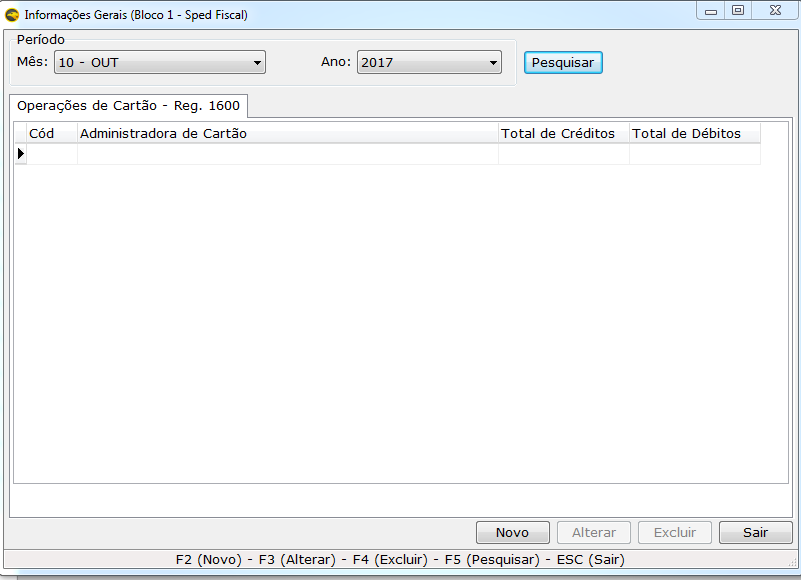

Acesse;
* Menu Fiscal
* Informações Gerais (bloco 1 – Sped Fiscal)
* Selecione o mês e o ano e clique em pesquisar, só assim será habilitado o botão de NOVO.

* Novo;
* Selecione a operadora de cartão, a qual deve está cadastrada no Eagle Gestão como Fornecedora;
* Após selecionar coloque os valores de crédito e débito.

! Após salvar é possível alterar os valores, é só selecionar o mês e o ano e clicar em alterar.

! Informando os valores de cartã no Eagle Gestão, não é preciso realizar essa operação no PVA.