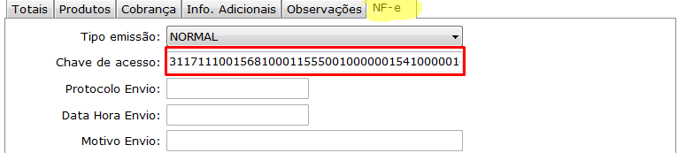
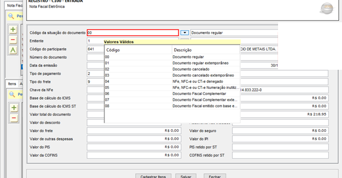

O erro acontece porque o CNPJ informado na chave de acesso não é o mesmo CNPJ do emitente da NF-e; Ex: Produtor Rural, Nota fiscal Avulsa emitida por meio do SIARE, dentre outros.
Quando isso acontecer é necessário conferir a chave de acesso na tela de Entradas conforme a imagem a seguir. 

! Observe se o CNPJ da chave de chave está diferente do CNPJ do Emitente.

! Se a chave de acesso estiver incorreta você deve alterar e gerar o sped novamente.

Se o cnpj não for, você deve acessar o seu SPED fiscal.
E no campo: Código da situação do documento: Selecionar o código 08 conforme a imagem.

E após clicar em salvar, e validar sped como de costume.