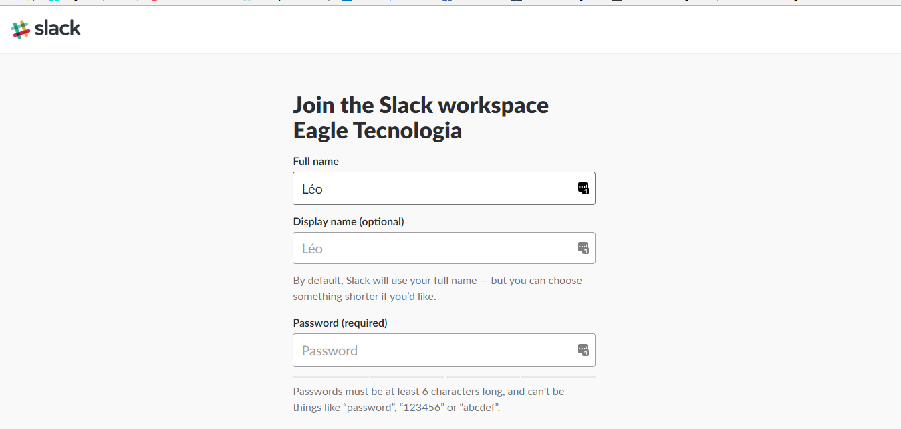
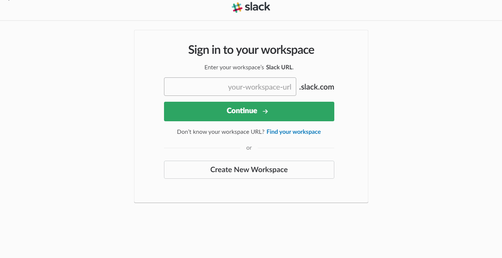
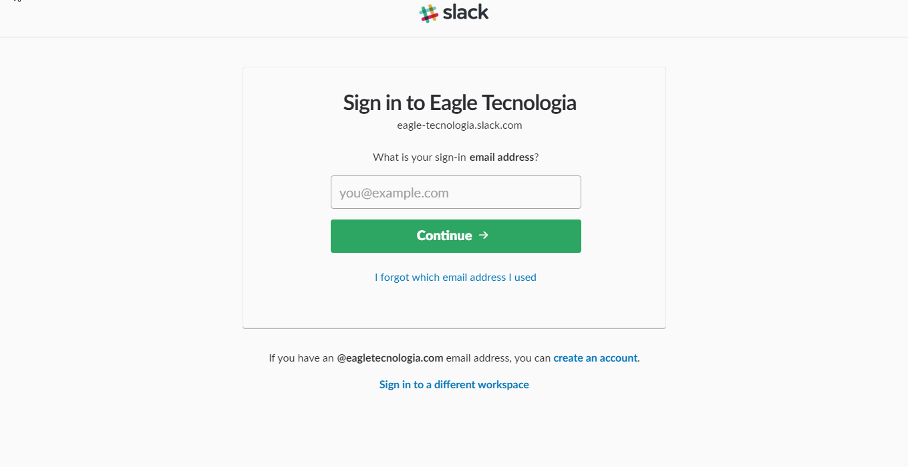
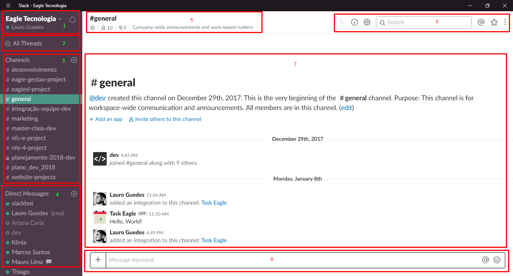
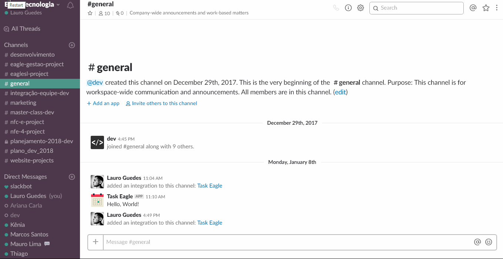
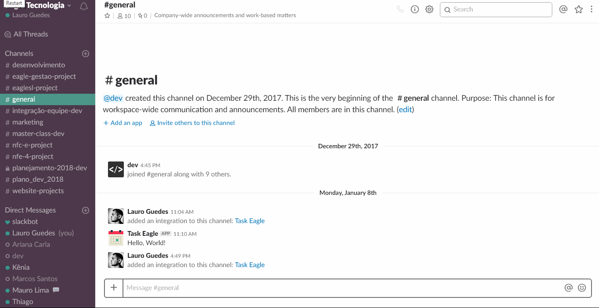

O Slack é um software dedicado a comunicação entre equipes que almejam alta produtividade. O principal objetivo é fornecer um ambiente onde se possa comunicar de forma fácil, rápida e organizada.

Seu grande benefício diante de outros comunicadores do mercado como Skype, é que ele permite uma grande integração com outras ferramentas como `Trello` e `Google Calendar`. Isso fornece inúmeras formas de comunicação no qual aumenta a produtividade da equipe consideravelmente.

## Instalação

O processo de entrar no Slack é um pouco diferente das ferramentas convecionais. O Slack usa um conceito de workspace que nada mais é do que uma organização. No caso aqui da Eagle Tecnologia já temos essa organização criada que é chamada de `eagle-tecnologia` dentro do Slack e que pode ser acessada da seguinte forma [https://eagle-tecnologia.slack.com](https://eagle-tecnologia.slack.com).

Com essa organização já criada, algum membro dessa organização precisa enviar um convite para as pessoas que desejam entrar na organização. Esse convite chega no e-mail e a pessoa precisa aceitá-lo e atualizar suas informações para que ai então ele tenha acesso à ferramenta de comunicação.

! Aqui na Eagle Tecnologia, por padrão, iremos utilizar a versão desktop da ferramenta.

**Passo-a-passo**

- Primeiramente [baixe o aplicativo](https://slack.com/downloads/windows);
- Execute o aplicativo baixado;
- Irá aparecer uma tela como abaixo, coloque a workspace da Eagle Tecnologia que é `eagle-tecnologia`;

- Após a inserção do workspace, o Slack lhe pedirá o e-mail convidado para que seja liberado o acesso. Nessa altura você já deve ter aceitado o convite de algum membro da organização e atualizado suas informações;

## Interface

O Slack usa uma inteface muito simples e intuitiva. A ideia é ter acesso a tudo de uma forma muito rápida. Ao contrário dos outros aplicativos de comunicação, o Slack utiliza o conceito de `canais` em vez de `grupos`. E os canais tem uma característica particular porque devem ser criados com o símbolo `#` e devem ser tudo minúsculo e sem carecteres especiais. Se por exemplo quisesse integrar toda a minha equipe de Departamento Pessoal, então criaria um canal no slack como `#departamento-pessoal`.

! Por convenção, iremos criar os canais na Eagle Tecnologia sempre no formato `firstwork-lastwork`, ou seja, se o termo tem espaço então colocaremos o símbolo `-`.

1. Configurações do usuário;
2. Todos os tópicos (Geralmente mensões a comentários e réplicas das mensagens);
3. Lista de canais (Envie mensagens para um grupo de pessoas que estão no canal);
4. Lista de usuários (Envie mensagens diretamente para uma pessoa específica);
5. Informações do canal aberto (É possível ver a quantidade de membros e colocar o canal como favorito);
6. Barra de busca;
7. Área de mensagens;
8. Campo para envio das mensagens;

## Funcionalidades

Confira nos Gifs abaixo algumas funcionalidades básicas do Slack. Confira também [dicas úteis para um bom uso do Slack](https://ajuda.eagletecnologia.com/faq/slack-dicas-uteis).

#### Criação do Canal

! O nome do canal só irá aparecer para quem foi convidado para fazer parte dele, porém se ele for setado para público, todos do workspace poderá encontrá-lo nas pesquisas e poderá se auto convidar para entrar. Caso queira evitar esse tipo de situação, basta cria-lo como privado.

! Só é permitido criar um canal quem tem a permição de dono do workspace.

#### Convidar novos membros

! Só é permitido convidar um membro quem tem a permição de dono do workspace.

#### Enviando arquivos

#### Opções de Mensagem

, compartilhar a mensagem, colocá-la como favorito(elas irão ser filtradas caso clique no ícone de estrela perto da barra de busca), entre outras ações como deletar uma mensagem que você escreveu")

## Algumas considerações

O Slack é uma ferramenta fechada e para utilizar todos os recursos é preciso pagar por isso, porém em seu plano free, para empresas com equipes pequenas é mais do que suficiente as funcionalidades disponíveis. Na Eagle Tecnologia está sendo utilizado o plano `Free` no qual impede de realizar algumas das ações abaixo:

- Caso o número de mensagens total enviadas exceda 10.000, não será possível pesquisar mensagens mais antigas;
- Não se pode ter mais de 10 apps e integrações vinculadas;
- Vídeo chamadas só funcionam 1 para 1, não se pode criar grupos de vídeo chamada.